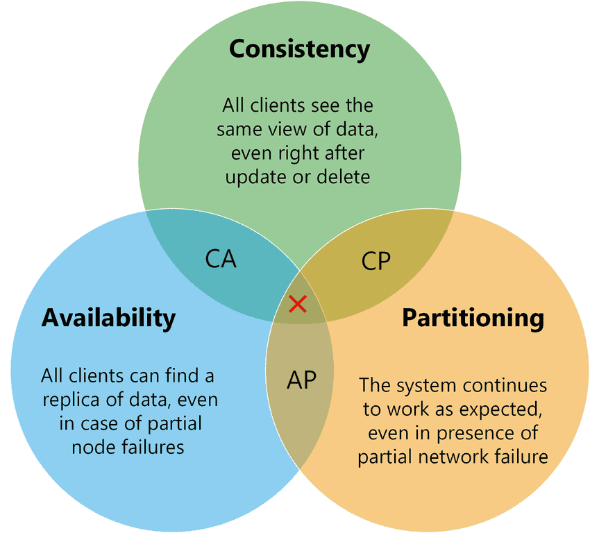

## 前言

这里我们来聊一聊分布式系统的一致性理论以及 CAP 定理，为什么要学这个呢？

我认为目的只有一个，吹牛逼！！！不管你是在面试吹牛逼还是在工作的时候跟你的同事吹牛逼，都是吹牛逼。

## 什么是分布式

我们先说说什么是分布式系统，我目前对分布式系统的理解其实很粗俗。

其实就是随着互联网业务的发展，传统的部署在单台计算机上的单体架构已经没有办法承受用户的高并发请求的访问，而一台计算机的内存、CPU 资源是有上限的，当单台计算机的性能达到瓶颈时，我们就不得不想一些其他的办法来提升整个系统的可支配的资源上限。

一个显而易见的方式就是堆机器，我们可以将原来系统中的业务模块做拆分，拆分成一个个更小的业务模型，比如结算域、订单域、交易域等，然后将这些更小的业务域部署到不同的计算机上，更进一步的，我们还可以在多台计算机上部署相同的服务，通过负载均衡对外提供服务。

这样计算机一多，那么整个系统能够支配的 CPU、内存、存储资源也会更多，就能应对更高的并发和流量。

## 分布式带来的问题

虽然通过增加机器解决了系统的资源瓶颈，但是也带来了一些额外的问题。

首当其冲的就是多台计算机如何进行通信，我们知道，同一台计算机上进程间的通信可以基于消息队列、共享内存、管道等来实现，但是对于跨计算机的进程通信，我们不得不使用 Socket 网络通信。

目前主流的分布式通信方式主要就包括 HTTP（OpenFeign）和远程过程调用 RPC（Dubbo）。

其次，正因为分布式系统中的计算机之间是经过网络进行通信的，那么在通信时就必须知道对方主机的 IP 和端口，这其实就是服务发现，在分布式系统中，就会有专门的注册中心来保存整个系统中各个服务的 IP 和端口信息，比如 Etcd 甚至是 Redis。

同时，注册中心也会通过心跳机制判断服务是否存活。

但是这些问题都不是这篇文章的重点，在分布式系统中的，一个老大难的问题其实是多个节点的数据一致性。

我们在一个单体项目中，比如结算域要在支付域写入支付单，可以直接在 service 注入一个 PayService，然后调用对应的 save 方法即可，这个方法的返回要么是成功，要么是失败。

而在分布式系统中，结算域要在支付域写入支付单，就需要通过 RPC 来做，这种网络调用不可避免的就会出现返回的第三种状态，超时！！！一旦网络调用出现了超时的结果，就不能知道写入结果到底是成功还是失败。

另外，对于不同的服务来说，一定是使用不同的数据库连接，操作的不同的数据库，那么多个事务之间是没有办法统一保证 ACID 特性的，所以，这就出现了分布式系统中的数据一致性问题。

## 一致性理论

在分布式系统中，数据通常会有多个副本，如果由于网络等问题导致这些数据副本未能及时同步，就会出现所谓的“一致性问题”，即各副本之间的数据不一致。

而这种数据一致性并非单一的“一致”与“不一致”两种情况，就像可用性可以用 0% 到 100% 之间的任意数值来表示一样，一致性也有不同的分类。

根据一致性强弱的不同，大致可以分为 **强一致性、弱一致性** 和 **最终一致性**。

在强一致性模型下，系统保证每个读操作都将返回最近写操作的结果，即任何时间点，客户端都将看到相同的数据视图。

强一致性模型通常会牺牲可用性来实现。

而弱一致性模型则放宽了一致性保证，它允许在不同节点之间的数据访问存在一定程度的不一致性，以换取更高的性能和可用性。

弱一致性模型通常更注重可用性，允许一定程度的数据不一致性。

最后，最终一致性是一种最大程度放宽了一致性要求的模型，它允许在系统发生分区或网络故障后，经过一段时间，系统最终能够达到一致的状态。

最终一致性模型在某些情况下提供了很高的可用性，但可能在很长一段时间内会有数据不一致现象。

有关这些数据一致性还有一些细分，比如强一致性还可以分为线性一致性、顺序一致性，弱一致性还可以分为因果一致性、单调一致性等，这里我就不展开了，我自己感觉没必要了解的这么深入。

## CAP 定理

了解了一致性理论之后，我们再来看什么 CAP 定理。

在 CAP 定理中，C、A、P 分别代表：

+ C：一致性（Consistency），访问分布式系统中的任意节点，必须得到最近写的、一致的数据，这里的一致性指的是线性一致性。
+ A：可用性（Availability），访问分布式系统中的任意健康节点，都能得到正确的响应，而不是超时或者错误。
+ P：分区容错性（Partition tolerance），分区是指因为网络故障或者节点宕机等问题导致的分布式系统中的部分节点和其他节点失去连接，形成了独立分区，那么容错就是指当分布式系统中出现了分区时，整个系统也要持续对外提供服务。

CAP 定理告诉我们 C、A、P 三者不能同时满足，最多只能满足其中两个。

### CA without P

这种情况在分布式系统中几乎是不存在的。

首先在分布式系统中，网络分区是一个必然的事实，因为分区是必然的，所以如果舍弃 P，意味着要舍弃分布式系统，那就没有必要再讨论 CAP 了。

像单机版本的 MySQL 就是保证了可用性和一致性，但是它并不是个分布式系统，一旦关系型数据库要考虑主从同步、集群部署等，那么就必须将 P 也考虑进来。

所以，对于一个分布式系统来说，P 是一个基本要求，CAP 三者中，只能在 CA 两者之间做权衡，并且要想尽办法提升 P。

### CP without A

如果一个分布式系统不要求强的可用性，即容许系统停机或者长时间无响应的话，就可以在 CAP 三者中保障 CP 而舍弃 A。

一个保证了 CP 而一个舍弃了 A 的分布式系统，一旦发生网络故障或者消息丢失等情况，就要牺牲用户的体验，等待所有数据全部一致了之后再让用户访问系统。

设计成 CP 的系统其实也不少，最典型的就是很多分布式数据库如 HBase，在发生极端情况时会优先保证数据的强一致性，虽然这会舍弃系统的可用性。

还有分布式系统中常用的 ZooKeeper 也是在 CAP 三者之中优先保证 CP，即任何时刻对 ZooKeeper 的访问请求都能得到一致的数据结果，同时系统对网络分割具备容错性，也正因此，它不能保证每次服务请求的可用性。

ZooKeeper 是分布式协调服务，它的职责是保证数据在其管辖下的所有服务之间保持同步、一致。所以就不难理解为什么 ZooKeeper 被设计成 CP 而不是 AP 特性的了。

### AP without C

要高可用并允许分区，就需要放弃一致性。

一旦网络问题发生，节点之间可能会失去联系，为了保证高可用，需要在用户访问时可以马上得到结果，所以每个节点只能用本地数据提供服务，而这样就会导致全局数据的不一致性。

这种舍弃强一致性而保证系统的分区容错性和可用性的场景和案例非常多。比如淘宝的购物，12306 的买票。都是在可用性和一致性之间舍弃了一致性而选择可用性。

你在 12306 买票的时候肯定遇到过这种场景，当你购买的时候提示你是有票的（但是可能实际已经没票了），你也正常的去输入验证码，下单了。但是过了一会系统提示你下单失败，余票不足。这其实就是先在可用性方面保证系统可以正常的服务，然后在数据一致性方面做了些牺牲，会影响一些用户体验，但是也不至于造成用户的严重阻塞。

但是，我们说很多网站牺牲了一致性，选择了可用性，这其实也不准确的，比如上面买票的例子，其实舍弃的只是强一致性，退而求其次保证了最终一致性，也就是说，虽然下单的瞬间，关于车票的库存可能存在数据不一致的情况，但是过了一段时间，还是要保证最终一致性的。

### 适合的才是最好的

CP、AP 孰优孰略，没有定论，只能根据场景定夺，适合的才是最好的。

对于涉及到钱财这样不能有一丝让步的场景，当网络发生故障时宁可停止服务也要保证 C。

比如前几年支付宝光缆被挖断的事件，在网络出现故障的时候，支付宝就在可用性和数据一致性之间选择了数据一致性，用户感受到的是支付宝系统长时间宕机，但是其实背后是无数的工程师在恢复数据，保证数据的一致性。

对于其他场景，比较普遍的做法是选择可用性和分区容错性，舍弃强一致性，退而求其次选择最终一致性来保证数据正确。

## BASE 理论

除一致性外，在大型的分布式系统中，高可用（High Availability）也是分布式系统的重要指标之一。

它指系统能够在预定的时间内保持运行并提供服务的能力，它强调的是系统的可靠性和连续性，即使在遇到硬件故障、网络问题或其他意外情况时，系统也能够继续为用户提供服务。

高可用性通常用“几个 9”来表示，这是一种描述系统正常运行时间百分比的方式，这里的“9”指的是90%，而每个额外的 9 代表了更高水平的服务可用性，比如 4 个 9 (99.99%) 表示一年中有大约 52.56 分钟的停机时间，5 个 9 (99.999%) 表示一年中有大约 5.26 分钟的停机时间。

在一些场景下，高可用相对于强一致性更加重要，这就是 BASE 理论的体现。

BASE 理论是对 CAP 理论的延伸，核心思想是即使无法做到强一致性（Strong Consistency），但应用可以采用合适的方式达到最终一致性（Eventual Consitency）。

BASE 是指基本可用（Basically Available）、软状态（Soft State）、最终一致性（Eventual Consistency）。

做不到 100% 可用，就要做到基本可用，做不到强一致性，就要做到最终一致性。

想要做到 BASE，主要就是用这几个手段：中间状态（软状态）+ 重试（最终一致性）+ 服务降级（基本可用）

### 基本可用

基本可用是指分布式系统在出现故障的时候，允许损失部分可用性（服务降级），即保证核心可用。

在电商大促时，为了应对激增的访问量，部分用户可能会被引导到降级页面，服务层也可能只提供降级服务，这就是损失部分可用性的体现。

### 软状态

软状态是指允许系统存在中间状态，而该中间状态不会影响系统整体可用性，分布式存储中一般一份数据至少会有三个副本，允许不同节点间副本同步的延时就是软状态的体现。

### 最终一致性

最终一致性是指系统中的所有数据副本经过一定时间后，最终能够达到一致的状态。

## 总结

这篇文章参考了其他的分享，但也有我自己的一些体会，后续有了新的理解也会做一些更改。