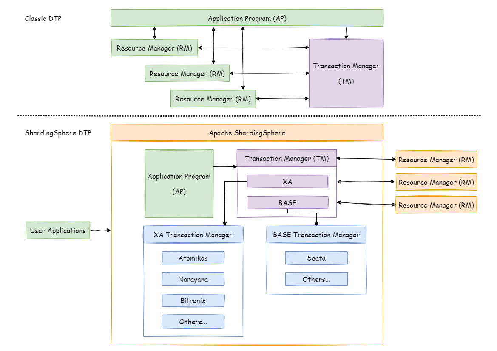
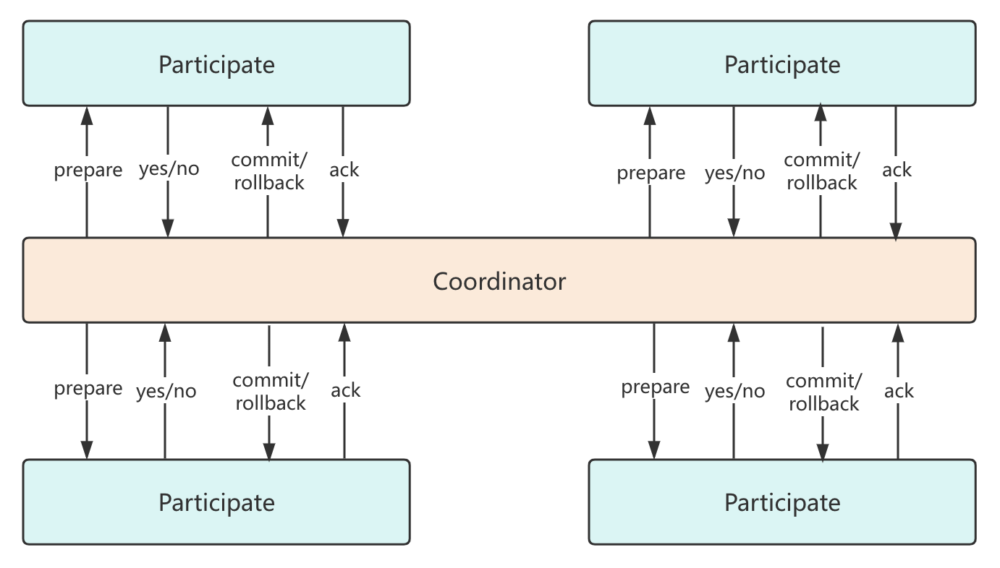
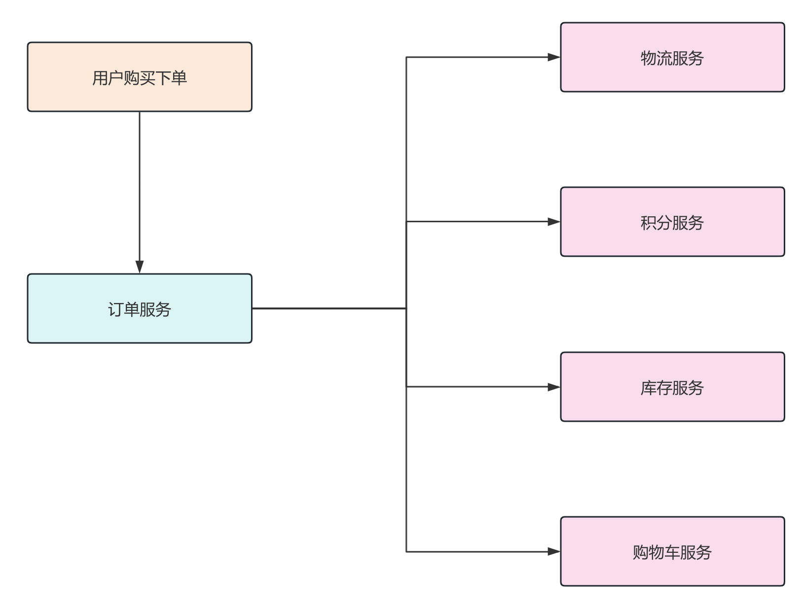

## 前言

2PC（Two-Phase Commit） 即两阶段提交，是基于 XA 规范的分布式事务协议，而 3PC 则是 2PC 扩展出来的协议。

他们都是用于保证数据强一致性的分布式事务解决方案。

## XA 规范

XA 规范是 X/Open 组织定义的一套分布式事务处理模型（DTP，Distributed Transaction Processing），它描述了全局 TM 和局部 RM 之间的接口规范，并且 TM 基于 XA 协议来与 RM 进行双向通信。

这里的 TM、RM 再加上 AP 就是 DTP 模型中的三个重要的角色。

+ AP：Application 应用程序，它定义了事务的边界，负责调用 TM 开启、提交或回滚一个事务。
+ TM：Transaction Manager 事务管理器，它是负责协调和控制整个事务流程的组件，它管理一个或多个分支事务，确保所有参与的 RM 能够正确地执行事务操作。
+ RM：Resource Manager 资源管理器，它是具体进行数据存储的组件，比如 MySQL。RM 负责执行由 TM 指示的具体操作，比如开启、准备提交、实际提交或回滚事务。

传统的 DTP 模型如下，下半部分算是 ShardingSphere 对 DTP 模型的一种细分。

目前几乎所有主流的数据库，像 MySQL、Oracle 等都对 XA 规范提供了支持。

而 2PC 协议和 3PC 协议就是根据这一思想衍生出来的，所以可以说 2PC 是实现 XA 分布式事务的关键。

## 标准 DTP 模型：2PC

首先我们来看标准的 DTP 模型，两阶段提交。

在分布式场景下，每个节点都可以感知本地事务执行的结果，但是节点之间并不知道相互的事务执行情况，所以在两阶段提交协议中引入了事务协调者 Coordinator 和事务参与者 Participate 的概念。

这里事务协调者等价于 DTP 模型中的 TM，而事务参与者则等价于 DTP 模型中的 RM。

### 引入协调者和参与者

那么引入了协调者和参与者之后，整个流程会出现什么变化呢？你可以参考一个 100 米短跑比赛的场景。

在开始比赛之前，运动员们会在跑道线前进行热身运动，然后在某个时刻，裁判会询问运动员们是否准备好，一旦有某个运动员还没有准备好，那么裁判并不会发出比赛开始的指令，而一旦所有的运动员都表示准备好了，那么裁判就可以打响信号枪，比赛正式开始！

我们总是说，程序源于生活，这就是一个很好的例子。

所以整个两阶段提交的流程如下：

整个过程是很清晰的，两阶段提交将整个事务划分为了两个阶段，prepare 准备阶段以及 commit 提交阶段。

当事务请求来临时，协调者会向所有相关的参与者发起 prepare 请求，询问是否可以提交事务，并阻塞等待参与者的响应。

参与者在收到 prepare 请求之后就会开启本地事务，执行业务逻辑，并且记录 undo log 以及 redo log 但不真正 commit，当参与者执行完业务逻辑之后，就向协调者返回执行的结果 yes 或者 no。

如果所有的参与者都返回 yes，说明事务可以提交，协调者会向所有的参与者发起 commit 请求，参与者收到 commit 之后才会真正提交事务，并释放占用的事务资源，然后向协调者返回 ack。

而一旦有参与者返回 no 或者参与者的响应超时，那么所有参与者的分支事务都需要回滚，协调者会向所有的参与者发起 rollback 请求，参与者收到 rollback 之后根据本地 undo log 回滚事务，并释放占用的事务资源，然后向协调者返回 ack。

这里注意一点，当协调者收到参与者的 yes 响应，并且向所有的参与者发出了 commit 请求之后，就可以直接向 AP 返回事务执行成功的结果了，之所以可以这样做是因为，当参与者响应 yes 之后就代表它已经做好了提交本地事务的准备，一旦协调者发出 commit 请求，即使参与者发生宕机，在重启之后，也有能力成功完成提交操作。

### 一个具体的 🌰

我们以电商交易场景为例，用户购买下单这一核心操作的同时会涉及到下游物流发货、积分变更、库存扣减、购物车状态清空等多个子系统的变更。当前业务的处理分支包括：

+ 主分支订单系统状态更新：由未支付变更为支付成功。
+ 物流系统状态新增：新增待发货物流记录，创建订单物流记录。
+ 积分系统状态变更：变更用户积分，更新用户积分表。
+ 库存系统状态减少：减少商品库存，更新商品库存表。
+ 购物车系统状态变更：清空购物车，更新用户购物车记录。

所以，这里的订单服务既可以看做 DTP 模型中 AP 也可以看做 RM，而物流、积分、库存、购物车服务则看做 RM，他们都可以作为 2PC 中事务的参与者。

你可以将这个 🌰 带入上面的 2PC 流程。

一般来说，我们会使用一个专门的 JVM 进程作为 DTP 模型中的 TM，也就是事务协调者，比如 Seata 的 XA 方案。

但是实际上也并不全是这样，两阶段提交的核心，其实是描述了在每一步操作前，每种角色应该处于什么状态，具备什么能力，具体在编码实现时，这几种角色分布在几个节点，以及用什么方式实现都是可以的。

### 如何满足原子性

从上面的两阶段提交的流程我们也可以看出，两阶段协议是可以保证原子性的，主要就是通过引入协调者，协调者根据所有参与者的反馈结果来决定是提交事务还是回滚事务。

而且，协调者可以保证所有的参与者要么一起提交，要么一起回滚，不会出现部分参与者不一致的情况。

### 两阶段提交的核心

通过分析上面的内容，我们可以发现，其实 2PC 的核心就是引入了一个额外的协调者以及在真正事务提交之前，增加了一个准备阶段来收集所有事务参与者是否有能力进行提交。

### 准备阶段需要做什么

看了上面的分析，你可能会觉得在准备阶段，参与者只是开启事务，然后执行业务 SQL，当执行完后，如果执行结果没有异常，就可以向协调者响应 yes，并不需要真正 commit。

但实际上，这样的理解是有偏差的，在两阶段协议中，参与者返回 yes，就代表它已经做好了提交操作的准备，即使它返回 yes 之后发生了机器故障或者宕机，一旦参与者重启，它也要有处理协调者 commit 请求的能力。

以 MySQL 举例，在事务开始后执行 SQL 的过程中，会记录 undo log 和 redo log，但是只要事务没有提交，如果机器宕机，重启之后，MySQL 默认会根据 undo log 将未提交的事务回滚，所以并不具备继续等待并且接受协调者 commit 请求的能力。

以之前的下单后扣减库存为例，一旦参与者向协调者响应了 yes，那么该参与者在响应 yes 之前至少要能够做到下面几点：

1. 保证当协调者请求 commit 时，库存是足够的，可以扣减成功。
2. 留下必要的持久化记录，保证即使机器重启之后，收到协调者的 rollback 请求，也能够回滚到事务开始之前的状态。
3. 留下必要的持久化记录，保证即使机器重启之后，收到协调者的 commit 请求，也能够提交整个事务，完成库存扣减。
4. 留下必要的持久化记录，标识自己已经完成了准备阶段的所有操作，向协调者响应 yes。

### 两阶段提交的缺点

经过上面的分析，其实 2PC 的缺点就很明显了。

首先就是性能问题，在 2PC 的两个阶段中，各个参与者一直占有数据库资源，只有当所有的参与者准备完毕，协调者才会进行全局提交，这之后各个参与者才能释放本地资源，这样的过程对性能的影响是极大的，尤其是在参与者事务较长的情况下。

其次，在 2PC 协议中，协调者处于一个至关重要的位置，它是 2PC 协议的核心，一旦协调者挂掉，那么整个 2PC 协议都无法正确运行，参与者将无法释放事务资源，造成服务不可用。

最后，其实 2PC 也是存在着不一致风险的，如果发生局部网络问题，导致只有部分参与者收到了 commit 请求，就会造成部分参与者提交了事务，而其他参与者未提交的情况。

## 2PC 的扩展：3PC

3PC 协议沿用了 2PC 的协调者和参与者的角色，但是将两阶段过程重新划分为了三个阶段：CanCommit、PreCommit、DoCommit。

### 3PC 的过程

我们先来看看 3PC 协议的运作流程。

首先在 **一阶段**，协调者向所有参与者发送 CanCommit 请求，询问它们是否可以执行事务。这个请求的主要目的是检查每个参与者是否有足够的资源来完成事务。

每个参与者收到 CanCommit 请求后，会检查自己的状态和资源，判断是否可以执行事务。如果参与者确定可以执行事务，它会回复 Yes 给协调者，否则，回复 No。

接下来进入 **二阶段**，协调者等待所有参与者一阶段的响应。如果所有参与者回复 Yes，协调者会向所有参与者发送 PreCommit 请求，指示它们准备提交事务，进入 PreCommit 阶段，如果任一参与者回复 No 或者超时未响应，协调者会向所有参与者发送 Abort 请求，指示它们回滚事务。

参与者收到 PreCommit 请求后，会执行本地事务的准备工作，包括记录 undo 和 redo 日志，完成准备工作后，参与者会向协调者发送 Ack 消息，确认已经准备好提交事务。

参与者收到 Abort 请求后，可以不进行任何操作，因为此时并没有锁定任何资源。

最后是 **三阶段**，协调者等待所有参与者二阶段的 Ack 消息。如果所有参与者都回复了 Ack，协调者会向所有参与者发送 DoCommit 请求，指示它们正式提交事务，进入 DoCommit 阶段，如果任一参与者没有回复 Ack 或者超时未响应，协调者会向所有参与者发送 Abort 请求，指示它们回滚事务。

参与者收到 DoCommit 请求后，会正式提交本地事务，并释放所有资源。提交完成后，参与者会向协调者发送确认消息，表示事务已成功提交。

参与者收到 Abort 请求后，会回滚本地事务，撤销所有更改，并释放所有资源。回滚完成后，参与者会向协调者发送确认消息，表示事务已成功回滚。

### 3PC 解决了 2PC 哪些问题

## 写在最后

这篇文章目前来看只能算是一个初版，其中的很多问题我还没有想清楚，后面实际做一做 Seata-XA 的 demo，看看具体是怎么做的，后面再来补充完善吧。