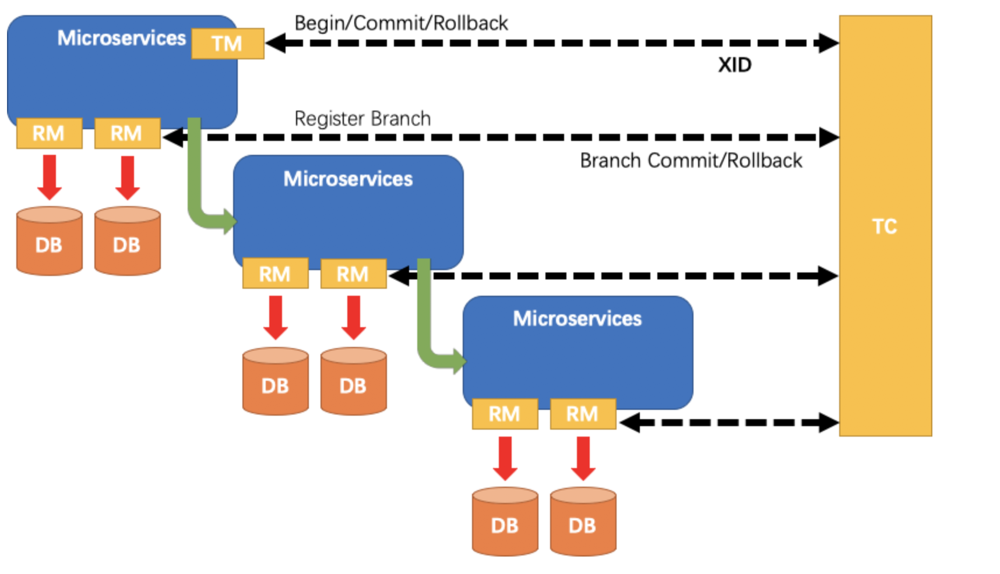
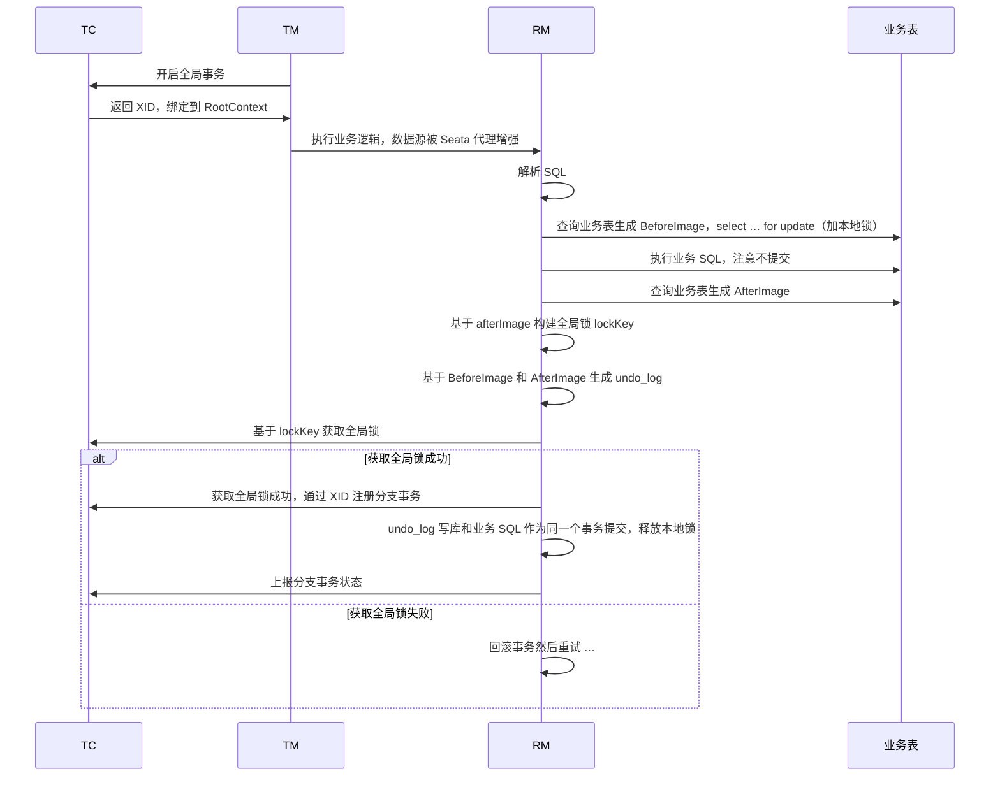
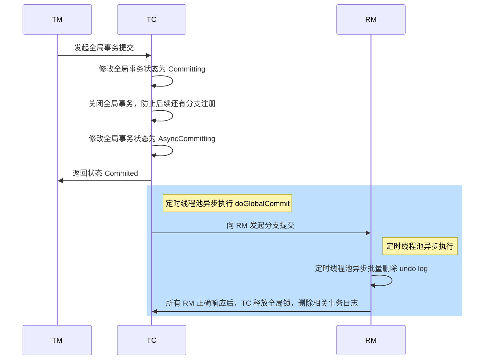
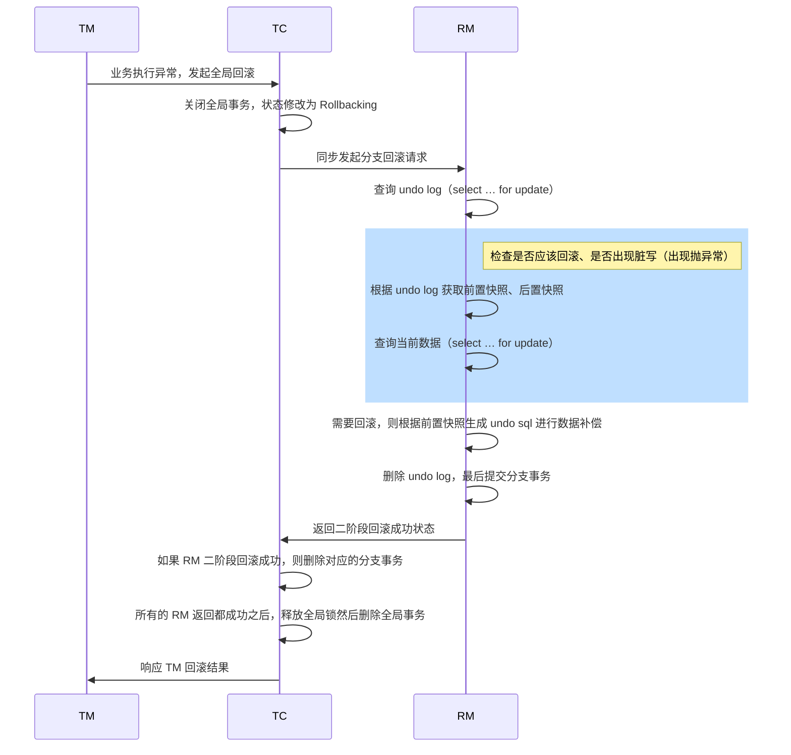
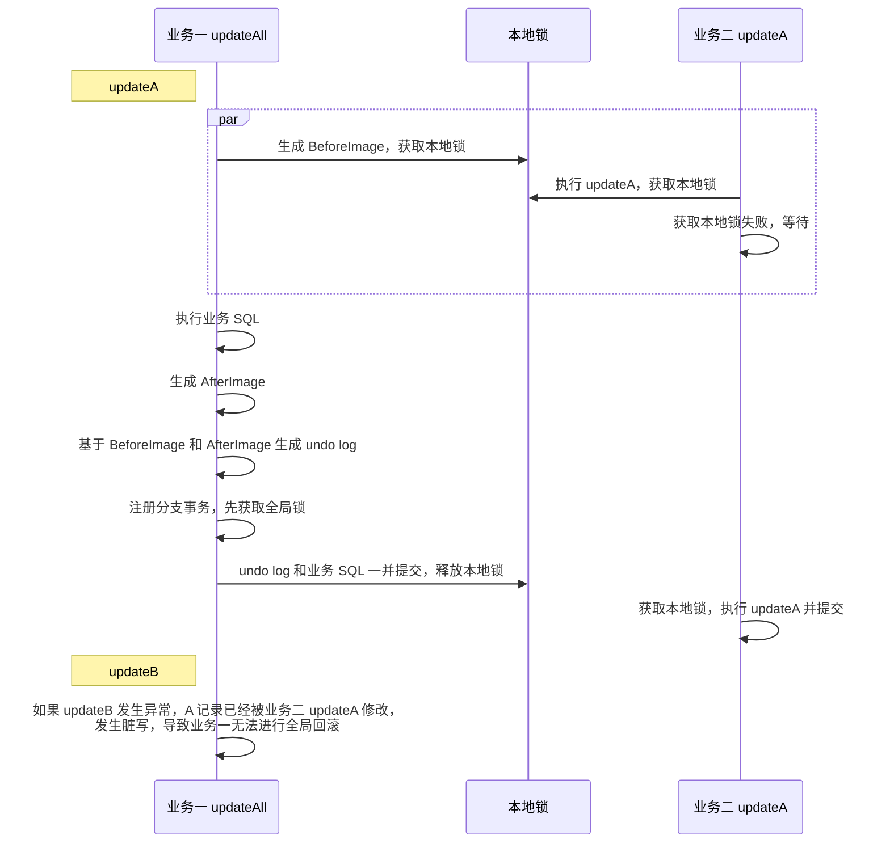
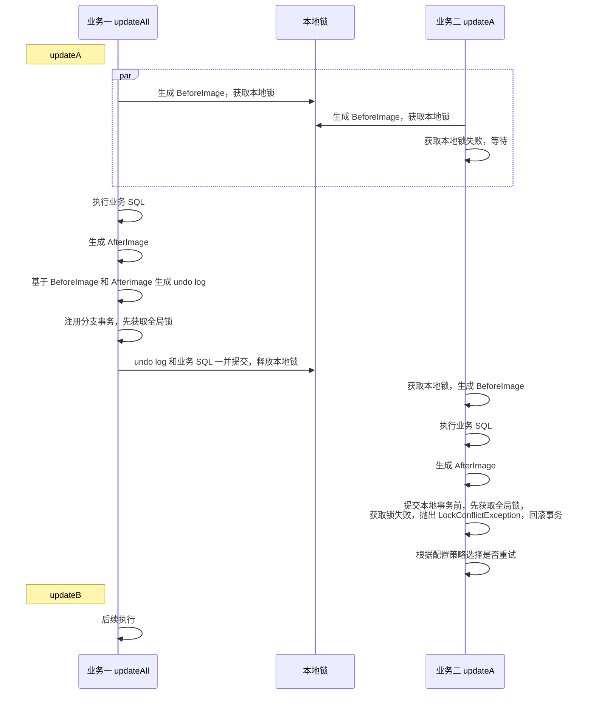
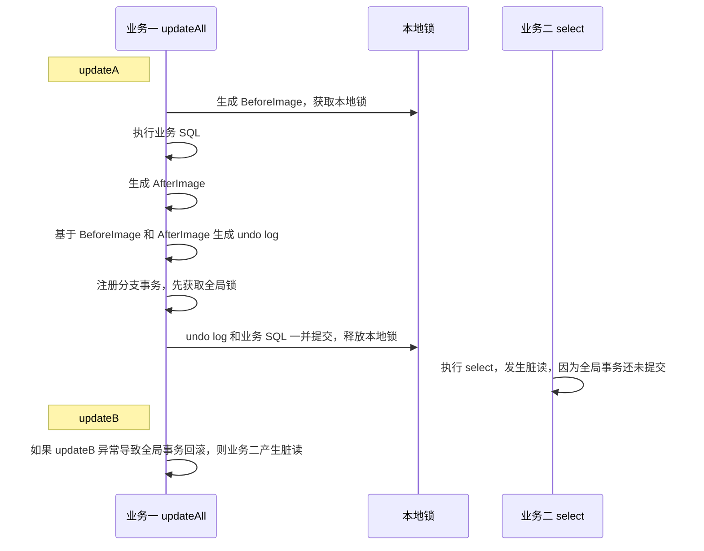
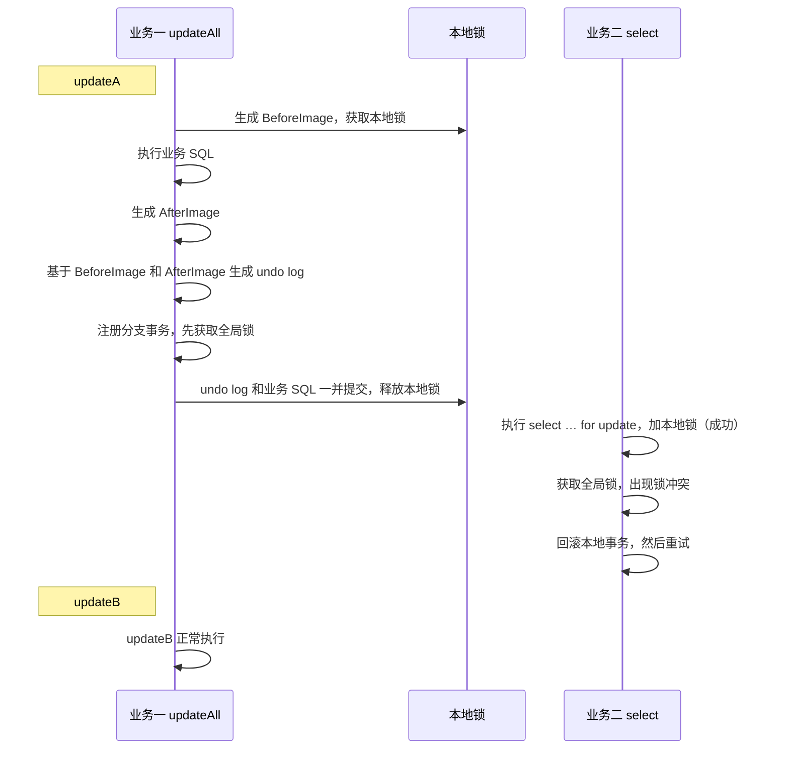

## 前言

Apache Seata 是一款分布式事务解决方案，它提供了四种可选的模式，包括 XA、AT、TCC 以及 SAGA。

这里我们主要聊一聊默认的 AT 模式，参考 incubator-seata-2.2.0。

## Seata 的三大组件

我们知道，分布式事务的问题本质是由于分支事务之间不能相互感知彼此的执行情况，所以很多分布式事务解决方案都会将整个全局事务划分为两阶段，并且引入额外的协调者。

Seata 也是这样，不过它和 XA 协议中 DTP 模型中的角色不一样（仅仅名称？），主要分为 TM、RM 以及 TC。

+ TM 是发起全局事务的客户端角色，负责定义事务的边界，即开启一个全局事务，并最终提交或回滚。
+ RM 代表参与到全局事务中的一个数据源，RM 与 TC 直接交互，负责锁定资源、上报分支事务的状态，并根据 TC 的指示提交或回滚这些分支事务。
+ TC 是 Seata 服务端的角色，负责维护全局事务的状态，并协调各个 RM 进行事务的提交或回滚，它接收来自 TM 的事务请求，并根据事务的状态与 RM 通信来控制整个全局事务的流程。

参考 seata 官方的一张图，可以发现，每个服务都可以是 TM 或者 RM，这取决于它是否发起全局事务。



## AT 模式的实现核心

整个 AT 模式的实现核心点在于对 @GlobalTransactional 的 AOP 增强以及数据源静态代理。

对于所有 @GlobalTransactional 注解的方法，底层基于 Spring AOP 实现方法环绕增强，大致的增强逻辑如下：

+ 业务执行前由 TM 向 TC 发起开启全局事务的请求。
+ 业务执行后根据执行情况（是否抛出异常）来进行二阶段的提交和回滚。

大致的逻辑如下：

```java
public Object execute(TransactionalExecutor business) throws Throwable { 
    // 获取全局事务
    GlobalTransaction tx = GlobalTransactionContext.getCurrent();
    try {
        // TM 向 TC 发起开启全局事务请求，并返回全局事务 xid 绑定到上下文
        beginTransaction();
        Object rs;
        try {
            // 执行业务逻辑，在业务逻辑中的数据库操作会被 Seata 数据源代理，进行额外的逻辑
            rs = business.execute();
        } catch (Throwable ex) {
            // 异常后回滚全局事务
            completeTransactionAfterThrowing(txInfo, tx, ex);
            throw ex;
        }
        // 正常则提交全局事务
        commitTransaction(tx, txInfo);
        return rs;
    } finally {
        // 清理事务资源
        clear();
    }
}
```

其次，在真正执行业务逻辑，或者说操作数据源时，实际会被 Seata 的数据源进行静态代理，可以对 JDBC API 进行增强，以 ConnectionProxy 的 commit 方法为例：

```java
public class ConnectionProxy {
    // 静态代理，代理原始 Connection
    protected Connection targetConnection;

    public void commit() throws SQLException {
        try {
            // 全局锁重试策略模板
            lockRetryPolicy.execute(() -> {
                // 内部调用到 processGlobalTransactionCommit 方法
                doCommit();
                return null;
            });
        } catch (SQLException e) {
            if (targetConnection != null && !getAutoCommit() && !getContext().isAutoCommitChanged()) {
                rollback();
            }
            throw e;
        } catch (Exception e) {
            throw new SQLException(e);
        }
    }

    /**
     * 1. 通过 xid 注册分支事务
     * 2. 写 undo log
     * 3. 本地事务提交
     * 		3.1 如果本地事务提交失败，向 TC 上报提交失败
     * 		3.2 如果本地事务提交成功，向 TC 上报提交成功
     * 4. 清空本地事务资源
     */
    private void processGlobalTransactionCommit() throws SQLException {
        register(); // 通过 xid 注册分支事务
        try {
            // 写 undo log
            UndoLogManagerFactory.getUndoLogManager(this.getDbType()).flushUndoLogs(this);
            // 本地事务提交（undo log + 业务 SQL 包裹在同一个事务中）
            targetConnection.commit();
        } catch (Throwable ex) {
            // 本地事务提交失败，向 TC 上报一阶段提交失败
            report(false);
            throw new SQLException(ex);
        }
        // TC 上报一阶段提交成功
        report(true);
    }
}
```

## AT 模式的工作流程

AT 模式的工作流程还是比较简单的，划分为两个阶段：

+ 一阶段：业务数据和回滚日志记录在同一个本地事务中提交，释放本地锁和连接资源。
+ 二阶段：
  - 提交异步化，非常快速地完成。
  - 回滚通过一阶段的回滚日志进行反向补偿。

我们下面就来逐个说一说。

### 一阶段执行

首先，由 TM 向 TC 发起全局事务，返回 TC 生成的全局事务 xid，绑定到 RootContext。

接着开始执行业务逻辑，在执行业务 SQL 前会解析该 SQL，通过查询业务表构建 BeforeImage，然后执行业务 SQL，但是不提交，再次查询业务表构建 AfterImage。

然后通过 BeforeImage 和 AfterImage 生成 undo log，构建全局锁的 lockKey。

注意，这里构建 BeforeImage 时查询使用的 select … for update，所以需要先获取本地锁。

接着 RM 向 TC 基于全局事务 xid 注册分支事务。

注意，分支事务注册前需要先获取全局锁，获取失败（锁冲突）则根据配置的策略看是否重试等待其他全局事务释放全局锁。

注册分支事务成功之后，对 undo log 进行编码压缩，然后写到数据库，最后提交本地事务，释放本地锁，并向 TC 上报一阶段提交状态。

整个过程参考下图：



### 二阶段提交

如果在业务逻辑执行期间，没有出现任何异常，则由 TM 基于全局事务 xid 向 TC 发起全局事务提交请求。

TC 收到请求后将全局事务状态改为 Committing ，然后关闭全局事务，防止后续还有分支注册上来。

对于 AT 模式，一阶段分支事务执行完就会提交，所以 TC 只需要修改全局事务状态为 AsyncCommitting，服务端会有定时线程池从 db/redis/file 中查询待提交的全局事务向相关的 RM 发起分支提交。

RM 收到 TC 的分支提交请求后，将分支信息（xid、branchId、resourceId）封装为 Phase2Context 加入到 commitQueue 中，同样有定时线程池定时异步批量的删除 undo log。

一旦所有的 RM 返回成功之后，TC 就可以释放全局锁，删除相关的事务日志。

在这个过程中，TC 向 RM 发起分支提交请求出现异常或者超时，TC 会将全局事务状态改为 CommitRetrying，然后交给定时线程池去重试提交这些事务，直到成功。

整个过程参考如下：



### 二阶段回滚

如果在业务逻辑执行期间出现异常，则由 TM 捕获异常后向 TC 发起全局事务回滚请求。

TC 首先通过 xid 获取全局事务，然后关闭该全局事务，保证后续不会有分支事务再注册上来，接着将全局事务状态改为 Rollbacking。

这里需要保证数据一致性，所以必须进行同步回滚，TC 向各个 RM 发起分支回滚请求，等到所有分支事务回滚完毕后，TC 才可以释放全局锁，删除事务日志。

在 RM 侧，收到 TC 的分支回滚请求后，通过 xid 和 branchId 获取对应的 undo log 记录。

然后进行数据校验，校验的大致逻辑如下：

```java
/**
 * 校验，返回是否需要继续回滚
 */
private boolean dataValidationAndGoOn() {
    // 获取前置快照
    TableRecords beforeRecords = getBeforeImage();
    // 获取后置快照
    TableRecords afterRecords = getAfterImage();
    // 前后快照一致，则无需回滚
    if (beforeRecords == afterRecords) {
        return false;
    }
    // 查询当前数据 select … for update，先获取本地锁
    TableRecords currentRecords = queryCurrentRecords();
    // 后置快照和当前数据不一致，需要进一步判断前置快照
    if (currentRecords != afterRecords) {
        // 前置快照和当前数据一致，无需回滚
        if (currentRecords == beforeRecords) {
            return false;
        } else {
            // 当前数据和前后快照都不一致，则出现了脏写，后续会回滚，然后抛出异常
            throw new SQLException();
        }
    }
    // 后置快照和当前数据一致，所以需要回滚
    return true;
}
```

如果确实需要回滚，则根据前置快照构建 undo sql 进行数据补偿，然后删除 undo log，提交事务，响应 TC 二阶段回滚成功状态。

整个过程参考下图：



## AT 模式事务隔离

一般来说，我们不可能将系统中所有的事务都交给 Seata 管理，因为并不是所有的操作都要用到分布式事务，所以通常情况下都是 Seata 全局事务 + 独立事务（未被 Seata 管理的事务）的组合模式。

这样的情况就导致了 AT 模式 **默认只能做到 RU 隔离级别**。

Seata 全局事务包含了若干个分支事务，在全局事务执行过程中，

+ 如果某个本地事务已经提交，可能会导致已提交的分支事务被独立事务读取，造成脏读。
+ 如果某个本地事务已经提交，可能会导致已提交的分支事务被独立事务更新，造成脏写，一旦整个全局事务出现异常，就无法进行回滚。

我们举个脏写的例子，假设业务代码是这样的：

+ updateAll() 用来同时更新 A 和 B 表记录，updateA()、updateB() 则分别更新 A、B 表记录
+ updateAll() 已经加上了 @GlobalTransactional

```java
class YourBussinessService {

    DbServiceA serviceA;
    DbServiceB serviceB;

    @GlobalTransactional
    public boolean updateAll(DTO dto) {
        serviceA.update(dto.getA());
        serviceB.update(dto.getB());
    }

    public boolean updateA(DTO dto) {
        serviceA.update(dto.getA());
    }
}
```

```java
class DbServiceA {
    @Transactional
    public boolean update(A a) {
        
    }
}
```



而要防止这种脏写问题，可以将独立事务扩展为全局事务，也就是给独立事务加上 @GlobalTransactional 注解，当然更轻量级的方案是给独立事务加 @GlobalLock 注解。

而要防止脏读问题，就不能使用普通的 select，而使用 select … for update，Seata 对这种快照读会进行代理。

### 独立事务扩展为全局事务

上面的例子，DbServiceA 的 update 方法加上 @GlobalTransactional 注解，如下：

```java
class DbServiceA {
    @GlobalTransactional
    public boolean update(A a) {
        // ...
    }
}
```



一旦将业务二也升级为全局事务，那么业务二进行分支注册前也需要获取全局锁，但是全局锁此时被业务一持有，业务二只能抛出异常，回滚本地事务，根据配置选择是否重试，这样就避免了脏写的发生。

### 独立事务加 @GlobalLock 注解

全局事务是一个极为重量级的操作，因此，在不需要全局事务，又需要检查全局锁避免脏写的场景，可以使用 @GlobalLock 注解来实现，@GlobalLock 是一个更为轻量级的操作。

```java
class DbServiceA {
    @GlobalLock
    @Transactional
    public boolean update(A a) {
        // ...
    }
}
```

独立事务加了 @GlobalLock 注解，在事务提交前，会通过 RM 向 TC 发起锁查询请求，判断是否出现锁冲突。

如果出现锁冲突，抛出 LockConflictException 异常，从而回滚本地事务，根据配置的重试策略选择是否重试。


### @GlobalLock + select … for update

而对于一些脏读的情况，如下：



这里解决脏读的方案就是将普通的 select 快照读更换为 select … for update 当前读，并且加 @GlobalLock 注解。

Seata 内部会代理 select … for update 执行，在执行查询（加本地锁）之后，会构建全局锁 lockKey，检查是否出现全局锁冲突，如果冲突则回滚事务，然后重试。

如下：



这样就可以解决脏读问题。

最后注意，如果一个事务中首先执行的是一个更新或者删除操作，其实也不需要用 select … for update，因为前面的更新或者删除一定会获取到全局锁（如果不获取，那就不是脏读问题，而是脏写了），不存在脏读问题。

## 总结一言

看源码的过程中，了解 TM、RM、TC 这几个角色的到底需要做什么，主要可以看看它们的接口定义。

其次，它们进行网络传输的过程底层是基于 Netty 的，所以重点是看它们的入栈、出栈处理器，对于一个节点，入栈表示数据从网络中到来，需要进行处理，而出栈表示数据要写到网络中。
