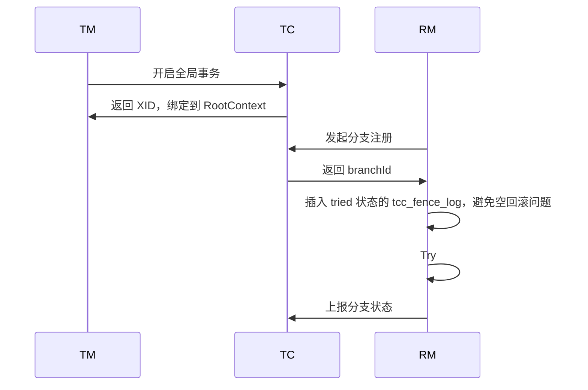
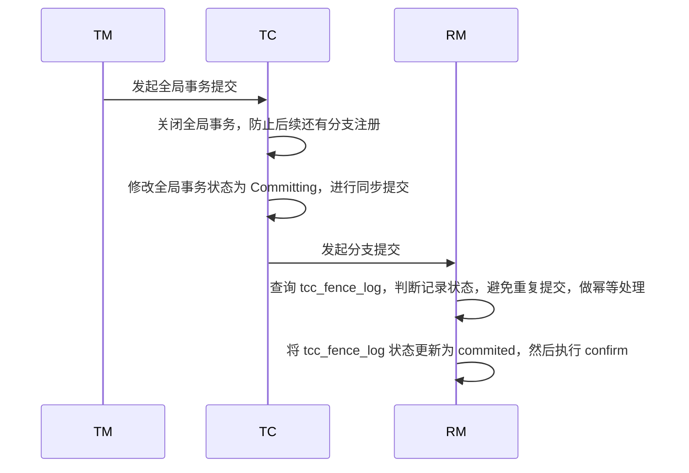
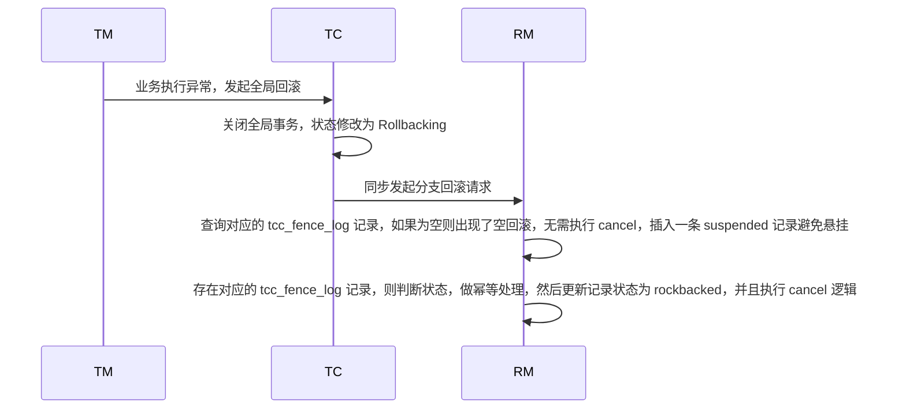

## 前言

前面我们看了看 Seata XA 和 AT 模式，这里再来看一看 Seata TCC 这种业务侵入型的事务模式。

## 什么是 TCC

TCC 即 Try-Confirm-Cancel，是 Seata 全局分布式事务框架下的一种具有业务侵入性的事务模式。

TCC 要求业务方自行实现资源的检测预留、提交和回滚操作，好处是不依赖底层数据库的事务支持。

+ Try：进行资源检查和预留。
+ Confirm：如果 Try 成功，则 Confirm 进行实际的业务逻辑。
+ Cancel：如果 Try 失败，或者其他 RM Try 失败，则 Cancel 将会执行，以释放 Try 阶段预留的资源。

一般来说，Confirm 和 Cancel 操作应该是幂等的，以支持 Seata Server 重复发起的事务提交和回滚请求。

## 如何实现 TCC

在 Seata 中如何使用 TCC 模式，我们就不过多赘述，主要是理解一下 Seata 是如何实现 TCC 的。

我们知道，Seata TCC 本质上来说是 Seata 定义的分布式事务框架下的一种事务模式，所以像 TC、TM 和 RM 这样角色之间的交互通信和 AT、XA 是一致的。

那么它们之间的区别主要在于 Seata TCC 模式无需对在数据源层面做额外处理，就像源码中的这样：

```java
// ExecuteTemplate
public static <T, S extends Statement> T execute(List<SQLRecognizer> sqlRecognizers,
                                                     StatementProxy<S> statementProxy,
                                                     StatementCallback<T, S> statementCallback,
                                                     Object... args) throws SQLException {
    if (!RootContext.requireGlobalLock() && BranchType.AT != RootContext.getBranchType()) {
        // Just work as original statement
        // Saga 或者 Tcc 都直接执行，无需加全局锁、生成 undo log 等
        return statementCallback.execute(statementProxy.getTargetStatement(), args);
    }
    // ...
}
```

实现 TCC 的几个核心点在于：

首先，在服务启动时，对 TCC 接口进行解析，将 @TwoPhaseBusinessAction 注解属性封装为 TCCResource 并注册。

其次，对 @GlobalTransactional 注解的方法，进行环绕增强，笼罩在 Seata 的全局事务框架下，这和 AT 和 XA 模式是一致的。

最后，对 @TwoPhaseBusinessAction 注解的方法，进行环绕增强，做一些 TCC 的额外逻辑，比如每次调用 Try 时，需要先向 TC 注册分支事务，而在全局事务决议提交/回滚时，TC 会通过 resourceId 调用对应 RM，执行 TCC Resource 的 Confirm/Cancel 方法。

## TCC 的难点

在 Seata TCC 模式中，实际上存在两个主要的难点。

一是要求开发者结合自身业务对 TCC 的三个接口做出实现，需要考虑如何做资源检测、预留、释放等。

二是在 TCC 模型中的固有问题，比如常见的空回滚、幂等和悬挂。

针对第一点，要具体场景具体分析，不作解释，这里主要说明第二点，Seata 为了解决这三个问题，单独引入了一张 tcc_fence_log 表，如下：

```sql
CREATE TABLE IF NOT EXISTS `tcc_fence_log`
(
    `xid`           VARCHAR(128)  NOT NULL COMMENT 'global id',
    `branch_id`     BIGINT        NOT NULL COMMENT 'branch id',
    `action_name`   VARCHAR(64)   NOT NULL COMMENT 'action name',
    `status`        TINYINT       NOT NULL COMMENT 'status(tried:1;committed:2;rollbacked:3;suspended:4)',
    `gmt_create`    DATETIME(3)   NOT NULL COMMENT 'create time',
    `gmt_modified`  DATETIME(3)   NOT NULL COMMENT 'update time',
    PRIMARY KEY (`xid`, `branch_id`),
    KEY `idx_gmt_modified` (`gmt_modified`),
    KEY `idx_status` (`status`)
) ENGINE = InnoDB
DEFAULT CHARSET = utf8mb4;
```

### 如何处理空回滚

空回滚，本质上来说就是 RM 还没有执行 Try 就执行了 Cancel。

比如在多个 RM 参与全局事务的情况下，由于其中某一个 RM 执行异常，导致 TC 发起全局事务回滚，但实际上可能存在一些 RM 并没有执行 Try，现在就要求它们执行 Cancel，在这些 RM 身上就出现了空回滚的问题。

在 Seata 中，在 Try 之前会向 tcc_fence_log 插入 status 为 tried 的记录，并在 Cancel 时检查资源是否 Try 过，即是否存在对应的 tcc_fence_log 记录，如果没有记录说明该 RM 未 Try 无需调用 Cancel 方法。

### 如何处理幂等

在某些情况下，TC 可能会重复向 RM 发起全局提交/回滚请求，这会导致 RM 重复执行 Confirm/Cancel 接口，所以，Confirm/Cancel 接口需要支持幂等处理，确保不会因为重复提交/回滚导致业务问题。

Seata 在提交事务时会先查询 tcc_fence_log 表，看是否已经有对应记录，如果对应记录存在则无需再次提交，否则执行 Confirm 并修改对应的 tcc_fence_log 为 committed。

与之对应的，回滚的处理方式也是类似的。

### 如何处理悬挂

悬挂是指二阶段的 Cancel 方法比一阶段的 Try 方法优先执行的情况。

由于允许空回滚的原因，在执行完二阶段 Cancel 方法之后直接空回滚返回成功，可能会导致后续到达的 Try 请求被错误地处理。

为了防止这种情况发生，Seata 在 tcc_fence_log 表中的状态字段增加了 suspended 状态。当 Cancel 方法先于 Try 方法执行时，Seata 会向 tcc_fence_log 表中插入一条状态为 suspended 的记录。随后，如果 Try 方法尝试执行，它会检查到这条记录的存在，并据此判断应该拒绝执行 Try 逻辑，从而避免资源的不当预留。

### 代码分析

在 Seata 中，有关代码在 SpringFenceHandler 中体现，比较重要的三个方法如下：

```java
public Object prepareFence(String xid, Long branchId, String actionName, Callback<Object> targetCallback) {
    TransactionTemplate template = createTransactionTemplateForTransactionalMethod(null);
    return template.execute(status -> {
        try {
            Connection conn = DataSourceUtils.getConnection(dataSource);
            // 执行 Try 之前，向 tcc_fence_log 中插入 STATUS_TRIED 记录
            boolean result = insertCommonFenceLog(conn, xid, branchId, actionName, CommonFenceConstant.STATUS_TRIED);
            LOGGER.info("Common fence prepare result: {}. xid: {}, branchId: {}", result, xid, branchId);
            if (result) {
                return targetCallback.execute(); // 执行 Try
            } else {
                throw new CommonFenceException(String.format("Insert common fence record error, prepare fence failed. xid= %s, branchId= %s", xid, branchId), FrameworkErrorCode.InsertRecordError);
            }
        } catch (CommonFenceException e) {
            // 重复 Key 异常，表示出现了悬挂问题
            if (e.getErrorCode() == FrameworkErrorCode.DuplicateKeyException) {
                LOGGER.error("Branch transaction has already rollbacked before, prepare fence failed. xid = {},branchId = {}", xid, branchId);
                addToLogCleanQueue(xid, branchId);
            }
            status.setRollbackOnly();
            throw new SkipCallbackWrapperException(e);
        } catch (Throwable t) {
            status.setRollbackOnly();
            throw new SkipCallbackWrapperException(t);
        }
    });
}

public boolean commitFence(Method commitMethod, Object targetTCCBean, String xid, Long branchId, Object[] args) {
    TransactionTemplate template = createTransactionTemplateForTransactionalMethod(MethodUtils.getTransactionalAnnotationByMethod(commitMethod, targetTCCBean));
    return Boolean.TRUE.equals(template.execute(status -> {
        try {
            Connection conn = DataSourceUtils.getConnection(dataSource);
            CommonFenceDO commonFenceDO = COMMON_FENCE_DAO.queryCommonFenceDO(conn, xid, branchId);
            if (commonFenceDO == null) {
                // Confirm 之前一定会插入 tcc_fence_log 记录
                throw new CommonFenceException(String.format("Common fence record not exists, commit fence method failed. xid= %s, branchId= %s", xid, branchId), FrameworkErrorCode.RecordNotExists);
            }
            if (CommonFenceConstant.STATUS_COMMITTED == commonFenceDO.getStatus()) {
                // 重复提交的幂等处理
                LOGGER.info("Branch transaction has already committed before. idempotency rejected. xid: {}, branchId: {}, status: {}", xid, branchId, commonFenceDO.getStatus());
                return true;
            }
            if (CommonFenceConstant.STATUS_ROLLBACKED == commonFenceDO.getStatus() || CommonFenceConstant.STATUS_SUSPENDED == commonFenceDO.getStatus()) {
                // unexpected
                if (LOGGER.isWarnEnabled()) {
                    LOGGER.warn("Branch transaction status is unexpected. xid: {}, branchId: {}, status: {}", xid, branchId, commonFenceDO.getStatus());
                }
                return false;
            }
            // 更新记录状态为 STATUS_COMMITTED
            boolean result = updateStatusAndInvokeTargetMethod(conn, commitMethod, targetTCCBean, xid, branchId, CommonFenceConstant.STATUS_COMMITTED, status, args);
            LOGGER.info("Common fence commit result: {}. xid: {}, branchId: {}", result, xid, branchId);
            return result;
        } catch (Throwable t) {
            status.setRollbackOnly();
            throw new SkipCallbackWrapperException(t);
        }
    }));
}

public boolean rollbackFence(Method rollbackMethod, Object targetTCCBean, String xid, Long branchId, Object[] args, String actionName) {
    TransactionTemplate template = createTransactionTemplateForTransactionalMethod(MethodUtils.getTransactionalAnnotationByMethod(rollbackMethod, targetTCCBean));
    // non_rollback
    // MySQL deadlock exception
    return Boolean.TRUE.equals(template.execute(status -> {
        try {
            Connection conn = DataSourceUtils.getConnection(dataSource);
            CommonFenceDO commonFenceDO = COMMON_FENCE_DAO.queryCommonFenceDO(conn, xid, branchId);
            // non_rollback
            if (commonFenceDO == null) {
                // 空回滚的处理，还没有执行 Try 就执行了 Cancel
                // 插入一条 STATUS_SUSPENDED 的 tcc_fence_log 记录解决悬挂问题
                boolean result = insertCommonFenceLog(conn, xid, branchId, actionName, CommonFenceConstant.STATUS_SUSPENDED);
                LOGGER.info("Insert common fence record result: {}. xid: {}, branchId: {}", result, xid, branchId);
                if (!result) {
                    throw new CommonFenceException(String.format("Insert common fence record error, rollback fence method failed. xid= %s, branchId= %s", xid, branchId), FrameworkErrorCode.InsertRecordError);
                }
                return true;
            } else {
                // 重复回滚的幂等处理
                if (CommonFenceConstant.STATUS_ROLLBACKED == commonFenceDO.getStatus() || CommonFenceConstant.STATUS_SUSPENDED == commonFenceDO.getStatus()) {
                    LOGGER.info("Branch transaction had already rollbacked before, idempotency rejected. xid: {}, branchId: {}, status: {}", xid, branchId, commonFenceDO.getStatus());
                    return true;
                }
                if (CommonFenceConstant.STATUS_COMMITTED == commonFenceDO.getStatus()) {
                    // unexpected
                    if (LOGGER.isWarnEnabled()) {
                        LOGGER.warn("Branch transaction status is unexpected. xid: {}, branchId: {}, status: {}", xid, branchId, commonFenceDO.getStatus());
                    }
                    return false;
                }
            }
            // 更新记录状态为 STATUS_ROLLBACKED
            boolean result = updateStatusAndInvokeTargetMethod(conn, rollbackMethod, targetTCCBean, xid, branchId, CommonFenceConstant.STATUS_ROLLBACKED, status, args);
            LOGGER.info("Common fence rollback result: {}. xid: {}, branchId: {}", result, xid, branchId);
            return result;
        } catch (Throwable t) {
            status.setRollbackOnly();
            Throwable cause = t.getCause();
            if (cause instanceof SQLException) {
                SQLException sqlException = (SQLException) cause;
                String sqlState = sqlException.getSQLState();
                int errorCode = sqlException.getErrorCode();
                if (Constants.DEAD_LOCK_SQL_STATE.equals(sqlState) && Constants.DEAD_LOCK_ERROR_CODE == errorCode) {
                    // MySQL deadlock exception
                    LOGGER.error("Common fence rollback fail. xid: {}, branchId: {}, This exception may be due to the deadlock caused by the transaction isolation level being Repeatable Read. The seata server will try to roll back again, so you can ignore this exception. (To avoid this exception, you can set transaction isolation to Read Committed.)", xid, branchId);
                }
            }
            throw new SkipCallbackWrapperException(t);
        }
    }));
}
```

## TCC 整体流程

最后，我们再整体分析一下 TCC 的流程处理，还是分为三个过程：一阶段执行、二阶段回滚、二阶段提交。

首先是一阶段，如下：



整体和 AT、XA 类似。

接着来看二阶段提交：



二阶段提交也比较简单，主要就是执行 Confirm 逻辑。

最后，如果执行过程中出现异常，则 TM 向 TC 发起二阶段回滚：



其实，从整体流程上来看，TCC 并没有什么特殊的处理，在 Seata 的全局事务框架下显得极为简单，只是做了一些幂等、悬挂、空回滚的处理。

但是实际上，核心的逻辑是交给了开发人员处理。