## 前言

上一篇文章我们说了说 Seata AT 模式，这篇文章就来聊一聊 XA 模式，包括两阶段提交、MySQL XA。

其中 Seata XA 的内容主要参考了 [分布式事务如何实现？深入解读 Seata 的 XA 模式 | Apache Seata](https://seata.apache.org/zh-cn/blog/seata-xa-introduce/).

## 什么是 XA

XA 规范是 X/Open 组织定义的分布式事务处理（DTP、Distributed Transaction Processing）标准。

它描述了全局的事务管理器 TM 与局部的资源管理器 RM 之间的接口。

在 DTP 标准中，定义了三个主要的组件：

+ TM：事务管理器，负责协调各个 RM、管理全局事务的状态和生命周期，包括开始、提交和回滚事务。
+ RM：资源管理器，通常是数据库管理系统，负责管理具体的事务资源，并参与事务的两阶段提交过程。
+ AP：应用程序，负责发起事务请求，并与事务管理器和资源管理器交互。

这和我们在 [Seata AT 详解](./Seata%20AT%20详解.md) 中描述的 Seata 三大组件有所区别。

在 Seata 中，将 DTP 标准的 TM 拆分为了 Seata TM 和 Seata TC，Seata TM 主要负责全局事务的开启、提交和回滚，Seata TC 主要负责维护全局事务的状态、协调各个 RM 的事务提交、回滚。

这种拆分可能更有利于 Seata 进行模块化的设计，并且 TC 作为独立的服务，可以更好地支持高可用以及扩展。

XA 规范是基于两阶段提交（2PC，Two-Phase Commit）协议进行设计的，所以我们先说一说什么是 2PC。

## 两阶段提交

在分布式场景下，每个节点其实都可以感知本地事务执行的结果，但是节点之间并不知道相互的事务执行情况，所以在两阶段提交协议中引入了事务协调者 Coordinator 和事务参与者 Participate 的概念。

这里事务协调者对应于 DTP 模型中的 TM，而事务参与者则对应于 DTP 模型中的 RM。

想象一个百米赛跑的场景。

开始比赛之前，运动员们会在跑道线前热身，某个时刻，裁判会询问运动员们 are you ready，如果某个运动员 not ready，裁判不会打响信号枪，而一旦所有的运动员都表示 ready，那么裁判就打响信号枪，比赛正式开始！

在程序的世界也是如此，两阶段提交的过程如下：

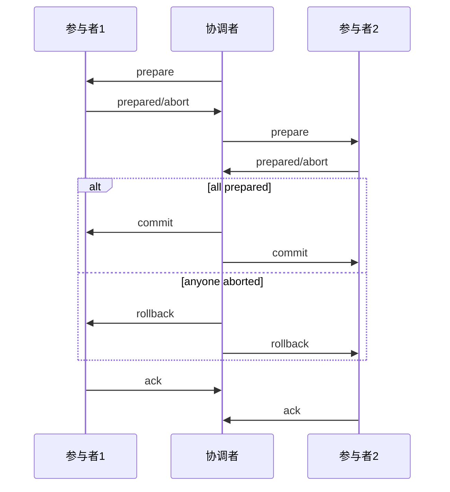

整个过程是很清晰的，两阶段提交将全局事务划分为了两个阶段。

在一阶段，当全局事务开启，协调者向所有参与者发起 prepare 请求，每个参与者执行事务，但不提交，根据执行的情况回复 prepared 或 aborted。

如果所有参与者的本地事务都执行成功，回复 prepared，则进入提交二阶段，如果任何一个参与者回复 aborted，则进入回滚二阶段。

接着协调者向所有参与者发送 commit 或者 rollback 请求，每个参与者执行相应的操作（最终提交 or 最终回滚），并回复确认。

不过，两阶段提交协议远不止我们上面描述的这么简单，如果要进行实际方案落地，需要考虑的细节是很多的，尤其是多节点之间由于网络通信导致的超时问题、协调者的单点故障以及节点的故障宕机问题。

对于协调者的单点问题来说，我们可以通过部署协调者高可用集群，而网络通信超时问题就不是那么好解决了。

针对网络超时的问题，在工程上的 2PC 的落地实现中，至少要做到即使出现网络通信超时或者宕机（失联）的情况，在等待一段时间（进行网络重连或者节点重启）后，最终一定可以达到一致的状态，所有的分支事务，要么全部提交、要么全部回滚。

这里我们说的最终达到一致的状态和保证最终一致性的分布式事务是有区别的，在 2PC 中，达到最终一致性的过程会持久锁定相关的事务资源，是能够完全保证全局强一致性的。

那要是节点宕机不能被修复怎么办？

在 1985 年 Fischer, Lynch, Paterson 提出了定理：

no distributed asynchronous protocol can correctly agree in presence of crash-failures

即：没有一个分布式异步协议能够在出现崩溃故障时正确地达成一致。

## MySQL XA

目前几乎所有主流的数据库，像 MySQL、Oracle 等都对 XA 规范提供了支持，在 MySQL 中对应的就是一组以 XA 开头的 SQL 命令。

+ xa start xid：开始一个 XA 事务，将事务置于 active 状态，每个 XA 事务必须有一个唯一的 xid。
+ xa end xid：结束一个 XA 事务，将事务从 active 状态转换为 idle 状态，之后不能进行任何数据操作，如果在 end 之后执行 xa commit 或者 xa rollback 则可以跳过下面的 xa prepare 过程。
+ xa prepare xid：字面意思是准备 XA 事务，实际表示一阶段完成。
+ xa commit xid [one phase]：提交一个 XA 事务，如果想要跳过 prepare 阶段则带上 one phase，这主要用于只有一个 RM 参与分布式事务时，简化流程。
+ xa rollback xid：回滚一个 XA 事务，释放对应的事务资源。
+ xa recover：列出所有当前处于 prepare 状态的 XA 事务。

具体这些命令如何使用可以参考 Seata XA 中是如何调用的。

最后，值得一提的是，MySQL 的 XA 事务其实分为外部 XA 和内部 XA。

+ 外部 XA 模式就是我们这里说的分布式事务，应用层作为协调者，由它决定提交、回滚。
+ 内部 XA 事务用于同一实例下跨多引擎事务，比如 InnoDB 引擎的 redo log 和 Server binlog 的刷盘问题。

## Seata XA 模式

::: tip

下面的内容，大多参考 [分布式事务如何实现？深入解读 Seata 的 XA 模式 | Apache Seata](https://seata.apache.org/zh-cn/blog/seata-xa-introduce/)

:::

### Seata 事务模式

Seata 是一个分布式事务框架，它定义了全局事务的框架。

所谓全局事务，就是若干个分支事务的整体协调

1. TM 向 TC 请求发起（Begin）、提交（Commit）、回滚（Rollback）全局事务。
2. TM 把代表全局事务的 XID 绑定到分支事务上。
3. RM 向 TC 注册，把分支事务关联到 XID 代表的全局事务中。
4. RM 把分支事务的执行结果上报给 TC。（可选）
5. TC 发送分支提交（Branch Commit）或分支回滚（Branch Rollback）命令给 RM。

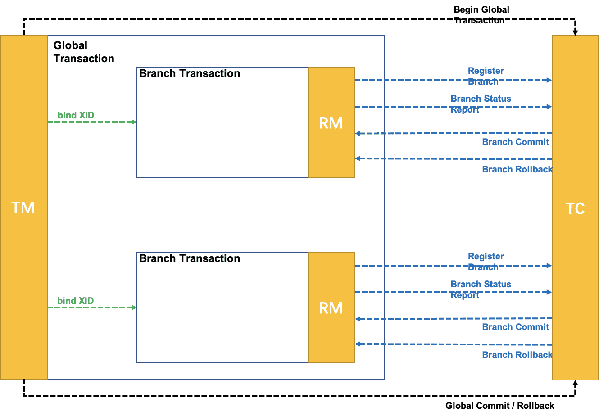

Seata 的全局事务处理过程，分为两个阶段：

+ 执行阶段：执行分支事务，并保证执行结果满足是可回滚（Rollbackable）和持久化（Durable）的。
+ 完成阶段：根据执行阶段结果形成的决议（本质是执行是否出现异常），应用通过 TM 发起全局提交或回滚的请求给 TC，TC 命令 RM 驱动分支事务进行 Commit 或 Rollback。

Seata 的所谓事务模式是指：运行在 Seata 全局事务框架下的分支事务的行为模式。准确地讲，应该叫分支事务模式。

不同的事务模式区别在于分支事务使用不同的方式达到全局事务两个阶段的目标。即，回答以下两个问题：

+ 执行阶段：如何执行并保证执行结果满足是可回滚和持久化。
+ 完成阶段：收到 TC 的命令后，如何做到分支的提交或回滚。

我们以 Seata 的 AT 模式和 TCC 模式为例来理解这两个问题。

在 AT 模式中，

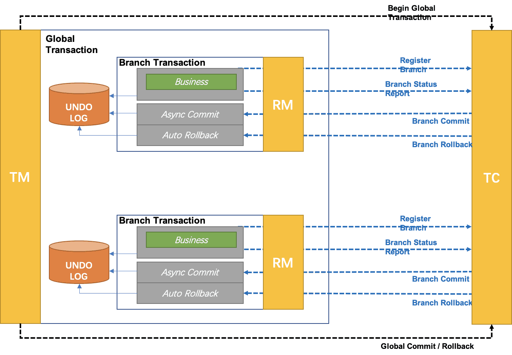

+ 执行阶段：
  - 可回滚：根据 SQL 解析结果，记录回滚日志 undo log
  - 持久化：回滚日志和业务 SQL 在同一个本地事务中提交到数据库
+ 完成阶段：
  - 分支提交：异步删除回滚日志记录
  - 分支回滚：依据回滚日志进行反向补偿更新

而在 TCC 模式中：

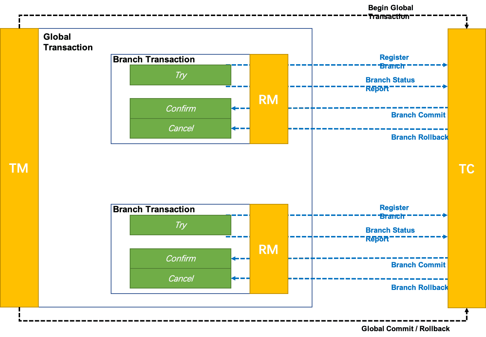

+ 执行阶段：
  - 调用业务定义的 Try 方法（完全由业务层面保证可回滚和持久化）
+ 完成阶段：
  - 分支提交：调用各事务分支定义的 Confirm 方法
  - 分支回滚：调用各事务分支定义的 Cancel 方法

### Seata XA 模式

那么 Seata XA 模式是如何做到这几点的。

所谓 Seata XA 就是在 Seata 定义的分布式事务框架内，利用事务资源（数据库、消息服务等）本身对 XA 协议的支持，以 XA 协议的机制来管理分支事务的一种事务模式。

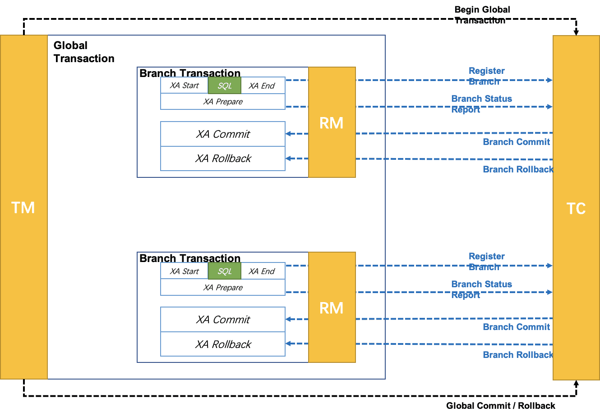

+ 执行阶段：
  - 可回滚：业务 SQL 操作放在 XA 分支中进行，由资源（数据库）对 XA 协议的支持来保证可回滚
  - 持久化：XA 分支完成后，执行 XA prepare，同样由资源对 XA 协议的支持来保证持久化（即之后任何意外都不会造成无法回滚的情况）
+ 完成阶段：
  - 分支提交：执行 XA 分支的 commit
  - 分支回滚：执行 XA 分支的 rollback

### 为什么支持 XA

为什么要在 Seata 中增加 XA 模式呢？支持 XA 的意义在哪里呢？

#### 补偿型事务模式的问题

首先要来看补偿型事务模式存在的问题，本质上，Seata 支持的 AT、TCC、Saga 都是补偿型的。

补偿型事务处理机制构建在事务资源之上（要么在中间件层面，比如 AT，要么在应用层面，比如 TCC），事务资源本身对分布式事务是无感知的。

这样的情况就会导致一个根本性的问题：无法做到真正的全局一致性。

比如，一条库存记录，处在补偿型事务处理过程中，由 100 扣减为 50，此时，数据库管理员连接数据库，查询统计库存，可以查询出此时的 50，之后，事务因为异常回滚，库存会被补偿回滚为 100，显然，数据库管理员查询统计到的 50 就是脏数据。

可以看到，补偿型分布式事务机制因为不要求事务资源本身（如数据库）的机制参与，所以无法保证事务框架之外的全局视角的数据一致性。

#### XA 的价值

与补偿型不同，XA 协议要求事务资源本身提供对规范和协议的支持。

因为事务资源感知并参与分布式事务处理过程，所以事务资源（如数据库）可以保障从任意视角对数据的访问有效隔离，满足全局数据一致性。

比如，上面提到的库存更新场景，XA 事务处理过程中，中间态数据库存 50 由数据库本身保证，是不会被数据库管理员的查询统计看到的（当然隔离级别需要读已提交以上），就像下面这样：

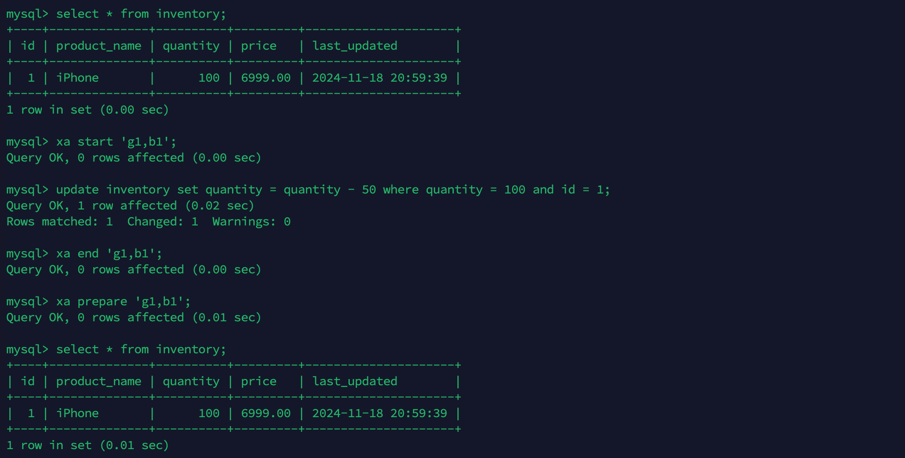

在真正执行 xa commit 之前，查询出来的数据都不会是中间态数据。

除了全局一致性这个根本性的价值外，支持 XA 还有如下几个方面的好处：

1. 业务无侵入：和 AT 一样，XA 模式是业务无侵入的，不会给应用设计和开发带来额外负担。
2. 数据库的支持广泛：XA 协议被主流关系型数据库广泛支持，不需要额外的适配即可使用。
3. 多语言支持容易：因为不涉及 SQL 解析，XA 模式对 Seata RM 的要求比较少，为不同语言开发 SDK 较之 AT 模式将更薄，更容易。
4. 传统基于 XA 应用的迁移：传统的，基于 XA 协议的应用，迁移到 Seata 平台，使用 XA 模式将更平滑。

### XA 被质疑的问题

XA 规范早在上世纪 90 年代初就被提出，用以解决分布式事务的问题。

现在，无论是 AT、TCC 还是 Saga，这些模式的提出，本质上都源自 XA 规范对某些场景的要求无法满足。

XA 规范定义的分布式事务处理机制存在一些被广泛质疑的问题，针对这些问题，我们是如何思考的呢？

#### 数据锁定

在 XA 模式中，数据一旦加锁，在后续整个全局事务处理过程结束前，都需要被锁定，读写都按隔离级别的定义约束起来。

就像下面这样：

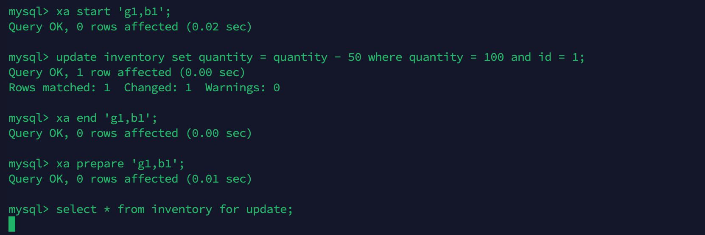

数据锁定是获得 **更高隔离性和全局一致性** 所要付出的代价。

补偿型的事务处理机制，在执行阶段即可完成分支（本地）事务的提交，在资源层面不锁定数据，这是以牺牲隔离性为代价的。

另外，AT 模式使用全局锁保障基本的写隔离，实际上也是锁定数据的，只不过锁在 TC 侧集中管理，解锁效率高且没有阻塞的问题。

#### 协议阻塞

在 XA 协议中，XA prepare 后，分支事务进入阻塞阶段，收到 XA commit 或 XA rollback 前必须阻塞等待。

协议的阻塞机制本身并不是问题，关键问题在于协议阻塞遇上数据锁定。

如果一个参与全局事务的资源“失联”（收不到分支事务结束 commit / rollback 的命令），那么它锁定的数据，将一直被锁定，甚至可能因此产生死锁。

这是 XA 协议的核心痛点，也是 Seata 引入 XA 模式要重点解决的问题，解决的基本思路是两个方面：

+ 避免“失联”。
+ 增加“自解锁”机制。

#### 性能较差

XA 模式性能的损耗主要来自两个方面：一是事务协调的过程增加了单个事务的 RT，另一方面是并发事务数据的锁冲突降低了系统吞吐量、系统并发量。

和不使用分布式事务支持的运行场景比较，性能肯定是下降的，这点毫无疑问。

本质上，事务（无论是本地事务还是分布式事务）机制就是拿部分性能的牺牲，换来编程模型的简单。

与同为业务无侵入的 AT 模式比较：

首先，因为同样运行在 Seata 定义的分布式事务框架下，XA 模式并没有产生更多事务协调的通信开销。

其次，并发事务产生锁冲突的情况在 AT 模式下（默认使用全局锁）同样存在。

所以，在影响性能的两个主要方面，XA 模式并不比 AT 模式有非常明显的劣势，而 AT 模式性能优势主要在于集中管理全局数据锁，锁的释放无需 RM 参与，释放锁非常快，另外，全局事务的提交，基本是异步化处理的，对于大多数正常业务来说是很合适的。

### Seata 如何实现 XA

XA 模式运行在 Seata 定义的事务框架内，所以和 AT 模式一样，实现 XA 的核心点也在于数据源静态代理和 AOP 环绕增强。

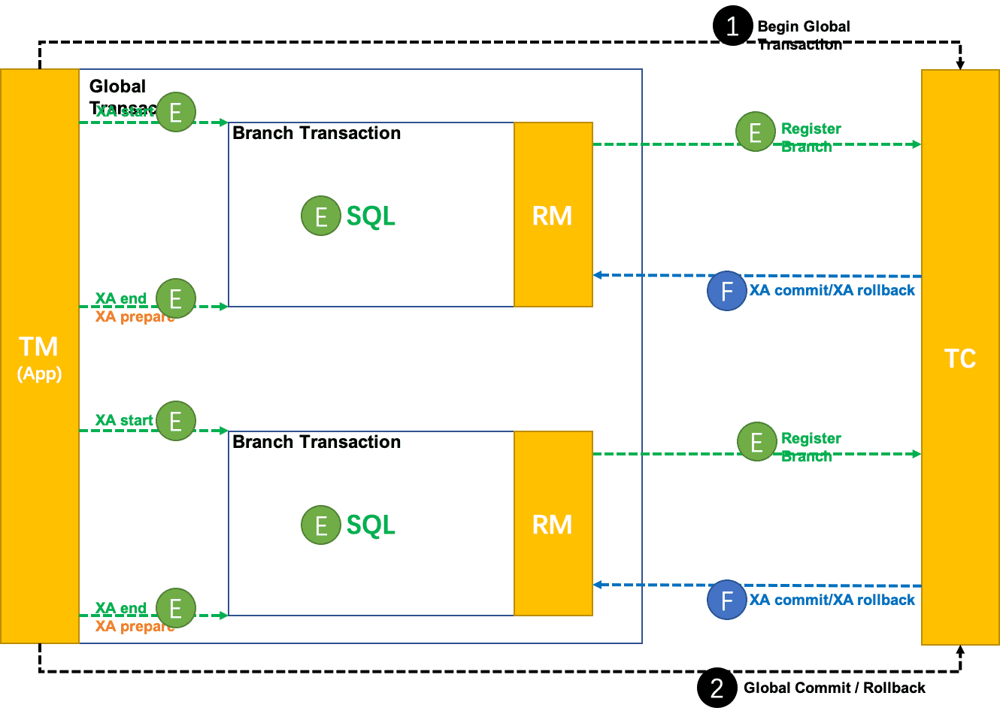

Seata XA 模式主要是基于资源对 XA 协议的支持来实现的，所以整个过程也就是对 xa 命令的执行。

这里我们还是从两个阶段来解释一下 XA 模式运行的过程。

+ 一阶段：xa start、do business、xa end、xa prepare
+ 二阶段：
  - xa commit
  - xa rollback

#### 一阶段执行

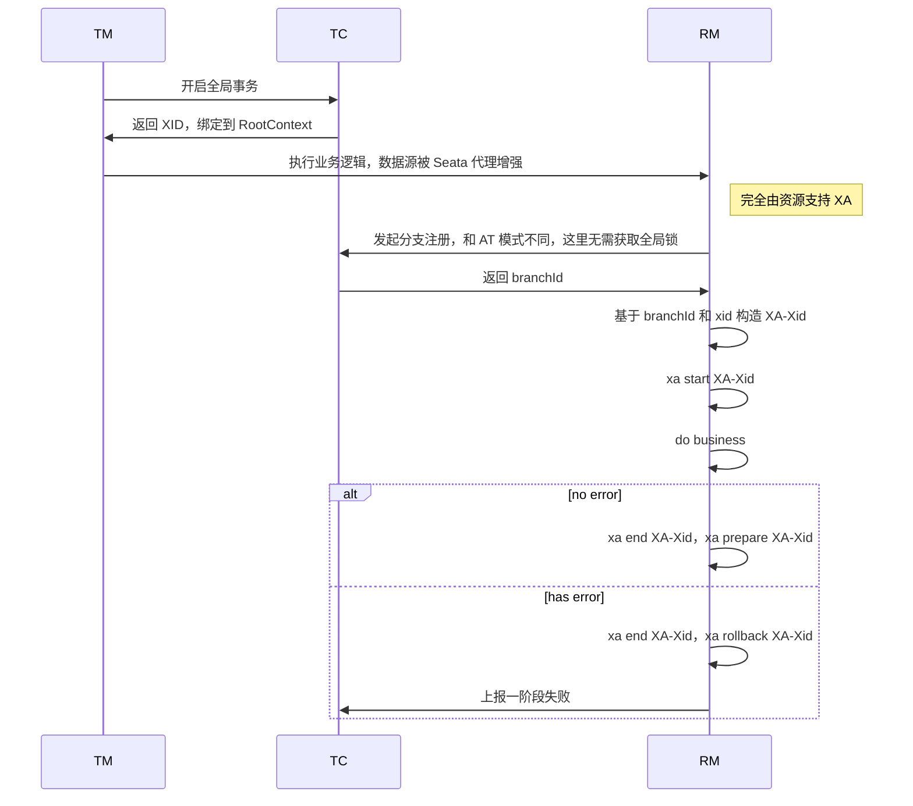

#### 二阶段提交


#### 二阶段回滚

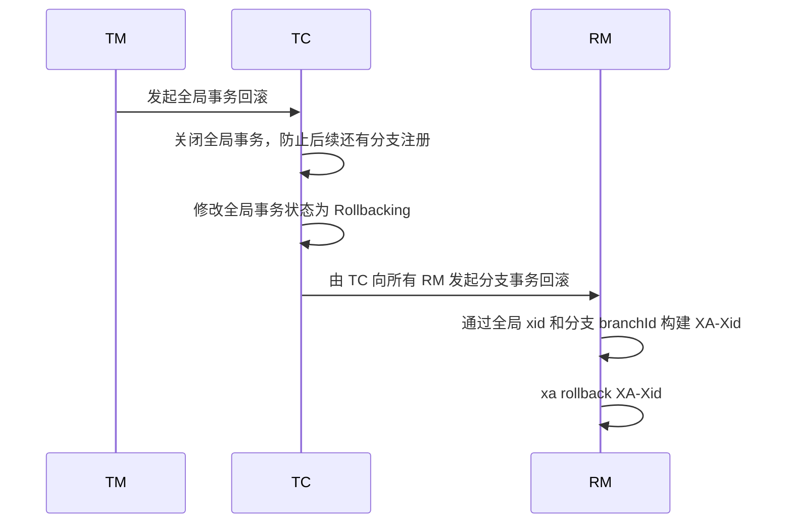

可以看到，其实 Seata XA 模式还是很简单的，它主要依赖于资源对 XA 协议的支持，Seata 自身只是起到一个串联的作用。

## Seata 如何解决 2PC 的工程化难点

### 单点故障

TC 作为 Seata 中的一个最为关键的角色，如果出现故障，那一定是最为致命的，尤其是在 XA 模式的二阶段，所以为了应对 TC 的单点故障问题，我们需要部署 TC 集群来实现 TC 的高可用。

参考下面基于 k8s 部署 Seata Server 高可用部署的案例：[https://seata.apache.org/zh-cn/blog/seata-ha-practice/](https://seata.apache.org/zh-cn/blog/seata-ha-practice/)

### 网络超时和节点宕机

针对网络超时和节点宕机，Seata 的做法主要有三点：

1. Seata 服务端的重试线程池
2. 可持久化事务日志，包括 global_table、branch_table 等
3. 利用 XA 资源本身的可回滚、持久化的能力（当然我们前面也说了，AT 由 undo log 来实现、TCC 和 Saga 由业务方自行实现）

和 Seata 服务相关的是重试线程池和可持久化事务日志，所以我们重点聊一聊。

在 Seata 服务端，TC 创建时会初始化下面的定时线程池用于处理不同状态下的全局事务，这些线程池负责推进那些可能因网络问题或节点故障而停滞的事务。

```java
public void init() {
    // 默认每隔 1s 查询全局事务状态为 TIMEOUT_ROLLBACKING、TIMEOUT_ROLLBACK_RETRYING、ROLLBACK_RETRYING 的事务，发起全局回滚
    retryRollbacking.scheduleAtFixedRate(() -> SessionHolder.distributedLockAndExecute(RETRY_ROLLBACKING, this::handleRetryRollbacking), 0, ROLLBACKING_RETRY_PERIOD, TimeUnit.MILLISECONDS);
    // 默认每隔 1s 查询全局事务状态为 COMMIT_RETRYING COMMITTED 的事务，发起全局提交，为什么有 COMMITTED？可能是因为全局事务状态是 COMMITTED 但是存在分支事务还未提交的情况
    retryCommitting.scheduleAtFixedRate(() -> SessionHolder.distributedLockAndExecute(RETRY_COMMITTING, this::handleRetryCommitting), 0, COMMITTING_RETRY_PERIOD, TimeUnit.MILLISECONDS);
    // 默认每隔 1s 查询全局事务状态为 ASYNC_COMMITTING 的事务，发起全局提交，主要用在 AT 模式
    asyncCommitting.scheduleAtFixedRate(() -> SessionHolder.distributedLockAndExecute(ASYNC_COMMITTING, this::handleAsyncCommitting), 0, ASYNC_COMMITTING_RETRY_PERIOD, TimeUnit.MILLISECONDS);
    // 延迟 60s 后开始，每隔一天删除一次 undo log
    undoLogDelete.scheduleAtFixedRate(() -> SessionHolder.distributedLockAndExecute(UNDOLOG_DELETE, this::undoLogDelete), UNDO_LOG_DELAY_DELETE_PERIOD, UNDO_LOG_DELETE_PERIOD, TimeUnit.MILLISECONDS);
    // 默认每隔 1s 查询处于 Begin 状态的全局事务，如果全局事务超时则更新全局事务状态为 TIMEOUT_ROLLBACKING，由 retryRollback 线程池发起全局回滚
    timeoutCheck.scheduleAtFixedRate(() -> SessionHolder.distributedLockAndExecute(TX_TIMEOUT_CHECK, this::timeoutCheck), 0, TIMEOUT_RETRY_PERIOD, TimeUnit.MILLISECONDS);
    // 找出全局事务状态为 ROLLBACKING 的事务，并对已经超时的事务再次发起全局事务回滚，根据一定的规则计算下一次调度的时间
    rollbackingSchedule(0);
    // 找出全局事务状态为 COMMITTING 的事务，并对已经超时的事务再次发起全局事务提交，根据一定的规则计算下一次调度的时间
    committingSchedule(0);
}
```

其次是可持久化事务日志，TC 在每一个阶段都会将对应的全局事务和分支事务状态做持久化，这样即使 TC 或者 RM 发生宕机，只要最终节点重启，也可以从持久化存储中恢复事务状态，继续之前的操作，而可持久化日志结合上述提到的重试线程池，可以确保即使在网络不稳定或者服务暂时不可用的情况下，事务最终仍然能够被正确地提交或回滚。

但是我们知道 XA 模式会锁定事务资源，如果 TC 或者 RM 一直不能重启，那么事务资源就会一直被锁定。

针对这个问题，如果是 RM 宕机，TC 会进行重试，我们只需要配置重试的超时时间即可，当重试时间到分支事务还未提交，就可以最终结束这个失败的分支事务，记录日志，转人工处理。

但是，一旦 TC 宕机，也就不存在重试超时时间之说了，所有的分支事务都会处于锁定状态，不能提交。

事实上，我也在本地尝试过让 TC 在二阶段宕机，实际的结果是所有的分支事务都会处于锁定状态，直到 TC 重启，所以如果要使用 Seata，请尽量部署 TC 高可用集群。

### 最后再举个栗子

我们再从 MySQL XA 相关的命令出发看一下是如何处理的，考虑下面的例子：

```java
// orderService 是本地调用，inventoryService 是 RPC 接口
@GlobalTransactional
public void doBusiness() {
    /* insert order */
    orderService.createOrder();
    /* update inventory */
    inventoryService.deductInventory();
}
```

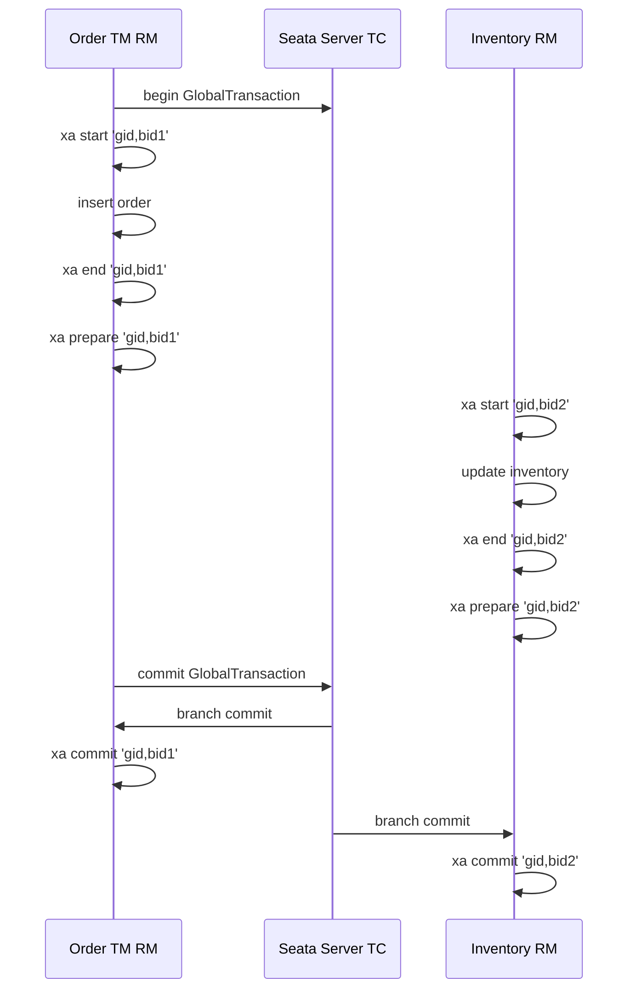

再来看一个异常的例子，假设扣减库存时出现异常

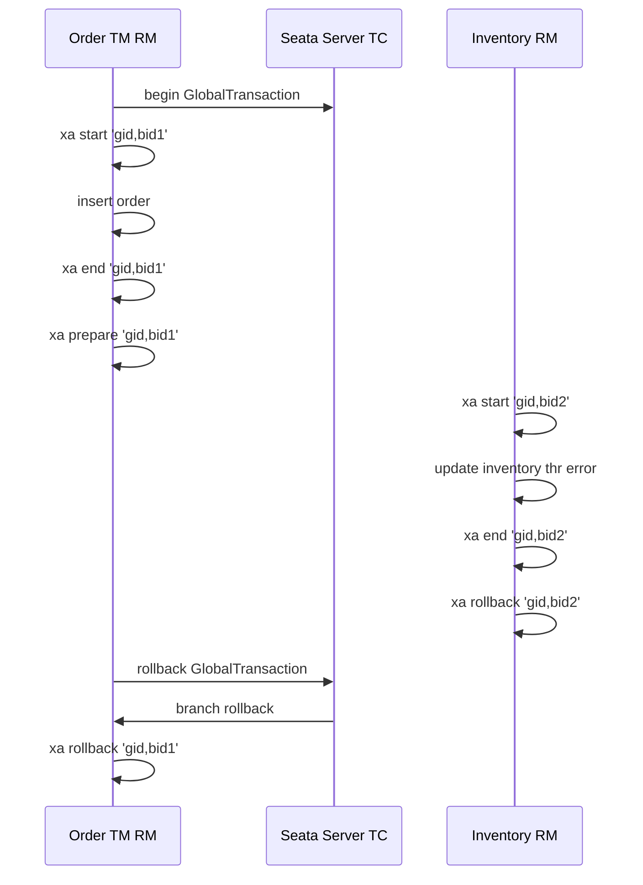

## 文末总结

在当前的技术发展阶段，不存一个分布式事务处理机制可以完美满足所有场景的需求。

一致性、可靠性、易用性、性能等诸多方面的系统设计约束，需要用不同的事务处理机制去满足。

而 Seata 项目最核心的价值在于：构建一个全面解决分布式事务问题的标准化平台。基于 Seata，上层应用架构可以根据实际场景的需求，灵活选择合适的分布式事务解决方案。
