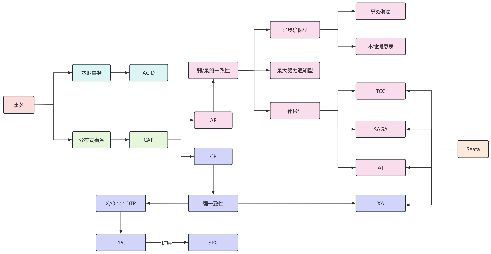
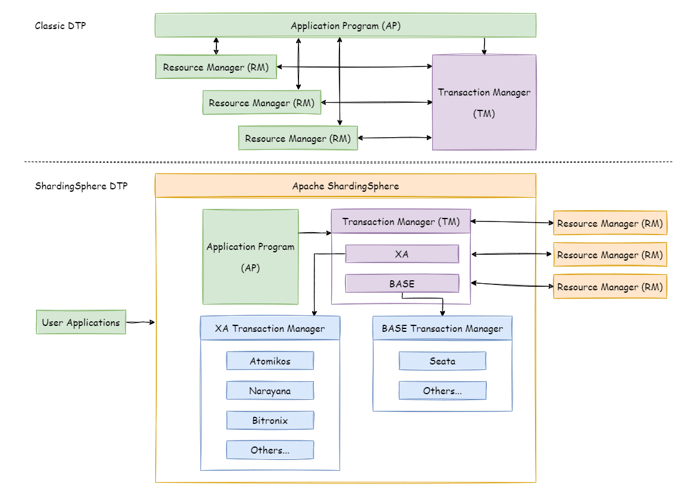

## 前言

总结一下分布式事务的常见解决方案。

## 什么是分布式事务

分布式事务是指在分布式系统中，跨越多个数据节点或应用服务的事务操作。

在分布式系统中，一个业务操作可能需要更新位于不同数据库、不同服务甚至不同地理位置的数据，为了保证这些操作的一致性和可靠性，就需要使用分布式事务来确保所有相关的事务操作要么全部成功提交，要么全部失败回滚。

典型的分布式事务问题出现在 **多服务的 RPC 远程调用** 以及 **数据库分库**。

以电商交易场景为例，用户支付订单这一核心操作的同时会涉及到下游物流发货、积分变更、购物车状态清空等多个子系统的变更。

在分布式场景下，订单服务、物流服务、积分服务等分布在不同的物理节点上，此时就需要保证所有服务操作的事务都能够同步进行，避免出现数据不一致的情况。

这里注意，并不是说事务操作有关的数据表位于同一个数据库就不会出现分布式事务的问题，如果业务需要在多个服务间进行相互调用，那么这些服务之间使用的肯定不是一个数据库连接，自然就不能通过本地事务来保证事务特性了。

## 常见的分布式事务解决方案

为了解决分布式事务问题，业界也有很多分布式事务解决方案。

我们知道，在分布式系统中，要么选择 AP，要么选择 CP，A 和 C 不能同时满足，由此也产生了两大类不同的分布式事务解决方案。

一类是保证强一致性的、基于 XA 协议的两阶段提交，以及由其扩展的三阶段提交协议，另一类是保证弱/最终一致性的包括异步确保型、最大努力通知型以及补偿型解决方案。

而为了规范事务的开发，Java 也增加了关于事务的规范，即 JTA 和 JTS，JTA 也是基于 XA 协议的，它将 XA 协议中的 TM 抽象为 javax.transaction.TransactionManager 接口，并通过底层事务服务（JTS）实现，像很多其他的 Java 规范一样，JTA 仅仅定义了接口，具体的实现是由供应商负责提供，目前的 JTA 实现主要包括 Atomikos 等。

同时，在业界比较流行的 Apache Seata 也基于四种不同的解决思想给出了具体的落地实现，具体参考下图：

保证强一致性的分布式事务解决方案，如基于 XA 协议的 2PC，3PC 等强调多个分支事务操作的原子性，任何一个分支事务失败，整个流程的所有事务都不能提交，同时一旦整个流程成功，所有的分支事务都必须提交。

另外一些保证弱/最终一致性的分布式事务解决方案如本地消息表、事务消息、TCC 等则更强调分支事务操作的数据最终一致性，它们不强制多个分支事务的原子性，但是需要通过补偿、重试等机制来保证数据的最终一致性。

在 ShardingSphere 的文档中，有下面一张图，也对传统的 XA 协议中的 DTP 模型做了进一步的细化，算是对分布式事务的另一种划分，如下：

## 如何选择

在选择一个分布式事务方案时，需要考虑很多因素，一般来说可以有以下几种选择方式：

1、实现成本：根据项目开发和维护的难度、成本等方面来选择合适的分布式事务方案。这几种方案中，TCC 实现成本最高，业务侵入性也比较大。

另外，事务消息、本地消息表和最大努力通知型都依赖 MQ，所以也要考虑 MQ 部署、维护和接入成本，而且同样是 MQ，也不是所有的都支持事务消息，这个也是需要考量的一个重要因素。

2、一致性要求：在一致性方面，2PC、3PC、Seata-XA 都可以保证强一致性，而其他几种方案都是保证最终一致性。

根据业务情况，比如下单环节中，库存扣减和订单创建可以用强一致性来保证，而订单创建和积分扣减就可以用最终一致性即可，而对于一些非核心链路的操作，如核对等，可以用最大努力通知即可。

3、可用性要求：根据 CAP 理论，A 和 C 是没办法同时保证的，所以对于需要保证高可用的业务，建议使用最大努力通知型等最终一致性方案，对于可用性要求不高，但是需要保证高一致性的业务，可以使用 2PC 等。

4、数据规模：对于利用 MQ 的这种方案，其实不是特别适合业务量特别大的场景，有可能出现消息堆积导致一致性保障不及时，对于数据量大的场景，可以考虑 Seata 中的解决方案。
