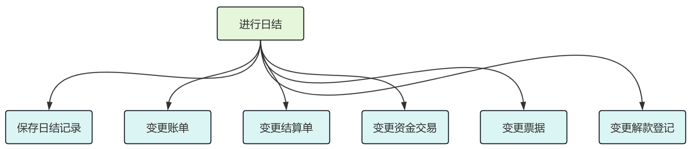
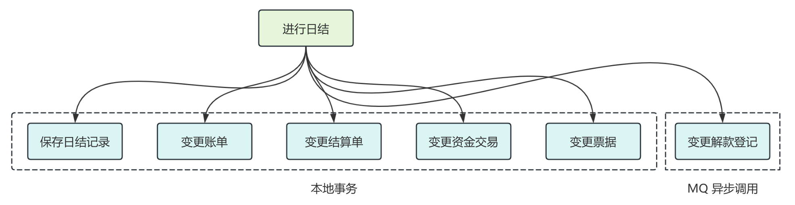
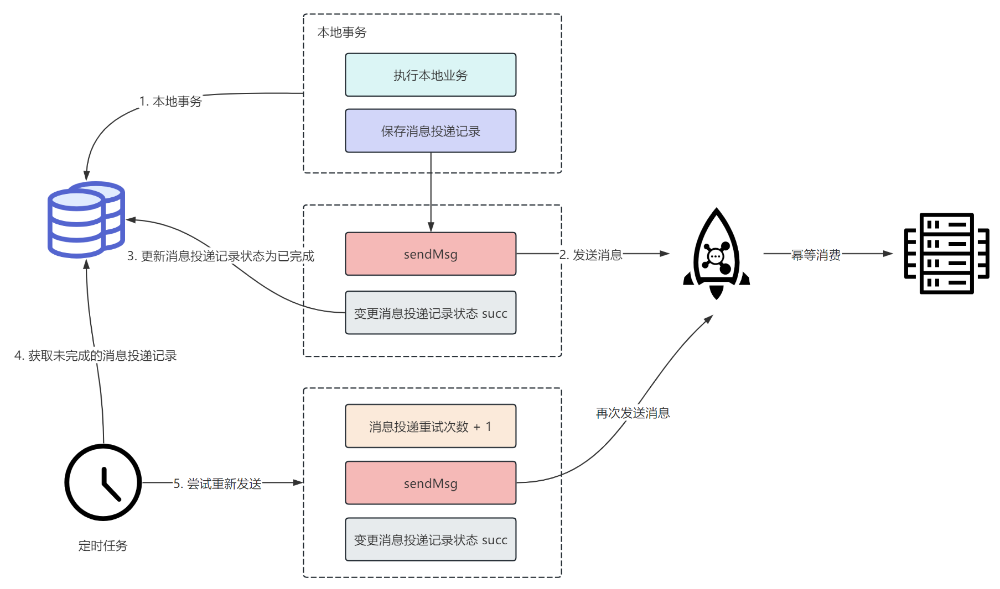
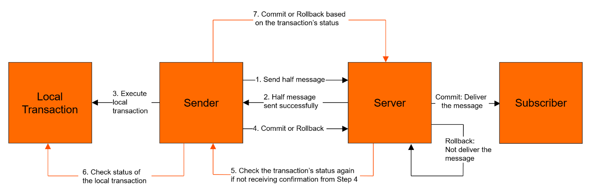

## 前言

最近在做一项业务迁移的工作，将原有的本地调用换成了 MQ，也引出了一致性的问题，最终是通过本地消息表的方式来保证了最终一致性。

这篇文章就来分享一下这个过程，顺便也整理一下异步确保型的分布式事务解决方案。

## 业务背景

目前我们的平台有一个日结接口，在这个接口中会涉及到多张表的事务问题，大致的日结流程如下：

1. 首先创建日结记录。
2. 然后将日结记录 id 写入到账单表，结算单表，资金交易表，票据表，解款登记表中，并将这些表中的 is_daily_settle 字段变更为 1 表示完成日结。
3. 当然取消日结也会将这些表中的 is_daily_settle 字段重新变更为 0 表示取消日结。

那么整体的流程如图：



而最近我们将解款登记这个业务进行了迁移，从平台侧迁移到了业务侧。

我们迁移的方案是在平台日结之后，通过发送日结成功的 MQ 消息，然后在业务侧监听 MQ 消息，变更解款登记表。

在进行迁移之前，我们可以通过本地事务保证这 6 张表数据的强一致性，而迁移之后，解款登记表就到了业务工程的数据库中，那么这就会出现分布式数据一致性的问题。

## 存在的一致性问题

我们将整个调用链路简化为本地事务 + MQ 异步调用，然后来看看迁移之后为什么会出现一致性问题。



在分布式系统中，由于 MQ 异步调用涉及到网络通信，而网络通信是不确定性（比如超时等问题）就会导致一致性问题。

主要可能会存在下面几个问题：

1. 本地事务和消息发送的原子性
2. 消费者端接受消息的可靠性
3. 消息被消费者重复消费的问题

对于第 2 点，描述的就是消息成功到达 broker，消费者如何保证一定能收到消息，这就和 MQ 的重试机制以及持久化存储密切相关，我们一般认为 MQ 是一个可靠的组件，这里的可靠是指只要消息被成功投递到 MQ，那么它就不会丢失，**至少可以被消费者成功消费一次。** 这是 MQ 需要保证的最基本特性。

在保证消息的可靠投递的情况下，消费者就有可能因为服务重启、故障等问题导致重复消费，实际上，消息的可靠投递和避免消息重复投递本身就是矛盾的，而消息的可靠投递是更重要的，所以需要消费者自身做好消费幂等，这就是第 3 点所描述的问题。

在这篇文章，我们主要是想聊一聊第 1 点，也就是本地事务和消息发送的原子性，这里所谓的原子性就是指，发送消息和本地事务应该是要么都成功，要么都失败。

## 良好的编码

显而易见的是，我们应该让本地事务尽可能的小，从而避免大事务问题，所以最好不要在本地事务中进行消息发送，这会给事务带来较大的负担。

其次，我们应该考虑的是发送消息和本地事务执行的顺序问题，如果先发送消息，一旦本地事务发生回滚，但是消息已经发送出去了，是不能撤回的，所以我们应该考虑先执行本地事务，本地事务执行成功之后再发消息，这样就可以最大程度的降低发送消息和本地事务不一致的风险。

我们知道，在 Spring 中，支持声明式事务和编程式事务，针对这两种方式，我们有不同的处理。

### 声明式事务

首先是基于 TransactionSynchronization 实现的一个事务后处理器，如下

```java
import org.springframework.transaction.support.TransactionSynchronization;
import org.springframework.transaction.support.TransactionSynchronizationManager;

/**
 * 事务工具类，支持在发送事务之后做一些后置处理
 */
public class TransactionUtil {

    public static void afterTransactionComplete(PostProcessor postProcessor) {
        if (TransactionSynchronizationManager.isActualTransactionActive()) {
            TransactionSynchronizationManager.registerSynchronization(new TransactionComplete(postProcessor));
        }
    }

    static class TransactionComplete implements TransactionSynchronization {

        private final PostProcessor postProcessor;

        TransactionComplete(PostProcessor postProcessor) {
            this.postProcessor = postProcessor;
        }

        @Override
        public void afterCompletion(int status) {
            // 事务提交之后进行后处理
            if (status == TransactionSynchronization.STATUS_COMMITTED) {
                postProcessor.postProcess();
            }
        }
    }

    @FunctionalInterface
    interface PostProcessor {

        /**
         * 后处理
         */
        void postProcess();
    }
}
```

使用工具类：

```java
import org.springframework.transaction.annotation.Transactional;

@Component
public class TxTest {

    @Transactional
    public void dailySettle() {
        // local transaction

        TransactionUtil.afterTransactionComplete(() -> {
            // send mq
        });
    }
}
```

### 编程式事务

如果是使用编程式事务，那就很简单了

```java
import org.springframework.beans.factory.annotation.Autowired;
import org.springframework.stereotype.Component;
import org.springframework.transaction.support.TransactionTemplate;

@Component
public class TxTest {

    @Autowired
    private TransactionTemplate txTemplate;

    public void dailySettle() {
        Boolean success = txTemplate.execute(status -> {
            // local transaction
            
            // if local transaction success then return true
            return true;
        });
        if (success) {
            // send mq
        }
    }
}
```

但这样就万无一失了吗？其实不然。

这仅仅只是我们在代码结构层面做出的最优的考虑，实际上还存在一些问题，比如在本地事务提交之后发送消息前服务故障宕机，或者是本地事务提交，但是发送消息超时，这都会造成发送消息和本地事务无法保证原子性的问题。

基于此，我们梳理了本地消息表和 RocketMQ 事务消息的方案。

## 本地消息表

### 流程梳理

采用本地消息表方案的流程图如下：



首先执行本地业务逻辑，正常执行完成后，在消息投递记录表中创建一条消息投递记录，这里本地业务逻辑和创建投递消息记录需要包裹在同一个事务中，一旦某个变更失败则进行回滚。

当上面的事务执行成功后，就可以开始发送消息了。

同时，系统中会有定时任务不断查询消息投递记录表中未完成的消息投递记录，重新进行发送。

在整个过程中，如果消息投递成功会变更消息投递记录状态为已完成，避免后续再次投递。

由于「变更消息投递记录状态为已完成」这个操作可能会失败，所以会导致定时任务再次查询到已经发送完成但未更新的消息投递记录，然后重新发送，这势必会导致消息重复发送，所以要求消费者端必须做好幂等处理。

此外，如果想要减轻下游消费者端的幂等处理负担，我们可以让定时任务在查出消息投递记录表中未完成的消息投递记录之后，先查询下游业务系统的状态，如果已经成功了，那么可以直接将消息投递记录推进为已完成。

当然，如果消息投递记录达到阈值之后，就可以转人工处理了。

### 物理模型

消息投递记录表对应的物理模型如下：

```sql
CREATE TABLE `biz_msg_delivery` (
  `id` bigint NOT NULL COMMENT '消息投递表主键',
  `msg_topic` varchar(255) COMMENT '消息 topic',
  `msg_tag` varchar(255) COMMENT '消息 tag',
  `msg_content` text COMMENT '消息内容',
  `delivery_status` tinyint DEFAULT NULL COMMENT '消息投递状态，1-未投递 2-完成投递',
  `max_elivery_retry_time` int DEFAULT NULL COMMENT '消息投递重试最大次数，达到则业务告警，人工介入',
  `delivery_retry_time` int DEFAULT NULL COMMENT '消息投递重试次数',
  `delivery_bean` varchar(255) DEFAULT NULL COMMENT '负责投递该消息的 bean, 定时任务拿到记录后根据该字段找到对应的 bean 进行具体的消息处理',
  `create_time` datetime DEFAULT NULL COMMENT '创建时间',
  `update_time` datetime DEFAULT NULL COMMENT '更新时间',
  `is_deleted` tinyint DEFAULT NULL COMMENT '逻辑删除',
  PRIMARY KEY (`id`)
) ENGINE=InnoDB DEFAULT CHARSET=utf8mb4 COLLATE=utf8mb4_0900_ai_ci;
```

### 示例代码

参考：[message-consistency](https://github.com/hein-hp/message-consistency)

## 事务消息

除了上面本地消息表的方案，我们还可以考虑使用 RocketMQ 的事务消息。

有关事务消息，官网描述的已经很详细了，你可以查看 [事务消息 | RocketMQ](https://rocketmq.apache.org/zh/docs/featureBehavior/04transactionmessage/)，当然这里我们也简单说一说。

### 功能原理

RocketMQ 实现的分布式事务消息，主要是在普通消息基础上，支持了二阶段的提交能力，将二阶段提交和本地事务绑定，实现全局提交结果的一致性。

其模型如下：



整个大致流程如下：

1. 首先生产者将消息发送至 RocketMQ 服务端。
2. RocketMQ 服务端将消息持久化成功之后，向生产者返回 Ack 确认消息已经发送成功，此时消息被标记为“暂不能投递”，这种状态下的消息即为半事务消息（Half Message）。
3. 接着生产者开始执行本地事务逻辑。
4. 生产者根据本地事务执行结果向 RocketMQ 服务端提交二次确认结果（Commit 或 Rollback），服务端收到确认结果后处理逻辑如下：
   - 二次确认结果为 Commit：服务端将半事务消息标记为可投递，并投递给消费者。
   - 二次确认结果为 Rollback：服务端将回滚事务，不会将半事务消息投递给消费者。
5. 在断网或者是生产者应用重启的特殊情况下，若服务端未收到发送者提交的二次确认结果，或服务端收到的二次确认结果为 Unknown 未知状态，经过固定时间后，服务端将对消息生产者即生产者集群中任一生产者实例发起消息回查。
6. 生产者收到消息回查后，需要检查对应消息的本地事务执行的最终结果。
7. 生产者根据检查到的本地事务的最终状态再次提交二次确认，服务端仍按照步骤 4 对半事务消息进行处理。

## 为什么不选择事务消息

这里我们为什么不选择 RocketMQ 的事务消息。

首先从功能实现来说，本地消息表和事务消息都可以保证事务发起方在执行完本地事务之后，消息一定可以发出去。

那么不使用事务消息，我考虑到的原因主要有：

首先采用事务消息的方案是严重依赖 RocketMQ 的，而我们的本地消息表方案理论上可以将 MQ 替换为其他任何 MQ 中间件。

其次，事务消息的方案在大多数正常流程下会产生更多次的网络调用，而更多次的网络调用也就会增加调用失败、超时的风险。

并且，事务消息的编码逻辑也更加复杂，而且对业务代码具有极大的侵入性，本来只需要发一次消息，用了事务消息之后需要改成发送两个 half 消息，同时还得给 MQ 提供一个反查接口，本身业务就复杂，再引入事务消息，更增大了业务理解的难度。

而本地消息表方案对代码的侵入性没那么高，并且不需要 MQ 支持事务消息，只是需要单独创建一张本地消息表，并且提供一个定时任务来做轮询，而且我觉得定时任务在一般的公司也算基础设施了吧。

## 总结

总的来说，本地消息表、事务消息适合于不要求强一致，但必须保证最终一致性的场景。

并且事务消息和本地消息表两个方案是可以互相替换的，用了事务消息的地方都可以换成本地消息表，但实际上，如果 MQ 支持事务消息，才可以考虑这个方案，如果公司使用的 MQ 不支持事务消息，就可以考虑本地消息表。

或者还有些场景有一些消息持久化、或者对账的需求，那么也建议使用本地消息表的方案。
