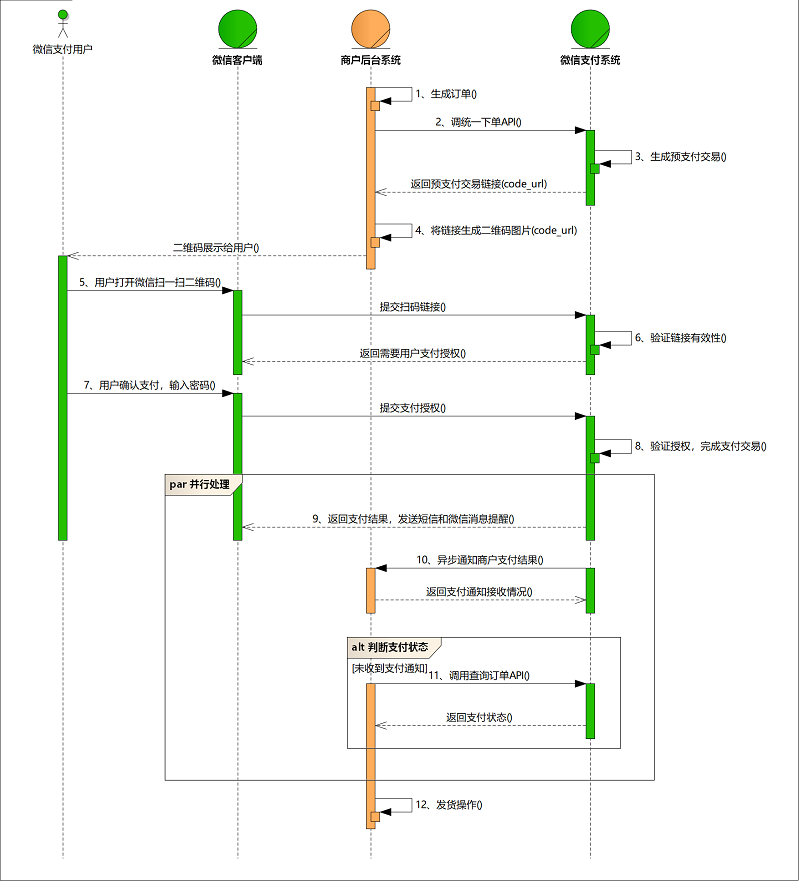
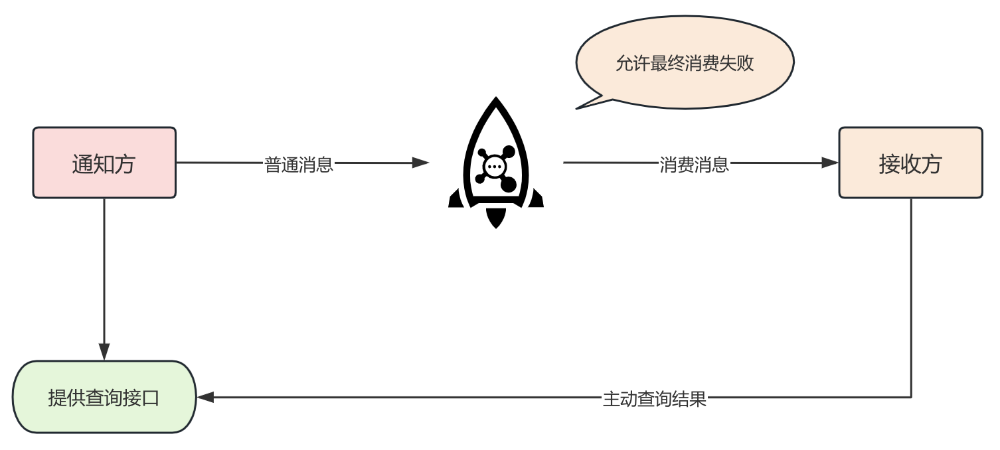
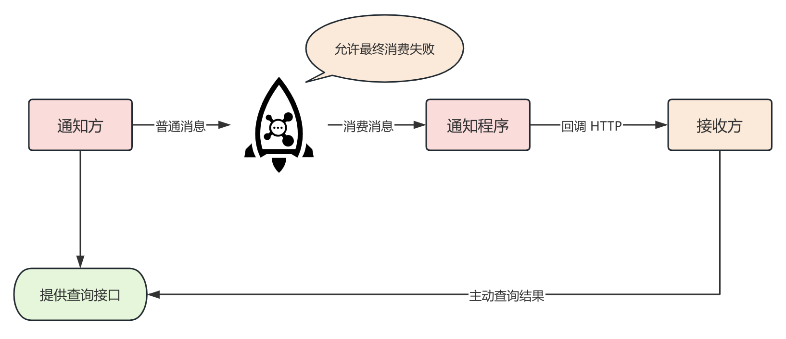

## 前言

最大努力通知也是一种分布式事务解决方案，主要用于一些外部系统，一个比较典型的例子就是做支付对接的场景，我们下面也会结合支付对接的场景来说一说。

## 支付对接流程

下面是微信 native 支付的流程交互图：

这里我们重点关注第 10、11 步。

当用户在微信输入密码之后，微信支付系统处理之后会向商家预设的 notify_url 发送支付结果，这个过程是异步的，事实上，这个异步通知可能会调用多次，在商家系统没有响应支付通知接受结果的情况下。

而在第 11 步，商家系统也可以通过微信支付系统的查单 API 来查询支付订单。

这其实就是最大努力通知的分布式事务解决方案。

## 最大努力通知的要求

从上面的支付的例子中，注意到两点，支付系统可能会多次异步通知商家系统，支付系统需要支持商家系统的查单请求。

所以，对于最大努力通知方案的要求在于：

+ 重复通知机制：通知方有一定的消息重复通知机制，尽最大努力通知到接收方，可以是按照梯度增加的时间间隔进行通知，比如 1min、5min、10min 等。
+ 通知校对机制：通知方能够正确处理接收方的查询请求，以便在尽最大努力也没有通知到接收方，或者接收方需要重复消费消息的场景下也能满足需求。

所以总的来说，最大努力通知需要满足两点：尽可能通知、提供查询机制。

## 与异步确保型方案的区别

最大努力通知方案和本地消息表、事务消息有什么区别？

在异步确保型方案中，通知方需要保证一定会将消息发出，并且发送到接收方，消息的可靠性关键由通知方保证。

而最大努力通知方案中，通知方只需要尽最大努力的将消息通知到接收方，但不保证接收方一定接受到，此时需要接受方主动调用通知方提供的查询接口查询结果，所以保证可靠性的关键字在接收方。

## 具体实现

当然在实际情况下，最大努力通知方案也可以结合异步确保型方案一起使用，所以一般情况下就有两种实现方案。

### MQ 重试

基于 MQ 做重试的方案是很简单的，主要是依赖 MQ 的重试机制来实现最大努力通知，整体流程和一个消息的生产和消费类似，如下：

通知方发送普通消息到 MQ，这里并不需要保证发送消息一定成功，如果没有成功发到 MQ 可以由接收方主动请求查询接口查询结果。

然后接收方监听 MQ，利用 MQ 的重试机制实现最大努力通知。

要求通知方提供查询接口供接收方查询业务结果。

### 通知程序重试

通知程序重试的这种情况类似于我们上面描述的支付对接中支付系统通知商家系统，同时与上面的方案相比多了一个通知程序，流程如下：

首先通知方发送普通消息到 MQ，这里可以使用异步确保型方案（事务消息、本地消息表）保证本地事务和消息发送的原子性，当然也可以不使用，而是转而将可靠性依赖于查询接口上。

然后系统会有专门的通知程序监听该 MQ，收到消息后通知程序通过 HTTP 等方式请求接收方的回调地址完成通知，通知程序调用该回调接口成功就表示通知成功，进而该消息消费成功。

可以看到，该方案中由通知程序监听 MQ 而不是接收方监听 MQ。

同样，也要求通知方提供查询接口供接收方查询业务结果。

## 总结

其实，不管是 MQ 重试还是通知程序重试，一个最重要的点就是需要通知方提供查询接口供接收方查询业务结果，一旦保证了这一点，其他的都可以很随意的做了。
