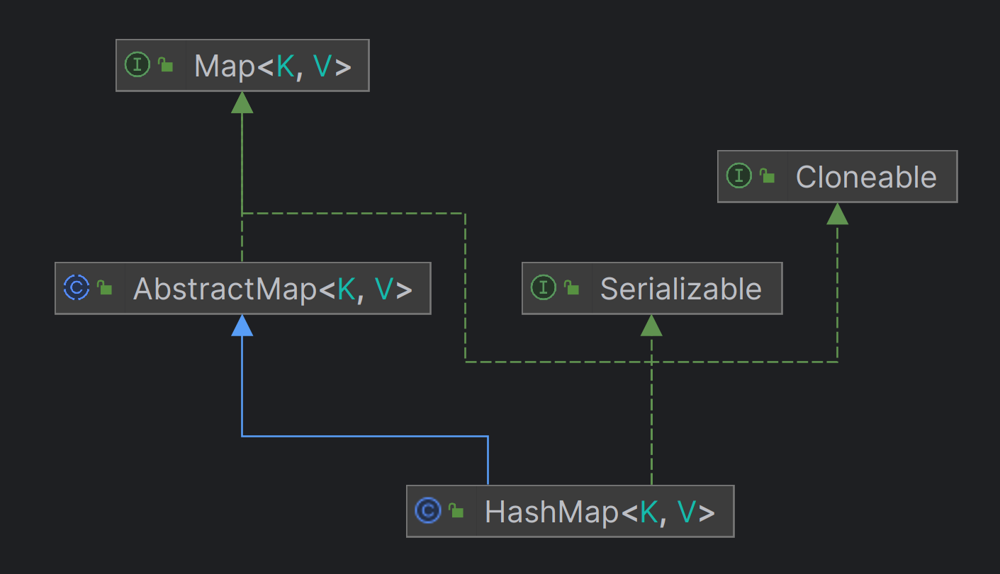
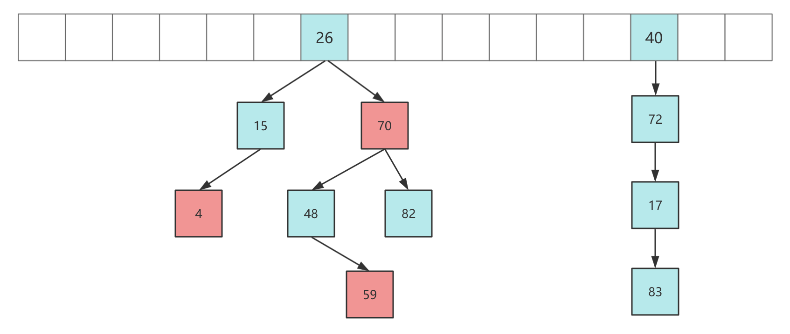
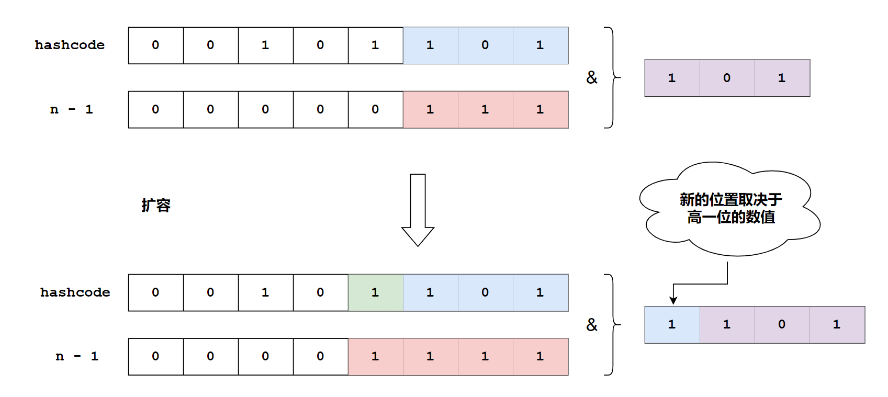
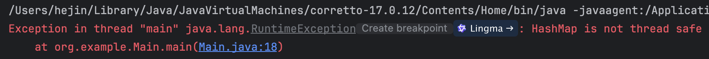

## 前言

HashMap 是程序中一个比较常用的键值数据容器，它本质上是一个散列表，所以绕不开散列表的三大问题：**散列函数、哈希冲突、扩容方案**，同时 HashMap 作为一个数据结构，还必须考虑多线程并发访问的问题，也就是 **线程安全**。

所以我们主要就是围绕这 4 点来展开。

## 继承结构

HashMap 属于 Map 集合体系的一部分，同时继承了 Serializable 接口可以被序列化，继承了 Cloneable 接口可以被复制。

其继承结构如下：



HashMap 并不是全能的，对于一些特殊情景下的需求，官方拓展了一些其他的类来满足，如线程安全的 ConcurrentHashMap、记录插入顺序的 LinkedHashMap、对键排序的 TreeMap 等。

## 散列函数

散列函数主要用于计算一个 key 在数组（哈希桶）中的下标，判断一个散列函数是否优秀的标准是：散列是否均匀、计算是否简单。

HashMap 中桶索引的计算步骤：

1. 对 key 对象的 hashcode 进行扰动
2. 通过 & 运算求出 key 对应的桶索引

### 扰动

扰动是为了让 hashcode 的随机性更高，在第二步就不会让所有的 key 都聚集在一起，提高散列均匀度。如何扰动可以查看 `hash()` 方法：

```java
static final int hash(Object key) {
    int h;
    // 获取到 key.hashCode()，在高低位异或运算
    // 这里也可以看出 HashMap 是支持 Null key 的，并且只能存在一个 Null key，hash 值为 0
    return (key == null) ? 0 : (h = key.hashCode()) ^ (h >>> 16);
}
```

所以，HashMap 的扰动方式就是将 key.hashCode 值的低 16 位和高 16 位进行异或，高 16 位保持不变，这样做的原因是 **一般的数组长度都会比较短，取模运算中只有低位参与散列，而让高位与低位进行异或，就可以让高位也得以参与散列运算，使得散列更加均匀**。

### 优化取模运算

对 hashcode 扰动之后需要对结果进行取模得到存储节点的桶索引，HashMap 在 JDK 1.8 并不是简单使用取模运算（%），而是采用了更加高性能的方法。

HashMap 控制数组长度为 2 的整数次幂，这样一来，对 hashcode 进行求余运算和让 hashcode 与数组长度 - 1 进行按位与运算是等价的。

+ 即 `hashcode % n` 等价于 `hashcode & (n - 1)`，在 n 为数组长度且为 2 的整数次幂的情况下满足。

按位与运算的效率比 `%` 高得多，所以提升了性能，在扩容运算中也利用到了此特性，如下：

```java
final V putVal(int hash, K key, V value, boolean onlyIfAbsent,
               boolean evict) {
    ...
    // 与数组长度 -1 进行位与运算，得到下标
    if ((p = tab[i = (n - 1) & hash]) == null)
        ...
}
```

那么 HashMap 是如何控制数组长度为 2 的整数次幂的？首先要修改数组长度，存在两种情况：

1. 初始化
2. 扩容时

默认情况下，如果没有在 HashMap 构造器中指定长度，则初始长度为 16，16 是一个较为合适的经验值，是 2 的整数次幂，太小会频繁触发扩容、太大会浪费空间。

如果初始长度指定为一个非 2 的整数次幂，会自动转化成 **大于该数的最小 2 的整数次幂**，如指定 6 则转化为 8，指定 11 则转化为 16。

结合源码分析，当初始化指定的是非 2 的整数次幂长度时，HashMap 会调用 tableSizeFor() 方法：

```java
public HashMap(int initialCapacity, float loadFactor) {
    ...
    this.loadFactor = loadFactor;
    // 这里调用了 tableSizeFor 方法
    this.threshold = tableSizeFor(initialCapacity);
}

static final int tableSizeFor(int cap) {
    // 这里必须减一，防止 cap 本身就是 2 的某次幂导致结果为 cap 的两倍
    int n = cap - 1;
    n |= n >>> 1;
    n |= n >>> 2;
    n |= n >>> 4;
    n |= n >>> 8;
    n |= n >>> 16;
    return (n < 0) ? 1 : (n >= MAXIMUM_CAPACITY) ? MAXIMUM_CAPACITY : n + 1;
}
```

tableSizeFor() 方法的作用是使得最高位 1 后续的所有位都变为 1，最后在 +1 则得到刚好大于 initialCapacity 的最小 2 的整数次幂数。

另外一种改变数组长度的情况是扩容，HashMap 每次扩容的大小都是原来的两倍，控制了数组大小一定是 2 的整数次幂，相关源码如下：

```java
final Node<K,V>[] resize() {
    ...
    if ((newCap = oldCap << 1) < MAXIMUM_CAPACITY &&
                 oldCap >= DEFAULT_INITIAL_CAPACITY)
            // 设置为原来的两倍
            newThr = oldThr << 1;
    ...
}
```

## 哈希冲突

再优秀的哈希算法也无法避免出现哈希冲突！！！

哈希冲突指的是在使用哈希函数时，不同输入值（即键或关键字）被映射到了相同的输出值（即哈希码或哈希值）的现象。

由于哈希函数的输出空间通常是有限的，而输入空间可能非常大甚至无限，所以不可避免会出现哈希冲突。

解决哈希冲突的方式很多，如开放定址法、再哈希法、公共溢出表法、链地址法。

### 拉链法

HashMap 采用的是链地址法，在 Java 8 之后还增加了红黑树的优化，一个简化的示意图如下：



当出现哈希冲突后会在当前桶位置拉成链表，当链表过长，会自动转化成红黑树提高查找效率。

### 转换红黑树的限制

红黑树是一个查找效率为 O(logn) 并且是查询稳定的数据结构，但红黑树只有在数据量较大时才能发挥它的优势，所以对于链表向红黑树的转化，HashMap 做了以下限制：

+ 当链表长度 ≥ 8 且数组长度 ≥ 64 时，才会将链表转化成红黑树。
+ 当链表长度 ≥ 8 但数组长度 < 64 时，会优先进行扩容，而不是转化成红黑树。
+ 当红黑树节点数 ≤ 6，自动转化回链表。

即，当链表长度大于或等于阈值（默认为 8）的时候，如果同时满足容量大于或等于 MIN_TREEIFY_CAPACITY（默认为 64）的要求，就会把链表转换为红黑树。后续如果由于删除或者其他原因调整了大小，当红黑树的节点小于或等于 6 个以后，又会恢复为链表形态。

所以就延伸出了下面的问题：

+ 为什么需要数组长度 ≥ 64 才会转化红黑树？
+ 为什么要 ≥ 8 转化为红黑树，而不是 7 或 9？

### 为什么需要数组长度 ≥ 64 才会转化红黑树

当数组长度较短时，如 16，链表长度达到 8 已经是占用了最大限度的 50%，意味着负载已经快要达到上限，此时如果转化成红黑树，之后的扩容又会再一次把红黑树拆分到新的数组中，这样反而降低了性能。所以在数组长度低于 64 时，优先进行扩容。 

### 为什么要 ≥ 8 转化为红黑树，而不是 7 或 9

每遍历一次链表，平均查找的时间复杂度是 O(n)，n 是链表的长度，由于红黑树有自平衡的特点，可以始终将查找时间复杂度控制在 O(logn)。

最初链表还不是很长，可能 O(n) 和 O(logn) 的区别不大，但一旦链表变长，那么查询的耗时就十分客观，所以为了提升查询性能，需要把链表转化为红黑树。

那为什么不一开始就用红黑树，反而要经历一个转换的过程？其实在 JDK 的源码注释中已经对这个问题作了解释：

```java
Because TreeNodes are about twice the size of regular nodes, 
use them only when bins contain enough nodes to warrant use (see TREEIFY_THRESHOLD). 
And when they become too small (due removal or resizing) they are converted back to plain bins.
```

大致意思如下：

单个树节点 TreeNode 占用的空间大约是普通链表节点 Node 的两倍，所以只有当包含足够多的链表节点时才会转换为树节点 TreeNodes，而是否足够多就是由 TREEIFY_THRESHOLD 值决定的，当桶中节点数由于移除或者 resize 变少后，又会变回普通的链表的形式，以便节省空间。

通过查看源码可以发现，默认链表长度达到 8 就转成红黑树，而当长度降到 6 就转换回去，体现了时间和空间平衡的思想，最开始使用链表的时候，空间占用较少，同时由于链表长度较短，所以查询也没有太大的性能问题。

而当链表越来越长，就需要使用红黑树来保证查询效率。对于何时从链表转化为红黑树，需要确定一个阈值，这个阈值默认为 8。

如果 hashCode 分布良好，那么红黑树是很少被用到的，因为各个值都均匀分布，很少出现链表很长的情况。理想情况下，链表长度符合 **泊松分布**，长度越大，命中概率越小，当长度为 8 时，概率仅为 0.00000006，这是一个小于千万分之一的概率，通常 HashMap 是不会存储这么多的数据，所以并不会发生从链表向红黑树的转换。

但是，HashMap 决定某一个元素落到哪一个桶里，是和对象的 hashCode 相关的，JDK 不能阻止用户自定义哈希算法，如果故意把哈希算法变得不均匀，例如：

```java
@Override
public int hashCode() {
    return 1;
}
```

这里 hashCode 计算出来的值始终为 1，就会导致 HashMap 中的链表变得过长。

所以事实上，链表长度超过 8 转为红黑树的设计，更多是为了防止用户实现了不好的哈希算法时导致链表过长，进而导致查询效率低，而此时转为红黑树更多的是一种兜底策略，用来保证极端情况下查询的效率。

所以如果在程序中发现 HashMap 内部出现了红黑树的结构，往往说明哈希算法分布不均，需要留意是不是实现了效果不好的 hashCode 方法，并对此进行改进，以便减少冲突。

## 扩容方案

### 装载因子 LoadFactory

当 HashMap 中的数据越来越多，发生 hash 冲突的概率也就会越来越高，通过数组扩容可以保持查找效率在常数时间复杂度。

那什么时候进行扩容？这是由 HashMap 的一个关键参数控制的：**装载因子 LoadFactory**。

+ LoadFactory = HashMap 中节点数 / 数组长度，是一个比例值。

当 HashMap 中节点数达到 LoadFactory 时，就会触发扩容，即 LoadFactory **控制了当前数组能够承载的节点数的阈值**。如数组长度是 16，LoadFactory 是 0.75，那么可容纳的节点数是 16 * 0.75 = 12。

LoadFactory 的大小需要仔细权衡。LoadFactory 越大，数组利用率越高，同时发生哈希冲突的概率也就越高；LoadFactory 越小，数组利用率降低，但发生哈希冲突的概率也降低了。所以 **LoadFactory 的大小需要权衡空间与时间之间的关系** 。

在理论计算中，0.75 是一个比较合适的数值，大于 0.75 哈希冲突的概率呈指数级别上升，而小于 0.75 冲突减少并不明显。HashMap 中的 LoadFactory 的默认大小是 0.75，没有特殊要求的情况下，不建议修改。

### 如何扩容

在到达阈值之后，HashMap 是如何进行扩容？HashMap 会把数组长度扩展为原来的两倍，再把旧数组的数据迁移到新的数组，而 HashMap 针对迁移做了优化：**使用 HashMap 数组长度是 2 的整数次幂的特点，以一种更高效率的方式完成数据迁移**。

Java 7 之前，HashMap 的数据迁移比较简单，就是遍历所有的节点，把所有的节点再次通过哈希函数计算新的下标，再插入到新数组的链表中。这样会有两个缺点：

1. 每个节点都需要进行一次求余计算
2. 插入到新的数组时候采用的是头插入法，在多线程环境下可能会形成链表环进而导致下一次查询 / 新增找不到尾节点而死循环。

Java 8 之后进行了优化，原因在于 HashMap 控制数组长度始终是 2 的整数次幂，每次扩展数组都是原来的 2 倍，带来的好处是 key 在新的数组的哈希结果只有两种：在原来的位置，或者在原来位置 + 原数组长度。具体为什么我们可以看下图：



从图中可以看到，在新数组中的哈希结果，仅仅取决于高一位的数值。如果高一位是 0，计算结果就是在原位置，而如果是 1，则加上原数组的长度即可。这样只需要判断一个节点 key 的 hashcode 的高一位是 1 or 0 就可以得到其在新数组的位置，而不需要重复进行哈希计算。

扩容时 HashMap 把每个链表拆分成两个链表，对应原位置 or 原位置 + 原数组长度，再分别插入到新的数组中，保留原来的节点顺序。

## 线程安全

HashMap 并不是线程安全的，内部并没有使用 synchronized、Lock 或者 CAS 来保证线程安全，所以在多线程情况下会出现线程安全问题，这里只简单的说一下，更多的是并发相关的内容。

### 扩容时访问元素为 null

一个测试用例如下：

```java
public static void main(String[] args) throws InterruptedException {
    final Map<Integer, String> map = new HashMap<>();
    final Integer targetKey = 0b1111_1111_1111_1111; // 65535
    final String targetValue = "v";
    map.put(targetKey, targetValue);
    new Thread(() -> IntStream.range(0, targetKey).forEach(k -> map.put(k, "value"))).start();
    while (true) {
        if (Objects.isNull(map.get(targetKey))) {
            throw new RuntimeException("HashMap is not thread safe");
        }
    }
}
```

输出：



由于 HashMap 默认的容量为 16，如果不停地往 map 中添加新的数据，就会在合适的时机进行扩容，而在扩容期间，它会新建一个空数组，并且用旧的数据转移到这个新的数组中去，在转移的过程中，如果有线程获取值，很可能会取到 null 值，而不是我们所希望的、原来添加的值。

### 同时 put 碰撞导致数据丢失

如果有多个线程同时 put 元素，并且发生了哈希碰撞，并且两个线程又同时判断该位置是空的，可以写入，所以这两个线程的两个不同的 value 便会添加到数组的同一个位置，这样最终就只会保留一个数据，丢失一个数据。

### 可见性无法保证

HashMap 无法保证可见性。

### 死循环导致 CPU 100%

Java 7 以前 HashMap 扩容时采用的是头插法，这种方式插入速度快，但在多线程环境下会造成链表环，而链表环会在下一次插入时找不到链表尾而发生死循环。

在 Java 8 之后扩容采用了尾插法，解决了这个问题。

### 如何解决

如何解决 HashMap 的线程安全问题呢？这里有三个方案：

+ 采用 Hashtable（不推荐）
+ 调用`Collections.synchronizeMap()`方法来让 HashMap 具有多线程能力
+ 采用 ConcurrentHashMap

前两个方案的思路是相似的，在每个方法中，对整个对象进行上锁，这种简单粗暴锁整个对象的方式造成的后果是：

+ 锁是非常重量级的，会严重影响性能。
+ 同一时间只能有一个线程对 HashMap 进行读写，限制了并发效率。

第三种方案是使用 ConcurrentHashMap，通过降低锁粒度 + CAS 的方式来提高效率。

简单来说，ConcurrentHashMap 锁的并不是整个对象，而是一个 **哈希桶的一个节点**，其他线程访问数组其他节点是不会互相影响，极大提高了并发效率，同时 ConcurrentHashMap 读操作也是不需要获取锁的。

## 源码解析

### 关键变量

```java
// 存放 k-v 的数组（哈希桶）
transient Node<K,V>[] table;
// 存储的键值对数目
transient int size;
// HashMap 结构修改的次数，主要用于判断 fail-fast
transient int modCount;
// 最大限度存储键值对的数目（threshold = table.length * loadFactor），也称为阈值
int threshold;
// loadFactor 装载因子，表示可最大容纳数据数量的比例
final float loadFactor;
// 静态内部类，HashMap 存储的节点类型；可存储键值对，本身是个链表结构。
static class Node<K,V> implements Map.Entry<K,V> {...}
```

### 扩容

HashMap 源码中将初始化操作也放到了扩容方法中，因而扩容方法源码主要分为两部分：

+ 确定新的数组大小
+ 迁移数据

详细的源码分析如下

```java
final Node<K,V>[] resize() {
    // 变量分别是原数组、原数组大小、原阈值；新数组大小、新阈值
    Node<K,V>[] oldTab = table;
    int oldCap = (oldTab == null) ? 0 : oldTab.length;
    int oldThr = threshold;
    int newCap, newThr = 0;

    // 如果原数组长度大于 0
    if (oldCap > 0) {
        // 如果已经超过了设置的最大长度（1 << 30，也就是最大整型正数）
        if (oldCap >= MAXIMUM_CAPACITY) {
            // 直接把阈值设置为最大正数
            threshold = Integer.MAX_VALUE;
            return oldTab;
        }
        else if ((newCap = oldCap << 1) < MAXIMUM_CAPACITY && oldCap >= DEFAULT_INITIAL_CAPACITY)
            // 设置为原来的两倍
            newThr = oldThr << 1;
    }
    // 原数组长度为 0，但原阈值不是 0，把长度设置为阈值
    // 对应的情况就是新建 HashMap 的时候指定了数组长度
    else if (oldThr > 0)
        newCap = oldThr;
    // 第一次初始化，默认 16 和 0.75
    // 对应使用默认构造器新建 HashMap 对象
    else {
        newCap = DEFAULT_INITIAL_CAPACITY;
        newThr = (int)(DEFAULT_LOAD_FACTOR * DEFAULT_INITIAL_CAPACITY);
    }
    // 如果原数组长度小于 16 （在构造时设定长度 ＜ 16）或者翻倍之后超过了最大限制长度，则重新计算阈值
    if (newThr == 0) {
        float ft = (float)newCap * loadFactor;
        newThr = (newCap < MAXIMUM_CAPACITY && ft < (float)MAXIMUM_CAPACITY ?
                  (int)ft : Integer.MAX_VALUE);
    }
    threshold = newThr;

    @SuppressWarnings({"rawtypes","unchecked"})
    // 建立新的数组
    Node<K,V>[] newTab = (Node<K,V>[])new Node[newCap];
    table = newTab;
    if (oldTab != null) {
        // 循环遍历原数组，并给每个节点计算新的位置
        for (int j = 0; j < oldCap; ++j) {
            Node<K,V> e;
            if ((e = oldTab[j]) != null) {
                oldTab[j] = null;
                // 如果没有后继节点，那么直接使用新的数组长度取模得到新下标
                if (e.next == null)
                    newTab[e.hash & (newCap - 1)] = e;
                // 如果是红黑树，调用红黑树的拆解方法
                else if (e instanceof TreeNode)
                    ((TreeNode<K,V>)e).split(this, newTab, j, oldCap);
                // 新的位置只有两种可能：原位置，原位置 + 老数组长度
                // 把原链表拆成两个链表，然后再分别插入到新数组的两个位置上
                // 不用多次调用 put 方法
                else {
                    // 分别是原位置不变的链表和原位置 + 原数组长度位置的链表
                    Node<K,V> loHead = null, loTail = null;
                    Node<K,V> hiHead = null, hiTail = null;
                    Node<K,V> next;
                    // 遍历老链表，判断新增判定位是 1 or 0 进行分类
                    do {
                        next = e.next;
                        if ((e.hash & oldCap) == 0) {
                            if (loTail == null)
                                loHead = e;
                            else
                                loTail.next = e;
                            loTail = e;
                        }
                        else {
                            if (hiTail == null)
                                hiHead = e;
                            else
                                hiTail.next = e;
                            hiTail = e;
                        }
                    } while ((e = next) != null);
                    // 最后赋值给新的数组
                    if (loTail != null) {
                        loTail.next = null;
                        newTab[j] = loHead;
                    }
                    if (hiTail != null) {
                        hiTail.next = null;
                        newTab[j + oldCap] = hiHead;
                    }
                }
            }
        }
    }
    // 返回新数组
    return newTab;
}
```

### 添加 Entry

调用`put()`方法添加键值对，最终会调用`putVal()`来真正实现添加逻辑。

```java
public V put(K key, V value) {
    // 获取 hash 值，再调用 putVal 方法插入数据
    return putVal(hash(key), key, value, false, true);
}

// onlyIfAbsent 表示是否覆盖旧值，true 表示不覆盖，false 表示覆盖，默认为 false
// evict 和 LinkHashMap 的回调方法有关，不在本文讨论范围
final V putVal(int hash, K key, V value, boolean onlyIfAbsent, boolean evict) {
    // tab 是 HashMap 内部数组，n 是数组的长度，i 是要插入的下标，p 是该下标对应的节点
    Node<K,V>[] tab; Node<K,V> p; int n, i;

    // 判断数组是否是 null 或者是否是空，若是，则调用 resize() 方法进行扩容
    if ((tab = table) == null || (n = tab.length) == 0)
        n = (tab = resize()).length;

    // 使用位与运算代替取模得到下标
    // 判断当前下标是否是 null，若是则创建节点直接插入，若不是，进入下面 else 逻辑
    if ((p = tab[i = (n - 1) & hash]) == null) 
        tab[i] = newNode(hash, key, value, null);
    else {
        // e 表示和当前 key 相同的节点，若不存在该节点则为 null
        // k 是当前数组下标节点的 key
        Node<K,V> e; K k;

        // 判断当前节点与要插入的 key 是否相同，是则表示找到了已经存在的 key
        if (p.hash == hash && ((k = p.key) == key || (key != null && key.equals(k))))
            e = p;
        // 判断该节点是否是树节点，如果是调用红黑树的方法进行插入
        else if (p instanceof TreeNode)
            e = ((TreeNode<K,V>)p).putTreeVal(this, tab, hash, key, value);
        // 最后一种情况是直接链表插入
        else {
            for (int binCount = 0; ; ++binCount) {
                if ((e = p.next) == null) {
                    p.next = newNode(hash, key, value, null);
                    // 长度大于等于 8 时转化为红黑树
                    // 注意，treeifyBin 方法中会进行数组长度判断，
                    // 若小于 64，则优先进行数组扩容而不是转化为树
                    if (binCount >= TREEIFY_THRESHOLD - 1)
                        treeifyBin(tab, hash);
                    break;
                }
                // 找到相同的直接跳出循环
                if (e.hash == hash &&
                    ((k = e.key) == key || (key != null && key.equals(k))))
                    break;
                p = e;
            }
        }
        // 如果找到相同的 key 节点，则判断 onlyIfAbsent 和旧值是否为 null
        // 执行更新或者不操作，最后返回旧值
        if (e != null) {
            V oldValue = e.value;
            if (!onlyIfAbsent || oldValue == null)
                e.value = value;
            afterNodeAccess(e);
            return oldValue;
        }
    }
    // 如果不是更新旧值，说明 HashMap 中键值对数量发生变化
    // modCount 数值 + 1 表示结构改变
    ++modCount;
    // 判断长度是否达到最大限度，如果是则进行扩容
    if (++size > threshold)
        resize();
    // 最后返回 null（afterNodeInsertion 是 LinkHashMap 的回调）
    afterNodeInsertion(evict);
    return null;
}
```

简单总结一下：

1. 总体上分为两种情况：找到相同的 key 和找不到相同的 key。找了需要判断是否更新并返回旧 value，没找到需要插入新的 Node、更新节点数并判断是否需要扩容。
2. 查找分为三种情况：数组、链表、红黑树。数组下标 i 位置不为空且不等于 key，那么就需要判断是否树节点还是链表节点并进行查找。
3. 链表到达一定长度后需要扩展为红黑树，当且仅当链表长度 ≥ 8 且数组长度 ≥ 64。

## 其他问题

### 为什么 Java 7 以前控制数组的长度为素数，而 Java 8 之后却采用的是 2 的整数次幂？

素数长度可以有效减少哈希冲突，Java 8 之后采用 2 的整数次幂主要是为了提高求余和扩容的效率，同时结合高低位异或的扰动方法使得哈希散列更加均匀。

但是还是要说明一个问题是，为什么素数可以减少哈希冲突？

当 hashcode 在数值范围内均匀分布时，理论上无论数组长度是素数还是合数，数据都应该能够均匀地分布在数组的不同位置上。

然而，在实际应用中，hashcode 可能并不是完全随机生成的，它们可能会表现出某种规律性或者模式，比如某些 hashcode 可能是某个固定间隔的倍数。

如果哈希表的大小是一个合数，并且这个合数有多个因子，那么对于那些恰好是这些因子倍数的 hashcode，它们将更有可能映射到哈希表中的相同位置，因为它们除以哈希表大小后的余数会重复，这会导致更多的哈希冲突。

相比之下，如果哈希表的大小选择为一个素数，那么它只有 1 和它自身两个正因子，这意味着除非 hashcode 正好是该素数的倍数（这种情况相对较少），否则 hashcode 被映射到哈希表的位置将会更加分散，减少了由于特定间隔而导致的哈希冲突。

举个例子，如果 hashcode 都是偶数（即每次增加 2），并且哈希表的大小是 4（一个合数），那么所有 hashcode 都将映射到 0 或 2 这两个索引上，造成严重的哈希冲突，但如果哈希表的大小是 5（一个素数），那么这些偶数哈希码将均匀地分配到 0、1、2、3、4 这五个索引上，这其实大大减少了冲突的情况。

所以，选择素数作为哈希表的大小可以减少特定模式的哈希码之间的冲突，提高哈希表性能。

### 为什么插入 HashMap 的数据需要实现 hashcode 和 equals 方法？对这两个方法有什么要求？

HashMap 判断 key 是否存在是通过下面的方式：

```java
// hash 体现 key 的 hashCode() 方法
p.hash == hash && ((k = p.key) == key || (key != null && key.equals(k)))
```

上面判断的代码中，hash 体现了 key 的 hashCode() 方法，而 equals 体现了 key 的 equals(Object o) 方法。

所以，当将对象作为键（key）插入到 HashMap 或类似的基于哈希的数据结构中时，正确地实现 hashCode() 和 equals(Object o) 方法是至关重要的。

而为了保证 HashMap 能够正常工作，对于 hashCode() 和 equals() 方法的实现的要求如下：

1. 一致性：如果两个对象被认为是相等的（即 a.equals(b) = true），那么这两个对象必须具有相同的哈希码（即 a.hashCode() = b.hashCode()），但是，如果两个对象不相等，它们 hashCode 值的不必相同，但最好不同，这样可以减少哈希冲突的可能性。
2. 重写规则：如果重写 equals 方法，那么也应该重写 hashCode 方法，反之亦然。因为 HashMap 依赖于 hashCode 来进行快速查找，并且依赖于 equals 来确保 key 的唯一性。如果不遵循这一规则，可能会导致 HashMap 无法正确识别 key，从而产生错误的行为，例如丢失键值对或者覆盖不应被覆盖的条目。
3. 非空性：通常情况下，hashCode 方法不应该返回 0，因为这可能导致与默认值混淆，尽管这不是强制性的，但避免返回 0 是一个良好的实践。
4. 性能：hashCode 方法应该尽可能快地执行，并且产生的哈希码应该均匀分布，以减少哈希冲突的概率。同时，equals 方法也应当高效，因为它可能在遍历链表或红黑树时被频繁调用。
5. 不可变性：一旦对象被放入 HashMap 后，其 hashCode 值不应该改变。否则，这会导致该对象无法被正确地检索出来，因为在后续查找过程中，新的哈希码可能指向了不同的位置。

## 总结

HashMap 的源码，相比于 ConcurrentHashMap 来说，难度算是很低的，你也可以看看 [万字解析 ConcurrentHashMap](../juc/万字解析%20ConcurrentHashMap.md)。