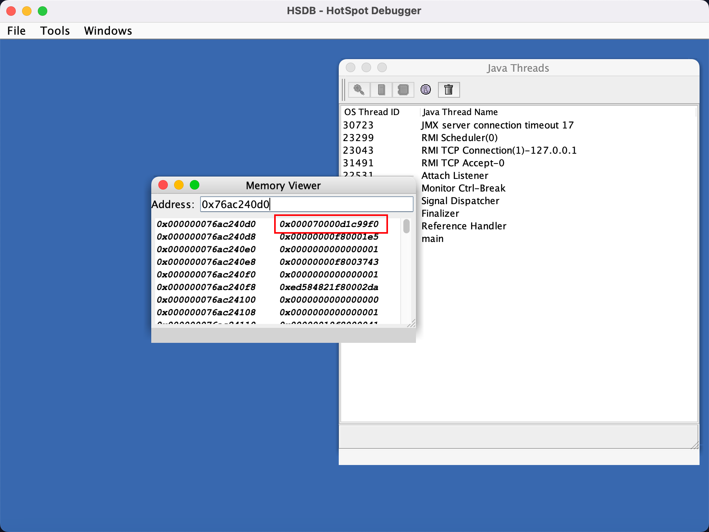
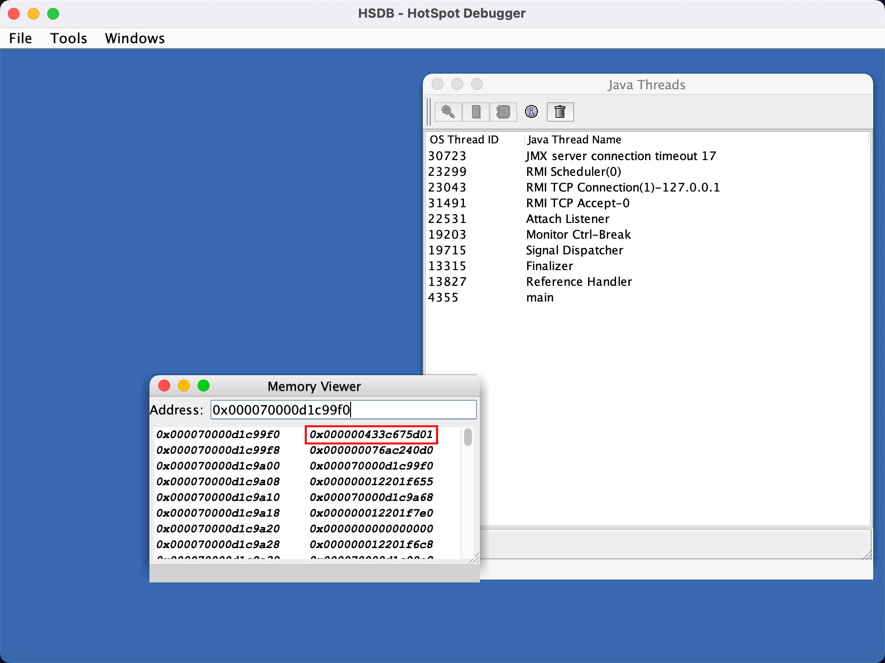
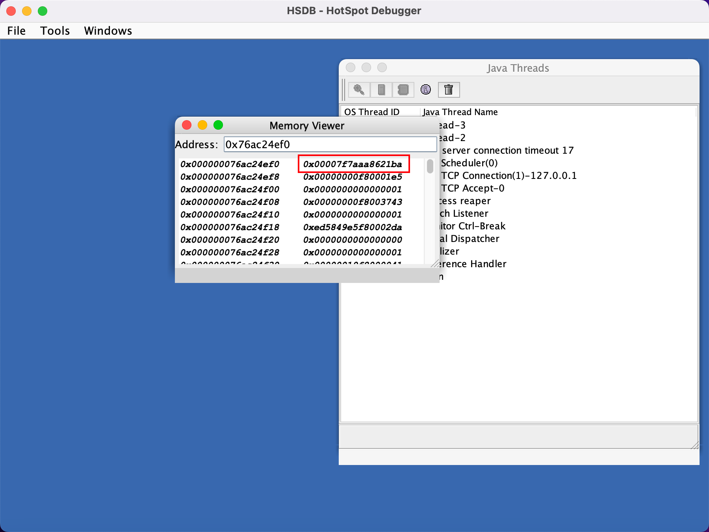
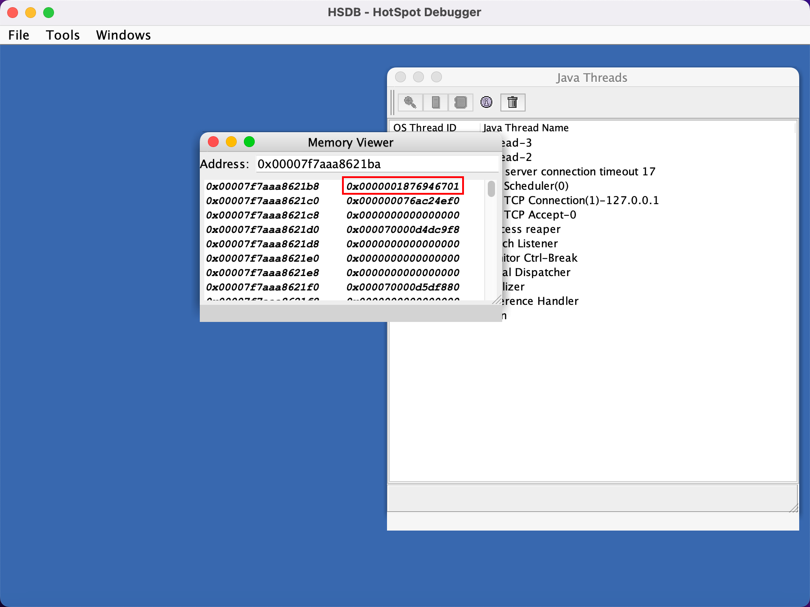

## 前言

我们知道，synchronized 关键字是基于对象锁的，那么它到底是怎么做的呢？这篇文章我们就来分析分析。

## Markword

首先我们要知道 markword 的内容。

在 JVM 源码中，对 markword 有详细的源码注释，可以参考：

+ [https://hg.openjdk.org/jdk8u/jdk8u/hotspot/file/69087d08d473/src/share/vm/oops/markOop.hpp](https://hg.openjdk.org/jdk8u/jdk8u/hotspot/file/69087d08d473/src/share/vm/oops/markOop.hpp)

## 偏向锁

偏向锁是从 JDK 1.6 引入的一种针对 synchronized 的锁优化技术，然而从 JDK 15 开始，这一特性被官方标记为废弃状态，如果还想继续使用的话需要通过 JVM 参数手动启用。

```java
-XX:+UseBiasedLocking
```

那么问题来了，JDK 15 为什么要废弃偏向锁呢？

首先我们要理解什么是偏向锁。

### 什么是偏向锁

当我们使用 synchronized 对临界区加锁时，如果没有启用偏向锁，那么线程请求进入临界区时都需要执行 CAS（无论是轻锁还是重锁）。

而 JVM 团队观察到，在大多数对象的生命周期内，基本只有一个线程访问临界区，所以，当某个线程首次访问临界区时记录下该线程的信息，当再有线程访问该临界区时判断是否是首次访问的线程

+ 如果是，则直接放行，这样就可以避免通过 CAS 操作。
+ 如果不是，则升级为轻锁。

这个优化方案其实就是偏向锁了，但是实际上，引入偏向锁会引入更多的问题，比如偏向撤销、批量重偏向、批量撤销等。

### 为什么要废弃

#### 时代变了

在过去，Java 应用通常使用的都是 Hashtable、Vector 等比较老的集合库，这类集合库大量使用 synchronized 来保证线程安全。

如果在单线程的情景下使用这些集合库就会有不必要的加锁操作，从而导致性能下降。

而偏向锁可以保证即使使用了这些老的集合库，也不会产生很大的性能损耗，因为 JVM 知道访问临界区的线程始终是同一个，也就避免了加锁操作。

这一切都很美好，但是随着时代的变化，新的 Java 应用基本都已经使用了无锁的集合库，比如 HashMap、ArrayList 等，这些集合库在单线程场景下比老的集合库性能更好。

即使是在多线程场景下，Java 也提供了 ConcurrentHashMap、CopyOnWriteArrayList 等性能更好的线程安全的集合库。

所以，对于使用了新版本的 Java 应用来说，偏向锁带来的收益已不如过去那么明显，而且在当下多线程应用越来越普遍的情况下，偏向锁带来的锁升级操作反而会影响应用的性能。

#### 成本还在增加

在废弃偏向锁的提案 JEP374 中还提到了与 HotSpot 相关的一点

Biased locking introduced a lot of complex code into the synchronization subsystem and is invasive to other HotSpot components as well.

简单翻译就是偏向锁为整个「同步子系统」引入了大量的复杂度，并且这些复杂度也入侵到了 HotSpot 的其它组件。

这导致了系统代码难以理解，难以进行大的设计变更，降低了子系统的演进能力。

所以总的来说就是 ROI 太低了，考虑到兼容性，所以决定先废弃该特性，最终的目标是移除它。

### 后续如何兼容

默认禁用偏向锁可能会导致一些 Java 应用的性能下降，所以 HotSpot 提供了偏向锁相关的命令。

```java
hejin@hejindeMacBook-Pro ~ % java -XX:+PrintFlagsFinal -version | grep -i bias 
intx BiasedLockingBulkRebiasThreshold          = 20                                  {product}
intx BiasedLockingBulkRevokeThreshold          = 40                                  {product}
intx BiasedLockingDecayTime                    = 25000                               {product}
intx BiasedLockingStartupDelay                 = 4000                                {product}
bool TraceBiasedLocking                        = false                               {product}
bool UseBiasedLocking                          = true                                {product}
bool UseOptoBiasInlining                       = true                                {C2 product}
openjdk version "1.8.0_422"
OpenJDK Runtime Environment (build 1.8.0_422-bre_2024_07_25_03_43-b00)
OpenJDK 64-Bit Server VM (build 25.422-b00, mixed mode)
```

## 轻锁和重锁

在偏向锁已经接近废弃的情况，这里就不想研究了，它确实也很抽象，所以我们下面主要基于轻锁和重锁来分析。

这里重锁就是 JVM 内部的 Monitor 锁。

首先我们先简单说明轻锁和重锁的加锁场景，轻锁出现在两（多）个线程加锁，但是加锁没有竞争，比如线程 t1 在 0 时刻加锁，2 时刻解锁，而线程 t2 在 3 时刻加锁、4 时刻解锁，那么线程 t1、t2 就都加的是轻锁。

比如下面的例子：

```java
public class MonitorTest {

    static final Object lock = new Object();

    public static void main(String[] args) throws InterruptedException {

        ObjectLockParser.printLock("加锁前", lock);

        Thread t0 = new Thread(() -> {
            synchronized (lock) {
                ObjectLockParser.printLock("加锁", lock);
            }
        });

        t0.start();
        t0.join();

        Thread t1 = new Thread(() -> {
            synchronized (lock) {
                ObjectLockParser.printLock("加锁", lock);
            }
        });

        t1.start();
        t1.join();

        ObjectLockParser.printLock("解锁后", lock);
    }
}
```

输出：

```java
main 加锁前, 锁类型: non-biasable; age: 0; markword: 0x1
Thread-0 加锁, 锁类型: thin lock; lock_pointer: 0x207ff0f8; markword: 0x207ff0f8
Thread-1 加锁, 锁类型: thin lock; lock_pointer: 0x207ff448; markword: 0x207ff448
main 解锁后, 锁类型: non-biasable; age: 0; markword: 0x1
```

所以，这种交替加锁，线程之间没有竞争的情况下，加轻锁就够了。

而一旦发生竞争，轻锁直接膨胀为重锁，并经历一段时间的自旋后还未获取锁则进入阻塞。

比如下面的例子：

```java
public class MonitorTest {

    static final Object lock = new Object();

    public static void main(String[] args) throws InterruptedException {

        ObjectLockParser.printLock("加锁前", lock);

        Thread t0 = new Thread(() -> {
            synchronized (lock) {
                ObjectLockParser.printLock("加锁", lock);
            }
        });


        Thread t1 = new Thread(() -> {
            synchronized (lock) {
                ObjectLockParser.printLock("加锁", lock);
            }
        });

        t0.start();
        t1.start();

        t0.join();
        t1.join();
        ObjectLockParser.printLock("解锁后", lock);
    }
}
```

输出：

```java
main 加锁前, 锁类型: non-biasable; age: 0; markword: 0x1
Thread-0 加锁, 锁类型: thin lock; lock_pointer: 0x2015f4e8; markword: 0x1cb2361a
Thread-1 加锁, 锁类型: fat lock; lock_pointer: 0x1cb23618; markword: 0x1cb2361a
main 解锁后, 锁类型: fat lock; lock_pointer: 0x1cb23618; markword: 0x1cb2361a
```

t0 线程先获取到轻锁，然后 t1 线程尝试加锁后出现了竞争，所以对象锁直接从轻锁膨胀为重锁。

## OpenJDK 源码分析

> [https://hg.openjdk.org/jdk8u/jdk8u/hotspot/](https://hg.openjdk.org/jdk8u/jdk8u/hotspot/)

我们知道 synchronized 关键字底层的 JVM 虚拟机指令其实是 monitorenter 和 monitorexit。

对于 monitorenter，处理该指令的入口代码：src/share/vm/interpreter/interpreterRuntime.cpp#monitorenter

```cpp
IRT_ENTRY_NO_ASYNC(void, InterpreterRuntime::monitorenter(JavaThread* thread, BasicObjectLock* elem))
    Handle h_obj(thread, elem->obj());
    if (UseBiasedLocking) {
        // 如果开启 UseBiasedLocking 则先尝试加偏向锁
        ObjectSynchronizer::fast_enter(h_obj, elem->lock(), true, CHECK);
    } else {
        // 否则直接加轻锁
        ObjectSynchronizer::slow_enter(h_obj, elem->lock(), CHECK);
    }
IRT_END
```

对于 monitorexit，入口地址是 src/share/vm/interpreter/interpreterRuntime.cpp#monitorexit

```cpp
IRT_ENTRY_NO_ASYNC(void, InterpreterRuntime::monitorexit(JavaThread* thread, BasicObjectLock* elem))
    Handle h_obj(thread, elem->obj());
    if (elem == NULL || h_obj()->is_unlocked()) {
        // 处理一些异常
        THROW(vmSymbols::java_lang_IllegalMonitorStateException());
    }
    // 解锁
    ObjectSynchronizer::slow_exit(h_obj(), elem->lock(), thread);
    elem->set_obj(NULL);
IRT_END
```

所以我们下面关注的重点就在 ObjectSynchronizer 类的 slow_enter 和 slow_exit。

### 轻锁分析

加锁。

入口方法：src\share\vm\runtime\synchronizer.cpp#slow_enter 中。

```cpp
// 这里 BasicLock* 表示轻锁
void ObjectSynchronizer::slow_enter(Handle obj, BasicLock* lock, TRAPS) {
  // 获取 markword
  markOop mark = obj->mark();
  if (mark->is_neutral()) {
    // 如果是无锁
    // 首先将原来的 markword 设置到 BasicLock 对象的 _displaced_header 属性中
    lock->set_displaced_header(mark);
    // 使用 Atomic::cmpxchg_ptr 进行 CAS 操作
    // obj()->mark_addr(): 获取对象头中的 markword 地址
    // 所以这里就是尝试将对象头中的 markword 值由 mark 替换为 lock（也就是锁指针）
    if (mark == (markOop) Atomic::cmpxchg_ptr(lock, obj()->mark_addr(), mark)) {
      // 如果 CAS 成功，则返回，表示轻锁加锁成功，否则进入下面的 inflate 流程
      return;
    }
  } else if (mark->has_locker() && THREAD->is_lock_owned((address)mark->locker())) {
    // 进到这里说明锁对象不是无锁状态而是轻锁状态，并且锁对象的 owner 是当前线程
    // 所以，这里表示轻锁重入，设置 NULL 之后返回
    lock->set_displaced_header(NULL);
    return;
  }
  // 一旦当前线程加轻锁失败 or 锁状态为轻锁但是锁对象的 owner 不是当前线程 or 锁状态为重锁
  lock->set_displaced_header(markOopDesc::unused_mark());
  // 就会进入下面的锁膨胀 inflate 流程 
  // 这里其实调用了两个方法：inflate 返回了一个 ObjectMonitor 对象，又调用了该对象的 enter 方法
  ObjectSynchronizer::inflate(THREAD,
                              obj(),
                              inflate_cause_monitor_enter)->enter(THREAD);
}
```

解锁。

入口方法：src\share\vm\runtime\synchronizer.cpp#slow_exit 中。

```cpp
void ObjectSynchronizer::slow_exit(oop object, BasicLock* lock, TRAPS) {
    fast_exit (object, lock, THREAD);
}

void ObjectSynchronizer::fast_exit(oop object, BasicLock* lock, TRAPS) {
    markOop dhw = lock->displaced_header();
    markOop mark;
    if (dhw == NULL) {
        // 如果 _displaced_header 为 NULL，表示是由于锁重入导致的，直接返回
        return;
    }
    mark = object->mark();
    // 这里 lock 是轻锁指针
    // 如果当前锁对象的 markword 为 lock，那么 CAS 尝试将对象头中的 markword 值由 mark 替换为 dhw
    // dhw 在轻锁加锁时就记录了锁对象加锁之前的 markword 值，所以这里就是重新替换回来
    if (mark == (markOop) lock) {
        if ((markOop) Atomic::cmpxchg_ptr (dhw, object->mark_addr(), mark) == mark) {
            // 如果 CAS 成功，表示解锁成功直接返回 
            return;
        }
    }
    // 如果当前锁对象的 markword 不为 lock，表示已经有线程将 markword 设置为 unused_mark
    // 此时锁对象状态为重锁，所以需要将锁膨胀，进入重锁的解锁流程
    ObjectSynchronizer::inflate(THREAD,
                                object,
                                inflate_cause_vm_internal)->exit(true, THREAD);
}
```

整体来说，轻锁的加锁和解锁流程还是比较简单的，就是将轻锁的锁地址和锁对象的 markword 做 CAS 交换，通过 CAS 来保证互斥加锁，一旦 CAS 失败，则将轻锁膨胀为重锁，再进行加锁或者解锁。

所以，在加轻锁之后，锁对象原来的 markword 就存储在轻锁的 _displaced_header 属性中，所以原来 markword 包含的像 hashcode 值这些就存储在轻锁的 _displaced_header 属性中。

### 锁膨胀

当线程加轻锁失败就会立刻进行锁膨胀，将轻锁升级为重锁。

在源码注释中，锁膨胀分为了 5 种情况：

+ 膨胀完成，直接返回
+ 膨胀中，等待其他线程膨胀完成
+ 轻锁膨胀到重锁，创建 ObjectMonitor 对象，设置一些关键属性值，将 ObjectMonitor 对象地址的后两位标记为 10，然后将该对象地址设置到锁对象的 markword 中，表示此时锁状态为重锁。
+ 无锁膨胀到重锁，也是创建 ObjectMonitor 对象，设置一些关键属性值，然后将 ObjectMonitor 对象地址的后两位标记为 10，然后将该对象地址设置到锁对象的 markword 中，表示此时锁状态为重锁。
+ 其他，非法

下面就分别来看这几种情况的处理。

```cpp
ObjectMonitor * ATTR ObjectSynchronizer::inflate(Thread * Self, 
                                                 oop object,
                                                 const InflateCause cause) {
    for (;;) {
        const markOop mark = object->mark();

        // 膨胀完成
        if (mark->has_monitor()) {
            // 已经有了 ObjectMonitor 对象，则直接返回
            ObjectMonitor * inf = mark->monitor() ;
            return inf ;
        }

        // 膨胀中
        if (mark == markOopDesc::INFLATING()) {
            // 已经有其他线程在进行锁膨胀，当前线程自旋一段时间等待
            ReadStableMark(object) ;
            continue ;
        }

        // 轻锁膨胀到重锁
        if (mark->has_locker()) {
            ObjectMonitor * m = omAlloc (Self) ;
            // 设置一些属性值
            m->Recycle();
            m->_Responsible  = NULL;
            m->OwnerIsThread = 0;
            m->_recursions   = 0;
            m->_SpinDuration = ObjectMonitor::Knob_SpinLimit;
            // CAS 将锁对象的 markword 由 mark 替换为 INFLATING（0）表示开始锁膨胀
            // 只有一个线程能够 CAS 成功，其他线程 continue 重试
            markOop cmp = (markOop) Atomic::cmpxchg_ptr (markOopDesc::INFLATING(), object->mark_addr(), mark) ;
            if (cmp != mark) {
                omRelease (Self, m, true);
                continue;
            }
            // 获取轻锁中存储的锁对象原始的 markword 值
            markOop dmw = mark->displaced_mark_helper() ;
            // 将 dmw 设置到 Monitor 的 _header 属性中
            m->set_header(dmw);
            // 将当前线程设置为 Monitor 对象的 _owner
            m->set_owner(mark->locker());
            // 将当然锁对象设置为 Monitor 对象的 _object
            m->set_object(object);
            // 这里 encode(m) 就是将 ObjectMonitor 地址的后两位设置为 10 表示重锁
            // release_set_mark 内部应该是使用了 release_store 屏障，将重锁地址记录在锁对象的 markword 中
            object->release_set_mark(markOopDesc::encode(m));
            return m;
        }

        // 执行到这里，就是从无锁直接升级为重锁
        ObjectMonitor * m = omAlloc (Self);
        m->Recycle();
        // 此时锁对象的 markword 值就是最原始的 markword，直接设置到 ObjectMonitor 的 _header 中
        m->set_header(mark);
        m->set_owner(NULL);
        // 将当前锁对象设置为 Monitor 对象的 _object
        m->set_object(object);
        m->OwnerIsThread = 1;
        m->_recursions   = 0;
        m->_Responsible  = NULL;
        m->_SpinDuration = ObjectMonitor::Knob_SpinLimit;
        // CAS 将锁对象的 markword 交换为 ObjectMonitor 的锁地址，CAS 成功则直接返回
        if (Atomic::cmpxchg_ptr (markOopDesc::encode(m), object->mark_addr(), mark) != mark) {
            // 否则清理 m，continue 重试
            m->set_object(NULL);
            m->set_owner(NULL);
            m->OwnerIsThread = 0;
            m->Recycle();
            omRelease(Self, m, true);
            m = NULL;
            continue;
        }
        return m ;
    }
}
```

### 自旋尝试

在轻锁膨胀为重锁之后，会经历一段时间的自旋尝试，如果自旋成功，那么获取对象锁成功，否则进入阻塞。

自旋的方法是 ObjectMonitor::TrySpin_VaryDuration。

不过本身这个方法是比较复杂的，尤其是其内部的自适应的自旋次数，和很多参数有着密切的关系：

```cpp
int ObjectMonitor::Knob_Verbose    = 0 ;
int ObjectMonitor::Knob_SpinLimit  = 5000 ;    // derived by an external tool -

static int Knob_SpinBase           = 0 ;       // Floor AKA SpinMin
static int Knob_SpinBackOff        = 0 ;       // spin-loop backoff
static int Knob_CASPenalty         = -1 ;      // Penalty for failed CAS
static int Knob_OXPenalty          = -1 ;      // Penalty for observed _owner change
static int Knob_SpinSetSucc        = 1 ;       // spinners set the _succ field
static int Knob_SpinEarly          = 1 ;
static int Knob_SuccEnabled        = 1 ;       // futile wake throttling
static int Knob_SuccRestrict       = 0 ;       // Limit successors + spinners to at-most-one
static int Knob_MaxSpinners        = -1 ;      // Should be a function of # CPUs
static int Knob_Bonus              = 100 ;     // spin success bonus
static int Knob_BonusB             = 100 ;     // spin success bonus
static int Knob_Penalty            = 200 ;     // spin failure penalty
static int Knob_Poverty            = 1000 ;
static int Knob_SpinAfterFutile    = 1 ;       // Spin after returning from park()
static int Knob_FixedSpin          = 0 ;
static int Knob_OState             = 3 ;       // Spinner checks thread state of _owner
static int Knob_UsePause           = 1 ;
static int Knob_PreSpin            = 10 ;      // 20-100 likely better
static int Knob_ResetEvent         = 0 ;
static int BackOffMask             = 0 ;
```

感兴趣的可以自行了解。

### 重锁分析

重锁（ObjectMonitor）对象的加锁和解锁流程就是比较复杂的了，其中还涉及到了 _cxq 竞争栈、_EntryList 队列、_WaitSet 队列等数据结构。

#### 加锁

代码的入口是在 src/share/vm/runtime/objectMonitor.cpp#ObjectMonitor::enter 方法。

```cpp
void ATTR ObjectMonitor::enter(TRAPS) {
    Thread * const Self = THREAD;
    void * cur;

    // 首先尝试将 ObjectMonitor 的 _owner 属性由 NULL CAS 设置为当前线程
    cur = Atomic::cmpxchg_ptr(Self, &_owner, NULL);
    if (cur == NULL) {
        // 设置成功则返回表示加锁成功
        return;
    }
    if (cur == Self) {
        // 当前线程持有重锁，加锁成功（重锁重入）
        _recursions++;
        return;
    }
    if (Self->is_lock_owned ((address)cur)) {
        // 当前线程持有轻锁，加锁成功（轻锁重入）
        _recursions = 1;
        _owner = Self;
        OwnerIsThread = 1;
        return;
    }

    // TrySpin 其实就是 TrySpin_VaryDuration 这里就是进行自旋
    if (Knob_SpinEarly && TrySpin (Self) > 0) {
        Self->_Stalled = 0;
        return;
    }

    // 执行到这里就表示加锁、自旋都失败了
    JavaThread * jt = (JavaThread *) Self;

    {
        for (;;) {
            // 进入 EnterI 方法
            EnterI (THREAD);
        }
    }
}
```

```cpp
void ATTR ObjectMonitor::EnterI (TRAPS) {
    Thread * Self = THREAD;
    // 再次尝试自旋
    if (TryLock (Self) > 0) {
        return;
    }
    // 延迟初始化？？
    DeferredInitialize();
    // 再次尝试自旋
    if (TrySpin (Self) > 0) {
        return;
    }
    // Enqueue "Self" on ObjectMonitor's _cxq.
    // 从注释中可以看出，下面就是将当前线程封装为 ObjectWaiter 节点加入 _cxq
    ObjectWaiter node(Self);
    ObjectWaiter * nxt;
    // 死循环，一定会被加入到 _cxq 或者自旋时直接拿锁成功
    for (;;) {
        node._next = nxt = _cxq;
        // CAS 加入 _cxq，加入成功则退出循环，否则一直继续
        if (Atomic::cmpxchg_ptr (&node, &_cxq, nxt) == nxt) break;
        // 每次加入失败再次尝试自旋
        if (TryLock (Self) > 0) {
            return;
        }
    }
    // 死循环
    for (;;) {
        // 又尝试一次自旋，拿锁成功则退出循环
        if (TryLock (Self) > 0) break;
        // park 当前线程
        if (_Responsible == Self || (SyncFlags & 1)) {
            Self->_ParkEvent->park ((jlong) RecheckInterval);
        } else {
            Self->_ParkEvent->park() ;
        }
        // 当线程被 park 唤醒时，再次尝试自旋拿锁，拿锁成功则退出循环
        if (TryLock(Self) > 0) break;
    }
    // 从 _cxq 或者 _EntryList 中移除节点
    UnlinkAfterAcquire (Self, &node);
    return;
}
```

所以我们这里可以总结一下加锁流程，如下：

1. CAS 设置 _owner 为当前线程，设置成功则加锁成功
2. 如果当前线程持有重锁，则加锁成功（重锁重入）
3. 如果当前线程持有轻锁，则加锁成功（轻锁重入）
4. TrySpin 自旋，如果自旋期间设置 _owner 成功，则加锁成功
5. 如果经过上面的过程，线程拿锁都没成功，那么就会进入 EnterI 方法
   1. 还是首先尝试 TrySpin 自旋拿锁，拿到就返回
   2. 尝试 CAS 将当前线程加入 _cxq 栈顶，同时每次如果 CAS 加入失败，都会调用 TrySpin 进行一次自旋
   3. 当线程加入到 _cxq 后，再次尝试 TrySpin 进行自旋，若还是失败，则 park 进入阻塞，等待当前的持锁线程调用 unpark 唤醒。
   4. 每次被 unpark 唤醒之后又会调用 TrySpin 自旋抢锁。
6. 在 EnterI 方法的过程中，由 break 退出循环时，如果当前线程的节点在 _cxq 或者 _EntryList 中时，会移除该节点。

#### 解锁

代码的入口是在 src/share/vm/runtime/objectMonitor.cpp#ObjectMonitor::exit。

这个方法实际是巨长无比的，看得我很恶心，直接给流程吧。

所以重锁解锁的流程如下：

1. 如果线程是从持有轻锁解重锁，则需要先加好重锁，再进行解锁。
2. 接着处理锁重入的情况。
3. CAS 设置 _owner 为 NULL
4. 如果 _EntryList 和 _cxq 都为空的情况下，直接返回
5. 如果 _EntryList 不为空，那么从队列头中获取到头节点，unpark 唤醒，然后返回。
6. 如果此时 _EntryList 为空，但是 _cxq 不为空，则将所有的 _cxq 转移到 _EntryList 中，然后从 _EntryList 中获取头节点唤醒，然后返回。
7. 注意这里被 unpark 唤醒的线程也不一定能成功拿锁，因为有可能此时又来一个线程成功将 _owner 设置为他自己，这也体现了 Monitor 锁的非公平性。

#### wait/notify

我们知道，在 Object 类中，还有三个与对象锁相关的方法，wait、notify、notifyAll。

下面我们就来说一说这三个方法。

首先，我们必须在 synchronized 块内调用 wait/notify 方法，对于 wait 而言，一旦调用，如果当前线程持有的是轻锁，那么会先将轻锁升级为重锁。

代码入口在：src\share\vm\runtime\synchronizer.cpp#ObjectSynchronizer::wait

```cpp
// NOTE: must use heavy weight monitor to handle wait()
void ObjectSynchronizer::wait(Handle obj, jlong millis, TRAPS) {
    // 拿到 ObjectMonitor 对象
    ObjectMonitor* monitor = ObjectSynchronizer::inflate(THREAD,
    obj(),
    inflate_cause_wait);

    // 调用 src\share\vm\runtime\objectMonitor.cpp#ObjectMonitor::wait
    monitor->wait(millis, true, THREAD);
}
```

```cpp
// src\share\vm\runtime\objectMonitor.cpp#ObjectMonitor::wait
void ObjectMonitor::wait(jlong millis, bool interruptible, TRAPS) {
    Thread * const Self = THREAD;
    JavaThread *jt = (JavaThread *)THREAD;
    // 延迟初始化
    DeferredInitialize();
    // 将当前线程封装为 ObjectWaiter 节点加入到 _WaitSet 中
    ObjectWaiter node(Self);
    AddWaiter(&node);

    intptr_t save = _recursions; // record the old recursion count
    _waiters++;                  // increment the number of waiters
    _recursions = 0;             // set the recursion level to be 1
    // 解锁
    exit(true, Self);            // exit the monitor

    // The thread is on the WaitSet list - now park() it.
    // On MP systems it's conceivable that a brief spin before we park
    // could be profitable.

    int ret = OS_OK;
    int WasNotified = 0;
    {
        OSThread* osthread = Self->osthread();
        OSThreadWaitState osts(osthread, true);
        {
            if (interruptible && (Thread::is_interrupted(THREAD, false) || HAS_PENDING_EXCEPTION)) {
                // Intentionally empty
            } else if (node._notified == 0) {
                if (millis <= 0) {
                    // park 线程
                    Self->_ParkEvent->park();
                } else {
                    // park 线程（有时限）
                    ret = Self->_ParkEvent->park(millis) ;
                }
            }
        }
        // 线程从 park 退出，可能是被其他线程 unpark 或者是 wait 超时
        if (node.TState == ObjectWaiter::TS_WAIT) {
            if (node.TState == ObjectWaiter::TS_WAIT) {
                DequeueSpecificWaiter(&node);       // unlink from WaitSet
                node.TState = ObjectWaiter::TS_RUN;
            }
        }
        ObjectWaiter::TStates v = node.TState;
        if (v == ObjectWaiter::TS_RUN) {
            // 进入 ObjectMonitor 的加锁方法
            enter(Self);
        } else {
            // 如果节点已经加入了 _cxq 或者 _EntryList 则进入 ReenterI 方法
            ReenterI(Self, &node);
            node.wait_reenter_end(this);
        }
    }
}
```

```cpp
void ATTR ObjectMonitor::ReenterI (Thread * Self, ObjectWaiter * SelfNode) {
    JavaThread * jt = (JavaThread *) Self;
    int nWakeups = 0;
    // 死循环，这里 SelfNode 要么在 _EntryList 要么在 _cxq
    for (;;) {
        ObjectWaiter::TStates v = SelfNode->TState;
        // 尝试加锁
        if (TryLock (Self) > 0) break;
        // 自旋拿锁
        if (TrySpin (Self) > 0) break;
        {
            // park 当前线程
            if (SyncFlags & 1) {
                Self->_ParkEvent->park((jlong)1000);
            } else {
                Self->_ParkEvent->park();
            }
        }
        // 每一次被其他线程 unpark 唤醒后都会 tryLock 尝试拿锁
        if (TryLock(Self) > 0) break;
    }

    // 到这里，当前线程已经成功拿锁，所以从 _cxq 或者 _EntryList 中移除
    // Self has acquired the lock -- Unlink Self from the cxq or EntryList .
    UnlinkAfterAcquire(Self, SelfNode);
    SelfNode->TState = ObjectWaiter::TS_RUN;
}
```

所以进入 ObjectMonitor 的 wait 方法之后，大致的流程如下：

1. 将当前线程封装为 ObjectWaiter 节点，加入到 _WaitSet 中
2. 接着执行 exit() 解锁
3. 然后将当前线程 park
4. 当 park 结束后，此时持锁的线程会将这个 _WaitSet 中的节点加入到 _EntryList 中
   1. 如果节点还未进入 _EntryList 或 _cxq，进入 ObjectMonitor 的 enter 方法（重锁的加锁方法），这里可能是带超时时间的 wait 方法到达超时时间。
   2. 否则进入 ReenterI 方法。

而对于 ReenterI 方法：

1. 进入 ReenterI 方法后，节点要么在 _cxq 中，要么在 _EntryList 中，所以尝试拿锁。
2. 拿锁失败则 park 进入阻塞。
3. 当其他线程解锁后，当前线程被唤醒后都会尝试自旋拿锁。
4. 当成功拿锁之后，还需要将节点从 _cxq 和 _EntryList 移除，然后返回。

当持锁线程调用 notify 后，会唤醒 _WaitSet 中 wait 中的节点。

代码入口在：src\share\vm\runtime\synchronizer.cpp#ObjectSynchronizer::notify

```cpp
void ObjectSynchronizer::notify(Handle obj, TRAPS) {
    markOop mark = obj->mark();
    // 如果是轻锁，说明从未有过竞争、从未调用 wait，则直接返回
    if (mark->has_locker() && THREAD->is_lock_owned((address)mark->locker())) {
        return;
    }
    // 获取 ObjectMonitor 对象后，调用其 nofity 方法
    ObjectSynchronizer::inflate(THREAD,
                                obj(),
                                inflate_cause_notify)->notify(THREAD);
}
```

```cpp
// 调用 src\share\vm\runtime\objectMonitor.cpp#ObjectMonitor::notify
void ObjectMonitor::notify(TRAPS) {
  if (_WaitSet == NULL) {
     // 如果 _WaitSet 为空则直接返回
     return ;
  }
  // 决定了如何将 _WaitSet 中的节点转移到 _EntryList 还是 _cxq
  // 默认是 2，所以就是将 _WaitSet 中的节点头插到 _cxq
  int Policy = Knob_MoveNotifyee; 
  // 拿到 _WaitSet 中的头节点
  ObjectWaiter * iterator = DequeueWaiter();
  if (iterator != NULL) {
     if (Policy != 4) {
        iterator->TState = ObjectWaiter::TS_ENTER;
     }

     ObjectWaiter * List = _EntryList;
     if (Policy == 0) {             // prepend to EntryList
         // 头插 _EntryList
     } else if (Policy == 1) {      // append to EntryList
         // 尾插 _EntryList
     } else if (Policy == 2) {      // prepend to cxq
         // 头插 _cxq
     } else if (Policy == 3) {      // append to cxq
         // 尾插 _cxq
     } else {
        ParkEvent * ev = iterator->_event;
        iterator->TState = ObjectWaiter::TS_RUN;
        ev->unpark();
     }

     if (Policy < 4) {
        iterator->wait_reenter_begin(this);
     }
  }
}
```

所以，调用 notify 的流程就是：

1. 首先如果 _WaitSet 为 NULL，直接返回。
2. 否则获取 _WaitSet 的头节点，转移到 _cxq 栈头。

#### 为什么有 _cxq 和 _EntryList

在 Monitor 锁中，_cxq 和 _EntryList 都是可以存放拿锁失败的线程封装的 ObjectWaiter 节点，但是为什么会区分出 _cxq 和 _EntryList 呢？只用一个队列不行吗？

其实，分为两个队列，主要是为了避免 CAS 导致的 ABA 问题，同时也可以提升操作队列的性能。

对于 _cxq 来说，考虑下面的情况：

| _cxq 栈状态 | t0 做 pop()    | 其他线程 |
| ----------- | -------------- | -------- |
| a->b->c     | cas(a, b)      |          |
| b->c        |                | pop()    |
| c           |                | pop()    |
| a->c        |                | push(a)  |
| b->c        | cas(a, b) 成功 |          |


最初栈状态是 a->b->c，t0 线程需要 cas 弹出栈顶元素 a，所以我们将栈顶指针指向的 a 修改为 b（这里栈顶指针就可以理解为内存地址）。

但是经过其他线程的两次 pop 和一次 push，此时栈顶元素还是 a，所以 t0 线程的 cas 是可以成功的，那么就相当于错误的将已经 pop 出去的 b 再次压栈了，这显然是不合逻辑的。

但是这种 ABA 的问题的产生只会出现在其他线程既有 pop 又有 push 的情况，所以 JVM 限定 _cxq 在有竞争的情况下只能向 _cxq push 元素，而不能出现多个线程竞争的进行 pop，这样就可以避免 ABA 问题。

所以，使用 _cxq 和 _EntryList 的原因如下：

1. _cxq 是栈结构，有竞争的线程可以用 CAS 向栈顶添加元素，但是只有持锁线程才能删除元素，避免了 ABA 问题
2. 持锁线程才能修改 _EntryList，所以 _EntryList 是没有竞争、稳定的，例如
   1. exit 唤醒时，把 _cxq 的节点都转移至 _EntryList
   2. notify 线程唤醒时，把 _WaitSet 头节点加入空的 _EntryList

## HSDB 实践

下面我们通过 HSDB 来分析锁对象的 markword 变化。

首先我们考虑轻锁，轻锁在持锁过程中，锁对象的 markword 存储的是轻锁的锁指针，而轻锁的锁指针中的 _displaced_header 属性存储了锁对象原来的 markword 值。

所以像锁对象的 hashcode 这些值在线程持锁过程中都是存储在轻锁的锁指针中的。

考虑下面的代码：

```java
import java.io.IOException;

import static org.hein.ObjectLockParser.*;

public class MonitorTest {

    static final Object lock = new Object();

    public static void main(String[] args) {
        printObjectAddress(lock);
        printHashcode(lock);
        printLock("加锁前", lock);
        synchronized (lock) {
            printLock("加锁", lock);
            try {
                System.in.read();
            } catch (IOException e) {
                throw new RuntimeException(e);
            }
        }
        printHashcode(lock);
        printLock("加锁后", lock);
    }
}
```

输出：

```java
object address: 0x76ac240d0
hashcode: 0x433c675d
main 加锁前, 锁类型: no lock; hash: 0x433c675d; age: 0
main 加锁, 锁类型: thin lock; lock_pointer: 0x70000d1c99f0
// ... 阻塞时通过 HSDB 查询内存
hashcode: 0x433c675d
main 加锁后, 锁类型: no lock; hash: 0x433c675d; age: 0
```

此时我们通过 HSDB 查询 0x76ac240d0 内存地址中的内容，如下：



这里的 0x000070000d1c99f0 可能是 JVM 源码中 BasicLock 对象的地址，也就是轻锁地址，所以我们进一步查询该地址的内容，如下：



查询出的结果就比较眼熟了，0x000000433c675d01，这里 433c675d 不就是 hashcode 吗，最后的 01 表示普通对象。

那么当线程加了重锁之后，锁对象的 markword 又是怎样的呢？

考虑下面的代码：

```java
import java.io.IOException;

import static org.hein.ObjectLockParser.*;

public class MonitorTest {

    static final Object lock = new Object();

    public static void main(String[] args) throws InterruptedException {
        printObjectAddress(lock);
        printHashcode(lock);
        printLock("加锁前", lock);

        Thread t0 = new Thread(() -> {
            synchronized (lock) {
                printLock("加锁", lock);
                try {
                    System.in.read();
                } catch (IOException e) {
                    throw new RuntimeException(e);
                }
            }
        });

        Thread t1 = new Thread(() -> {
            synchronized (lock) {
                printLock("加锁", lock);
                try {
                    System.in.read();
                } catch (IOException e) {
                    throw new RuntimeException(e);
                }
            }
        });

        t0.start();
        t1.start();
        t0.join();
        t1.join();
        printLock("加锁后", lock);
    }
}
```

输出：

```java
object address: 0x76ac24ef0
hashcode: 0x18769467
main 加锁前, 锁类型: no lock; hash: 0x18769467; age: 0
Thread-2 加锁, 锁类型: thin lock; lock_pointer: 0x70000d4dc9f8
// ... 阻塞时通过 HSDB 查询内存
Thread-3 加锁, 锁类型: fat lock; lock_pointer: 0x7f7aaa8621ba
// ... 阻塞时通过 HSDB 查询内存
main 加锁后, 锁类型: fat lock; lock_pointer: 0x7f7aaa8621ba
```

此时我们通过 HSDB 查询 0x76ac24ef0 内存地址中的内容，如下：



这里的 0x00007f7aaa8621ba 可能是 JVM 源码中 ObjectMonitor 对象的地址，也就是重锁地址，所以我们进一步查询该地址的内容，如下：



查询出的结果就比较眼熟了，0x0000001876946701，这里 18769467 不就是 hashcode 吗，最后的 01 表示普通对象。

所以，其实线程不管是加的轻锁还是加的重锁，锁对象的 markword 都是存储了 JVM 级别的 lock 地址，在该 lock 地址中存储了锁对象原始的 markword 值，可能就包含了 hashcode 等。

## 附录

### 1）HSBD

HSDB 相关命令：

```java
# 输出 Java 进程
jps
# HSDB 启动
sudo java -cp ./sa-jdi.jar sun.jvm.hotspot.HSDB JVM_PID
```

### 2）对象锁解析

```java
import org.openjdk.jol.vm.VM;
import sun.misc.Unsafe;

import java.lang.reflect.Field;

/**
 * 对象锁解析器
 *
 * @author hein
 */
public class ObjectLockParser {

    private static final sun.misc.Unsafe unsafe;

    static {
        try {
            Field theUnsafe = Unsafe.class.getDeclaredField("theUnsafe");
            theUnsafe.setAccessible(true);
            unsafe = (Unsafe) theUnsafe.get(null);
        } catch (NoSuchFieldException | IllegalAccessException e) {
            throw new RuntimeException(e);
        }
    }

    /**
     * markword 偏移量
     */
    private static final int MARKWORD_OFFSET = 0;

    /**
     * 获取对象 markword
     */
    private static long markword(Object instance) {
        if (instance == null) {
            throw new NullPointerException();
        }
        return unsafe.getLong(instance, MARKWORD_OFFSET);
    }

    public static String getMarkword(Object obj) {
        return "0x" + Long.toHexString(markword(obj));
    }

    public static String parseLock(Object obj) {
        return parseMarkWord(markword(obj));
    }

    public static void printLock(String desc, Object lock) {
        System.out.println(Thread.currentThread().getName() + " " + desc + ", 锁类型: " + parseLock(lock));
    }

    public static void printObjectAddress(Object obj) {
        System.out.println("0x" + Long.toHexString(VM.current().addressOf(obj)));
    }

    public static void printHashcode(Object obj) {
        System.out.println("0x" + Long.toHexString(obj.hashCode()));
    }

    private static String parseMarkWord(long mark) {
        long bits = mark & 3L;
        switch ((int) bits) {
            case 0:
                return "thin lock; lock_pointer: 0x" + Long.toHexString(mark);
            case 1:
                String s = "; age: " + (mark >> 3 & 15L);
                int tribits = (int) (mark & 7L);
                switch (tribits) {
                    case 1:
                        int hash = (int) (mark >>> 8);
                        if (hash != 0) {
                            return "hash: 0x" + Long.toHexString(hash) + s;
                        }
                        return "non-biasable" + s;
                    case 5:
                        long thread = mark >>> 10;
                        if (thread == 0L) {
                            return "biasable" + s;
                        }
                        return "biased: 0x" + Long.toHexString(thread) + "; epoch: " + (mark >> 8 & 2L) + s;
                }
            case 2:
                return "fat lock; lock_pointer: 0x" + Long.toHexString(mark);
            case 3:
                return "marked: " + Long.toHexString(mark);
            default:
                return "parse error";
        }
    }
}
```

```xml
<dependency>
  <groupId>org.openjdk.jol</groupId>
  <artifactId>jol-core</artifactId>
  <version>0.16</version>
</dependency>
```