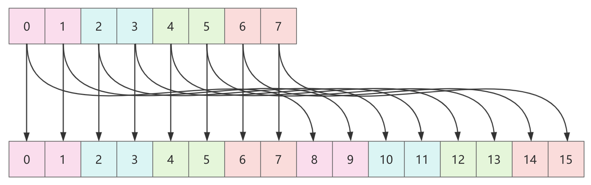

## 前言

ConcurrentHashMap 是 JDK 1.5 引入的一个并发安全且高效的哈希集合，简单来说，我们可以认为它在 HashMap 的基础上增加了线程安全性的保障。

我们知道 HashMap 是非线程安全的，为了保证并发场景下的线程安全，可以使用一些具备线程安全性的集合，比如 Hashtable、Collections.synchronizedMap 以及 ConcurrentHashMap。

但是 Hashtable 和 Collections.synchronizedMap 都是加锁的粒度都是方法级别的，这时候就可以考虑使用锁粒度更小的 ConcurrentHashMap。

同时，ConcurrentHashMap 和 HashMap 有很多共同点，比如在发生哈希冲突时使用拉链法解决哈希冲突、链表和红黑树转换的阈值选择等，我们这里就不多解释。

## 如何理解线程安全

通常我们说 ConcurrentHashMap 是一个线程安全的键值集合，这里的线程安全更多指的是单个操作如 get、put 和 remove 来说是线程安全的。

但是，当需要执行复合操作时，就需要特别注意了。

复合操作是指那些涉及到多个步骤的操作。例如，检查一个键是否存在，并且如果不存在则添加一个新的条目，这实际上涉及到了两个步骤：get 操作来检查键是否存在，以及 put 操作来插入新的条目。

```java
// 假设 map 是一个 ConcurrentHashMap<String, String>
String value = map.get(key);
if (value == null) {
    map.put(key, "newValue");
}
```

上面的代码在多线程环境下是不安全的，因为两个线程可能同时发现 key 对应的值为 null，然后都尝试插入 newValue，为了避免这种情况，应该使用 ConcurrentHashMap 提供的原子方法 putIfAbsent 或者使用 computeIfAbsent 方法：

```java
// 使用 putIfAbsent 方法
map.putIfAbsent(key, "newValue");

// 或者使用 computeIfAbsent 方法
value = map.computeIfAbsent(key, k -> "newValue");
```

## 数据结构


ConcurrentHashMap 底层和 HashMap 一样也是基于 Node 数组实现的，相较于 HashMap，区别是使用了 volatile 保证 val 和 next 属性的有序性和可见性。

```java
static class Node<K,V> implements Map.Entry<K,V> {
    final int hash;
    final K key;
    volatile V val;
    volatile Node<K,V> next;
    // ...
}
```

## put & 初始化

首先我们来看看 ConcurrentHashMap 的 put 以及初始化的逻辑。

当调用 ConcurrentHashMap 的空参构造方法，只是创建了一个 ConcurrentHashMap 对象，并没有对底层 table 数组进行初始化，不过默认的初始化大小是 16。

```java
/**
 * Creates a new, empty map with the default initial table size (16).
 */
public ConcurrentHashMap() {
}
```

当第一次 put 元素时，如果 table 没有初始化，就会先进行初始化然后再添加元素。

```java
public V put(K key, V value) {
    return putVal(key, value, false);
}

/** Implementation for put and putIfAbsent */
final V putVal(K key, V value, boolean onlyIfAbsent) {
    if (key == null || value == null) throw new NullPointerException();
    // 对 key 的哈希值进行哈希扰动
    int hash = spread(key.hashCode());
    int binCount = 0;
    // table 是成员变量，ConcurrentHashMap 底层存储对象
    for (Node<K,V>[] tab = table;;) {
        Node<K,V> f; int n, i, fh;
        if (tab == null || (n = tab.length) == 0)
            // 初始化
            tab = initTable();
        // 判断插入位置
        else if ((f = tabAt(tab, i = (n - 1) & hash)) == null) {
            if (casTabAt(tab, i, null,
                         new Node<K,V>(hash, key, value, null)))
                break;                   // no lock when adding to empty bin
        }
        // 元素迁移
        else if ((fh = f.hash) == MOVED)
            tab = helpTransfer(tab, f);
        else {
            // 处理已有节点
            V oldVal = null;
            synchronized (f) {
                if (tabAt(tab, i) == f) {
                    // 尾插法拉链
                    if (fh >= 0) {
                        binCount = 1;
                        for (Node<K,V> e = f;; ++binCount) {
                            K ek;
                            if (e.hash == hash &&
                                ((ek = e.key) == key ||
                                 (ek != null && key.equals(ek)))) {
                                oldVal = e.val;
                                if (!onlyIfAbsent)
                                    e.val = value;
                                break;
                            }
                            Node<K,V> pred = e;
                            if ((e = e.next) == null) {
                                pred.next = new Node<K,V>(hash, key,
                                                          value, null);
                                break;
                            }
                        }
                    }
                    // 树节点插入
                    else if (f instanceof TreeBin) {
                        Node<K,V> p;
                        binCount = 2;
                        if ((p = ((TreeBin<K,V>)f).putTreeVal(hash, key,
                                                       value)) != null) {
                            oldVal = p.val;
                            if (!onlyIfAbsent)
                                p.val = value;
                        }
                    }
                }
            }
            if (binCount != 0) {
                if (binCount >= TREEIFY_THRESHOLD)
                    // 树化
                    treeifyBin(tab, i);
                if (oldVal != null)
                    return oldVal;
                break;
            }
        }
    }
    // 更新统计信息
    addCount(1L, binCount);
    return null;
}
```

从 putVal 方法的第一行的代码我们就可以看出 ConcurrentHashMap 是不支持 null key 和 null value 的，至于为什么，主要是 null 值二义性的缘故。

像 ConcurrentHashMap 这类专为并发而设计的容器来说，不允许 null 值的出现的主要原因是可能会在并发的情况下出现难以容忍的二义性。

所谓的二义性问题是指含义不清或不明确，假设 ConcurrentHashMap 允许插入 null，那么此时就会有二义性问题，它的二义性含义有两个：

1. 值没有在集合中，所以返回 null。
2. 值就是 null，所以返回的就是它原本的 null 值。

这就是 ConcurrentHashMap 的二义性问题，那为什么 HashMap 就不怕二义性问题呢？

这是因为 HashMap 的设计是给单线程使用的，所以如果查询到了 null 值，还可以通过 containsKey来区分这个 null 值到底是存入的 null？还是压根不存在的 null？这样二义性问题就得到了解决。

由于 ConcurrentHashMap 使用的场景是多线程，所以它的情况更加复杂，我们没办法判断某一个时刻返回的 null 值，到底是值为 null，还是压根就不存在，也就是二义性问题不可被证伪。

试想一下，我们首先从 map 中 get 一个 key，由于该 key 不存在，所以返回 null，但这时候我们使用 containsKey 进行判断，而恰好由其他线程并发写入一条 value 为 null 的键值，那么 containsKey 返回 true，这就出现了二义性。

而且本身 Doug Lea 的观点是，不管容器是否考虑到线程安全的问题，都不应该允许 null 值的存在，这是集合本身设计的问题，如果集合允许 null 值，无疑是引入了空指针的安全问题。

解释了 ConcurrentHashMap 为什么不允许 null value 之后，接下来我们将这个 put 分解为几个部分来看。

### 哈希扰动

```java
static final int spread(int h) {
    // HASH_BITS: 0x7fffffff
    return (h ^ (h >>> 16)) & HASH_BITS;
}
```

如果哈希值的低位在不同 key 之间差异不大，而高位则有很大的差异，那么在使用位与操作时，高位的不同并不能反映在数组索引的不同上。这会导致哈希碰撞，尤其是在哈希值的低位部分相似的时候。

spread() 方法通过将哈希值的高位与低位异或来分散高位的影响，使得高位的变化也能够影响到索引的选择。

### 初始化

如果在 put 时，table 为 null 或者 table 的长度为 0，就会进行初始化。

```java
if (tab == null || (n = tab.length) == 0)
    // 初始化
    tab = initTable();
```

```java
private final Node<K,V>[] initTable() {
    Node<K,V>[] tab; int sc;
    // 判断是否需要进行初始化
    while ((tab = table) == null || tab.length == 0) {
        // 如果 sizeCtl 的值小于 0，说明已经有其他线程正在进行初始化，
        // 当前线程选择 yield（让出 CPU 时间片），等待其他线程初始化完成。
        if ((sc = sizeCtl) < 0)
            Thread.yield(); // lost initialization race; just spin
        else if (U.compareAndSwapInt(this, SIZECTL, sc, -1)) {
            // 如果当前线程能够成功地通过 CAS 操作（compareAndSwapInt）
            // 将 sizeCtl 设置为 -1，则当前线程获得了初始化哈希表的权利。
            // 从这里可以看出 sizeCtl = -1 表示存在线程在初始化哈希表。
            try {
                // 再次检查 table 是否为空或长度为零，以确认没有其他线程在这段时间内完成了初始化。
                if ((tab = table) == null || tab.length == 0) {
                    // 计算数组大小 n，如果 sizeCtl > 0，则使用 sizeCtl 作为数组大小；
                    // 否则使用默认大小 DEFAULT_CAPACITY。
                    int n = (sc > 0) ? sc : DEFAULT_CAPACITY;
                    @SuppressWarnings("unchecked")
                    Node<K,V>[] nt = (Node<K,V>[])new Node<?,?>[n];
                    table = tab = nt;
                    // 更新 sizeCtl 的值为 n - (n >>> 2)
                    // 设置新的 sizeCtl 为 n * 0.75，作为下一次扩容的元素个数阈值。
                    sc = n - (n >>> 2);
                }
            } finally {
                sizeCtl = sc;
            }
            break;
        }
    }
    return tab;
}
```

### 找到插入位置

```java
else if ((f = tabAt(tab, i = (n - 1) & hash)) == null) {
    if (casTabAt(tab, i, null,
                 new Node<K,V>(hash, key, value, null)))
        break;                   // no lock when adding to empty bin
}
```

由于数组长度一定是 2 的 n 次方，所以这里使用位与运算优化取模（%）运算提高性能。

使用 CAS 在 i 位置插入一个新的节点，如果插入成功则跳出循环，进行后续 addCount 处理。

### 帮助迁移

```java
// 帮助迁移
else if ((fh = f.hash) == MOVED)
    tab = helpTransfer(tab, f);
```

如果当前位置上的节点 f 的哈希值为 MOVED，则表示正在进行迁移操作，调用 helpTransfer 帮助迁移。

这里 helpTransfer 我们后续扩容时再详细说说。

### 处理已有节点

```java
V oldVal = null;
// 对当前 Node 对象加锁，保证线程安全
synchronized (f) {
    // 再次检查
    if (tabAt(tab, i) == f) {
        // 如果当前节点是链表节点
        if (fh >= 0) {
            binCount = 1;
            for (Node<K,V> e = f;; ++binCount) {
                K ek;
                if (e.hash == hash &&
                    ((ek = e.key) == key ||
                     (ek != null && key.equals(ek)))) {
                    // 更新
                    oldVal = e.val;
                    // 用在 putIfAbsent 中
                    if (!onlyIfAbsent)
                        e.val = value;
                    break;
                }
                Node<K,V> pred = e;
                if ((e = e.next) == null) {
                    // 尾插法拉链
                    pred.next = new Node<K,V>(hash, key,
                                              value, null);
                    break;
                }
            }
        }
        // 如果是树节点则使用 putTreeVal 进行树结构中的插入节点（自行了解）
        else if (f instanceof TreeBin) {
            Node<K,V> p;
            binCount = 2;
            if ((p = ((TreeBin<K,V>)f).putTreeVal(hash, key,
                                           value)) != null) {
                oldVal = p.val;
                if (!onlyIfAbsent)
                    p.val = value;
            }
        }
    }
}
if (binCount != 0) {
    // 当前桶中的节点个数 >= 阈值，则树化
    if (binCount >= TREEIFY_THRESHOLD)
        treeifyBin(tab, i);
    if (oldVal != null)
        // put 方法返回值不为 null 代表的是原值
        return oldVal;
    break;
}
```

这里有一个特殊的变量 fh，它是当前 Node 的 hash 值，在 ConcurrentHashMap 中的含义：

+ fh ≥ 0 时该节点是链表节点
+ fh = MOVED（-1） 表示该节点所在的桶正在被迁移
+ fh = TREEBIN（-2） 表示该节点是树节点

而当桶中的节点个数 ≥ 阈值时，则进行树化

```java
/**
 * Replaces all linked nodes in bin at given index unless table is
 * too small, in which case resizes instead.
 */
private final void treeifyBin(Node<K,V>[] tab, int index) {
    Node<K,V> b; int n, sc;
    if (tab != null) {
        // 从这里可以看出树化的前提条件其实有两个：
        // 1. 桶中节点数量 >= 树化的阈值（默认 8）
        // 2. 整个 table 的大小 >= 最小树化容量（默认 64）
        // 不满足这两个条件则优先进行扩容
        if ((n = tab.length) < MIN_TREEIFY_CAPACITY)
            tryPresize(n << 1);
        // 这里 b 的类型其实是 TreeBin 而不是 TreeNode
        // 由于红黑树可能会发生旋转从而导致头节点发生变化，如果仍然使用 TreeNode 加锁就会存在问题
        // 比如当前头节点进行左旋后，新的线程又来加锁，其实是会加锁成功的。
        // 为了避免这种情况，固定使用 TreeBin 表示红黑树的 Node 节点
        // TreeBin 中的 root 属性（为 TreeNode) 持有红黑树的引用
        else if ((b = tabAt(tab, index)) != null && b.hash >= 0) {
            // 树化加锁，保证线程安全
            synchronized (b) {
                // 再次检查
                if (tabAt(tab, index) == b) {
                    TreeNode<K,V> hd = null, tl = null;
                    for (Node<K,V> e = b; e != null; e = e.next) {
                        TreeNode<K,V> p =
                            new TreeNode<K,V>(e.hash, e.key, e.val,
                                              null, null);
                        if ((p.prev = tl) == null)
                            hd = p;
                        else
                            tl.next = p;
                        tl = p;
                    }
                    setTabAt(tab, index, new TreeBin<K,V>(hd));
                }
            }
        }
    }
}
```

### 更新统计信息

这里其实就类似于 size++ 的操作。

```java
addCount(1L, binCount);
```

这个方法我们留到「统计元素数量」时再详细说说。

## 扩容

在 ConcurrentHashMap 中，比较重要的逻辑就是如何进行扩容的，下面我们详细说说。

扩容方法主要涉及到 tryPresize 方法以及 transfer 方法。tryPresize 方法用于尝试预先调整哈希表的大小，以适应预期的元素数量，而 transfer 方法则是真正执行数据迁移的工作。

而扩容的时机主要有四个：

1. 在 put 时，如果当前线程发现 ConcurrentHashMap 正在进行扩容，那么当前线程会调用 helpTransfer 方法帮助进行数据迁移。
2. 当 ConcurrentHashMap 中的某个桶中的节点数达到树化的阈值，同时整个哈希表大小不超过 64 时会优先调用 tryPresize 进行扩容。
3. 当添加键值之后，调用 addCount() 方法时也可能会进行扩容。
4. 在 putAll 方法中，首先会调用 tryPresize 将 table 的大小扩容到合适的大小（也可能当前的 table 容量足够，那么就不会进行实际的扩容操作）。

### 关键变量 sizeCtl

在看扩容的源码之前我们要先了解一下在 ConcurrentHashMap 中的一个关键变量 sizeCtl 的含义。

```java
/**
 * Table initialization and resizing control.  When negative, the
 * table is being initialized or resized: -1 for initialization,
 * else -(1 + the number of active resizing threads).  Otherwise,
 * when table is null, holds the initial table size to use upon
 * creation, or 0 for default. After initialization, holds the
 * next element count value upon which to resize the table.
 */
private transient volatile int sizeCtl;
```

其实注释写的很清楚了，sizeCtl 是 table 进行初始化和扩容的控制变量，它的具体含义如下：

当 sizeCtl 为负数时，table 正在进行初始化或者扩容，如果 sizeCtl = -1，表示当前正在进行表的初始化，如果 sizeCtl = -(1 + 正在活跃进行扩容的线程数)，表示当前正在进行扩容操作，并且 sizeCtl 的绝对值减去 1 就是当前活跃的扩容线程数。

当 sizeCtl 为非负数时，如果还未初始化，则 sizeCtl 表示初始容量（为 0 表示使用默认初始容量），而初始化之后，sizeCtl 表示下一次扩容的元素个数阈值，当元素数量达到 sizeCtl 的值时 ConcurrentHashMap 将会进行扩容操作。

我们举一些例子说明。

在 table 初始化阶段：

+ 如果 sizeCtl 的值为 -1，表示当前正在进行初始化。
+ 如果 sizeCtl 的值为正数，例如 16，表示还没有初始化，并且初始表大小为 16。
+ 如果 sizeCtl 的值为 0，表示还没有初始化，并且将使用默认的初始表大小。

在扩容阶段：

+ 如果 sizeCtl 的值为 -2，表示当前有一个线程正在进行扩容。
+ 如果 sizeCtl 的值为 -4，表示当前有三个线程正在进行扩容。
+ 如果 sizeCtl 的值为 64，表示当前表已经初始化完成，并且当元素数量达到 64 时，将会进行下一次扩容。

### tryPresize

```java
// size 表示期望的最小容量大小
private final void tryPresize(int size) {
    // 计算扩容后的目标容量
    int c = (size >= (MAXIMUM_CAPACITY >>> 1)) ? MAXIMUM_CAPACITY :
        // tableSizeFor 计算 ≥ 入参的最近的 2 的 n 次方
        tableSizeFor(size + (size >>> 1) + 1);
    int sc;
    // sizeCtl >= 0 表示还未开始初始化或者扩容（见 sizeCtl 含义）
    while ((sc = sizeCtl) >= 0) {
        Node<K,V>[] tab = table; int n;
        // 在 ConcurrentHashMap 中的 putAll 方法中，有调用 tryPresize 进行初始化功能。
        // 所以这里会再次判断一次。
        if (tab == null || (n = tab.length) == 0) {
            // table 初始化容量取 sc 和 c 的最大值
            n = (sc > c) ? sc : c;
            // CAS 将 sizeCtl 置为 -1 表示开始初始化
            if (U.compareAndSwapInt(this, SIZECTL, sc, -1)) {
                try {
                    if (table == tab) {
                        @SuppressWarnings("unchecked")
                        Node<K,V>[] nt = (Node<K,V>[])new Node<?,?>[n];
                        table = nt;
                        sc = n - (n >>> 2);
                    }
                } finally {
                    sizeCtl = sc;
                }
            }
        }
        // c <= sc 表示没有达到扩容的阈值
        // n >= MAXIMUM_CAPACITY 表示 table 数组已经到达最大容量，无法扩容
        else if (c <= sc || n >= MAXIMUM_CAPACITY)
            break;
        // 到这里就是正在进行扩容
        else if (tab == table) {
            int rs = resizeStamp(n);
            if (sc < 0) {
                Node<K,V>[] nt;
                if ((sc >>> RESIZE_STAMP_SHIFT) != rs || sc == rs + 1 ||
                    sc == rs + MAX_RESIZERS || (nt = nextTable) == null ||
                    transferIndex <= 0)
                    break;
                if (U.compareAndSwapInt(this, SIZECTL, sc, sc + 1))
                    transfer(tab, nt);
            }
            else if (U.compareAndSwapInt(this, SIZECTL, sc,
                                         (rs << RESIZE_STAMP_SHIFT) + 2))
                transfer(tab, null);
        }
    }
}
```

在 tryPresize 方法中，有一段比较复杂的逻辑，我们来详细看看：

```java
// 到这里就是正在进行扩容
else if (tab == table) {
    // 此时 n 表示当前数组大小
    // 返回一个扩容戳，格式为 0000 0000 0000 0000 1xxx xxxx xxxx xxxx
    int rs = resizeStamp(n);
    // sizeCtl < 0 表示正在进行扩容
    if (sc < 0) {
        Node<K,V>[] nt;
        // RESIZE_STAMP_SHIFT: 16，MAX_RESIZERS: 65535
        if ((sc >>> RESIZE_STAMP_SHIFT) != rs || sc == rs + 1 ||
            sc == rs + MAX_RESIZERS || (nt = nextTable) == null ||
            transferIndex <= 0)
            break;
        // 表示当前线程可以帮助扩容，CAS 将 sizeCtl + 1
        if (U.compareAndSwapInt(this, SIZECTL, sc, sc + 1))
            transfer(tab, nt);
    }
    // sizeCtl >= 0 表示还未开始扩容，该线程是首次进行扩容
    // CAS 将 sizeCtl 变更为 rs << RESIZE_STAMP_SHIFT) + 2
    else if (U.compareAndSwapInt(this, SIZECTL, sc,
                                 (rs << RESIZE_STAMP_SHIFT) + 2))
        // transfer 的第二个参数是 nextTab，表示扩容之后的新 table 数组
        // 入参为 null 也表示这是第一个线程发起的扩容
        transfer(tab, null);
}
```

先来看一下 resizeStamp(n) 方法：

```java
/**
 * The number of bits used for generation stamp in sizeCtl.
 * Must be at least 6 for 32bit arrays.
 */
private static int RESIZE_STAMP_BITS = 16;

/**
 * Returns the stamp bits for resizing a table of size n.
 * Must be negative when shifted left by RESIZE_STAMP_SHIFT.
 */
static final int resizeStamp(int n) {
    return Integer.numberOfLeadingZeros(n) | (1 << (RESIZE_STAMP_BITS - 1));
}

// 返回 n 的二进制中最前面 0 的个数
public static int numberOfLeadingZeros(int i) {
    // HD, Figure 5-6
    if (i == 0)
        return 32;
    int n = 1;
    if (i >>> 16 == 0) { n += 16; i <<= 16; }
    if (i >>> 24 == 0) { n +=  8; i <<=  8; }
    if (i >>> 28 == 0) { n +=  4; i <<=  4; }
    if (i >>> 30 == 0) { n +=  2; i <<=  2; }
    n -= i >>> 31;
    return n;
}
```

resizeStamp 方法实际是根据当前数组长度 n 生成一个与扩容相关的扩容戳，比如 n = 16， 

16 的二进制为：0000 0000 0000 0000 0000 0000 0001 0000，其最前面的 0 的个数为 27，另外还要将 27 的第 16 位置为 1。

所以 resizeStamp 返回 32 的 Integer 值，二进制为 0000 0000 0000 0000 1xxx xxxx xxxx xxxx

在这个例子中就是：0000 0000 0000 0000 1000 0000 0001 1011，假设这里是第一次扩容，会将 sizeCtl 设置为 rs << RESIZE_STAMP_SHIFT) + 2，也就是：1000 0000 0001 1011 0000 0000 0000 0010，将扩容戳的二进制数据左移 16 位，相当于将低位变到了高位，那么该数一定是一个负数，最终，这个二进制包括两部分含义：

1. 高 16 位 1000 0000 0001 1011 表示扩容标记，由于每次扩容时 n 值都不同，因此可以保证该标记的唯一性。
2. 低 16 位 0000 0000 0000 0010 表示并行扩容的线程数量，这里表示只有一个线程正在扩容。

之所以要这么复杂的设计，最根本的原因是 ConcurrentHashMap 支持并发扩容，也就是允许多个线程同时对一个数组进行扩容。

## transfer

> 由于 transfer 方法体现了 ConcurrentHashMap 的扩容精髓，所以我单独作为一个二级标题。

在 HashMap 中，扩容逻辑是很简单的，无非就是创建一个新的数组，然后将原数组的对应元素迁移到新数组即可。

但在 ConcurrentHashMap 中，远没有那么简单，由于 ConcurrentHashMap 默认是在并发场景下使用的，而如果在扩容时只是简单加一把同步锁，在数据量很大的扩容场景下，性能损耗是十分客观的。

而实际 ConcurrentHashMap 的扩容也没有简单的加一把同步锁，它的逻辑设计的十分巧妙，它通过使用 CAS 机制实现无锁的并发同步策略，同时对于同步锁 synchronized，也将锁粒度控制在了对单个数据节点做迁移的范围，并且利用多线程并行扩容，也大大提高了扩容的效率。

先大致喽一眼代码，你会发现，这可能是整个 ConcurrentHashMap 中最长的方法。

```java
private final void transfer(Node<K,V>[] tab, Node<K,V>[] nextTab) {
    int n = tab.length, stride;
    if ((stride = (NCPU > 1) ? (n >>> 3) / NCPU : n) < MIN_TRANSFER_STRIDE)
        stride = MIN_TRANSFER_STRIDE; // subdivide range
    if (nextTab == null) {            // initiating
        try {
            @SuppressWarnings("unchecked")
            Node<K,V>[] nt = (Node<K,V>[])new Node<?,?>[n << 1];
            nextTab = nt;
        } catch (Throwable ex) {      // try to cope with OOME
            sizeCtl = Integer.MAX_VALUE;
            return;
        }
        nextTable = nextTab;
        transferIndex = n;
    }
    int nextn = nextTab.length;
    ForwardingNode<K,V> fwd = new ForwardingNode<K,V>(nextTab);
    boolean advance = true;
    boolean finishing = false; // to ensure sweep before committing nextTab
    for (int i = 0, bound = 0;;) {
        Node<K,V> f; int fh;
        while (advance) {
            int nextIndex, nextBound;
            if (--i >= bound || finishing)
                advance = false;
            else if ((nextIndex = transferIndex) <= 0) {
                i = -1;
                advance = false;
            }
            else if (U.compareAndSwapInt
                     (this, TRANSFERINDEX, nextIndex,
                      nextBound = (nextIndex > stride ?
                                   nextIndex - stride : 0))) {
                bound = nextBound;
                i = nextIndex - 1;
                advance = false;
            }
        }
        if (i < 0 || i >= n || i + n >= nextn) {
            int sc;
            if (finishing) {
                nextTable = null;
                table = nextTab;
                sizeCtl = (n << 1) - (n >>> 1);
                return;
            }
            if (U.compareAndSwapInt(this, SIZECTL, sc = sizeCtl, sc - 1)) {
                if ((sc - 2) != resizeStamp(n) << RESIZE_STAMP_SHIFT)
                    return;
                finishing = advance = true;
                i = n; // recheck before commit
            }
        }
        else if ((f = tabAt(tab, i)) == null)
            advance = casTabAt(tab, i, null, fwd);
        else if ((fh = f.hash) == MOVED)
            advance = true; // already processed
        else {
            synchronized (f) {
                if (tabAt(tab, i) == f) {
                    Node<K,V> ln, hn;
                    if (fh >= 0) {
                        int runBit = fh & n;
                        Node<K,V> lastRun = f;
                        for (Node<K,V> p = f.next; p != null; p = p.next) {
                            int b = p.hash & n;
                            if (b != runBit) {
                                runBit = b;
                                lastRun = p;
                            }
                        }
                        if (runBit == 0) {
                            ln = lastRun;
                            hn = null;
                        }
                        else {
                            hn = lastRun;
                            ln = null;
                        }
                        for (Node<K,V> p = f; p != lastRun; p = p.next) {
                            int ph = p.hash; K pk = p.key; V pv = p.val;
                            if ((ph & n) == 0)
                                ln = new Node<K,V>(ph, pk, pv, ln);
                            else
                                hn = new Node<K,V>(ph, pk, pv, hn);
                        }
                        setTabAt(nextTab, i, ln);
                        setTabAt(nextTab, i + n, hn);
                        setTabAt(tab, i, fwd);
                        advance = true;
                    }
                    else if (f instanceof TreeBin) {
                        TreeBin<K,V> t = (TreeBin<K,V>)f;
                        TreeNode<K,V> lo = null, loTail = null;
                        TreeNode<K,V> hi = null, hiTail = null;
                        int lc = 0, hc = 0;
                        for (Node<K,V> e = t.first; e != null; e = e.next) {
                            int h = e.hash;
                            TreeNode<K,V> p = new TreeNode<K,V>
                                (h, e.key, e.val, null, null);
                            if ((h & n) == 0) {
                                if ((p.prev = loTail) == null)
                                    lo = p;
                                else
                                    loTail.next = p;
                                loTail = p;
                                ++lc;
                            }
                            else {
                                if ((p.prev = hiTail) == null)
                                    hi = p;
                                else
                                    hiTail.next = p;
                                hiTail = p;
                                ++hc;
                            }
                        }
                        ln = (lc <= UNTREEIFY_THRESHOLD) ? untreeify(lo) :
                            (hc != 0) ? new TreeBin<K,V>(lo) : t;
                        hn = (hc <= UNTREEIFY_THRESHOLD) ? untreeify(hi) :
                            (lc != 0) ? new TreeBin<K,V>(hi) : t;
                        setTabAt(nextTab, i, ln);
                        setTabAt(nextTab, i + n, hn);
                        setTabAt(tab, i, fwd);
                        advance = true;
                    }
                }
            }
        }
    }
}
```

下面我们逐一分析各个部分的作用。

### 创建 nextTable

```java
private final void transfer(Node<K,V>[] tab, Node<K,V>[] nextTab) {
    int n = tab.length, stride;
    // MIN_TRANSFER_STRIDE: 16
    // 计算每个线程处理的区间大小（步长），如果数组长度太小，则默认一个线程处理的长度是 16
    if ((stride = (NCPU > 1) ? (n >>> 3) / NCPU : n) < MIN_TRANSFER_STRIDE)
        stride = MIN_TRANSFER_STRIDE; // subdivide range
    // 创建新数组，该数组长度是原来的 2 倍
    if (nextTab == null) {            // initiating
        try {
            @SuppressWarnings("unchecked")
            Node<K,V>[] nt = (Node<K,V>[])new Node<?,?>[n << 1];
            nextTab = nt;
        } catch (Throwable ex) {      // try to cope with OOME
            // 如果创建新表失败（如内存不足），则将 sizeCtl 设置为 Integer.MAX_VALUE 并返回
            sizeCtl = Integer.MAX_VALUE;
            return;
        }
        // nextTable 只在扩容时才会用到
        nextTable = nextTab;
        // 初始化 transferIndex 为原数组长度
        transferIndex = n;
    }
    // ...
}
```

其中一个重要的变量是 stride，它表示迁移的步长，也就是控制数据迁移过程中每次处理的桶（bin）的数量，主要用在多处理器环境下分散迁移工作的负载，来避免多线程同时争用同一部分数据。

在 ConcurrentHashMap 中与之相关的另一个重要的变量是 transferIndex，由 transferIndex 和 stride 共同决定了线程一次迁移的区间，我们画个图来说明。

这里为了好画，我们假设迁移步长是 2，原数组长度是 8，需要扩容到 16。

首先，整体迁移过程是从原数组的末尾位置开始逆着迁移的，每次线程只会迁移 stride 个桶。



这里我使用不同的颜色来区分线程每次迁移的区间，但是注意，并不是说一定要 4 个线程来做迁移，一个线程也是可以迁移的，当线程迁移完当前的区间之后，会判断是否迁移完了，如果还没有迁移完成，就可以根据 transferIndex 和 stride 再次计算需要迁移的区间继续去做迁移。

当线程将某个位置的 Node 迁移完成之后，会在该位置放置一个 ForwardingNode 节点，该节点的哈希值固定为 -1，这样再有其他线程在迁移过程中来读写元素时一旦发现 table 的某个位置的 Node 的哈希值为 -1，就可以断定此时正在进行扩容，那么在满足一定的条件下，当前线程也可以基于此时的 transferIndex 和 stride 找到自己可以迁移的区间来帮助迁移。

### 数据迁移区间计算

```java
int nextn = nextTab.length;
ForwardingNode<K,V> fwd = new ForwardingNode<K,V>(nextTab);
boolean advance = true;
boolean finishing = false; // to ensure sweep before committing nextTab
for (int i = 0, bound = 0;;) {
    Node<K,V> f; int fh;
    while (advance) {
        int nextIndex, nextBound;
        // 当线程迁移完一个节点后，advance 被置为 true，如果在该迁移区间内还有节点未迁移（--i >= bound）
        //  则进入该 if，将 advance 设置为 false 跳出循环继续迁移
        if (--i >= bound || finishing)
            advance = false;
        // 如果 transferIndex <= 0 表示原数组所有节点都已迁移完毕
        else if ((nextIndex = transferIndex) <= 0) {
            // i 赋值为 -1 进行后面的逻辑
            i = -1;
            // 将 advance 设置为 false 跳出循环
            advance = false;
        }
        // CAS 设置 transferIndex 并计算迁移区间
        else if (U.compareAndSwapInt
                 (this, TRANSFERINDEX, nextIndex,
                  nextBound = (nextIndex > stride ?
                               nextIndex - stride : 0))) {
            bound = nextBound;
            i = nextIndex - 1;
            advance = false;
        }
    }
    // ...
}
```

首先 ForwardingNode 节点我们已经知道，它的哈希值固定为 -1，当原数组中某个位置的节点迁移完成之后，将会在该位置放置一个 ForwardingNode 节点，标志此时正在扩容以及该位置已经迁移完毕。

在 for 循环中创建了两个变量 i 和 bound，这两个变量就构成了当前迁移的区间 [bound, i]，我们来模拟一下，假设 stride 为 16，原数组长度为 32，那么 transferIndex 初始化为 32，新数组长度为 64。

此时前两个 if 都不满足，来到最后一个条件，CAS 将 transferIndex 设置 16，同时 bound 被赋值为 16，i 为 31，所以此次线程迁移的区间就是 [16, 31]，将 advance 设置为 false，向下执行开始迁移。

假设此时又有一个线程来 put 元素，并且发现节点的哈希值为 -1，那么它就会来帮助迁移，根据此时的 transferIndex = 16 和 stride = 16 计算新的迁移区间为 [0, 15]，将 advance 设置为 false，向下执行开始迁移，此时所有的节点都有迁移的线程了。

当然也可能是最初的那个线程在迁移完区间 [16, 31] 后，又来迁移区间 [0, 15]，总之，不管怎么样线程迁移数据的基本单位就是一个长为 stride 的不重复区间。

### 更新扩容标记

```java
private final void transfer(Node<K,V>[] tab, Node<K,V>[] nextTab) {
    // ...
    for (int i = 0, bound = 0;;) {
        // ...
        else if ((f = tabAt(tab, i)) == null)
            // CAS 设置该位置为 fwd
            advance = casTabAt(tab, i, null, fwd);
        else if ((fh = f.hash) == MOVED)
            // 已经迁移过
            advance = true; // already processed
        else {
            // ...
        }
    }
}
```

这段代码就是在处理要迁移的节点为 null 或者为 MOVED 的特殊情况。

### 开始数据迁移

下面的代码就是真正实现迁移的逻辑：

1. 首先对要迁移的节点 f 加同步锁。
2. fh ≥ 0 表示 f 节点为链表节点，应该按照链表节点的方式做迁移。
3. 此外就是 f 节点为红黑树节点，按照红黑树的规则迁移，需要注意数据迁移之后可能存在红黑树转为链表的情况。
4. 不管是链表迁移还是红黑树迁移，在迁移完成之后都需要将 advice 设置为 true 方便计算下一次迁移的区间。

当然整体迁移的过程和 HashMap 是差不多的，由于数组长度的特殊性，每个节点要么在原位置，要么在原位置 + 原数组长度 n 的位置，这个过程是无需重新计算哈希值的。

```java
synchronized (f) {
    if (tabAt(tab, i) == f) {
        Node<K,V> ln, hn;
        if (fh >= 0) {
            int runBit = fh & n;
            Node<K,V> lastRun = f;
            for (Node<K,V> p = f.next; p != null; p = p.next) {
                int b = p.hash & n;
                if (b != runBit) {
                    runBit = b;
                    lastRun = p;
                }
            }
            if (runBit == 0) {
                ln = lastRun;
                hn = null;
            }
            else {
                hn = lastRun;
                ln = null;
            }
            for (Node<K,V> p = f; p != lastRun; p = p.next) {
                int ph = p.hash; K pk = p.key; V pv = p.val;
                if ((ph & n) == 0)
                    ln = new Node<K,V>(ph, pk, pv, ln);
                else
                    hn = new Node<K,V>(ph, pk, pv, hn);
            }
            setTabAt(nextTab, i, ln);
            setTabAt(nextTab, i + n, hn);
            setTabAt(tab, i, fwd);
            advance = true;
        }
        else if (f instanceof TreeBin) {
            TreeBin<K,V> t = (TreeBin<K,V>)f;
            TreeNode<K,V> lo = null, loTail = null;
            TreeNode<K,V> hi = null, hiTail = null;
            int lc = 0, hc = 0;
            for (Node<K,V> e = t.first; e != null; e = e.next) {
                int h = e.hash;
                TreeNode<K,V> p = new TreeNode<K,V>
                    (h, e.key, e.val, null, null);
                if ((h & n) == 0) {
                    if ((p.prev = loTail) == null)
                        lo = p;
                    else
                        loTail.next = p;
                    loTail = p;
                    ++lc;
                }
                else {
                    if ((p.prev = hiTail) == null)
                        hi = p;
                    else
                        hiTail.next = p;
                    hiTail = p;
                    ++hc;
                }
            }
            ln = (lc <= UNTREEIFY_THRESHOLD) ? untreeify(lo) :
                (hc != 0) ? new TreeBin<K,V>(lo) : t;
            hn = (hc <= UNTREEIFY_THRESHOLD) ? untreeify(hi) :
                (lc != 0) ? new TreeBin<K,V>(hi) : t;
            setTabAt(nextTab, i, ln);
            setTabAt(nextTab, i + n, hn);
            setTabAt(tab, i, fwd);
            advance = true;
        }
    }
}
```

### 迁移之后的处理

```java
private final void transfer(Node<K,V>[] tab, Node<K,V>[] nextTab) {
    // ...
    for (int i = 0, bound = 0;;) {
        // ...
        // 当 transferIndex <= 0 时表示当前线程迁移完毕，i 赋值为 -1，进入下面的代码
        if (i < 0 || i >= n || i + n >= nextn) {
            int sc;
            // 如果迁移完成，则修改 table 的引用，更新 sizeCtl 为 n * 2 - n / 2，其实就是 3/4 * 2n
            if (finishing) {
                nextTable = null;
                table = nextTab;
                sizeCtl = (n << 1) - (n >>> 1);
                return;
            }
            // 如果还没有完成，说明还有其他线程正在执行中，
            // CAS 将 sizeCtl - 1，表示当前线程执行完毕了，扩容线程数 - 1
            if (U.compareAndSwapInt(this, SIZECTL, sc = sizeCtl, sc - 1)) {
                // 这里是就是判断 sc 是否等于刚开始扩容时的 sizeCtl 初始值
                // 如果不等于，说明现在还有线程在进行数据迁移，那么当前线程直接返回（因为当前线程已经迁移完成）
                if ((sc - 2) != resizeStamp(n) << RESIZE_STAMP_SHIFT)
                    return;
                // 如果 sc 等于刚开始扩容时的 sizeCtl 初始值
                // 那么将 finishing 和 advance 都设置为 true 再下一轮循环时就会进入第一个 if 块
                finishing = advance = true;
                i = n; // recheck before commit
            }
        }
        // ...
    }
}
```

至此，扩容的过程大概就是这样。

## helpTransfer

当线程在读写 ConcurrentHashMap 时，遇到哈希值为 -1 的节点，就会进入下面的方法来帮助扩容。

```java
/**
 * Helps transfer if a resize is in progress.
 */
final Node<K,V>[] helpTransfer(Node<K,V>[] tab, Node<K,V> f) {
    Node<K,V>[] nextTab; int sc;
    if (tab != null && (f instanceof ForwardingNode) &&
        (nextTab = ((ForwardingNode<K,V>)f).nextTable) != null) {
        // 此时的 rs 代表不含有扩容并发线程数的扩容戳
        int rs = resizeStamp(tab.length) << RESIZE_STAMP_SHIFT;
        while (nextTab == nextTable && table == tab &&
               (sc = sizeCtl) < 0) {
            // 扩容线程数超出最大数量限制，已经扩容完毕等情况都无需再进行扩容
            if (sc == rs + MAX_RESIZERS || sc == rs + 1 ||
                transferIndex <= 0)
                break;
            // CAS 将 sizeCtl 值加一，然后实际进行帮助迁移
            if (U.compareAndSwapInt(this, SIZECTL, sc, sc + 1)) {
                transfer(tab, nextTab);
                break;
            }
        }
        // 如果当前线程参与了迁移过程，则返回 nextTab
        return nextTab;
    }
    // 否则返回 table
    return table;
}
```

## 统计元素数量

在常规的集合中，我们只需要维护一个 size 变量，每添加一个元素，将 size++ 即可，但是在 ConcurrentHashMap 中，这样做显然是不合适的，因为存在并发安全问题。

我们当然可以在每次 size++ 时进行锁同步，或者基于 CAS 做变更，但这两种方式的性能开销都比较大，而在 ConcurrentHashMap 中，使用的是更加巧妙但也更加复杂的分段累加思想。

在 putVal 方法最后，会调用 addCount 进行元素个数加一。

```java
/** Implementation for put and putIfAbsent */
final V putVal(K key, V value, boolean onlyIfAbsent) {
    // ...
    // 更新统计信息
    addCount(1L, binCount);
    return null;
}
```

### 基本原理

在 ConcurrentHashMap 中，并没有直接的 size 变量来记录 table 中的元素个数，而是基于一个 baseCount 和 CounterCell 数组实现的。

```java
/**
 * Base counter value, used mainly when there is no contention,
 * but also as a fallback during table initialization
 * races. Updated via CAS.
 */
private transient volatile long baseCount;

/**
 * Table of counter cells. When non-null, size is a power of 2.
 */
private transient volatile CounterCell[] counterCells;
```

可以基于两种方式来累加元素个数。

+ 当线程没有竞争时，直接对 baseCount 值进行 CAS 加一即可。
+ 当线程竞争激烈时，构建 CounterCell 数组，通过线程随机算法选择一个 CounterCell，针对该 CounterCell 中的 value 进行累加。

下面我们看看 addCount 方法。

### addCount

```java
/**
 * Adds to count, and if table is too small and not already
 * resizing, initiates transfer. If already resizing, helps
 * perform transfer if work is available.  Rechecks occupancy
 * after a transfer to see if another resize is already needed
 * because resizings are lagging additions.
 *
 * @param x the count to add
 * @param check if < 0, don't check resize, if <= 1 only check if uncontended
 */
private final void addCount(long x, int check) {
    CounterCell[] as; long b, s;
    if ((as = counterCells) != null ||
        !U.compareAndSwapLong(this, BASECOUNT, b = baseCount, s = b + x)) {
        CounterCell a; long v; int m;
        boolean uncontended = true;
        if (as == null || (m = as.length - 1) < 0 ||
            (a = as[ThreadLocalRandom.getProbe() & m]) == null ||
            !(uncontended =
              U.compareAndSwapLong(a, CELLVALUE, v = a.value, v + x))) {
            fullAddCount(x, uncontended);
            return;
        }
        if (check <= 1)
            return;
        s = sumCount();
    }
    if (check >= 0) {
        Node<K,V>[] tab, nt; int n, sc;
        while (s >= (long)(sc = sizeCtl) && (tab = table) != null &&
               (n = tab.length) < MAXIMUM_CAPACITY) {
            int rs = resizeStamp(n) << RESIZE_STAMP_SHIFT;
            if (sc < 0) {
                if (sc == rs + MAX_RESIZERS || sc == rs + 1 ||
                    (nt = nextTable) == null || transferIndex <= 0)
                    break;
                if (U.compareAndSwapInt(this, SIZECTL, sc, sc + 1))
                    transfer(tab, nt);
            }
            else if (U.compareAndSwapInt(this, SIZECTL, sc, rs + 2))
                transfer(tab, null);
            s = sumCount();
        }
    }
}
```

整体 addCount 方法主要分为两个部分，

1. 对 ConcurrentHashMap 中的元素个数进行累加。
2. 判断是否需要扩容，如果需要则进行扩容

扩容部分的代码我们在前面分析 transfer 时详细说过，所以这里就分析一下累加部分的代码。

```java
// 在 put 时 x 为 1L，check 为 binCount
private final void addCount(long x, int check) {
    CounterCell[] as; long b, s;
    // 如果 counterCells 已经被创建出来了，那么不会在 baseCount 上加一，而是进入下面的逻辑
    // counterCells 是全局的 CounterCell 数组
    if ((as = counterCells) != null ||
        // 首先对 baseCount 进行 CAS 加一，如果累加成功直接返回
        // 在有线程竞争时 CAS 失败，返回 false 进入下面的逻辑
        !U.compareAndSwapLong(this, BASECOUNT, b = baseCount, s = b + x)) {
        CounterCell a; long v; int m;
        boolean uncontended = true;
        if (as == null || (m = as.length - 1) < 0 ||
            (a = as[ThreadLocalRandom.getProbe() & m]) == null ||
            !(uncontended =
              U.compareAndSwapLong(a, CELLVALUE, v = a.value, v + x))) {
            fullAddCount(x, uncontended);
            return;
        }
        if (check <= 1)
            return;
        // 累加
        s = sumCount();
    }
    // ...
}
```

解释一下比较难理解的代码：

1. as == null：全局 counterCells 数组还未初始化，进入 fullAddCount() 进行初始化。
2. (m = as.length - 1) < 0：理论上不存在这种情况，因为 counterCells 一旦初始化长度就为 2。
3. (a = as[ThreadLocalRandom.getProbe() & m]) == null：通过线程随机数定位在 counterCells 中的 CounterCell 实例，这里表示在该位置还没有 CounterCell 实例，进入 fullAddCount() 创建对应的 CounterCell 实例。
4. !(uncontended = U.compareAndSwapLong(a, CELLVALUE, v = a.value, v + x))：这里对应 counterCells 已经初始化，并且线程随机数定位的位置也存在 CounterCell 实例，CAS 将对应的 cellValue 加 x，如果 CAS 失败也会进入 fullAddCount() 进行累加。

这里有一个细节点，当 counterCells 不为 null 时，会优先基于 counterCells 做累加，其实这是一个概率性的问题，当一个集合在短时间内出现了并发竞争，那么后续出现竞争的可能性也很大。

### fullAddCount

我们再来看看 fullAddCount 有什么。

通过注释我们可以看出，ConcurrentHashMap 的计数原理应该是和 LongAdder 类似的。

```java
// See LongAdder version for explanation
private final void fullAddCount(long x, boolean wasUncontended) {
    int h;
    if ((h = ThreadLocalRandom.getProbe()) == 0) {
        ThreadLocalRandom.localInit();      // force initialization
        h = ThreadLocalRandom.getProbe();
        wasUncontended = true;
    }
    boolean collide = false;                // True if last slot nonempty
    for (;;) {
        CounterCell[] as; CounterCell a; int n; long v;
        if ((as = counterCells) != null && (n = as.length) > 0) {
            if ((a = as[(n - 1) & h]) == null) {
                if (cellsBusy == 0) {            // Try to attach new Cell
                    CounterCell r = new CounterCell(x); // Optimistic create
                    if (cellsBusy == 0 &&
                        U.compareAndSwapInt(this, CELLSBUSY, 0, 1)) {
                        boolean created = false;
                        try {               // Recheck under lock
                            CounterCell[] rs; int m, j;
                            if ((rs = counterCells) != null &&
                                (m = rs.length) > 0 &&
                                rs[j = (m - 1) & h] == null) {
                                rs[j] = r;
                                created = true;
                            }
                        } finally {
                            cellsBusy = 0;
                        }
                        if (created)
                            break;
                        continue;           // Slot is now non-empty
                    }
                }
                collide = false;
            }
            else if (!wasUncontended)       // CAS already known to fail
                wasUncontended = true;      // Continue after rehash
            else if (U.compareAndSwapLong(a, CELLVALUE, v = a.value, v + x))
                break;
            else if (counterCells != as || n >= NCPU)
                collide = false;            // At max size or stale
            else if (!collide)
                collide = true;
            else if (cellsBusy == 0 &&
                     U.compareAndSwapInt(this, CELLSBUSY, 0, 1)) {
                try {
                    if (counterCells == as) {// Expand table unless stale
                        CounterCell[] rs = new CounterCell[n << 1];
                        for (int i = 0; i < n; ++i)
                            rs[i] = as[i];
                        counterCells = rs;
                    }
                } finally {
                    cellsBusy = 0;
                }
                collide = false;
                continue;                   // Retry with expanded table
            }
            h = ThreadLocalRandom.advanceProbe(h);
        }
        else if (cellsBusy == 0 && counterCells == as &&
                 U.compareAndSwapInt(this, CELLSBUSY, 0, 1)) {
            boolean init = false;
            try {                           // Initialize table
                if (counterCells == as) {
                    CounterCell[] rs = new CounterCell[2];
                    rs[h & 1] = new CounterCell(x);
                    counterCells = rs;
                    init = true;
                }
            } finally {
                cellsBusy = 0;
            }
            if (init)
                break;
        }
        else if (U.compareAndSwapLong(this, BASECOUNT, v = baseCount, v + x))
            break;                          // Fall back on using base
    }
}
```

从整体来看，fullAddCount 主要就是做了三件事：

1. 如果 CounterCell 数组还未初始化，则先进行初始化。
2. 如果已经初始化，则通过线程随机数找到一个位置的 CounterCell，对其中的 value 进行累加。
3. 如果线程竞争加剧，则尝试对 CounterCell 数组进行扩容。

下面我们结合代码对这三部分进行说明。

这里还要先说明几个前置 API，ThreadLocalRandom 类的 localInit、getProbe、advanceProbe。

ThreadLocalRandom 使用一种称为“probe sequence”的技术来生成随机数，这种方法可以减少哈希冲突，尤其是在多线程环境下。为了支持这种技术，ThreadLocalRandom 维护了一个 probe 的字段，它用于生成随机数时的内部计算。

+ getProbe：这个方法返回当前线程的 probe 值。如果线程尚未初始化其 probe 值，则会生成一个新的值并返回。
+ advanceProbe：这个方法接收一个当前的 probe 值作为输入，并返回一个新的 probe 值。主要是通过将输入值与三个固定的常量进行异或运算来实现的，这样同一线程每次调用都会得到一个不同的 probe 值，这有助于在多线程环境中分散对共享资源的访问模式。
+ 而当 probe 为 0 时会调用 localInit 强制初始化 ThreadLocalRandom。

在 CounterCell 数组中，每个线程就是基于 getProbe 生成的随机数计算该线程对应的 CounterCell 存储的索引位置，由于同一个线程重复调用 getProbe 得到的值是相同的，这样就可以将同一个线程绑定在 CounterCell 数组的同一个位置（也算是一种哈希算法吧）。

#### 初始化 CounterCell

初始化的逻辑很简单，见代码。

```java
// See LongAdder version for explanation
private final void fullAddCount(long x, boolean wasUncontended) {
    int h;
    // 这里对 h 进行赋值 ThreadLocalRandom.getProbe()
    if ((h = ThreadLocalRandom.getProbe()) == 0) {
        ThreadLocalRandom.localInit();      // force initialization
        h = ThreadLocalRandom.getProbe();
        wasUncontended = true;
    }
    boolean collide = false;                // True if last slot nonempty
    for (;;) {
        CounterCell[] as; CounterCell a; int n; long v;
        // 这里是 counterCells 已经初始化的情况
        if ((as = counterCells) != null && (n = as.length) > 0) {
            // ... 
        }
        // 可以将 cellsBusy 理解为抢占锁的标记（1-抢占，0-释放）
        else if (cellsBusy == 0 && counterCells == as &&
                 U.compareAndSwapInt(this, CELLSBUSY, 0, 1)) {
            boolean init = false;
            // 进行 counterCells 的初始化（长度为 2）
            try {                           // Initialize table
                if (counterCells == as) {
                    CounterCell[] rs = new CounterCell[2];
                    // 将当前要增加的元素个数 x 保存到 rs[h & 1] 位置
                    rs[h & 1] = new CounterCell(x);
                    counterCells = rs;
                    init = true;
                }
            } finally {
                cellsBusy = 0;
            }
            if (init)
                // 增加完成，退出循环
                break;
        }
        // 在 baseCount 上增加 x
        // 考虑两个线程并发执行的情况，一个线程 CAS 成功去初始化 counterCells 了，
        //  	另外一个就可以直接在 baseCount 做增加
        else if (U.compareAndSwapLong(this, BASECOUNT, v = baseCount, v + x))
            break;                          // Fall back on using base
    }
}
```

#### 增加元素个数

见代码注释。

```java
// See LongAdder version for explanation
private final void fullAddCount(long x, boolean wasUncontended) {
    int h;
    if ((h = ThreadLocalRandom.getProbe()) == 0) {
        ThreadLocalRandom.localInit();      // force initialization
        h = ThreadLocalRandom.getProbe();
        wasUncontended = true;
    }
    boolean collide = false;                // True if last slot nonempty
    for (;;) {
        CounterCell[] as; CounterCell a; int n; long v;
        // counterCells 已经初始化
        if ((as = counterCells) != null && (n = as.length) > 0) {
            // 当前线程对应的 CounterCell 位置为 null
            if ((a = as[(n - 1) & h]) == null) {
                if (cellsBusy == 0) {            // Try to attach new Cell
                    // 创建新的 CounterCell 保存 x
                    CounterCell r = new CounterCell(x); // Optimistic create
                    if (cellsBusy == 0 &&
                        // CAS 设置 cellsBusy 为 1（可以理解为加锁）
                        U.compareAndSwapInt(this, CELLSBUSY, 0, 1)) {
                        boolean created = false;
                        try {               // Recheck under lock
                            CounterCell[] rs; int m, j;
                            if ((rs = counterCells) != null &&
                                (m = rs.length) > 0 &&
                                rs[j = (m - 1) & h] == null) {
                                rs[j] = r;
                                created = true;
                            }
                        } finally {
                            cellsBusy = 0;
                        }
                        if (created)
                            break;
                        continue;           // Slot is now non-empty
                    }
                }
                collide = false;
            }
            // 入参 wasUncontended 值有两种情况，
            // 当 CounterCell 数组中已经存在该线程对应的 CounterCell 实例，
            //  	并且该线程已经尝试过增加值，但是 CAS 失败了，此时 wasUncontended 为 false
            // 否则 wasUncontended 为 true。
            else if (!wasUncontended)       // CAS already known to fail
                // 这里实际是为了让当前线程找到下一个 CounterCell 的位置
                wasUncontended = true;      // Continue after rehash
            // CAS 在 CounterCell 上做增加
            else if (U.compareAndSwapLong(a, CELLVALUE, v = a.value, v + x))
                // 增加成功跳出循环返回
                break;
            else if (counterCells != as || n >= NCPU)
                // 如果 counterCells 发生了变化，或者 counterCells 长度超过 NCPU
                // 那么设置 collide 为 false，下一次循环时进入下面的分支就不会进行扩容
                collide = false;            // At max size or stale
            else if (!collide)
                // 主要是用来阻止进行扩容
                collide = true;
            else if (cellsBusy == 0 &&
                     U.compareAndSwapInt(this, CELLSBUSY, 0, 1)) {
                // 扩容 ...
            }
            // 当前线程不断找下一个 CounterCell 的位置
            h = ThreadLocalRandom.advanceProbe(h);
        }
        else if (cellsBusy == 0 && counterCells == as &&
                 U.compareAndSwapInt(this, CELLSBUSY, 0, 1)) {
            // 初始化逻辑
        }
        // 在 baseCount 上做增加
        else if (U.compareAndSwapLong(this, BASECOUNT, v = baseCount, v + x))
            break;                          // Fall back on using base
    }
}
```

#### CounterCell 数组扩容

整体来说，这里扩容逻辑是非常简单的，就是创建一个翻倍大小的 CounterCell 数组，然后将原数组中的元素迁移过去即可，在扩容之后再次尝试增加值。

但是关键点在于什么情况下会进入到扩容的分支，我们详细分析源码会发现主要是在以下的情况才会进行扩容：

1. 当前 CounterCell 数组的大小 < 处理器的数量（NCPU）
2. 存在线程争用，即多个线程尝试修改同一索引位置的 CounterCell。
3. 成功获取 cellsBusy 乐观锁，并且 CounterCell 数组引用未被其他线程修改。

```java
try {
    if (counterCells == as) {// Expand table unless stale
        CounterCell[] rs = new CounterCell[n << 1];
        for (int i = 0; i < n; ++i)
            rs[i] = as[i];
        counterCells = rs;
    }
} finally {
    cellsBusy = 0;
}
collide = false;
continue;                   // Retry with expanded tablea
```

### size 进行结果汇总

基于前面的分析，我们也能猜出 size() 方法具体实现，无非就是将 baseCount 和 CounterCell 保存的 value 进行累加即可，事实也是如此。

但是注意，size() 并没有加锁，所以该方法返回的元素个数并不一定是 table 的总的容量。

```java
final long sumCount() {
    CounterCell[] as = counterCells; CounterCell a;
    long sum = baseCount;
    if (as != null) {
        for (int i = 0; i < as.length; ++i) {
            if ((a = as[i]) != null)
                sum += a.value;
        }
    }
    return sum;
}
```

### CounterCell 的关注点

在 CounterCell 中，还有一个我们值得关注的点，那就是 @sun.misc.Contended。

我们知道，在 ConcurrentHashMap 中，可能会有大量的并发同时操作同一个 CounterCell 实例的 value 值，而多线程读写就可能出现 CPU 缓存伪共享问题，这里通过 @sun.misc.Contended 解决了该问题。

```java
@sun.misc.Contended static final class CounterCell {
    volatile long value;
    CounterCell(long x) { value = x; }
}
```

## 总结

一点阅读源码的感受。

通过阅读 ConcurrentHashMap 的源码，我们不难发现 Doug Lea 的代码风格是在条件判断中进行赋值，所以在阅读代码时对那些条件判断的语句也千万不要放过。
