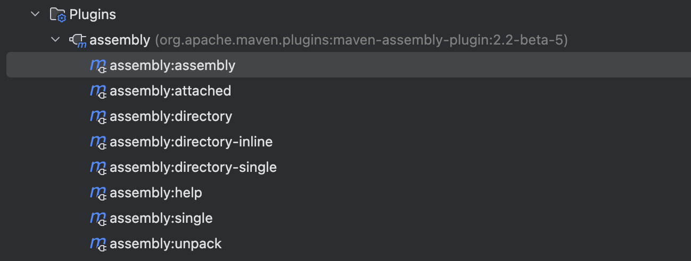

## 前言

最近在看 JVM-Sandbox 项目，学习一下底层用到的 Agent 插桩技术。

## 什么是 Agent 插桩

Agent 也被称为 Java 探针、插桩技术，本质上来说它就是一个 jar 包，可以在目标 JVM 启动时或运行时执行 jar 包内的 premain 或者 agentmain 方法。

这么一看好像 Agent 并不起眼，但是当它结合 Instrumentation API、JMX 技术，就变成了炙手可热的香饽饽。

当 Agent 技术结合 Instrumentation API，就可以实现在 Java 程序运行时动态修改字节码，对正在运行的 Java 程序进行无侵入式的（无需修改源代码）、可插拔式的 AOP 增强、调试。

当 Agent 技术结合 JMX 技术，就可以实现 Java 程序运行时信息的获取，比如线程栈、内存、类信息等，这样就可以对正在运行的 Java 程序实现无侵入式的、可插拔式的监控。

## Agent 插桩示例

### premain

premain 方法，也可以称为 Java Agent 的静态加载模式，该方法会在目标 JVM 启动时执行，也就是在程序 main 方法执行前被调用，该方法接受一个字符串参数以及一个 Instrumentation 对象。

+ 字符串参数通常是传递给 -javaagent 参数的值
+ 而 Instrumentation 对象可用于修改类行为，后面会聊到

所以，premain 可以在目标 JVM 的类加载前对类进行修改，从而实现对目标类的增强，适合于 APM 等性能监测系统从一开始就监控程序的执行性能。

---

下面我们以一个简单的案例来说明静态加载模式。

首先创建一个 Maven 工程 agent，然后添加 Maven 插件：

```xml
<build>
  <plugins>
    <plugin>
      <groupId>org.apache.maven.plugins</groupId>
      <artifactId>maven-assembly-plugin</artifactId>
      <version>2.2-beta-5</version>
      <configuration>
        <descriptorRefs>
          <!-- 将所有依赖加入同一个 jar 包 -->
          <descriptorRef>jar-with-dependencies</descriptorRef>
        </descriptorRefs>
        <archive>
          <!-- 指定 agent 相关配置文件 -->
          <manifestFile>src/main/resources/MANIFEST.MF</manifestFile>
        </archive>
      </configuration>
    </plugin>
  </plugins>
</build>
```

编写 premain 方法，如下：

```java
package org.hein;

import java.lang.instrument.Instrumentation;

public class PreMain {

    public static void premain(String args, Instrumentation inst) {
        System.out.println("agent premain, args: " + args);
        System.out.println("classLoader.length: " + inst.getAllLoadedClasses().length);
    }
}
```

在 src/main/resources 目录下创建 MANIFEST.MF 清单文件，这个文件主要用来描述 Agent 的配置属性，比如使用哪个类的 premain 方法。

```properties
Manifest-Version: 1.0
Premain-Class: org.hein.PreMain
Can-Redefine-Classes: true
Can-Retransform-Classes: true
Can-Set-Native-Method-Prefix: true

```

使用 maven-assembly-plugin 插件进行打包，运行 assembly:assembly 命令。



然后创建另外一个 Java 程序 agent-client，编写一段 main 方法，打成 jar 包后静态加载上一步得到的 jar 包。

如下：

```shell
java -jar -javaagent:/Users/hejin/project/agent-demo/agent/target/agent-1.0-jar-with-dependencies.jar agent-client-1.0.jar
```

你会得到下面的输出：

```java
agent premain, args: null
classLoader.length: 464
>>>>> Main
```

如果想要传递参数到 Java Agent，可以像下面这样：

```java
java -jar -javaagent:/Users/hejin/project/agent-demo/agent/target/agent-1.0-jar-with-dependencies.jar=name=hejin,age=21 agent-client-1.0.jar
```

你会得到下面的输出：

```java
agent premain, args: name=hejin,age=21
classLoader.length: 464
>>>>> Main
```

如果有必要，就可以在 agent 项目中，对 args 参数进行字符串解析，拿到对应的参数信息。

### agentmain

与 premain 相对的是 agentmain 方法，也即是 Agent 的动态加载模式，它用于在 JVM 已经启动并且某些类已经被加载后的情况下插桩到目标 JVM。

这通常是通过 Attach API 来实现的，它允许在运行时将 Agent 注入到目标 JVM 进程中。

该方法同样接收一个字符串参数和 Instrumentation 对象，它的主要用途是重新转换已经加载的类或者在类被加载之后添加额外的行为。

像我们熟悉的 arthas 诊断工具，JVM-Sandbox 技术底层都是使用到了动态加载模式。

---

还是简单写一个例子，我们仿照 arthas，只不过只实现一个命令，查看当前 JVM 使用的类加载器。

首先在 agent 工程中，编写 AgentMain 类，agentmain 方法：

```java
package org.hein;

import java.lang.instrument.Instrumentation;
import java.util.Arrays;
import java.util.Scanner;
import java.util.stream.Collectors;

public class AgentMain {

    public static void agentmain(String args, Instrumentation inst) {
        System.out.println("agent agentmain: >>>>>>>>>>>>>>>>");
        Scanner sc = new Scanner(System.in);
        while (true) {
            System.out.print("> ");
            String input = sc.nextLine().trim();
            switch (input) {
                case "classLoaderInfo":
                    classLoaderInfo(inst);
                    break;
                case "quit":
                    System.out.println("bye!");
                    return;
                default:
            }
        }
    }

    public static void classLoaderInfo(Instrumentation inst) {
        System.out.println(Arrays.stream(inst.getAllLoadedClasses())
                .map(Class::getClassLoader)
                .map(each -> each == null ? "BootStrapClassLoader" : each.getClass().getSimpleName())
                .distinct()
                .sorted(String::compareTo)
                .collect(Collectors.joining(",")));
    }
}
```

在 MANIFEST.MF 清单文件中，补充 Agent-Class 配置：

```java
Manifest-Version: 1.0
Premain-Class: org.hein.PreMain
Agent-Class: org.hein.AgentMain
Can-Redefine-Classes: true
Can-Retransform-Classes: true
Can-Set-Native-Method-Prefix: true

```

依然通过 maven-assembly-plugin 插件进行打包，运行 assembly:assembly 命令。

接着在 agent-client 中，通过 VirtualMachine attach 指定的 JVM 进程，然后加载上面编写的 agent jar 包。

```java
package org.hein;

import com.sun.tools.attach.AgentInitializationException;
import com.sun.tools.attach.AgentLoadException;
import com.sun.tools.attach.AttachNotSupportedException;
import com.sun.tools.attach.VirtualMachine;

import java.io.BufferedReader;
import java.io.IOException;
import java.io.InputStreamReader;
import java.util.Scanner;

/**
 * java -jar agent-client-1.0-jar-with-dependencies.jar /Users/hejin/project/agent-demo/agent/target/agent-1.0-jar-with-dependencies.jar
 */
public class Main {

    // args[0] -> agent path
    public static void main(String[] args) throws IOException, AttachNotSupportedException, AgentLoadException, AgentInitializationException {
        if (args.length == 0) {
            throw new RuntimeException("没有指定 agent 路径");
        }
        Process process = Runtime.getRuntime().exec("jps");
        try (BufferedReader br = new BufferedReader(new InputStreamReader(process.getInputStream()))) {
            String line;
            while ((line = br.readLine()) != null) {
                System.out.println(line);
            }
        }
        Scanner sc = new Scanner(System.in);
        String pid = sc.next();
        VirtualMachine vm = VirtualMachine.attach(pid);
        System.out.println("agent path: " + args[0]);
        // 加载 agent，这里 args[0] 是 agent 路径，还可以指定 agent 的入参（用在 agentmain 方法的 args 中）
        try {
            // 加载 agent.jar, 目标 JVM 会执行 agent.jar 包中的 Agent-Class 中的 agentmain 方法
            vm.loadAgent(args[0]);
        } finally {
            if (vm != null) {
                // 与 attach 动作相反
                vm.detach();
            }
        }
    }
}
```

在 JDK 1.8，你可能需要额外引入下面的 Maven 依赖：

```xml
<dependency>
    <groupId>com.sun</groupId>
    <artifactId>tools</artifactId>
    <version>1.8</version>
    <scope>system</scope>
    <systemPath>/Library/Java/JavaVirtualMachines/jdk-1.8.jdk/Contents/Home/lib/tools.jar</systemPath>
    <!-- 防止依赖传递 -->
    <optional>true</optional>
</dependency>
```

这里 com.sum.tools 是本地系统依赖，而 maven-assembly-plugin 插件在打包时默认会忽略 scope = system 的依赖，所以我们需要额外做一些配置。

在 agent-client src/main 目录下创建 assembly/assembly.xml 文件，如下：

```xml
<!-- 用于解决 maven-assembly-plugin 忽略本地系统依赖 scope=system 的问题 -->
<assembly xmlns="http://maven.apache.org/plugins/maven-assembly-plugin/assembly/1.1.3"
  xmlns:xsi="http://www.w3.org/2001/XMLSchema-instance"
  xsi:schemaLocation="http://maven.apache.org/plugins/maven-assembly-plugin/assembly/1.1.3 http://maven.apache.org/xsd/assembly-1.1.3.xsd">
  <id>jar-with-dependencies</id>
  <formats>
    <format>jar</format>
  </formats>
  <includeBaseDirectory>false</includeBaseDirectory>
  <dependencySets>
    <dependencySet>
      <outputDirectory>/</outputDirectory>
      <useProjectArtifact>true</useProjectArtifact>
      <unpack>true</unpack>
      <scope>system</scope>
      <includes>
        <include>com.sun:tools</include>
      </includes>
    </dependencySet>
    <dependencySet>
      <outputDirectory>/</outputDirectory>
      <useProjectArtifact>true</useProjectArtifact>
      <unpack>true</unpack>
      <scope>runtime</scope>
    </dependencySet>
  </dependencySets>
  <fileSets>
    <fileSet>
      <directory>${project.build.outputDirectory}</directory>
      <outputDirectory>/</outputDirectory>
      <includes>
        <include>**/*.class</include>
      </includes>
    </fileSet>
  </fileSets>
</assembly>
```

修改插件如下：

```xml
<build>
  <plugins>
    <plugin>
      <groupId>org.apache.maven.plugins</groupId>
      <artifactId>maven-assembly-plugin</artifactId>
      <version>2.2-beta-5</version>
      <configuration>
        <archive>
          <manifest>
            <mainClass>org.hein.Main</mainClass>
          </manifest>
        </archive>
        <descriptors>
          <descriptor>src/main/assembly/assembly.xml</descriptor>
        </descriptors>
      </configuration>
      <executions>
        <execution>
          <id>make-assembly</id>
          <phase>package</phase>
          <goals>
            <goal>single</goal>
          </goals>
        </execution>
      </executions>
    </plugin>
  </plugins>
</build>
```

然后将 agent-client 打包，就可以像 arthas 那样使用了，只是这里需要手动补 agent 的路径。

比如我们启动 SeataApplication，执行下面的命令：

```java
hejin@hejindeMacBook-Pro target % java -jar agent-client-1.0-jar-with-dependencies.jar /Users/hejin/project/agent-demo/agent/target/agent-1.0-jar-with-dependencies.jar
7265 jar
7266 Jps
7244 ServerApplication
7245 Launcher
7244
agent path: /Users/hejin/project/agent-demo/agent/target/agent-1.0-jar-with-dependencies.jar
```

那么在 SeataApplication 程序控制台就可以进行如下的交互：

```java
agent agentmain: >>>>>>>>>>>>>>>>
> classLoaderInfo
AppClassLoader,BootStrapClassLoader,ByteArrayClassLoader,DelegatingClassLoader,ExtClassLoader,MethodUtil,NoCallStackClassLoader
> quit
bye!
```

## Instrumentation API

Instrumentation 是 Java 提供的 JVM 接口，它提供了一系列查看和操作 Java 类定义的方法，比如修改类的字节码、向 classloader 的 classpath 下添加 jar 文件等。

一些主要方法如下：

```java
public interface Instrumentation {

    /**
     * 添加一个类文件转换器（ClassFileTransformer），并指定是否允许重新转换已加载的类。
     * @param transformer 要添加的类文件转换器
     * @param canRetransform 如果为 true，则允许对已经加载的类进行重新转换
     */
    void addTransformer(ClassFileTransformer transformer, boolean canRetransform);

    /**
     * 注册一个 ClassFileTransformer。从此之后加载的所有类都会被这个转换器拦截，
     * 并且可以在类加载到JVM之前修改类的字节码。
     * @param transformer 要添加的类文件转换器
     */
    void addTransformer(ClassFileTransformer transformer);

    /**
     * 从当前注册的转换器列表中移除指定的转换器。
     * @param transformer 要移除的类文件转换器
     * @return 如果成功移除了转换器，则返回 true；否则返回 false
     */
    boolean removeTransformer(ClassFileTransformer transformer);

    /**
     * 检查当前 JVM 是否支持重新转换已加载的类。
     * @return 如果支持重新转换，则返回 true；否则返回 false
     */
    boolean isRetransformClassesSupported();

    /**
     * 对指定的类进行重新转换。如果这些类已经被转换过，那么它们将被再次转换。
     * @param classes 要重新转换的类
     * @throws UnmodifiableClassException 如果类不能被重新转换
     */
    void retransformClasses(Class<?>... classes) throws UnmodifiableClassException;

    /**
     * 检查当前 JVM 是否支持重新定义已加载的类。
     * @return 如果支持重新定义，则返回 true；否则返回 false
     */
    boolean isRedefineClassesSupported();

    /**
     * 重新定义一组类。这会替换掉这些类的现有定义。
     * 注意：不能增加、删除或者重命名字段和方法，改变方法的签名或者类的继承关系
     * @param definitions 类的新定义
     * @throws ClassNotFoundException 如果找不到某个类
     * @throws UnmodifiableClassException 如果类不能被重新定义
     */
    void redefineClasses(ClassDefinition... definitions) throws ClassNotFoundException, UnmodifiableClassException;

    /**
     * 检查给定的类是否可以被修改（即是否可以被重新定义或重新转换）。
     * @param theClass 要检查的类
     * @return 如果类可以被修改，则返回 true；否则返回 false
     */
    boolean isModifiableClass(Class<?> theClass);

    /**
     * 获取所有已加载的类。
     * @return 所有已加载的类的数组
     */
    @SuppressWarnings("rawtypes")
    Class[] getAllLoadedClasses();

    /**
     * 获取由指定类加载器初始化的所有类。
     * @param loader 指定的类加载器
     * @return 由指定类加载器初始化的所有类的数组
     */
    @SuppressWarnings("rawtypes")
    Class[] getInitiatedClasses(ClassLoader loader);

    /**
     * 获取指定对象在内存中的大小（以字节为单位）。
     * @param objectToSize
     * @return 对象的大小
     */
    long getObjectSize(Object objectToSize);

    /**
     * 将指定的 JAR 文件添加到引导类加载器的搜索路径中。
     * @param jarfile 要添加的 JAR 文件
     */
    void appendToBootstrapClassLoaderSearch(JarFile jarfile);

    /**
     * 将指定的 JAR 文件添加到系统类加载器的搜索路径中。
     * @param jarfile 要添加的 JAR 文件
     */
    void appendToSystemClassLoaderSearch(JarFile jarfile);

    /**
     * 检查当前 JVM 是否支持设置 native 方法前缀。
     * @return 如果支持设置 native 方法前缀，则返回 true；否则返回 false
     */
    boolean isNativeMethodPrefixSupported();

    /**
     * 设置指定类文件转换器生成的 native 方法的前缀。
     * @param transformer 相关的类文件转换器
     * @param prefix 要设置的前缀
     */
    void setNativeMethodPrefix(ClassFileTransformer transformer, String prefix);
}
```

其中最常用的方法是 addTransformer，这个方法可以在类加载时做拦截，对输入的类的字节码进行修改，其参数是一个 ClassFileTransformer 接口，定义如下：

```java
package java.lang.instrument;

import java.security.ProtectionDomain;

/**
 * 该方法允许在类加载到 JVM 之前或之后对类的字节码进行转换。
 */
public interface ClassFileTransformer {

    /**
     * 在类被加载到 JVM 时调用此方法。如果需要修改类的字节码，可以在此方法中进行，并返回修改后的字节码。
     * 如果不需要修改，则返回 null。
     *
     * @param loader              定义要转换的类的类加载器；如果类是由引导类加载器加载的，则为 null。
     * @param className           类的内部名称（即二进制名称），例如 "java/util/List"。
     * @param classBeingRedefined 如果是重新定义类的操作，则为正在被重新定义的类；如果是加载新类，则为 null。
     * @param protectionDomain    要转换的类的保护域。
     * @param classfileBuffer     原始类文件格式的类字节码。
     * @return 					  修改后的类字节码数组，如果不需要修改则返回 null。
     * @throws IllegalClassFormatException 如果生成的类文件格式不正确。
     */
    byte[] transform(ClassLoader loader,
                     String className,
                     Class<?> classBeingRedefined,
                     ProtectionDomain protectionDomain,
                     byte[] classfileBuffer) throws IllegalClassFormatException;
}
```

### 从 Instrumentation 看 Agent

主流的 JVM 都对 Instrumentation 做了实现，但是考虑到 Instrumentation API 的特殊性及其可能带来的影响，所以它并没有直接集成到 JDK 的标准运行时环境中，而是通过 Agent 的形式提供。

Instrumentation 实例作为方法入参传递给 Agent 的 premain 或 agentmain 方法，从而允许开发者以“上帝视角”对应用程序进行监控和修改，而无需修改应用程序的源代码。

就像我们上面的插桩示例一样。

### 输入类的源码

下面我们用一个例子使用一下 Instrumentation API，仿照 arthas，获取运行时类的源码。

大致的思路就是首先通过向 Instrumentation 添加 ClassFile 转换器来获取内存中的字节码信息，然后通过反编译工具将字节码信息还原为源代码信息。

关键代码如下：

```java
public static void jad(Instrumentation inst, Scanner sc) {
    System.out.println("> input your className");
    String className = sc.next();
    Class<?> clazz = Arrays.stream(inst.getAllLoadedClasses())
            .filter(each -> each.getName().equals(className))
            .findFirst()
            .orElse(null);
    if (clazz == null) {
        System.out.println("class not found");
    } else {
        // 反编译源码
        ClassFileTransformer transformer = new ClassFileTransformer() {

            @Override
            public byte[] transform(ClassLoader loader, String className, Class<?> classBeingRedefined, ProtectionDomain protectionDomain, byte[] classFileBuffer) throws IllegalClassFormatException {
                // 不修改字节码，仅仅是利用它反编译出源码
                try {
                    print(classFileBuffer, className);
                } catch (Exception e) {
                    // ignore
                }
                return null;
            }

            private void print(byte[] classFileBuffer, String className) throws Exception {

                Loader loader = new Loader() {
                    @Override
                    public boolean canLoad(String internalName) {
                        return false;
                    }

                    @Override
                    public byte[] load(String internalName) {
                        return classFileBuffer;
                    }
                };

                Printer printer = new Printer() {
                    private static final String TAB = "  ";
                    private static final String NEWLINE = "\n";
                    private int indentationCount = 0;
                    private final StringBuilder sb = new StringBuilder();
                    @Override public String toString() { return sb.toString(); }
                    @Override public void start(int maxLineNumber, int majorVersion, int minorVersion) {}
                    @Override public void end() {System.out.println(sb);}
                    @Override public void printText(String text) { sb.append(text); }
                    @Override public void printNumericConstant(String constant) { sb.append(constant); }
                    @Override public void printStringConstant(String constant, String ownerInternalName) { sb.append(constant); }
                    @Override public void printKeyword(String keyword) { sb.append(keyword); }
                    @Override public void printDeclaration(int type, String internalTypeName, String name, String descriptor) { sb.append(name); }
                    @Override public void printReference(int type, String internalTypeName, String name, String descriptor, String ownerInternalName) { sb.append(name); }
                    @Override public void indent() { this.indentationCount++; }
                    @Override public void unindent() { this.indentationCount--; }
                    @Override public void startLine(int lineNumber) { for (int i = 0; i < indentationCount; i++) sb.append(TAB); }
                    @Override public void endLine() { sb.append(NEWLINE); }
                    @Override public void extraLine(int count) { while (count-- > 0) sb.append(NEWLINE); }
                    @Override public void startMarker(int type) {}
                    @Override public void endMarker(int type) {}
                };
                ClassFileToJavaSourceDecompiler decompiler = new ClassFileToJavaSourceDecompiler();
                decompiler.decompile(loader, printer, className);
            }
        };
        inst.addTransformer(transformer, true);
        // 触发转换器
        try {
            inst.retransformClasses(clazz);
        } catch (UnmodifiableClassException e) {
            throw new RuntimeException(e);
        } finally {
            inst.removeTransformer(transformer);
        }
    }
}
```