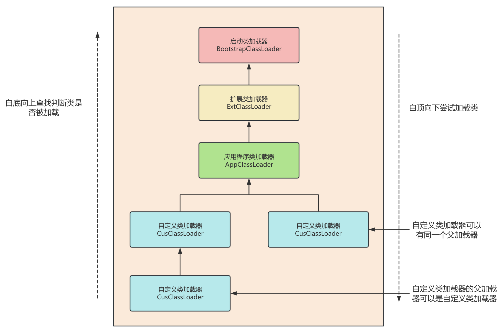
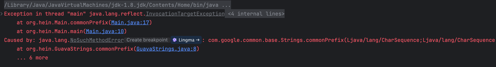

## 前言

上一篇文章，我们说到了 JVM-Sandbox 用到的 Agent 技术，在这个项目中，还提到了一点特性：

+ 类隔离：沙箱以及沙箱的模块不会和目标应用的类相互干扰

所以，这篇文章我们就来研究一下 JVM 的类加载，以及如何实现类隔离。

## 类加载器

类的生命周期中，第一个阶段就是类加载，类加载器（ClassLoader）负责这个过程。

类加载器是 JVM 的一个重要组成部分，它负责在运行时查找、加载类文件（.class 字节码文件），当查找到这些二进制数据后，类加载器执行 JNI（本地接口调用），在方法区和堆区创建对象，保存字节码中的类和接口信息。

类加载器仅仅负责 **获取二进制的字节码信息**，后续对象的创建还是要交给 JVM 其他部分完成。

### 三大类加载器

在 JVM 中，有三个比较重要的 ClassLoader。

+ Bootstrap ClassLoader（启动类加载器）：它是最顶层的类加载器，由 Cpp 实现，主要用于加载核心类库。
+ Extension ClassLoader（扩展类加载器）：它负责加载 Java 平台扩展目录下的 jar 文件。
+ Application ClassLoader（应用程序/系统类加载器）：负责加载应用程序类路径下的所有类，由 sun.misc.Luncher$AppClassLoader 实现，是大多数应用程序默认使用的类加载器。

这三个类加载器各自有自己负责加载的目录，也可以通过 VM 参数指定额外需要加载的 Class。

### 自定义类加载

除此之外，开发者还可以创建自定义类加载器来满足特定需求，比如实现类隔离。

如果要自定义类加载器，需要继承 ClassLoader 抽象类，该类中有两个关键方法：

```java
public abstract class ClassLoader {

    /**
     * 查找并定义指定名称的类。
     *
     * 该方法首先尝试从文件系统中查找具有给定全限定名（二进制名）的类。
     * 如果找到，则通过调用defineClass方法将字节码转换为Class对象。
     * 如果找不到或者发生错误，则抛出ClassNotFoundException。
     * 
     * @param name 类的全限定名
     * @return 找到的Class对象
     * @throws ClassNotFoundException 如果找不到类
     */
    protected Class<?> findClass(String name) throws ClassNotFoundException {
        throw new ClassNotFoundException(name);
    }

    /**
     * 加载指定名称的类。
     *
     * 该方法首先会检查这个类是否已经被加载过；如果已经加载，则直接返回已加载的Class对象。
     * 否则，它会调用loadClass(String, boolean)方法来加载类，并且不解析类。
     * 
     * @param name 类的全限定名
     * @return 加载的Class对象
     * @throws ClassNotFoundException 如果找不到类
     */
    public Class<?> loadClass(String name) throws ClassNotFoundException {
        return loadClass(name, false);
    }
}
```

在官方 API 文档中写到：

+ Subclasses of ClassLoader are encouraged to override `findClass(String name)`, rather than this method.
+ 建议 ClassLoader 的子类重写 `findClass(String name)` 方法而不是 `loadClass(String name, boolean resolve)` 方法。

如果不想打破双亲委派模型，重写 ClassLoader 类中的 findClass() 方法即可，无法被父类加载器加载的类最终会通过这个方法被加载，但是，如果想打破双亲委派模型则需要重写 loadClass() 方法。

## 双亲委派模型

上面我们提到了双亲委派模型和父类加载器的字眼，这里就来解释。

### 类加载器的父子关系

既然是“双亲”委派模型，那么类加载器之间就一定会存在父子关系，不过，这里的“父子”关系并不是继承或实现，而是组合。

在 ClassLoader 抽象类中，parent 属性指定了每一个类加载器都会有一个父类加载器（启动类加载器除外），类加载器的父子关系并不是以继承的方式实现，而是以组合的关系复用父类加载器的代码。

我们上面提到的三个类加载器，AppClassLoader 以 ExtClassLoader 作为父类加载器，而 ExtClassLoader 以 BootstrapClassLoader 作为父类加载器。

### 双亲委派模型

一个显然的问题是：如果 JVM 要加载一个类，到底由哪个类加载器来加载？

首先我们要知道类在被加载过程中最基本的要求：

1. 保证类加载的安全性。比如开发人员如果自定义了 java.lang.String，JVM 需要保证该类不能替换 rj.jar 中的 String 核心类。
2. 避免重复加载。减少类加载过程中的性能开销。

要想满足这两个要求，就需要使用 **双亲委派机制** 来保证，理所当然的，这两点也就成为了双亲委派模型的优势。

根据官网介绍：

> The ClassLoader class uses a delegation model to search for classes and resources. Each instance of ClassLoader has an associated parent class loader. When requested to find a class or resource, a ClassLoader instance will delegate the search for the class or resource to its parent class loader before attempting to find the class or resource itself. The virtual machine's built-in class loader, called the "bootstrap class loader", does not itself have a parent but may serve as the parent of a ClassLoader instance.

翻译过来大概的意思是：

ClassLoader 类使用 **委托模型** 来搜索类和资源。每个 ClassLoader 实例都有一个相关的父类加载器。需要查找类或资源时，ClassLoader 实例会在试图亲自查找类或资源之前，将搜索类或资源的任务委托给其父类加载器。

虚拟机中被称为“bootstrap class loader”的内置类加载器本身没有父类加载器，但是可以作为 ClassLoader 实例的父类加载器。

从上面的介绍可以看出：

+ ClassLoader 类使用委托模型来搜索类和资源。
+ 双亲委派模型要求除了顶层的启动类加载器外，其余的类加载器都应该有自己的父类加载器。
+ ClassLoader 实例会在试图“亲自”查找类或资源之前，将搜索类或资源的任务委托给其“父类”加载器。

就像下面一样：



所以，双亲委派模型的类加载流程如下：

1. 当一个类加载器尝试加载某个类时，会先 **自底向上查找父类加载器是否加载过**，如果加载过就直接返回该类信息，如果直到最顶层的类加载器都没有加载，**再自顶向下进行加载**。
2. AppClassLoader 的父类加载器是 ExtClassLoader，ExtClassLoader 没有父类加载器，但在双亲委派时会委派给 BootstrapClassLoader。

向上查找的机制保证只要其中一个父类加载器加载过该类，就可以直接返回，避免重复加载，而向下委派的机制起到了加载优先级的作用，一个类优先由 BootstrapClassLoader 加载，它加载不了再交给 ExtClassLoader ……

实际上，双亲委派模型的实现却非常简单，实现的代码都集中在 java.lang.ClassLoader 的 loadClass() 方法中：

```java
protected Class<?> loadClass(String name, boolean resolve) throws ClassNotFoundException {
    synchronized (getClassLoadingLock(name)) {
        // 首先检查是否已经加载过该类
        Class<?> c = findLoadedClass(name);
        if (c == null) {
            // 没有加载过
            long t0 = System.nanoTime();
            try {
                if (parent != null) {
                    // 如果父类加载器不为 null 则调用父类加载器的 loadClass 方法
                    // 优先让父类加载
                    c = parent.loadClass(name, false);
                } else {
                    // 如果父类加载器为 null 则默认调用 Bootstrap 启动类加载器的 loadClass 方法
                    c = findBootstrapClassOrNull(name);
                }
            } catch (ClassNotFoundException e) {
                // ClassNotFoundException thrown if class not found
                // from the non-null parent class loader
            }
            // 若父类加载失败，则调用自己的 findClass 方法进行加载
            if (c == null) {
                // If still not found, then invoke findClass in order
                // to find the class.
                long t1 = System.nanoTime();
                c = findClass(name);

                // this is the defining class loader; record the stats
                sun.misc.PerfCounter.getParentDelegationTime().addTime(t1 - t0);
                sun.misc.PerfCounter.getFindClassTime().addElapsedTimeFrom(t1);
                sun.misc.PerfCounter.getFindClasses().increment();
            }
        }
        if (resolve) {
            resolveClass(c);
        }
        return c;
    }
}
```

用递归的思想，很简单的就实现了双亲委派模型。

## 类隔离技术

在某些情况下，我们可能需要在一个项目中动态引入第三方的 JAR 包。如果这些 JAR 包依赖于不同版本的同一库，就可能会遇到类加载冲突的问题。

### Guava 的例子

比如，在一个使用了 Guava 10.0.1 版本的程序中，如果尝试通过反射调用另一个 JAR 包中的方法，而该方法依赖于 Guava 11.0 或更高版本的功能，就可能会出现 NoSuchMethodError 错误。

在 out-jar 工程中，引入了高版本的 Guava 包。

```java
package org.hein;

import com.google.common.base.Strings;

public class GuavaStrings {

    public static String commonPrefix(String s1, String s2) {
        return Strings.commonPrefix(s1, s2);
    }
}
```

在 main-pro 工程中，引入 10.0.1 版本的 Guava 依赖，接着反射调用 out-jar 中的 commonPrefix 方法。

```java
package org.hein;

import java.io.File;
import java.net.URL;
import java.net.URLClassLoader;

public class Main {

    public static void main(String[] args) throws Exception {
        System.out.println(commonPrefix("common", "c"));
    }

    public static String commonPrefix(String s1, String s2) throws Exception {
        File file = new File("/Users/hejin/project/guava-test/out-jar/target/out-jar-1.0.0-jar-with-dependencies.jar");
        URLClassLoader classLoader = new URLClassLoader(new URL[]{file.toURI().toURL()});
        Object o = Class.forName("org.hein.GuavaStrings", true, classLoader).newInstance();
        return (String) o.getClass().getMethod("commonPrefix", String.class, String.class).invoke(o, s1, s2);
    }
}
```

不出意外，出现了 NoSuchMethodError。



在 main-pro 工程中，通过 AppClassLoader 加载了 Guava 10.0.1 相关类，当尝试通过反射调用 out-jar 中的 commonPrefix 方法时，由于双亲委派机制，URLClassLoader 会首先委托给其父类加载器 AppClassLoader 来加载 GuavaStrings 类及其依赖的 Guava 类。

所以，实际使用的 Guava 版本仍然是 10.0.1，commonPrefix 方法不存在，从而抛出 NoSuchMethodError。

### 打破双亲委派

打破双亲委派模型是很简单的，重写 loadClass 方法，当类未加载过，则让该类加载器先加载即可。

```java
package org.hein;

import java.io.IOException;
import java.net.MalformedURLException;
import java.net.URL;
import java.net.URLClassLoader;
import java.util.Enumeration;

/**
 * 默认的父类加载器是系统类加载器 AppClassLoader
 */
public class ChildFirstClassLoader extends URLClassLoader {

    public ChildFirstClassLoader(String jarFilePath) throws MalformedURLException {
        super(new URL[]{new URL("file:" + jarFilePath)});
    }

    @Override
    public Class<?> loadClass(String name, boolean resolve) throws ClassNotFoundException {
        synchronized (getClassLoadingLock(name)) {
            // 避免重复加载
            Class<?> c = findLoadedClass(name);
            if (c != null) {
                if (resolve) {
                    resolveClass(c);
                }
                return c;
            }
            try {
                // 优先由当前类加载器加载
                c = findClass(name);
                if (c != null) {
                    if (resolve) {
                        resolveClass(c);
                    }
                    return c;
                }
            } catch (ClassNotFoundException e) {
                // ignore
            }
            try {
                // 再交给父类加载器加载
                if (getParent() != null) {
                    c = super.loadClass(name, resolve);
                    if (c != null) {
                        if (resolve) {
                            resolveClass(c);
                        }
                        return c;
                    }
                }
            } catch (ClassNotFoundException e) {
                // ignore
            }
            try {
                // 最后再由系统类加载器尝试加载一次
                c = findSystemClass(name);
                if (c != null) {
                    if (resolve) {
                        resolveClass(c);
                    }
                    return c;
                }
            } catch (ClassNotFoundException e) {
                // ignore
            }
            throw new ClassNotFoundException(name);
        }
    }

    @Override
    public URL getResource(String name) {
        URL url = findResource(name);
        if (url != null) {
            return url;
        }
        return super.getResource(name);
    }

    @Override
    public Enumeration<URL> getResources(String name) throws IOException {
        Enumeration<URL> urls = findResources(name);
        if (urls != null) {
            return urls;
        }
        return super.getResources(name);
    }
}
```

再重写上面的例子，如下：

```java
package org.hein;

import java.lang.reflect.Method;

public class Main {

    public static void main(String[] args) throws Exception {
        System.out.println(commonPrefix("common", "c"));
    }

    public static String commonPrefix(String s1, String s2) throws Exception {
        try (ChildFirstClassLoader classLoader =
                     new ChildFirstClassLoader("/Users/hejin/project/guava-test/out-jar/target/out-jar-1.0.0-jar-with-dependencies.jar")) {
            Class<?> aClass = classLoader.loadClass("org.hein.GuavaStrings");
            Method method = aClass.getMethod("commonPrefix", String.class, String.class);
            return (String) method.invoke(null, s1, s2);
        }
    }
}
```

控制台正确输出~

除此之外，还应该注意一点，即对于线程上下文类加载器的特殊处理。

在某些特定情况下，JVM 使用线程上下文类加载器加载特定的类，这主要是为了能够跨过不同的类加载器层次结构，从而加载到可能被其他类加载器所“管理”的类。

一个典型的例子是 JDBC 驱动的加载。java.sql 包下的类由 BootstrapClassLoader 加载，而这些类又需要访问具体数据库厂商提供的 JDBC 驱动实现，这些实现通常位于应用程序的类路径下，并不由引导类加载器负责加载。因此，JDBC 相关的 API 会使用线程上下文类加载器来查找并加载这些具体的驱动实现。

为了避免某些需要我们指定类加载器的类加载时是基于线程上下文类加载器进行加载的特殊情况，我们需要临时将线程上下文类加载器设置为我们自定义的类加载器。

并在类加载完后进行复原，确保之后该线程执行其他操作不会因为错误的类加载器而导致类加载问题或安全问题。

就像下面这样：

```java
package org.hein;

public class ThreadContextClassLoader {

    private static final ThreadLocal<ClassLoader> CLASS_LOADER_THREAD_LOCAL = new ThreadLocal<>();

    /**
     * 替换线程上下文类加载器
     */
    public static void replace(ClassLoader classLoader) {
        CLASS_LOADER_THREAD_LOCAL.set(Thread.currentThread().getContextClassLoader());
        Thread.currentThread().setContextClassLoader(classLoader);
    }

    /**
     * 恢复线程上下文类加载器
     */
    public static void restore() {
        if (CLASS_LOADER_THREAD_LOCAL.get() == null) {
            return;
        }
        Thread.currentThread().setContextClassLoader(CLASS_LOADER_THREAD_LOCAL.get());
        CLASS_LOADER_THREAD_LOCAL.remove();
    }
}
```

```java
package org.hein;

import java.lang.reflect.Method;

public class Main {

    public static void main(String[] args) throws Exception {
        System.out.println(commonPrefix("common", "c"));
    }

    public static String commonPrefix(String s1, String s2) throws Exception {
        try (ChildFirstClassLoader classLoader =
                     new ChildFirstClassLoader("/Users/hejin/project/guava-test/out-jar/target/out-jar-1.0.0-jar-with-dependencies.jar")) {
            try {
                ThreadContextClassLoader.replace(classLoader);
                Class<?> aClass = classLoader.loadClass("org.hein.GuavaStrings");
                Method method = aClass.getMethod("commonPrefix", String.class, String.class);
                return (String) method.invoke(null, s1, s2);
            } finally {
                ThreadContextClassLoader.restore();
            }
        }
    }
}
```
