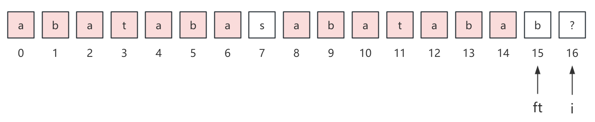
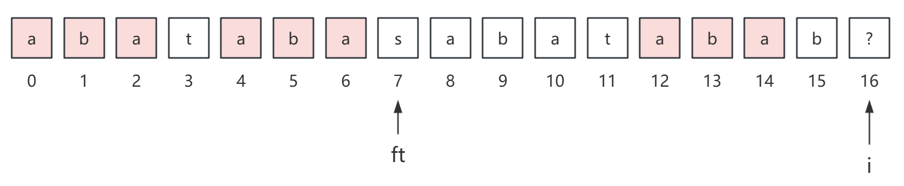
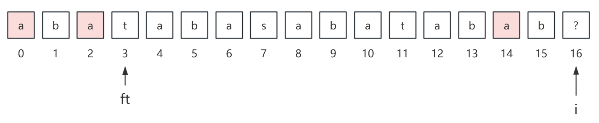
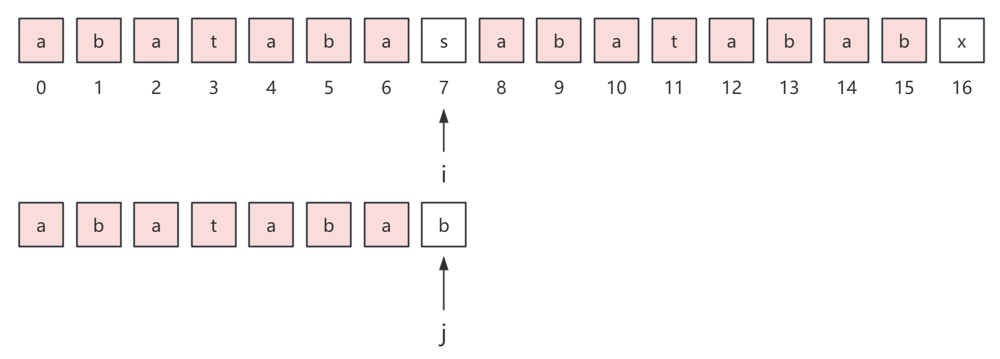
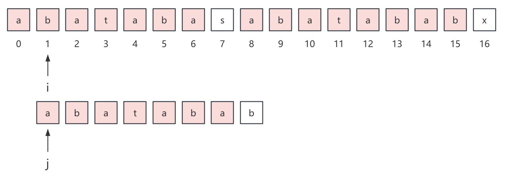
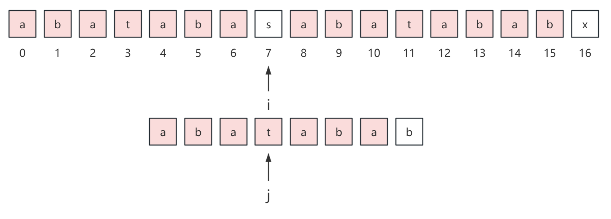

## 前言

kmp 算法最近经常出现在我的笔试题里面，不得不花时间来学一学了，学习资料是左神的 b 站视频。

## 解决什么问题

首先我们来看 kmp 算法解决什么问题？

在 java 语言中，String 类有一个方法是 indexof，那么 kmp 算法和它是一样的，就是模式匹配。

而所谓的模式匹配就是，给定主串 s 和模式串 p，要求找出 p 串在 s 串中出现的位置，比如 s = "acababa"，p = "ba"，那么 kmp 算法返回的结果应该是 3。

## 真前缀和真后缀

我们知道字符串前缀是指从字符串头部开始到某个位置 i 结束的子串，比如字符串 s = "acababa"，那么它的前缀串就有：a、ac、aca、acab、acaba、acabab、acababa。

而真前缀就是真正的前缀，也就是不包含它本身，所以真前缀只有：a、ac、aca、acab、acaba、acabab。

那么对应的后缀就是指从某个位置 i 到字符串尾部的的子串，而真后缀就是不包含它本身，所以上面字符串 s 的真后缀有：a、ba、aba、baba、ababa、cababa。

## next 数组

在开始 kmp 算法之前，我们还要学习一下 kmp 算法中的 next 数组，这个概念在 [前缀函数与 KMP 算法 - OI Wiki](https://oi-wiki.org/string/kmp/#%E5%AD%97%E7%AC%A6%E4%B8%B2%E5%89%8D%E7%BC%80%E5%92%8C%E5%90%8E%E7%BC%80%E5%AE%9A%E4%B9%89) 中被称为前缀函数。

但是我们这里的 next 数组和前缀函数还是存在一点区别的，你可以仔细看一看 OI Wiki 中的前缀函数。

在 kmp 算法中，我们通常会对 p 串求 next 数组，用于 kmp 算法整体流程的加速推进。

### 定义 next 数组

首先我们定义 next 数组：**next[i] 表示 p 串前 i 个字符构成的子串中相等的真前缀和真后缀的最大长度**。

对于 next[0]，p 串前 0 个字符显然是不合法的，所以规定 next[0] = -1。

而对于 next[1]，p 串前 1 个字符构成的子串，真前缀和真后缀都是空串，所以 next[1] = 0。

剩余的情况就需要通过代码来计算了。

这里我们举个例子：p = "aabaabsaabaaa"，那么得到的 next 数组就应该是：

```java
next = [-1, 0, 1, 0, 1, 2, 3, 0, 1, 2, 3, 4, 5]
```

那么我们如何快速求解 next 数组呢？

### 求解 next 数组

这里我只举出一个例子，来说明 next 数组是怎么求出来的，至于为什么能够推出这种想法，你可以去看左神的视频或者是 OI Wiki。

顺便稍微吐槽一下，左神讲的例子其实和他的代码并不是很匹配（自我感觉），你可以看一下我的代码，或许更好记忆或者更有一些启发。

我们假设 p = "abatabasabatabab?..."，那么求解 next[16] 也就是 ? 字符的 next 值的过程如下：

首先我们初始化 ft = i - 1，可以知道 next[ft] 的值是 7，因为前 15 个字符最长的真前缀和真后缀是 abataba，长度为 7。



你可以很直观地看出，如果 p[7] = p[15] 的话，那么 next[i] 的值就是 next[ft] + 1 = 8，这是显然易见的。

但实际上，p[7] ≠ p[15]，所以我们需要将 ft 进行回退，回退的位置就是 next[ft]，如下：



这里 ft 回退到位置 7，并且 next[7] = 3，实际上你可以观察出来，p[0...2] 和 p[12...14] 是相等的，这并不是巧合，由于 next[15] = 7，所以他们一定是相等的，那么此时如果 p[3] = p[15] 的话，那么 next[i] 的值就是 next[ft] + 1 = 4。

但实际上，p[3] ≠ p[15]，所以我们还要将 ft 往前跳，即 ft = next[ft]，如下：



这里 ft 回退到位置 3，并且 next[3] = 1，如果此时 p[1] = p[15] 的话，那么 next[16] = next[ft] + 1 = 2，显然也是如此，所以 next[16] = 2，16 位置的最长相等的真前缀和真后缀就是 "ab"。

这里为什么用 ? 而不是一个具体的字符，主要是因为对每一个位置的 next 值的求解，并不依赖于当前位置的字符，仅仅依赖于前面的字符。

这里 ft 取自 front 是向前的意思，表示不断向前跳。

```java
public int[] next(char[] p) {
    int[] next = new int[p.length];
    next[0] = -1;
    for (int i = 2, ft; i < p.length; i++) {
        ft = next[i - 1];
        // 这里可以很明确的体现这种不断回退的思想
        while (ft > 0 && p[i - 1] != p[ft]) {
            ft = next[ft];
        }
        if (p[i - 1] == p[ft]) {
            ft++;
        }
        next[i] = ft;
    }
    return next;
}
```

## kmp 算法

求出了 next 数组之后，我们就可以进一步来看 kmp 算法是如何利用 next 数组的。

考虑下面的例子，



在匹配过程中，s[i] 和 p[j] 不断比较，最后在 s[7] 的位置发生了失配，如果是朴素的模式匹配算法，我们会这样做，让 i 来到 s 串上一次匹配开始位置的下一个位置，即位置 1，让 j 重置为 0。



但如果是这样我们还费尽心思的求 next 数组干嘛呢？

所以，在 kmp 算法中，我们直接让 i 不动，j 来到 3 位置，这里 3 其实就是发生失配时的 7 位置的 next 值。



从上图中，可以很直观地看到，p[j] 前面的 3 个字符已经不需要再次比较了，为什么可以这样做？

其实很简单，我们最初是在 p[7] 和 s[7] 发生失配的，所以 p[0...2] 和 s[0...2] 一定是相等的，而我们提前求出来的 next 数组告诉我们 next[7] = 3，所以 p[0...2] 和 p[4...6] 一定是相等的，所以 s[4...6] 和 p[0...2] 是相等的。

所以我们可以直接从 s[7] 和 p[3] 开始继续匹配。

事实上，kmp 算法的代码实现也是非常容易理解的，如下：

```java
public int kmp(char[] s, char[] p) {
    int n = s.length, m = p.length;
    int i = 0, j = 0;
    int[] next = next(p);
    while (i < n && j < m) {
        if (s[i] == p[j]) {
            i++;
            j++;
        } else if (j == 0) {
            i++;
        } else {
            j = next[j];
        }
    }
    return j == m ? i - j : -1;
}
```

## 时空复杂度

整个 kmp 算法的时间复杂度就是求解 next 数组以及进行模式匹配的过程，我们先来看求解 next 数组：

```java
public int[] next(char[] p) {
    int[] next = new int[p.length];
    next[0] = -1;
    for (int i = 2, ft; i < p.length; i++) {
        ft = next[i - 1];
        // 这里可以很明确的体现这种不断回退的思想
        while (ft > 0 && p[i - 1] != p[ft]) {
            ft = next[ft];
        }
        if (p[i - 1] == p[ft]) {
            ft++;
        }
        next[i] = ft;
    }
    return next;
}
```

首先空间复杂度 O(m) 没啥说的。

比较难分析的就是时间复杂度，其实这里分析的关键就在于内层的 while 循环，而内层循环的执行次数又和 ft 有着密切的关系。

在整个求解 next 数组的过程中，ft 最多增加到 O(m)（考虑字符串全为同一种字符的情况），而每次只能增加 1，所以 ft 最多增加 O(m) 次，而 while 循环中，ft 总共回退的次数不可能超过它增加的次数，所以 while 循环中 ft 最多回退 O(m) 次，也就是在整个求解 next 数组的过程中，while 循环内最多执行 O(m) 次。

所以整体的时间复杂度就是 O(m)。

接下来就是 kmp 算法的整体流程：

```java
public int kmp(char[] s, char[] p) {
    int n = s.length, m = p.length;
    int i = 0, j = 0;
    // O(m)
    int[] next = next(p);
    while (i < n && j < m) {
        if (s[i] == p[j]) {
            i++;
            j++;
        } else if (j == 0) {
            i++;
        } else {
            j = next[j];
        }
    }
    return j == m ? i - j : -1;
}
```

这里分析时间复杂度，我们利用作差的思想，定义两个量 i 和 i - j，i 的上限是 n，而 i - j 的上限也不过就是 n。

所以我们分析 while 循环中的各个分支情况如下：

| 分支   | i      | j                  | i - j |
| ------ | ------ | ------------------ | ----- |
| 分支 1 | 增加 1 | 增加 1             | 增加  |
| 分支 2 | 增加 1 | 不变               | 增加  |
| 分支 3 | 不变   | 减少（至少减少 1） | 增加  |


而分支 1、2、3 发生的总的操作次数就是 while 循环的时间复杂度，由于 i 和 i - j 的上限加起来最多就 2n，但是这三个分支都在将这两个量增加，所以这三个分支执行的总次数不会超过 2n，那么显然时间复杂度就是 O(n)。

所以，总的来说，kmp 算法的时间复杂度是 O(m + n)，而空间复杂度是 O(m)。