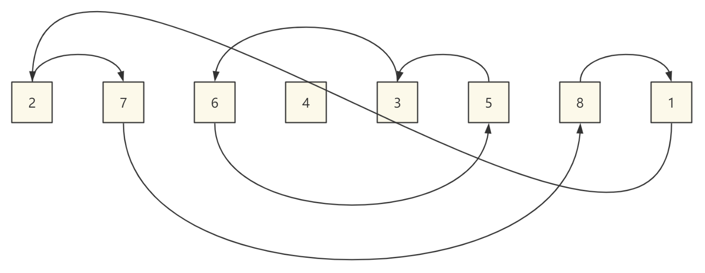

## 前言

原地哈希

## 算法概要

原地哈希算法，可以将其拆分为两个关键字：原地和哈希。

所谓原地很好理解，就是指空间复杂度为 O(1)，而哈希在这里与题目有着密切的关系，存在明确的哈希映射关系。

我们举个例子，数据范围 **在 [1, n] 的长度为 n 的数组**，所有的数都不相同，要求在 O(n) 时间复杂度内完成排序。

一般排序是基于元素值的大小来决定顺序的，即元素值决定了排序后的位置，而对于上面这种条件，不妨让 nums[i] 就放到索引为 nums[i] - 1 的位置。

所以这里明确的哈希关系就是 f(x) = x - 1

而对每个数组中的每个元素在原地进行哈希运算之后，就可以将每个数都归为到正确的位置。

比如：序列为 [2, 7, 6, 4, 3, 5, 8, 1]

那么使用原地哈希的思想，整个数组就可以被置换环分割。



如上图所示，整个序列被三个置换环分割，2、7、8、1、2，6、5、3、6，4、4。

```java
public void sort(int[] nums) {
    int n = nums.length - 1;
    for (int i = 1; i <= n; i++) {
        while (hash(nums[i]) != i) {
            // 不断交换
            swap(nums, i, hash(nums[i]));
        }
    }
    System.out.println(Arrays.toString(nums));
}

public int hash(int x) {
    return x - 1;
}

public void swap(int[] nums, int i, int j) {
    int tmp = nums[i];
    nums[i] = nums[j];
    nums[j] = tmp;
}
```

下面我们来分析一下时间复杂度，首先结论是 O(n)。

比较有讨论的点就在 while 循环部分，while 循环不会每一次都把数组里面的所有元素都看一遍，如果有一些元素在这一次的循环中被交换到了它们应该在的位置，那么在后续的遍历中，由于它们已经在正确的位置上，代码再执行到它们的时候，就会直接跳过。

最极端的一种情况是，在第 1 个位置经过这个 while 就把所有的元素都看了一遍，所有的元素都被正确的放置在它们应该在的位置，那么 for 循环后面的部分的 while 的循环体都不会被执行。

平均下来，每个数只需要看一次就可以了，while 循环体被执行很多次的情况不会每次都发生，这样的复杂度分析的方法叫做 **均摊复杂度分析**。

## 题目

### 缺失的第一个正数

> [41. 缺失的第一个正数](https://leetcode.cn/problems/first-missing-positive/)

```java
class Solution {
    public int firstMissingPositive(int[] nums) {
        int n = nums.length;
        for (int i = 0; i < n; i++) {
            int h;
            while ((h = hash(nums[i])) >= 0 && h < n && h != i && nums[h] != nums[i]) {
                swap(nums, h, i);
            }
        }
        for (int i = 0; i < n; i++) {
            if (hash(nums[i]) != i) {
                return i + 1;
            }
        }
        return n + 1;
    }

    public int hash(int x) {
        return x - 1;
    }

    public void swap(int[] nums, int i, int j) {
        int tmp = nums[i];
        nums[i] = nums[j];
        nums[j] = tmp;
    }

```

### 寻找重复数

> [287. 寻找重复数](https://leetcode.cn/problems/find-the-duplicate-number/)

```java
class Solution {
    public int findDuplicate(int[] nums) {
        int n = nums.length;
        for (int i = 0; i < n; i++) {
            int h;
            while ((h = hash(nums[i])) >= 0 && h < n && h != i) {
                if (nums[h] == nums[i]) {
                    return nums[h];
                }
                swap(nums, h, i);
            }
        }
        return -1;
    }

    public int hash(int x) {
        return x - 1;
    }

    public void swap(int[] nums, int i, int j) {
        int tmp = nums[i];
        nums[i] = nums[j];
        nums[j] = tmp;
    }
}
```

### 数组中重复的数据

> [442. 数组中重复的数据](https://leetcode.cn/problems/find-all-duplicates-in-an-array/)

```java
class Solution {
    public List<Integer> findDuplicates(int[] nums) {
        int n = nums.length;
        List<Integer> res = new ArrayList<>();
        for (int i = 0; i < n; i++) {
            int h;
            while ((h = hash(nums[i])) >= 0 && h < n && h != i && nums[h] != nums[i]) {
                swap(nums, h, i);
            }
        }
        for (int i = 0; i < n; i++) {
            if (hash(nums[i]) != i) {
                res.add(nums[i]);
            }
        }
        return res;
    }

    public int hash(int x) {
        return x - 1;
    }

    public void swap(int[] nums, int i, int j) {
        int tmp = nums[i];
        nums[i] = nums[j];
        nums[j] = tmp;
    }
}
```

### 找到所有数组中消失的数字

> [448. 找到所有数组中消失的数字](https://leetcode.cn/problems/find-all-numbers-disappeared-in-an-array/)

```java
class Solution {
    public List<Integer> findDisappearedNumbers(int[] nums) {
        int n = nums.length;
        List<Integer> res = new ArrayList<>();
        for (int i = 0; i < n; i++) {
            int h;
            while ((h = hash(nums[i])) >= 0 && h < n && h != i && nums[h] != nums[i]) {
                swap(nums, h, i);
            }
        }
        for (int i = 0; i < n; i++) {
            if (hash(nums[i]) != i) {
                res.add(i + 1);
            }
        }
        return res;
    }

    public int hash(int x) {
        return x - 1;
    }

    public void swap(int[] nums, int i, int j) {
        int tmp = nums[i];
        nums[i] = nums[j];
        nums[j] = tmp;
    }
}
```

### 寻找文件副本

> [LCR 120. 寻找文件副本](https://leetcode.cn/problems/shu-zu-zhong-zhong-fu-de-shu-zi-lcof/)

```java
class Solution {
    public int findRepeatDocument(int[] documents) {
        int n = documents.length;
        for (int i = 0; i < n; i++) {
            int h;
            while ((h = hash(documents[i])) >= 0 && h < n && h != i) {
                if (documents[h] == documents[i]) {
                    return documents[i];
                }
                swap(documents, i, h);
            }
        }
        return -1;
    }

    public int hash(int x) {
        return x;
    }

    public void swap(int[] nums, int i, int j) {
        int tmp = nums[i];
        nums[i] = nums[j];
        nums[j] = tmp;
    }
}
```