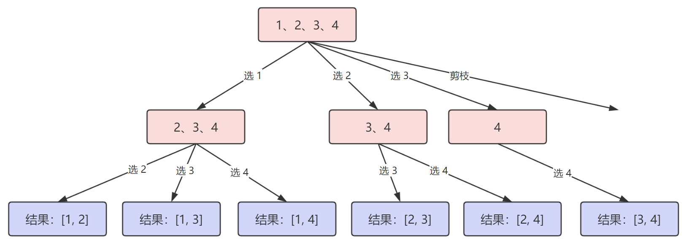

## 前言

回溯算法所解决的问题都可以抽象为「树结构」。

::: right
—— 代码随想录
:::

## 算法概要

回溯算法解决的都是在集合中递归查找子集，集合的大小构成了树的宽度，递归的深度构成了树的深度。由于递归有终止条件，所以回溯抽象的树结构一定是一棵「高度有限的 N 叉树」。

比如 [组合](https://leetcode.cn/problems/combinations/) 问题，就可以抽象为下面的树结构：



而我们在写回溯代码时，也是有一定的模版或者套路的，主要特别记住两点：

1. 递归就是「在纵向深入，进行选择」
2. 循环就是「在可选择的集合中进行横向遍历」

```java
void backtracking(参数) {
    if (终止条件) {
        存放结果;
        return;
    }
    for (选择：本层集合中元素（树中节点孩子的数量就是集合的大小）) {
        处理节点;
        backtracking(路径，选择列表); // 递归
        回溯，撤销处理结果
    }
}
```

不过，一旦题目做多了之后，可能你对递归越来越熟悉，也就可以自己随意发挥了。

## 更多题目

在 LeetCode 中，也有相当一部分回溯算法的题目，包括排列、组合、子集等，参考：[回溯题目](../test/回溯类.md)