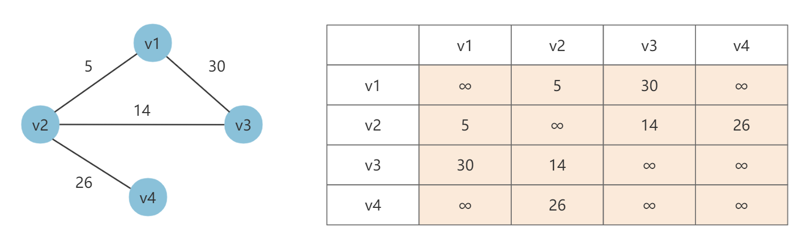
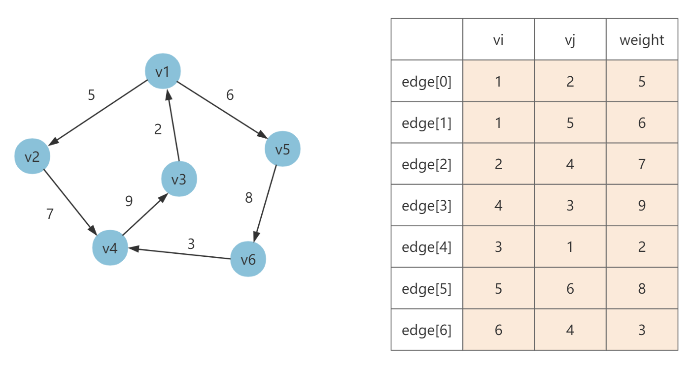
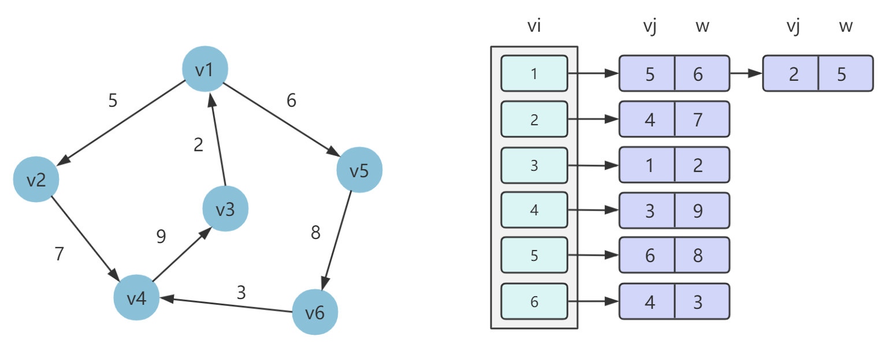
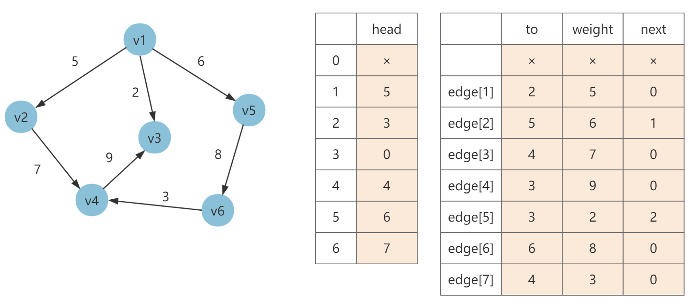
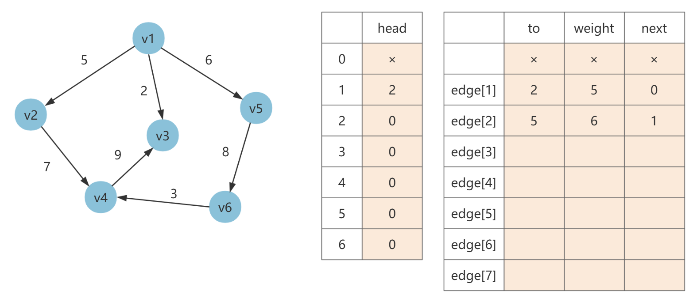
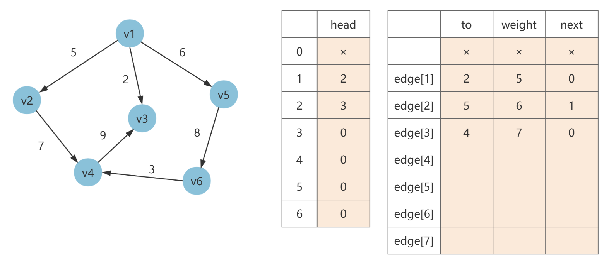
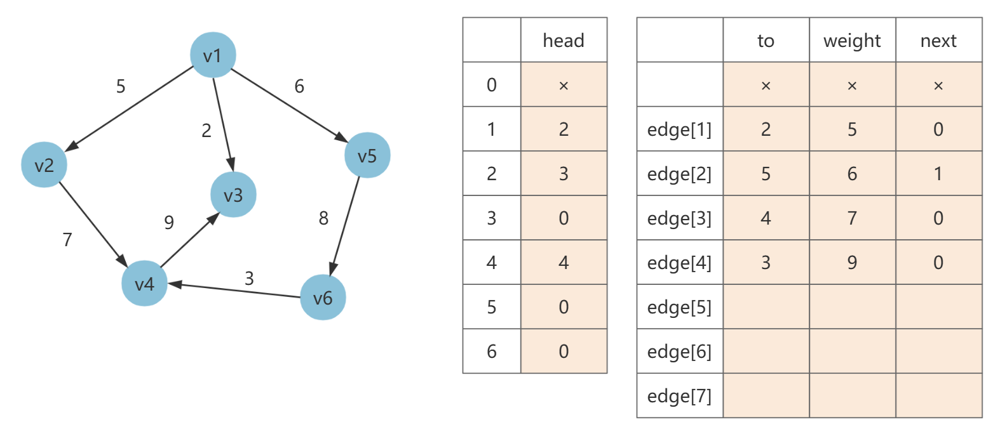
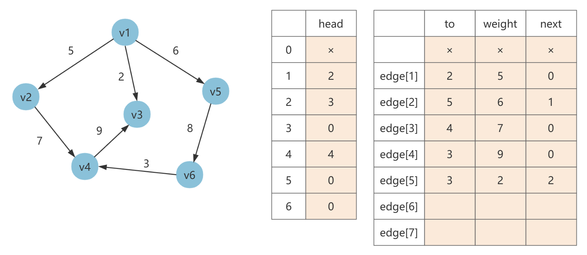
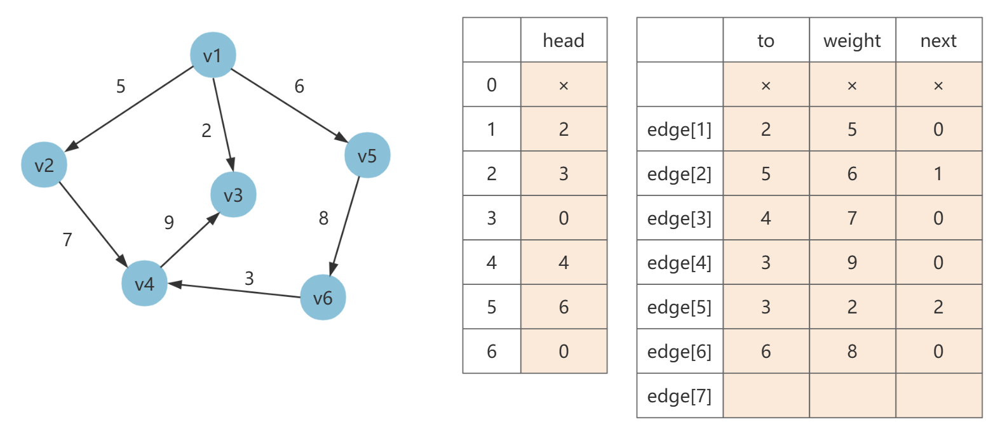

## 前言

图的结构比较复杂，需要表示顶点和边。一个图可能有任意多个（有限个）顶点，并且任何两个顶点之间都可能存在边。

在实现图的存储时，重点需要关注边与顶点之间的关联关系，这是图的存储的关键。

图的存储可以通过顺序存储结构和链式存储结构来实现，其中顺序存储结构包括 **邻接矩阵和边集数组**，链式存储结构包括 **邻接表、链式前向星、十字链表和邻接多重表**。

我们约定用 n 代表顶点数目，e 代表边数目，$d(v_i)$ 表示顶点 $v_i$ 的度。

## 邻接矩阵

**邻接矩阵** 使用一个二维数组（假设是 A）来存储顶点之间的邻接关系。

+ 对于无权图来说，如果 A[i][j] = 1，则说明顶点 $v_i$ 到 $v_j$ 存在边，如果 A[i][j] = 0，则说明顶点 $v_i$ 到 $v_j$ 不存在边。
+ 对于带权图来说，A[i][j] = w，如果 $w \neq \infty$，则说明顶点 $v_i$ 到 $v_j$ 的权值为 w。如果 $w= \infty$，则说明顶点 $v_i$ 到 $v_j$ 不存在边。

举个栗子



邻接矩阵的优点是实现简单，可以直接查询顶点 $v_i$ 和 $v_j$ 之间是否有边存在，以及边的权值。

但是初始化效率和遍历效率较低，空间开销大，空间利用率低，并且不能存储重复边，也不便于增删节点。当顶点数目过大（10^5）时，使用邻接矩阵建立一个 $n×n$ 的二维数组不太现实。

```java
/**
 * 邻接矩阵建图
 */
class Graph {

    // 最大顶点数
    static int MAXV = 11;
    // 邻接矩阵
    static int[][] graph = new int[MAXV + 1][MAXV + 1];

    static int n; // 实际顶点数

    public static void directGraph(int n, int[][] edges) {
        build(n);
        for (int[] edge : edges) {
            graph[edge[0]][edge[1]] = edge[2];
            // 如果需要创建无向图，则另外加边，如下
            // graph[edge[1]][edge[0]] = edge[2];
        }
    }

    public static void print() {
        for (int i = 1; i <= n; i++) {
            for (int j = 1; j <= n; j++) {
                System.out.print((graph[i][j] == Integer.MAX_VALUE ? "∞" : graph[i][j]) + " ");
            }
            System.out.println();
        }
    }

    private static void build(int m) {
        n = m;
        for (int i = 1; i <= n; i++) {
            for (int j = 1; j <= n; j++) {
                graph[i][j] = Integer.MAX_VALUE;
            }
        }
    }

    public static void main(String[] args) {
        int n = 4;
        int[][] edges = {{1, 2, 5}, {2, 3, 14}, {1, 3, 30}, {2, 4, 26}};
        directGraph(n, edges);
        print();
    }
}
```

## 边集数组

**边集数组** 使用数组来存储顶点之间的邻接关系。数组中每个元素都包含一条边的起点 $v_i$、终点 $v_j$ 和边的权值 weight（如果是带权图）。

举个栗子



Code 略，基本很少用。

## 邻接表

**邻接表** 使用顺序存储和链式存储相结合的存储结构来存储图的顶点和边。

它的数据结构包括两个部分，数组 + 链表，数组用来存放顶点的信息，链表用来存放邻居节点以及对应边的权值。

在邻接表的存储方法中，对图中每个顶点 $v_i$ 建立一个线性链表，把所有邻接于 $v_i$ 的顶点链接到单链表上。这样对于具有 n 个顶点的图而言，其邻接表结构由 n 个线性链表组成。

这是笔试中最常用的结构。

举个栗子



```java
import java.util.*;

/**
 * 邻接表建图
 */
class Graph {

    static List<List<int[]>> graph = new ArrayList<>();

    public static void directGraph(int n, int[][] edges) {
        build(n);
        for (int[] edge : edges) {
            // edge[0]: from 点
            // edge[1]: to 点
            // edge[2]: weight
            graph.get(edge[0]).add(new int[]{edge[1], edge[2]});
            // 如果需要创建无向图，则另外加边，如下
            // graph.get(edge[1]).add(new int[]{edge[0], edge[2]});
        }
    }

    public static void build(int n) {
        graph.clear();
        for (int i = 0; i <= n; i++) {
            graph.add(new ArrayList<>());
        }
    }

    public static void print() {
        for (int i = 0; i < graph.size(); i++) {
            System.out.printf("[%d] -> ", i);
            for (int[] arr : graph.get(i)) {
                System.out.printf("(%d, %d) -> ", arr[0], arr[1]);
            }
            System.out.println();
        }
    }

    public static void main(String[] args) {
        int n = 6;
        int[][] edges = {{1, 2, 5}, {1, 5, 6}, {3, 1, 2}, {2, 4, 7}, {4, 3, 9}, {6, 4, 3}, {5, 6, 8}};
        directGraph(n, edges);
        print();
    }
}
```

## 链式前向星

链式前向星初学可能比较难理解，相较于前面三种建图方式来说。

### 数据结构构成

链式前向星本质上就是「边集数组」和「邻接表」的结合，只是不使用动态链表，而是将指针的指向存储在了边集数组中，可以快速访问一个节点所有的邻接顶点，并且使用很少的额外空间。

链式前向星可以说是目前建图和遍历效率最高的存储方式。

链式前向星由两种数据结构组成：

+ 边集数组：edges，edges[i] 表示第 i 条边。edges[i].to 表示第 i 条边的终点，edges[i].w 表示第 i 条边的权值，edges[i].next 表示与第 i 条边同起始点的下一条边在 edges 中的存储位置（边号）。
+ 头节点数组：head，head[i] 存储以顶点 i 为起点的第 1 条边在数组 edges 中的下标。

你会发现 edges[i].to 和 edges[i].w 就是边集数组中的终点和权值，而 edges[i].next 其实就担当了邻接表中链接顶点的下一条邻边的作用。

### 如何遍历

假设点数为 n = 6，边集如下：

```java
              f  t  w
edges = [[], [1, 2, 5], [1, 5, 6], [2, 4, 7], [4, 3, 9], [1, 3, 2], [5, 6, 8], [6, 4, 3]]
```

其链式前向星建图如下：



如果需要在图中遍历顶点 $v_1$ 的所有边，步骤如下：

1. 找到顶点 $v_1$ 作为起点的第一条边在边集数组中的下标（边号），为 head[1] = 5，进而找到顶点 $v_1$ 的第一条边是 edges[5]，即 $v_1 \rightarrow v_3$，权值是 2，同时顶点 $v_1$ 的下一条边是 edges[next] 即 edges[2]。
2. 通过 edges[2] 找到 $v_1$ 的第二条邻边，即 $v_1 \rightarrow v_5$，权值是 6，顶点 $v_1$ 的下一条边是即 edges[1]。
3. 通过 edges[1] 找到 $v_1$ 的第三条邻边，即 $v_1 \rightarrow v_2$，权值是 5，此时 edges[1].next = 0 表示不存在其余的边，遍历结束。

可以看出，其实就是通过边集数组中的 next 值将一个顶点的所有邻边构成了一个逻辑上的链表。

### 如何建图

还是以上面的例子，进一步说明是如何建图的。

假设点数为 n = 6，边集如下：

```java
              f  t  w
edges = [[], [1, 2, 5], [1, 5, 6], [2, 4, 7], [4, 3, 9], [1, 3, 2], [5, 6, 8], [6, 4, 3]]
```


最初，head 数组初始化为 0。


接着开始加边，第一条边为 [1, 2, 5]，令 edge[1].next= head[1]，然后填充 to 和 weight，最后 head[1] = 1（当前边号）。



第二条边为 [1, 5, 6]，令 edge[2].next= head[1]，然后填充 to 和 weight，最后 head[1] = 2（当前边号）。



第三条边为 [2, 4, 7]，令 edge[3].next= head[2]，然后填充 to 和 weight，最后 head[2] = 3（当前边号）。



第四条边为 [4, 3, 9]，令 edge[4].next= head[4]，然后填充 to 和 weight，最后 head[2] = 4（当前边号）。



第五条边为 [1, 3, 2]，令 edge[5].next= head[1]，然后填充 to 和 weight，最后 head[1] = 5（当前边号）。



第六条边为 [5, 6, 8]，令 edge[6].next= head[5]，然后填充 to 和 weight，最后 head[5] = 6（当前边号）。


第七条边为 [6, 4, 3]，令 edge[7].next= head[6]，然后填充 to 和 weight，最后 head[6] = 7（当前边号）。 

所以总的规则就是：假设当前加的边是 `[f, t, w]`，应该加的边号来到 i，那么：

1. 当前 edges[i].next 就赋值为 head[f]，即顶点 f 的第一条边，这样相当于顶点 f 的邻边就通过 next 链接起来了。
2. 然后依次向边集数组那样赋值 to 和 weight。
3. 最后将 head[f] 的值赋值为当前的边号 i。

### 建图代码

```java
import java.util.*;

/**
 * 链式前向星建图
 */
class Graph {

    // 最大顶点数
    static int MAXV = 11;
    // 最大边数
    static int MAXE = 21;
    // head 数组
    static int[] head = new int[MAXV];
    // edges[i][0]: to
    // edges[i][1]: weight
    // edges[i][2]: next
    static int[][] edges = new int[MAXE][3];

    static int c; // 边计数
    static int n; // 实际顶点数
    static int m; // 实际边数

    public static void directGraph(int n, int[][] es) {
        build(n, es.length);
        for (int[] edge : es) {
            addEdge(edge[0], edge[1], edge[2]);
        }
    }

    public static void print() {
        for (int i = 1; i <= n; i++) {
            System.out.printf("[%d] -> ", i);
            // ei 表示边号
            // head[i] 就是顶点 i 的第一条边号
            // ei = edges[ei][2], 不断将 next 赋值给 ei，进行循环
            for (int ei = head[i]; ei > 0; ei = edges[ei][2]) {
                System.out.printf("(%d, %d) -> ", edges[ei][0], edges[ei][1]);
            }
            System.out.println();
        }
    }

    private static void addEdge(int from, int to, int weight) {
        edges[c][2] = head[from];
        edges[c][1] = weight;
        edges[c][0] = to;
        head[from] = c++;
    }

    private static void build(int p, int q) {
        n = p;
        m = q;
        // 链式前向星清空
        c = 1;
        Arrays.fill(head, 1, n + 1, 0);
    }

    public static void main(String[] args) {
        int n = 6;
        int[][] edges = {{1, 2, 5}, {1, 5, 6}, {2, 4, 7}, {4, 3, 9}, {1, 3, 2}, {5, 6, 8}, {6, 4, 3}};
        directGraph(n, edges);
        print();
    }
}
```