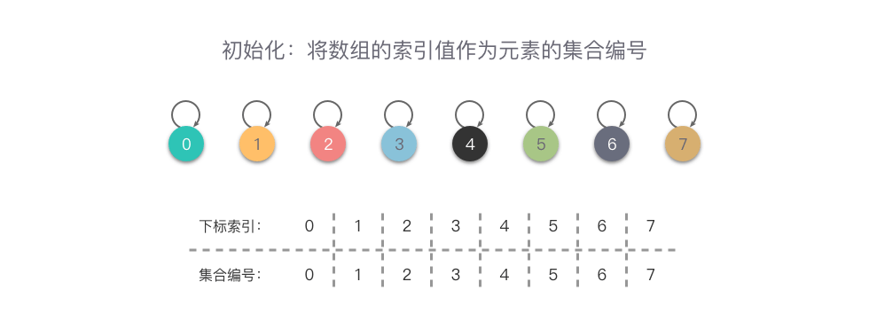
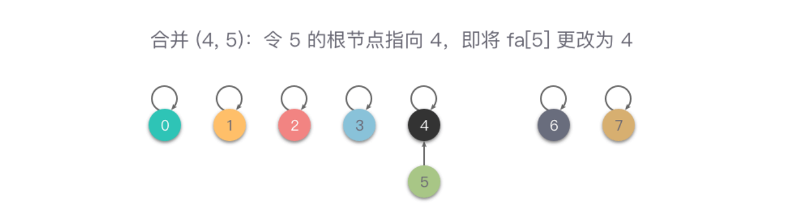
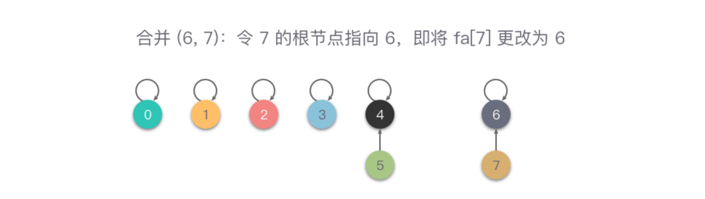
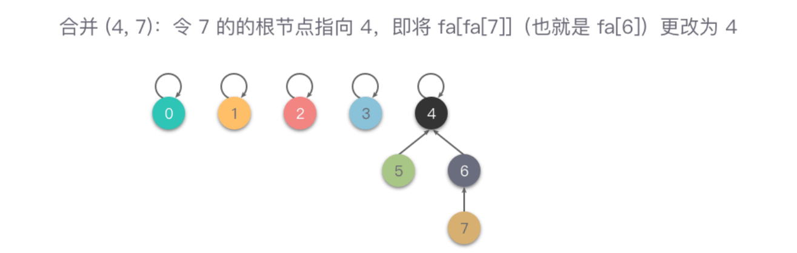
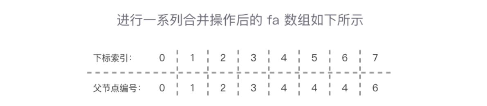
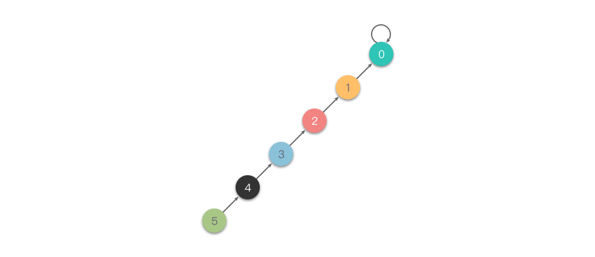
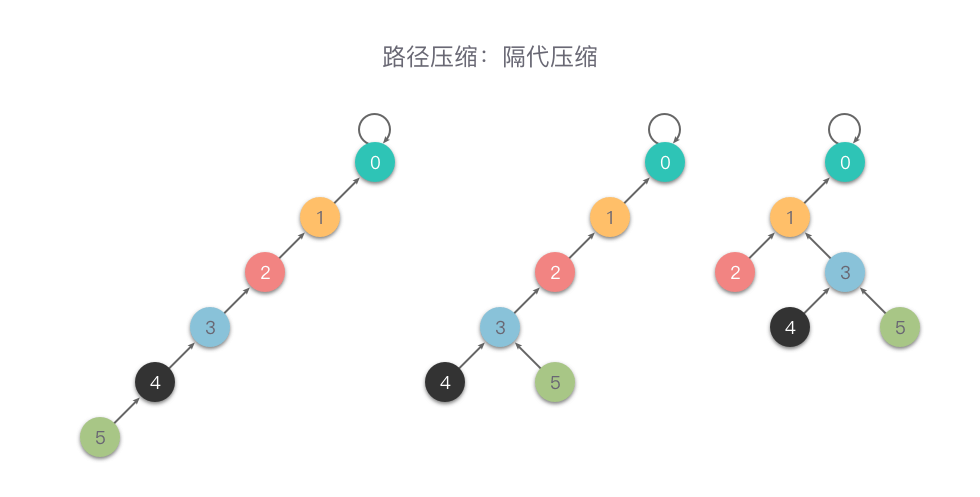
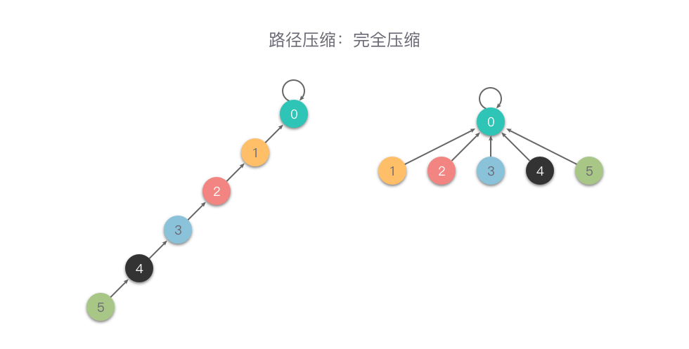
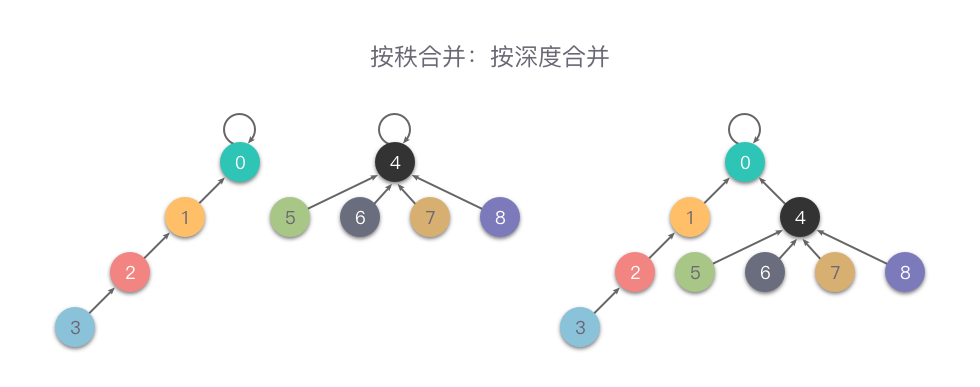
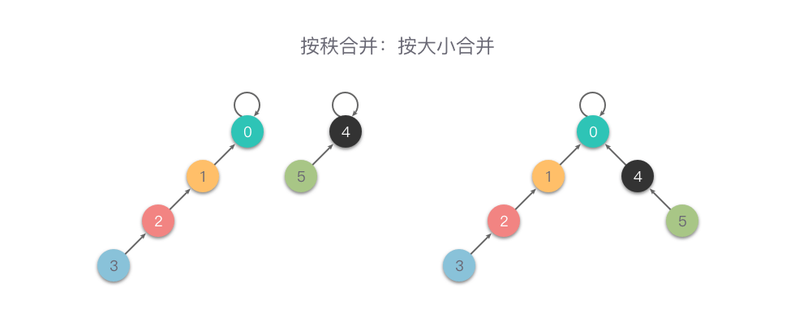

## 前言

并查集

## 简介

并查集，是一种用于处理集合 **合并与查询** 的树型数据结构，用于处理一些不交集的合并及查询问题。不交集指的是一系列没有重复元素的集合。

并查集维护了一个由多个集合组成的集合族，每个集合都由一个代表元素来标识，最初这些集合之间的元素不相交，每个元素只属于一个集合。

并查集提供了以下两个主要操作：

1. **合并（Union）**：将两个不相交的集合合并成一个大集合，通常是通过将其中一个集合的代表元素指向另一个集合的代表元素来实现。
2. **查找（Find）**：查找一个元素所属的集合，通常是返回该元素所属集合的代表元素，这个操作可以用来检查两个元素是否属于同一个集合，从而判断它们之间是否具有某种关系。

并且，在并查集中，还可以进行定制信息，比如查找并查集当前有多少个集合，以及给每个集合附带额外的信息。

## 实现

我们可以使用一个数组 fa 来记录整个并查集，fa[x] 表示 x 的父节点的集合编号，逻辑上代表着元素节点 x 指向父节点 fa[x]。

当初始化时，fa[x] 值赋值为下标索引 x，进行合并操作时，只要将两个元素的树根节点（代表元素）相连接（fa[r1] = r2）即可，而在进行查询操作时，只需要查看两个元素的树根节点（代表元素）是否一致，就能知道两个元素是否属于同一个集合。

比如下面的例子，使用数组来表示一系列集合元素 `{0}, {1}, {2}, {3}, {4}, {5}, {6}, {7}`，初始化时如下图所示，可以看出：元素的集合编号就是数组 fa 的索引值，代表着每个元素属于一个集合。



当进行一系列的合并操作后，比如 union(4, 5)、union(6, 7)、union(4, 7) 操作后变为 `{0}, {1}, {2}, {3}, {4, 5, 6, 7}`，合并操作的步骤及结果如下图所示。

从图中可以看出，在进行一系列合并操作后，fa[4] = fa[5] = fa[6] = fa[fa[7]]，即 4、5、6、7 的元素根节点编号都是 4，说明这 4 个元素同属于一个集合。







合并后的 fa 数组：



## 路径压缩

在集合很大或者树很不平衡时，使用上述思路实现并查集的代码效率很差，最坏情况下，树会退化成一条链，单次查询的时间复杂度高达 O(n)。



为了避免出现最坏情况，一个常见的优化方式是路径压缩。

**路径压缩（Path Compression）**：在从底向上查找根节点过程中，如果此时访问的节点不是根节点，则可以把这个节点尽量向上移动一下，从而减少树的层树。这个过程就叫做路径压缩。

路径压缩有两种方式：一种叫做隔代压缩，另一种叫做完全压缩。

### 隔代压缩

**隔代压缩**：在查询时，两步一压缩，一直循环执行把当前节点指向它的父亲节点的父亲节点这样的操作，从而减小树的深度。

下面是一个隔代压缩的例子。



代码实现：

```java
public int find(int x) {
    while (fa[x] != x) {
        fa[x] = fa[fa[x]];
        x = fa[x];
    }
    return x;
}
```

### 完全压缩

**完全压缩**：在查询时，把被查询的节点到根节点的路径上的所有节点的父节点设置为根节点，从而减小树的深度。

也就是说，在向上查询的同时，把在路径上的每个节点都直接连接到根上，以后查询时就能直接查询到根节点。

相比较于隔代压缩，完全压缩压缩的更加彻底。下面是一个完全压缩的例子。



代码实现：

`````java
public int find(int x) {
    return (x == fa[x]) ? x : (fa[x] = find(fa[x]));
}
`````

## 按秩合并

由于路径压缩只在查询时进行，并且只压缩一棵树上的路径，所以并查集最终的结构仍然可能是比较复杂的，为了避免这种情况，另一个优化方式是按秩合并。

**按秩合并（Union By Rank）**：指的是在每次合并操作时，都把秩较小的树根节点指向秩较大的树根节点。

这里的秩有两种定义，一种定义指的是树的深度，另一种定义指的是树的大小（即集合节点个数）。无论采用哪种定义，集合的秩都记录在树的根节点上。

### 按深度合并

**按深度合并（Unoin By Rank）**：在每次合并操作时，都把深度较小的树根节点指向深度较大的树根节点。

用一个数组 rank 记录每个根节点对应的树的深度（如果不是根节点，其 rank 值相当于以它作为根节点的子树的深度）。

初始化，所有元素的 rank 值设为 1。在合并时，比较两个根节点，把 rank 值较小的根节点指向 rank 值较大的根节点上合并。

下面是一个按深度合并的例子。



### 按大小合并

**按大小合并（Unoin By Size）**：这里的大小指的是集合节点个数，在每次合并操作时，都把集合节点个数较少的树根节点指向集合节点个数较大的树根节点。

用一个数组 size 记录每个根节点对应的集合节点个数（如果不是根节点，其 size 值相当于以它作为根节点的子树的集合节点个数）。

初始化，所有元素的 size 值设为 1。在合并操作时，比较两个根节点，把 size 值较小的根节点指向 size 值较大的根节点上合并。

下面是一个按大小合并的例子。



基于 size 的优化在某些极端情况下，仍然存在一些问题，另外基于 rank 的优化也是并查集的标准优化方式。

基于 size 的优化的问题就在于，我们希望树的高度尽量低，但是 size 小不意味着高度就低，而相较而言，rank 可以更好地衡量高度。因为这里的 rank 表示的是树的层级数量，而不是像 size 那样的节点数量。

但是实际情况是，我们一般都不进行按秩合并，仅仅进行完全压缩就行了。

## 复杂度分析

在并查集中，主要使用了数组 fa 来存储集合中的元素，如果使用了按秩合并的优化方式，还会使用数组 rank 或者数组 size 来存放权值，不难得出空间复杂度为 O(n)。

在同时使用了路径压缩和按秩合并的情况下，并查集的合并操作和查找操作的时间复杂度可以接近于 O(1) ，最坏情况下的时间复杂度是 $O(m×\alpha(n))$。这里的 m 是合并操作和查找操作的次数，$\alpha(n)$ 是 Ackerman 函数的某个反函数，其增长极其缓慢，也就是说其单次操作的平均运行时间可以认为是一个很小的常数。

所以

+ 并查集的空间复杂度：$O(n)$。
+ 并查集 m 次调用的时间复杂度：$O(m×\alpha(n))$ 或者简单理解为 $O(m)$。

## 模板代码

> - [P3367 【模板】并查集](https://www.luogu.com.cn/problem/P3367)

```java
import java.io.*;

public class Main {
    
    public static int N, M;
    public static int MAX = 10001;
    public static int[] fa = new int[MAX]; 
    public static int[] sz = new int[MAX]; // 按秩合并

    public static void main(String[] args) throws IOException {
        StreamTokenizer in = new StreamTokenizer(new BufferedReader(new InputStreamReader(System.in)));
        PrintWriter out = new PrintWriter(new OutputStreamWriter(System.out));
        while (in.nextToken() != StreamTokenizer.TT_EOF) {
            N = (int) in.nval;
            // 初始化
            build();
            in.nextToken();
            M = (int) in.nval;
            for (int i = 0; i < M; i++) {
                in.nextToken();
                int z = (int) in.nval;
                in.nextToken();
                int x = (int) in.nval;
                in.nextToken();
                int y = (int) in.nval;
                if (z == 1) union(x, y);
                if (z == 2) out.println(isSameSet(x, y) ? "Y" : "N");
            }
        }
        out.flush();
        out.close();
    }

    public static void build() {
        for (int i = 1; i <= N; i++) {
            fa[i] = i;
            sz[i] = 1;
        }
    }

    public static void union(int x, int y) {
        int rx = find(x), ry = find(y);
        if (rx == ry) return;
        if (sz[rx] > sz[y]) {
            fa[ry] = rx;
            sz[rx] += sz[ry];
        } else {
            fa[rx] = ry;
            sz[ry] += sz[rx];
        }
    }

    public static boolean isSameSet(int x, int y) {
        return find(x) == find(y);
    }

    // 隔代压缩
    public static int find(int x) {
        while (x != fa[x]) {
            fa[x] = fa[fa[x]];
            x = fa[x];
        }
        return x;
    }
}
```

最简单的、保证时间复杂度均摊在 O(1) 的写法就是进行完全压缩，但不进行按秩合并，如下：

```java
import java.io.*;

public class Main {
    
    public static int MAXN = 10001;
    public static int[] fa = new int[MAXN];
    public static int n;

    public static void main(String[] args) throws IOException {
        StreamTokenizer in = new StreamTokenizer(new BufferedReader(new InputStreamReader(System.in)));
        PrintWriter out = new PrintWriter(new OutputStreamWriter(System.out));
        while (in.nextToken() != StreamTokenizer.TT_EOF) {
            n = (int) in.nval;
            build();
            in.nextToken();
            int m = (int) in.nval;
            for (int i = 0; i < m; i++) {
                in.nextToken();
                int z = (int) in.nval;
                in.nextToken();
                int x = (int) in.nval;
                in.nextToken();
                int y = (int) in.nval;
                if (z == 1) {
                    union(x, y);
                } else {
                    out.println(isSameSet(x, y) ? "Y" : "N");
                }
            }
        }
        out.flush();
        out.close();
    }

    public static void build() {
        for (int i = 0; i <= n; i++) {
            fa[i] = i;
        }
    }

    public static int find(int x) {
        return (x == fa[x]) ? x : (fa[x] = find(fa[x]));
    }

    public static void union(int x, int y) {
        fa[find(x)] = find(y);
    }

    public static boolean isSameSet(int x, int y) {
        return find(x) == find(y);
    }
}
```

## 更多题目

参考：[并查集](../test/并查集.md)