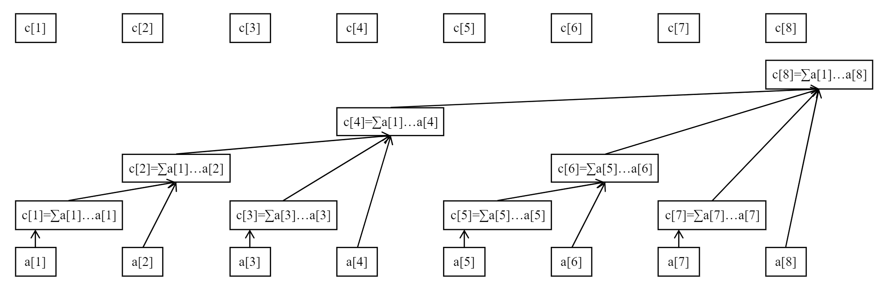

## 前言

树状数组 Binary Indexed Tree，又因为其发明者被命名为 Fenwick 树。

## 简介

树状数组，一般用于维护一些可差分的信息，比如累加和、累乘积等。

那么什么叫可差分信息呢？常见的包括累加和、累乘积、异或和 ……。

对于累加和来说，一个序列 a，如果你已经知道 a[1...10]、a[1...5] 的累加和，那么你就可以求出 a[6...10] 的累加和，对于累乘积、异或和也是如此。

这里我们重点强调一下异或和，由于两个相同的数异或的结果是 0，所以 xor(l, r) = xor(1, r) ^ xor(1, l - 1)。

比如 xor(1, 5) = 1 ^ 2 ^ 3 ^ 4 ^ 5，而 xor(1, 2) = 1 ^ 2，那么显然 xor(3, 5) = 3 ^ 4 ^ 5 = xor(1, 5) ^ xor(1, 2)。

像最大值、最小值、除此之外的很多信息都是不可差分的。

对于这些不可差分的信息，我们可以选择线段树来维护，它的思考难度更低。

我们下面的例子都是以累加和作为维护的信息来说明的，它能够在 O(logn) 时间复杂度内得到任意前缀和、区间和，并且支持 O(logn) 级别的单点修改。

事实上，树状数组能解决的问题是线段树能解决的问题的子集：树状数组能做的，线段树一定能做，但是线段树能做的，树状数组不一定可以。

然而，树状数组的代码要远比线段树简洁，并且常数时间也更小，而且对于更高维的数组，其代码也易修改。

## 区间查询

举个例子，如果要求出序列 a[1...7] 的累加和，可以怎么做？

一个简单的方式就是计算 a[1] + …… + a[7]，那如果此时已经知道了 a[1...4] 的累加和为 x，a[5...6] 的累加和为 y，a[7...7] 的累加和为 z，那么 a[1...7] 的累加和就是 x + y + z。

这是显而易见的。

其实这也就是树状数组能够在 logn 级别求解问题的原因，它总能将一段前缀 [1...n] 拆分为不多于 logn 段区间，同时我们假设这些区间的信息是已知的，那么我们只需要整合这些区间的信息即可。

下面是一个树状数组的例子：



图中的 a 数组就是原始数组，而 c 数组就是树状数组。

从图中可以看出：

+ c[8] 维护了 a[1...8] 的累加和
+ c[6] 维护了 a[5...6] 的累加和
+ c[4] 维护了 a[1...4] 的累加和
+ c[2] 维护了 a[1...2] 的累加和
+ 剩余的 c[x] 都是维护 a[x...x] 的累加和

这样维护之后，如何计算 a[1...7] 的累加和？

实际上，我们可以在树状数组中从最后一个位置开始往前跳，每跳到一个位置 x，就累加对应的 c[x]。

以上面的例子来说，从 c[7] 开始往前跳，下一跳到 c[6]，下一跳到 c[4]，沿途累加跳到位置的值，所以就可以得到 c[7] + c[6] + c[4]，再转换为各个位置维护的原始数组的累加和，就是 a[7...7] + a[5...6] + a[1...4]，这不就是 a[1...7] 吗。

如果要求 a[1...n] 的累加和，那么只需要从 n 往前跳最多 logn 步，所以时间复杂度会控制在 O(logn)。

一旦我们可以快速的求出 a[1...n] 的累加和，那么 a[x...n] 的累加和也变得容易了，就是前缀和作差即可。

+ a[x...y] 的累加和 = a[1...y] 的累加和 - a[1...x-1] 的累加和

## 管辖区间

我们上面一顿噼里啪啦的输出，但是一直没有解释一个最关键的问题，那就是我怎么知道往前跳到哪？

我们不妨定义出一个管辖区间的概念。

还是以上面的例子来说，

+ c[8] 管辖了 a[1...8]
+ c[6] 管辖了 a[5...6]
+ c[4] 管辖了 a[1...4]
+ c[2] 管辖了 a[1...2]
+ 剩余的 c[x] 都是管辖自己

我们多观察观察，就可以发现下面的规律（可能也发现不了，就直接看吧）

+ c[x] 管辖的一定是一段右边界为 x 的区间
+ c[x] 管辖的区间长度 len 是有迹可循的，len 其实就是 x 二进制中最右边的 1（不信你自己试试）
+ 那么 c[x] 管辖的区间我们就可以确定了，就是 a[x - len + 1, x]

举两个例子吧：

+ c[8] 管辖的区间：8 的二进制为 1000，最右边的 1 表示的数就是 8，所以 c[8] 管辖的区间长度是 8，即 a[1...8]
+ c[88] 管辖的区间：88 的二进制为 01011000，最右边的 1 表示的数也是 8，所以 c[88] 管辖的区间长度是 8，即 a[81...88]

最后，求 x 二进制最右边的 1 的方法，如下

```java
// 获取 x 最右侧的 1
public static int lowbit(int x) {
    return x & -x;
}
```

有了管辖区间，那么每一个位置往前跳时，就需要跳到它自己的管辖区间的上一个位置，比如 c[7] 管辖区间是 a[7...7]，所以它跳到 c[6]，c[6] 管辖的区间是 a[5...6]，所以它跳到 c[4]，c[4] 管辖的区间是 a[1...4]，到 1 了就可以停下来了。

那么区间查询的代码就显而易见了：

```java
// 返回 1 ~ i 范围的累加和
public static int sum(int i) {
    int sum = 0;
    while (i > 0) {
        sum += tree[i];
        i -= lowbit(i);
    }
    return sum;
}
```

## 单点增加

我们在原数组进行单点增加是很简单的，但是树状数组中关键在于如何在单点增加时也维护树状数组的信息。

因为修改原数组可能会导致树状数组的多个位置发生变化。


比如上图中对 a[1] 进行单点增加，其实需要对 c[1]、c[2]、c[4]、c[8] 都进行增加。

其实一句话总结就是，一旦对 a[x] 修改，那么树状数组中管辖 a[x] 的位置都会涉及到修改。

所以当修改了 a[x]，那么在树状数组中，从 c[x] 开始不断往上跳，直到跳出了树状数组的范围。

那么如果根据 c[x] 跳到它的父亲 c[p] 呢？

+ p = x + lowbit(x)，这就是规律，要么你记住，要么你理解记住。

还是举两个例子：

+ c[2] 的父亲：2 + lowbit(2)，就是 4，即 c[2] 往上跳是 c[4]
+ c[4] 的父亲：4 + lowbit(4)，就是 8，即 c[4] 往上跳是 c[8]

所以单点增加的代码也就显而易见了：

```java
// 位置 i 增加 x
public static void add(int i, int v) {
    while (i <= n) {
        tree[i] += v;
        i += lowbit(i);
    }
}
```

从任意一个位置开始往上跳，最多跳 logn 步就能到右边界，所以单点增加的时间复杂度也是 O(logn)。

## 高维延伸

树状数组从一维扩展到高维是很容易的，实际上就是一个套娃的过程，一个二维树状数组的关键的代码如下：

```java
public int lowbit(int i) {
    return i & -i;
}

public void add(int x, int y, int v) {
    for (int i = x; i <= n; i += lowbit(i)) {
        for (int j = y; j <= m; j += lowbit(j)) {
            tree[i][j] += v;
        }
    }
}

// 求 (1, 1) 到 (x, y) 这个部分的累加和
public int sum(int x, int y) {
    int ans = 0;
    for (int i = x; i > 0; i -= lowbit(i)) {
        for (int j = y; j > 0; j -= lowbit(j)) {
            ans += tree[i][j];
        }
    }
    return ans;
}
```

## 一些延伸

经典的树状数组可以在 O(logn) 时间复杂度内进行范围累加查询和单点增加，如果我们设定树状数组维护差分信息呢？

这其实就可以转变为在 O(logn) 时间复杂度内进行范围增加和单点查询，下面会给出模板代码。

## 模板代码

### 单点增加、范围查询

> [https://www.luogu.com.cn/problem/P3374](https://www.luogu.com.cn/problem/P3374)

```java
import java.io.*;

/**
 * 树状数组单点增加、范围查询模板
 */
public class Main {

    static int MAXN = 500001;
    static int[] tree = new int[MAXN];
    static int n, m;

    public static void main(String[] args) throws IOException {
        BufferedReader br = new BufferedReader(new InputStreamReader(System.in));
        StreamTokenizer in = new StreamTokenizer(br);
        PrintWriter out = new PrintWriter(new OutputStreamWriter(System.out));
        in.nextToken();
        n = (int) in.nval;
        in.nextToken();
        m = (int) in.nval;
        for (int i = 1, v; i <= n; i++) {
            in.nextToken();
            v = (int) in.nval;
            add(i, v);
        }
        for (int i = 1, a, b, c; i <= m; i++) {
            in.nextToken();
            a = (int) in.nval;
            in.nextToken();
            b = (int) in.nval;
            in.nextToken();
            c = (int) in.nval;
            if (a == 1) {
                add(b, c);
            } else {
                out.println(range(b, c));
            }
        }
        out.flush();
        out.close();
        br.close();
    }

    // 获取 x 最右侧的 1
    public static int lowbit(int x) {
        return x & -x;
    }

    // 位置 i 增加 x
    public static void add(int i, int v) {
        while (i <= n) {
            tree[i] += v;
            i += lowbit(i);
        }
    }

    // 返回 1 ~ i 范围的累加和
    public static int sum(int i) {
        int sum = 0;
        while (i > 0) {
            sum += tree[i];
            i -= lowbit(i);
        }
        return sum;
    }

    // 返回 l ~ r 范围的累加和
    public static int range(int l, int r) {
        return sum(r) - sum(l - 1);
    }
}
```

### 范围增加、单点查询

> [https://www.luogu.com.cn/problem/P3368](https://www.luogu.com.cn/problem/P3368)

```java
import java.io.*;

/**
 * 树状数组范围增加、单点查询模板
 */
public class Main {

    static int MAXN = 500002;
    static int[] tree = new int[MAXN]; // 树状数组维护原数组的差分信息
    static int n, m;

    public static void main(String[] args) throws IOException {
        BufferedReader br = new BufferedReader(new InputStreamReader(System.in));
        StreamTokenizer in = new StreamTokenizer(br);
        PrintWriter out = new PrintWriter(new OutputStreamWriter(System.out));
        in.nextToken();
        n = (int) in.nval;
        in.nextToken();
        m = (int) in.nval;
        for (int i = 1, v; i <= n; i++) {
            in.nextToken();
            v = (int) in.nval;
            add(i, v);
            add(i + 1, -v);
        }
        for (int i = 1; i <= m; i++) {
            in.nextToken();
            int op = (int) in.nval;
            if (op == 1) {
                in.nextToken();
                int l = (int) in.nval;
                in.nextToken();
                int r = (int) in.nval;
                in.nextToken();
                int v = (int) in.nval;
                add(l, v);
                add(r + 1, -v);
            } else {
                in.nextToken();
                int index = (int) in.nval;
                out.println(sum(index));
            }
        }
        out.flush();
        out.close();
        br.close();
    }

    // 获取 x 最右侧的 1
    public static int lowbit(int x) {
        return x & -x;
    }

    // 位置 i 增加 x
    public static void add(int i, int v) {
        while (i <= n) {
            tree[i] += v;
            i += lowbit(i);
        }
    }

    // 返回 1 ~ i 范围的累加和
    public static int sum(int i) {
        int sum = 0;
        while (i > 0) {
            sum += tree[i];
            i -= lowbit(i);
        }
        return sum;
    }
}
```

## 更多题目

参考：[树状数组](../test/树状数组.md)
