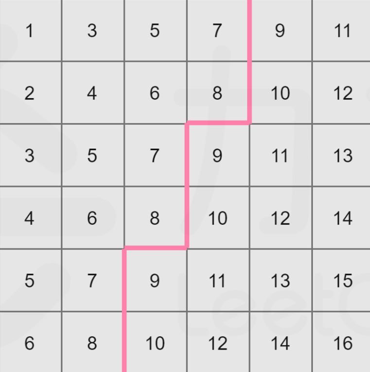

## 前言

二分搜索类题目：
+ 二分答案法应用
+ LeetCode 轮转数组类题目

## 二分答案法

所谓二分答案法，就是估计最终答案可能的范围，这个范围初步可以定的粗略一些，反正后续求解会使用二分搜索，其实也二分不了几次。

其次是分析问题的答案和给定条件之间的单调性，大部分时候只需要用到自然智慧。

建立一个 f 函数，当有一个备选答案的情况下，判断给定的条件是否达标。

在最终答案可能的范围上不断二分搜索，每次二分的中点都用 f 函数判断，直到二分结束，找到最合适的答案。

**核心点：分析单调性、建立 f 函数**

### 爱吃香蕉的珂珂

> [875. 爱吃香蕉的珂珂](https://leetcode.cn/problems/koko-eating-bananas/)

首先，题目求解的最小速度 k 的取值是存在一个范围的，由于 piles[i] ≥ 1，所以 k 至少为 1，而 k 的最大值其实就是整个 piles 数组的最大值 max，因为如果 k > max，是不能吃下一堆香蕉的，必须要等待，所以 k 没有必要更大。

所以 k 的范围可以确定为：1 ~ max。

同时，随着 k 的增大，吃完全部香蕉的时间要么不变，要么减少，这是显而易见的，所以 k 和吃完香蕉的时间是存在单调性的，这是可以进行二分的基础。

到这里，还有一个关键点在于，如何判断 k 为具体某个值时是否满足题意。

对于本题目来说，如何判断 k 为某个值是是否满足题意，其实就是每一个位置的香蕉数除以 k 向上取整的商进行累加看是否 < h。

这里向上取整的写法：

+ num1 和 num2 是非负整数
+ 如果是 num1 / num2，这在计算机里面是向下取整
+ 如果要向上取整，请写为 (num1 + num2 - 1) / num2

```java
class Solution {
    public int minEatingSpeed(int[] piles, int h) {
        int max = 0;
        for (int pile : piles) {
            max = Math.max(max, pile);
        }
        int res = -1;
        int l = 1, r = max, m;
        while (l <= r) {
            m = l + r >> 1;
            if (f(piles, h, m)) {
                r = m - 1;
                res = m;
            } else {
                l = m + 1;
            }
        }
        return res;
    }

    // 判断在 k = speed 的情况下，是否可以在 h 小时内吃完
    public boolean f(int[] piles, int h, int speed) {
        int need = 0;
        for (int pile : piles) {
            // pile / speed 的向上取整写法
            // 务必记住
            need += (pile + speed - 1) / speed;
            if (need > h) {
                return false;
            }
        }
        return need <= h;
    }
}
```

### 分割数组的最大值

> + [410. 分割数组的最大值](https://leetcode.cn/problems/split-array-largest-sum/)
> + [画匠问题](https://www.nowcoder.com/questionTerminal/767778ca5b38446cba801820df11399d)

这道题目本质就是在求划分出来的这 k 个非空连续子数组中，最大的累加和的最小值，我们记为 ans。

那么 ans 最大值为整个数组的累加和，这是毋庸置疑的，因为需要将原数组划分为非空的子数组，所以 ans 的最小值是原数组的最小值。

那么 ans 的范围就是：min ~ sum，sum 表示整个数组的累加和，min 表示原数组的最小值。

我们给定一个函数 f，可以求出在数组 nums 上进行划分，需要满足划分后的各个子数组各自累加和的最大值为 limit 的情况下，至少需要划分为多少个子数组。

再次描述 limiit：对 nums 数组进行划分，得到 n 个子数组，这 n 个子数组各自的累加和的最大值为 limit。

随着 limit 的增大，子数组的长度一定要增大，划分的子数组数量要么不变，要么减少，这就是一个单调性。

所以，我们在 min ~ sum 上进行二分，根据 f 函数求出至少需要划分为 n 个子数组才能满足这 n 个子数组的累加和的最大值为 limit，若 n ≤ k，说明还需要继续划分，limit 要减小，继续向左二分，否则向右二分。

```java
class Solution {
    public int splitArray(int[] nums, int k) {
        int sum = 0, min = Integer.MAX_VALUE;
        for (int num : nums) {
            sum += num;
            min = Math.min(min, num);
        }
        int ans = -1;
        int l = min, r = sum, m;
        while (l <= r) {
            m = l + r >> 1;
            if (f(nums, m, k)) {
                r = m - 1;
                ans = m;
            } else {
                l = m + 1;
            }
        }
        return ans;
    }

    // 在 nums 上进行划分，每个子数组的累加和 <= limit 时可以划分出的子数组的个数 n 是否 <= k
    public boolean f(int[] nums, int limit, int k) {
        int n = 1, tmp = 0;
        for (int num : nums) {
            if (num > limit) {
                // 不能划分出子数组
                return false;
            }
            if (tmp + num > limit) {
                n++;
                tmp = num;
            } else {
                tmp += num;
            }
        }
        return n <= k;
    }
}
```

### 机器人跳跃问题

> [机器人跳跃问题](https://www.nowcoder.com/practice/7037a3d57bbd4336856b8e16a9cafd71)

首先这道题求最少单位的初始能量，我们不妨想一下初始能量的范围。

毋庸置疑的是初始能量最少可以是 1（H 数组全为 1 的情况），至于初始能量的最大值为 H 数组的最大值，这样的话，每遇到 H 数组中的一个元素，能量值都会增加，最后肯定可以保证完成游戏。

所以，初始能量的范围为 1 ~ max。

所以我们在 1 ~ max 上进行二分，对二分的每一个值，都判断是否可以完成游戏，这实际上也是存在单调性的，如果值 k 可以完成游戏，那么对于 k + 1、k + 2 等一定也是可以完成游戏的。

最后就是定义一个 f 函数，表示当初始能量为 Init 时，是否可以保证完成游戏。

```java
import java.io.*;

public class Main {
    public static int MAXN = 100001;
    public static int[] H = new int[MAXN];
    public static int n = 0;

    public static void main(String[] args) throws IOException {
        StreamTokenizer in = new StreamTokenizer(new BufferedReader(new InputStreamReader(System.in)));
        PrintWriter out = new PrintWriter(new OutputStreamWriter(System.out));
        while (in.nextToken() != StreamTokenizer.TT_EOF) {
            n = (int) in.nval;
            int l = 1;
            // r 也是最大值
            int r = 0;
            for (int i = 0; i < n; i++) {
                in.nextToken();
                H[i] = (int) in.nval;
                r = Math.max(r, H[i]);
            }
            out.println(binary(l, r, r));
        }
        out.flush();
        out.close();
    }

    private static int binary(int l, int r, int max) {
        int mid;
        int ans = -1;
        while (l <= r) {
            mid = l + r >> 1;
            if (check(mid, max)) {
                ans = mid;
                r = mid - 1;
            } else {
                l = mid + 1;
            }
        }
        return ans;
    }

    // 初始能量为 init 是否可以完成游戏，这里 max 主要是为了防止溢出
    public static boolean check(int init, int max) {
        for (int i = 0; i < n; i++) {
            if (init > H[i]) {
                init += (init - H[i]);
                // 如果 init 很大，那么后续能量的增长可能是指数级别的
                // 所以，一旦 init > max 则直接返回
                if (init > max) return true;
            } else {
                init -= (H[i] - init);
                if (init < 0) return false;
            }
        }
        return true;
    }
}
```

### 找出第 K 小的数对距离

> [719. 找出第 K 小的数对距离](https://leetcode.cn/problems/find-k-th-smallest-pair-distance/)

题目是求数对距离，我们不妨看看一个普遍数组中所有的数对距离可能的范围。

首先最小肯定是 0，那么最大的数对距离就是数组中的最大值 - 最小值。

所以数对距离的范围是：0 ~ max - min

定义一个 f 函数，可以求出数对距离为 dis 的情况下，数组中有多少组数对，其数对距离 ≤ dis。

显然，当 dis 增大，那么数组中符合条件的数对数量要么不变，要么增大。

所以不妨对数对距离 dis 在 0 ~ max - min 进行二分，根据 f 函数求出数对距离为 dis 的情况下，数组中有 n 组数对，其数对距离 ≤ dis，若 n ≥ k 则记录 ans 并向左二分，反之，向右二分。

最后，f 函数可以使用滑动窗口，但先决条件是数组有序，所以我们先对数组排序。

题解代码：

```java
import java.util.Arrays;

class Solution {
    public int smallestDistancePair(int[] nums, int k) {
        Arrays.sort(nums);
        int n = nums.length;
        int l = 0, r = nums[n - 1] - nums[0], mid;
        int ans = -1;
        while (l <= r) {
            mid = l + r >> 1;
            if (count(nums, mid) > k) {
                ans = mid;
                r = mid - 1;
            } else {
                l = mid + 1;
            }
        }
        return ans;
    }

    private int count(int[] nums, int dis) {
        int ans = 0;
        for (int winl = 0, winr = 0; winl < nums.length; winl++) {
            while (winr + 1 < nums.length && nums[winr + 1] - nums[winl] <= dis) {
                winr++;
            }
            ans += winr - winl;
        }
        return ans;
    }
}
```

### 同时运行 N 台电脑的最长时间

> [2141. 同时运行 N 台电脑的最长时间](https://leetcode.cn/problems/maximum-running-time-of-n-computers/)

假设需要让这 n 台电脑运行 m 分钟，两个结论：

1. 电池数组 batteries 中，元素值大于 m 的电池在整个供电的过程中为一台电脑供电就可以了。
2. 对于全是碎片电池的电池数组（所谓碎片电池就是电量 batteries[i] ＜ m），如果碎片电池的累加和 ≥ m * n，那么这些碎片电池一定可以使得这 n 台电脑运行 m 分钟。（通过辗转腾挪一定可以做到）。

结合第 1、2 点，对于一个普遍的电池数组，首先非碎片电池可以在 m 时间内各自运行一台电脑，剩余的非碎片电池再进行辗转腾挪看是否可以运行剩下的电脑。

举个例子：

电池数组为 `[3, 4, 10, 12, 7, 8, 10, 9]`，问需要使用这些电池在 6 台电脑上运行 10 分钟，是否可行？

+ 首先 2、3、6 号电池可以各自运行一台电脑，也就是 3 台电脑。
+ 剩余的碎片电池的累加和为  31，是大于 `10 * 3` 的，所以一定可以满足要求，是可行的。

接下来就是二分答案法的使用。

题目求这 n 台电脑运行的分钟数，那么它的最小值是 0，最大值是 batteries 数组的累加和（比如只有 1 台电脑）。

对于函数 f，其实就是我们上面的所说的，是否可以让这 n 台电脑运行 m 分钟。

显然，单调性是运行的分钟数越多，就更难达成目标。

所以，在 0 ~ sum 上进行二分，根据 f 判断是否可以让 n 台电脑运行 mid 分钟，如果可以，那么记录答案，继续向右二分，否则向左二分。

题解代码：

```java
class Solution {
    public long maxRunTime(int n, int[] batteries) {
        long sum = 0;
        for (int battery : batteries) {
            sum += battery;
        }
        long l = 0, r = sum, mid;
        long ans = -1;
        while (l <= r) {
            mid = l + r >> 1;
            if (canRun(batteries, n, mid)) {
                ans = mid;
                l = mid + 1;
            } else {
                r = mid - 1;
            }
        }
        return ans;
    }

    // 给定电池数组，是否可以让 n 台电脑运行 time 分钟
    private boolean canRun(int[] batteries, int n, long time) {
        // 碎片电池的累加和
        long sum = 0;
        for (int battery : batteries) {
            if (battery > time) {
                n--;
            } else {
                sum += battery;
            }
        }
        return sum >= (long) n * time;
    }
}
```

一个小的贪心如下：

```java
class Solution {

    public long maxRunTime(int n, int[] batteries) {
        long sum = 0;
        int max = 0;
        for (int battery : batteries) {
            sum += battery;
            max = Math.max(max, battery);
        }
        if (sum > (long) max * n) {
            // 所有电池的最大电量是 max，若此时 sum > (long) max * n
            // 表示最终的供电时间一定 >= max，而如果最终的供电时间 >= max，那么所有的电池都是碎片电池
            // 那么尽可能大的供电时间就是 sum / n
            return sum / n;
        }
        // 到这里，最终的供电时间一定是 < max，那么范围右边界得到优化
        int l = 0, r = max, mid;
        int ans = 0;
        while (l <= r) {
            mid = l + r >> 1;
            if (canRun(batteries, n, mid)) {
                ans = mid;
                l = mid + 1;
            } else {
                r = mid - 1;
            }
        }
        return ans;
    }

    // 给定电池数组，是否可以让 n 台电脑运行 time 分钟
    private boolean canRun(int[] batteries, int n, int time) {
        // 碎片电池的累加和
        long sum = 0;
        for (int battery : batteries) {
            if (battery > time) {
                n--;
            } else {
                sum += battery;
            }
        }
        return sum >= (long) n * time;
    }
}
```

### 在 D 天内送达包裹的能力

> [1011. 在 D 天内送达包裹的能力](https://leetcode.cn/problems/capacity-to-ship-packages-within-d-days/)

我们考虑在 days 天内将传送带上的所有包裹送达的船的最低运载能力，其最小值是 weight 数组的最大值，最大值是 weight 数组的累加和。

所以最低运载能力的范围：max ~ sum

考虑函数 f 为在运载能力为 pow 的情况下，将包裹运完至少需要多少天。

显然，pow 越大，包裹运完需要的天数要么不变，要么减少，这就是单调性。

所以，我们考虑在 max ~ sum 进行二分，每一次的 mid 值通过 f 函数求出至少需要 n 天，若 n ≤ days，则记录 ans 并继续向左二分，否则向右二分。

题解代码：

```java
class Solution {
    public int shipWithinDays(int[] weights, int days) {
        int sum = 0, max = 0;
        for (int weight : weights) {
            sum += weight;
            max = Math.max(max, weight);
        }
        int l = max, r = sum, mid;
        int ans = -1;
        while (l <= r) {
            mid = l + r >> 1;
            if (leastDays(weights, mid) <= days) {
                ans = mid;
                r = mid - 1;
            } else {
                l = mid + 1;
            }
        }
        return ans;
    }

    private int leastDays(int[] weights, int pow) {
        int ans = 0;
        int i = 0;
        while (i < weights.length) {
            if (pow < weights[i]) {
                return Integer.MAX_VALUE;
            }
            int sum = 0;
            while (i < weights.length && sum + weights[i] <= pow) {
                sum += weights[i++];
            }
            ans++;
        }
        return ans;
    }
}
```

### 制作 m 束花所需的最少天数

> [1482. 制作 m 束花所需的最少天数](https://leetcode.cn/problems/minimum-number-of-days-to-make-m-bouquets/)

根据题意，要求摘 m 束花等待的最少时间，我们不妨看看摘 m 束花等待的时间的范围。

首先最小值，由于 m 最小为 1，所以摘 m 束花等待的时间最小为 1，对于最大值，存在结果的情况下，最大值为 bloomDay 数组的最大值，到这个时候，所有的花都可以使用了，必然满足。

接下来考虑函数 f，f 表示在等待时间为 waitTime，可以摘的花的数量。

对于单调性来说，一旦等待时间 waitTime 增大，那么必然摘的花的数量要么不变，要么增大，这就是单调关系。

所以，我们可以在 1 ~ max 的范围内进行二分，根据 f 求出在等待时间为 mid 时可以摘的花的数量 n，若 n ≥ m，那么记录 ans，并继续向左进行二分，反之，继续向右进行二分。

题解代码：

```java
class Solution {
    public int minDays(int[] bloomDay, int m, int k) {
        if (m * k > bloomDay.length) return -1;
        int max = 0;
        for (int num : bloomDay) {
            max = Math.max(max, num);
        }
        int l = 1, r = max, mid;
        int ans = -1;
        while (l <= r) {
            mid = l + r >> 1;
            if (getFlowers(bloomDay, mid, k) >= m) {
                ans = mid;
                r = mid - 1;
            } else {
                l = mid + 1;
            }
        }
        return ans;
    }

    // 在 waitTime 时间内可以采摘的花束的数量，滑动窗口
    private int getFlowers(int[] bloomDay, int waitTime, int k) {
        int ans = 0;
        for (int winl = 0, winr = 0; winr < bloomDay.length; winr++) {
            while (winr < bloomDay.length && bloomDay[winr] <= waitTime) {
                winr++;
            }
            ans += (winr - winl) / k;
            winl = winr + 1;
        }
        return ans;
    }
}
```

### H 指数 II

> [275. H 指数 II](https://leetcode.cn/problems/h-index-ii/)

对于 h 指数来说，其最小值是 0，比如研究者的所有论文都被引用了 0 次，最大值是 citations 数组的长度，毕竟该研究者只有 citations.length 篇论文。

所以，h 指数的范围是：0 ~ citations.length

对于 f 函数来说，f 表示 h 指数为 p 的情况下，判断是否有 p 篇文献被引用的次数为 p，由于数组已经是升序，那么 f 函数可以通过$ O(1) $的时间复杂度得到。

显然，h 指数越小，f 函数越容易得到满足，这也就是一种单调性。

所以，我们在 0 ~ citations.length 范围内进行二分，如果 h 指数为 mid 的情况下，已经满足条件（f 函数返回 true），那么记录 ans，继续向右二分，反之，向左二分。

```java
class Solution {
    public int hIndex(int[] citations) {
        int l = 0, r = citations.length, mid;
        int ans = -1;
        while (l <= r) {
            mid = l + r >> 1;
            if (check(citations, mid)) {
                ans = mid;
                l = mid + 1;
            } else {
                r = mid - 1;
            }
        }
        return ans;
    }

    // 判断是否有 p 篇文献被引用的次数为 p
    private boolean check(int[] citations, int p) {
        if (p == 0) return citations.length > 0;
        return citations[citations.length - p] >= p;
    }
}
```

### 乘法表中第 k 小的数

> [668. 乘法表中第 k 小的数](https://leetcode.cn/problems/kth-smallest-number-in-multiplication-table/)

题目求乘法表中的数字，显然数字的范围是在 1 ~ m * n。

所以我们定义函数 f，表示为给定一个值 num，求 num 是第几小的数字，或者说，num 前面有几个数比它小（这里是相对于乘法表中的元素来说）。

显然，值越大，那么前面比它小的数就越多，这就是单调性。

所以，在 1 ~ m * n 范围上进行二分，根据函数 f 求出二分中点是第 m 小的数字，若 m ≥ k 则记录 ans，继续向左二分，否则向右二分。

那么本题的关键其实在于函数 f 如何编写？

我们可以遍历乘法表的每一行，对于乘法表的第 i 行，其数字均为 i 的倍数，因此不超过 num 的数字有 min(num / i, n) 个，所以整个乘法表中不超过 num 的数字个数为 $\sum^m_{i=1}min(x/i,n)$。

题解代码：

```java
class Solution {
    public int findKthNumber(int m, int n, int k) {
        int l = 1, r = m * n, mid;
        int ans = 0;
        while (l <= r) {
            mid = l + r >> 1;
            if (getRank(mid, m, n) >= k) {
                ans = mid;
                r = mid - 1;
            } else {
                l = mid + 1;
            }
        }
        return ans;
    }

    private int getRank(int num, int m, int n) {
        int ans = 0;
        for (int i = 1; i <= m; i++) {
            ans += Math.min(num / i, n);
        }
        return ans;
    }
}
```

### 有序矩阵中第 K 小的元素

> [378. 有序矩阵中第 K 小的元素](https://leetcode.cn/problems/kth-smallest-element-in-a-sorted-matrix/)

题目要求第 k 小的元素，显然结果的范围在 `matrix[0][0] ~ matrix[n - 1][n - 1]` 中。

所以我们定义函数 f，表示给定一个数 num，求出 num 在矩阵中的排名 rank（num 位于第 rank 个元素）

显而易见的是，数 num 越大，那么 rank 就越大，这就是单调性。

所以，我们考虑在 `matrix[0][0] ~ matrix[n - 1][n - 1]` 范围上进行二分，根据函数 f 求出二分中点的排名为 rank，若 rank ≥ k，则记录 ans 并继续向左二分，否则继续向右二分。

接下来，主要考虑 f 函数如何实现？

假设一个矩阵如下：



对于 8 来说，矩阵中 ＞ 8 和 ≤ 8 的数分成了两个区域，那么左上区域的数量就是数值 8 的排名 rank。

所以

+ 初始位置在 `matrix[n - 1][0]` 处（左下角）
+ 来到每一个位置 `matrix[i][j]`，若 `matrix[i][j] ≤ m` 则将当前列 ≤ m 的数的数量（即 i + 1） 累加到答案中，并向右移动，否则向上。
+ 不断移动直到走出格子。

题解代码：

```java
class Solution {

    public int kthSmallest(int[][] matrix, int k) {
        int n = matrix.length;
        int l = matrix[0][0], r = matrix[n - 1][n - 1], mid;
        int ans = 0;
        while (l <= r) {
            mid = l + ((r - l) >> 1);
            if (getRank(matrix, mid) >= k) {
                ans = mid;
                r = mid - 1;
            } else {
                l = mid + 1;
            }
        }
        return ans;
    }

    public int getRank(int[][] matrix, int num) {
        int ans = 0;
        int n = matrix.length;
        int i = n - 1, j = 0;
        while (i >= 0 && j < n) {
            if (matrix[i][j] <= num) {
                ans += i + 1;
                j++;
            } else {
                i--;
            }
        }
        return ans;
    }
}
```

### 修车的最少时间

> [2594. 修车的最少时间](https://leetcode.cn/problems/minimum-time-to-repair-cars/)

题目要求修理所有汽车的时间 time，不妨考虑 time 可能的的范围。

首先 time 的最小值为 1（汽车数量为 1，且 ranks[i] = 1），time 的最大值为 rinks[0] * cars * cars（假设将所有的汽车都交给 0 号工人修理，那么耗费的时间就是 rinks[0] * cars * cars，更不用说还会有其他工人分担修汽车的任务）。

对于函数 f，表示给定时间 time 内，求最多可以修理车辆的数量。

显然，如果给定的时间越多，那么可以修理的汽车数量就越多，这就是单调性。

所以，考虑在 1 ~ rinks[0] * cars * cars 范围进行二分，根据 f 函数求出给定时间为 mid 时可以修理的汽车数量 n，若 n ≥ cars，则记录答案，继续向左二分，否则向右二分。

题解示例

```java
class Solution {
    public long repairCars(int[] ranks, int cars) {
        long l = 1, r = (long) ranks[0] * cars * cars, mid;
        long ans = -1;
        while (l <= r) {
            mid = l + ((r - l) >> 1);
            if (getRepairByTime(ranks, mid) >= cars) {
                ans = mid;
                r = mid - 1;
            } else {
                l = mid + 1;
            }
        }
        return ans;
    }

    public long getRepairByTime(int[] ranks, long time) {
        long ans = 0;
        for (int rank : ranks) {
            ans += (long) Math.sqrt((double) time / rank);
        }
        return ans;
    }
}
```

### 打家劫舍 IV

> [2560. 打家劫舍 IV](https://leetcode.cn/problems/house-robber-iv/)

要求窃取能力 cap 的最小值，不访考虑一个范围，cap 最大不过是 nums 的最大值 max，最小不过是 nums 的最小值 min。

存在的一个单调性是当 cap 变大，那么窃取的房屋数量一定会增加的，当然可能不是严格递增。

所以我们在 [min, max] 范围内进行二分，定义 f 函数表示在 nums 中偷窃，当窃取能力是 x 时，所能偷窃的最多的房屋数量 cnt，如果 cnt ≥ k，则记录答案，继续向左二分，找出更小的窃取能力，否则向右二分。

下面给出 f 函数，如何快速求出能窃取的最多的房屋数量 cnt

```java
// 在 nums 数组上进行偷窃，偷窃的最大能力是 cap，返回最多可以偷窃多少家房屋
public int rob(int[] nums, int cap) {
    int res = 0;
    for (int i = 0; i < nums.length; i++) {
        // 可以窃取则直接窃取
        if (nums[i] <= cap) {
            // 结果 +1
            res++;
            // 下一间房屋就不能窃取了
            i++;
        }
    }
    return res;
}
```

这样的贪心策略（能早窃取就早窃取）为什么是正确的？

比如 [3, 4, 5] 的最大窃取能力是 10，那么是偷窃 3 还是偷窃 4 呢？如果偷窃 3 就放弃了 4，但是仔细一想，偷窃 3 或者偷窃 4 对结果（能够窃取的最多的房屋数量）的贡献都是 1，但是偷窃 3 的优势在于，如果 4 后面还有房屋，那么就可以继续偷窃。

所以遇到能偷就偷，不管下一个是否能偷窃，都将下一个房屋跳过。

```java
class Solution {
    public int minCapability(int[] nums, int k) {
        int max = Integer.MIN_VALUE, min = Integer.MAX_VALUE;
        for (int num : nums) {
            max = Math.max(max, num);
            min = Math.min(min, num);
        }
        // 在 [min...max] 范围内做二分搜素
        int l = min, r = max, m;
        int cap = -1;
        while (l <= r) {
            m = l + r >> 1;
            if (rob(nums, m) >= k) {
                cap = m;
                r = m - 1;
            } else {
                l = m + 1;
            }
        }
        return cap;
    }

    // 在 nums 数组上进行偷窃，偷窃的最大能力是 cap，返回最多可以偷窃多少家房屋
    private int rob(int[] nums, int cap) {
        int res = 0;
        for (int i = 0; i < nums.length; i++) {
            if (nums[i] <= cap) {
                res++;
                i++;
            }
        }
        return res;
    }
}
```

### 第 N 个神奇数字

> [878. 第 N 个神奇数字](https://leetcode.cn/problems/nth-magical-number/)

我们不妨考虑第 N 个神奇数字的范围。

首先最小就是 1，因为 n 是从 1 开始的，而最大是 min(a, b) * n，因为对于 a 来说，它的第 n 个神奇数字就是 n * a，更不用说还有 b 的加入会导致第 n 个神奇数字的提前到来。

这里存在的单调性是随着 a ~ b 范围内的数 m 的增大，那么 1 ~ m 范围内的神奇数一定是增加的。

所以我们在 [1, min(a, b) * n] 范围内进行二分，定义函数 f 表示在 1 ~ m 范围内的神奇数的个数，如果个数 ≥ n 那么记录 ans 并且向左二分，否则向右二分。

接下来就是设计函数 f 快速求出 [1...m] 范围内的神奇数的个数。

+ [1...m] 范围上能被 a 整数的数字有 m / a 个
+ [1...m] 范围上能被 b 整数的数字有 m / b 个
+ 当然，这会存在重复的部分（能被 a 和 b 同时整除），所以我们求出 lcm(a, b) 之后将这部分个数减掉

```java
class Solution {

    public int nthMagicalNumber(int n, int a, int b) {
        long lcm = lcm(a, b);
        long l = 1, r = (long) Math.min(a, b) * n, m;
        long ans = -1;
        while (l <= r) {
            m = l + r >> 1;
            if (f(m, n, a, b, lcm)) {
                ans = m;
                r = m - 1;
            } else {
                l = m + 1;
            }
        }
        return (int) (ans % (1e9 + 7));
    }

    // [1...m] 能被 a 和 b 整数的数的个数是否 >= n
    public boolean f(long m, int n, int a, int b, long lcm) {
        return m / a + m / b - m / lcm >= n;
    }

    public long lcm(int a, int b) {
        long gcd = gcd(a, b);
        return (a / gcd) * b;
    }

    public long gcd(int a, int b) {
        return b == 0 ? a : gcd(b, a % b);
    }
}
```

## 旋转数组系列题目

+ [189. 轮转数组](https://leetcode.cn/problems/rotate-array/)
+ [153. 寻找旋转排序数组中的最小值](https://leetcode.cn/problems/find-minimum-in-rotated-sorted-array/)
+ [154. 寻找旋转排序数组中的最小值 II](https://leetcode.cn/problems/find-minimum-in-rotated-sorted-array-ii/)
+ [33. 搜索旋转排序数组](https://leetcode.cn/problems/search-in-rotated-sorted-array/)
+ [81. 搜索旋转排序数组 II](https://leetcode.cn/problems/search-in-rotated-sorted-array-ii/)

### 轮转数组

这道题目的思路很简单，就是先翻转整个数组，再翻转数组前 k 个元素，最后翻转数组后 n - k 个元素

由于 k 可能会超过 n，所以先对 n 取模，这不会影响结果。

```java
public class RotateArray {

    public void rotate(int[] nums, int k) {
        int n = nums.length;
        k %= n;
        reverse(nums, 0, n - 1);
        reverse(nums, 0, k - 1);
        reverse(nums, k, n - 1);
    }

    public void reverse(int[] nums, int i, int j) {
        while (i < j) {
            swap(nums, i++, j--);
        }
    }

    public void swap(int[] nums, int i, int j) {
        int tmp = nums[i];
        nums[i] = nums[j];
        nums[j] = tmp;
    }
}
```

### 寻找旋转排序数组中的最小值

首先需要明确的是一个排序数组（无重复），无论旋转多少次，最终的结果一定是一段 or 两段升序序列。

我们使用二分搜索算法，考虑以下情况：

+ nums[m] < nums[r]：那么最小值一定在 m 或者 m 左侧，r = m。
+ nums[m] > nums[r]：那么最小值一定在 m 右侧，l = m + 1。
+ nums[m] = nums[r]：这种情况不可能出现，因为数组没有重复元素。

```java
public int findMin(int[] nums) {
    int l = 0, r = nums.length - 1;
    int m;
    while (l < r) {
        m = l + r >> 1;
        if (nums[m] < nums[r]) {
            // 这里为什么不是 r = m - 1
            // 如果 r = m - 1 那么有可能错过最小值（m 就是最小值位置的情况）
            r = m;
        } else {
            l = m + 1;
        }
    }
    return nums[l];
}
```

### 寻找旋转排序数组中的最小值 II

和上一题的区别在于，该题目的数组不保证去重，也就是可能有重复元素，所以 **对 nums[m] = nums[j] 的处理情况有所不同。**

我们使用二分搜索算法，考虑以下情况：

+ nums[m] < nums[r]：那么最小值一定在 m 或者 m 左侧，r = m。
+ nums[m] > nums[r]：那么最小值一定在 m 右侧，l = m + 1。
+ nums[m] = nums[r]：这里无法判断 m 在哪个排序数组中，所以让 r 减一，缩小判断范围。

```java
public int findMin(int[] nums) {
    int n = nums.length;
    int l = 0, r = n - 1;
    int m;
    while (l < r) {
        m = l + r >> 1;
        if (nums[m] < nums[r]) {
            r = m;
        } else if (nums[m] > nums[r]) {
            l = m + 1;
        } else {
            r--;
        }
    }
    return nums[l];
}
```

当 nums[m] = nums[r] 时让 r 减一的正确性推导如下。

当 nums[m] = nums[r] 时，无法判断 m 在左（右）排序数组，自然不能通过二分法安全的缩小区间，比如：

下面两个数组，当 `i = 0, j = 4` 时，求出的中间位置 m = 2，此时无论选择往左二分还是往右二分都会漏过最优解。 

```java
nums1 = 10, 1, 10, 10, 10  // 往右二分会漏过最优解
nums2 = 10, 10, 10, 1, 10  // 往左二分会漏过最优解
```

而要证明 r 减一的正确性，分为两种情况，我们假设旋转点是 x

1. 当 x < r 时，即使 r = r - 1，旋转点 x 仍然在区间 [l...r] 内，这是毋庸置疑的，所以可以安全的将 r 减一。
2. 当 x = r 是，r = r - 1 会丢失旋转点 x，但是最终返回的 nums[l] 仍然是旋转点值 nums[x]，所以也可以安全的将 r 减一。

### 搜索旋转排序数组

这种方法其实不太好理解，但是这种方式和下面「搜索旋转排序数组 II」是类似的，所以还是需要掌握。

```java
public int search(int[] nums, int target) {
    int n = nums.length;
    int l = 0, r = n - 1;
    int m;
    while (l <= r) {
        m = l + r >> 1;
        // 找到 target 返回
        if (nums[m] == target) {
            return m;
        }
        if (nums[l] <= nums[m]) {
            // [l, m] 区间是有序的
            if (nums[l] <= target && target < nums[m]) {
                // target 在 [l, m] 区间内 
                r = m - 1;
            } else {
                l = m + 1;
            }
        } else {
            // [m + 1, r] 区间是有序的
            if (nums[m] < target && target <= nums[r]) {
                // target 在 [m + 1, r] 区间内
                l = m + 1;
            } else {
                r = m - 1;
            }
        }
    }
    return -1;
}
```

一个更容易理解的方法：

先通过「寻找旋转数组的最小值」找出旋转点，就可以分离出两段升序区间，在这两段升序区间进行二分即可。

注意，要保证数组元素不能重复。

```java
public int search(int[] nums, int target) {
    int n = nums.length;
    int l = 0, r = n - 1, m;
    while (l < r) {
        m = l + r >> 1;
        if (nums[m] < nums[r]) {
            r = m;
        } else {
            l = m + 1;
        }
    }
    // l 就是旋转点
    // 所以 [0...l - 1] 和 [l...n - 1] 都是升序区间，先找左边，没找到再找右边
    int res = binary(nums, l, n - 1, target);
    return res != -1 ? res : binary(nums, 0, l - 1, target);
}

public int binary(int[] nums, int i, int j, int target) {
    int m;
    while (i <= j) {
        m = i + j >> 1;
        if (nums[m] < target) {
            i = m + 1;
        } else if (nums[m] > target) {
            j = m - 1;
        } else {
            return m;
        }
    }
    return -1;
}
```

### 搜索旋转排序数组 II

对于数组中有重复元素的情况，二分查找时可能会有 nums[l] = nums[mid] = nums[r]，此时无法判断区间 [l, mid] 和区间 [mid + 1, r] 哪个是有序的。

例如 nums = [3,1,2,3,3,3,3]，target = 2，首次二分时无法判断区间 [0, 3] 和区间 [4, 6] 哪个是有序的。

对于这种情况，我们只能将当前二分区间的左边界加一，右边界减一，然后在新区间上继续二分查找。

```java
public boolean search(int[] nums, int target) {
    int n = nums.length;
    if (n == 0) {
        return false;
    }
    if (n == 1) {
        return nums[0] == target;
    }
    int l = 0, r = n - 1;
    int m;
    while (l <= r) {
        m = l + r >> 1;
        if (nums[m] == target) {
            return true;
        }
        // 无法判断区间 [l, mid] 和区间 [mid + 1, r] 哪个是有序的。
        // 此时只能将当前二分区间的左边界加一，右边界减一，然后在新区间上继续二分查找。
        if (nums[l] == nums[m] && nums[m] == nums[r]) {
            ++l;
            --r;
        } else if (nums[l] <= nums[m]) {
            // [l, m] 区间是有序的
            if (nums[l] <= target && target < nums[m]) {
                // target 在 [l, m] 区间内 
                r = m - 1;
            } else {
                l = m + 1;
            }
        } else {
            // [m + 1, r] 区间是有序的
            if (nums[m] < target && target <= nums[r]) {
                // target 在 [m + 1, r] 区间内
                l = m + 1;
            } else {
                r = m - 1;
            }
        }
    }
    return false;
}
```

## 一些总结

可以看到二分还是可以玩出很多花样的，像什么二分答案法，旋转数组这些，最重要的是掌握好最基础的那三种二分方式。