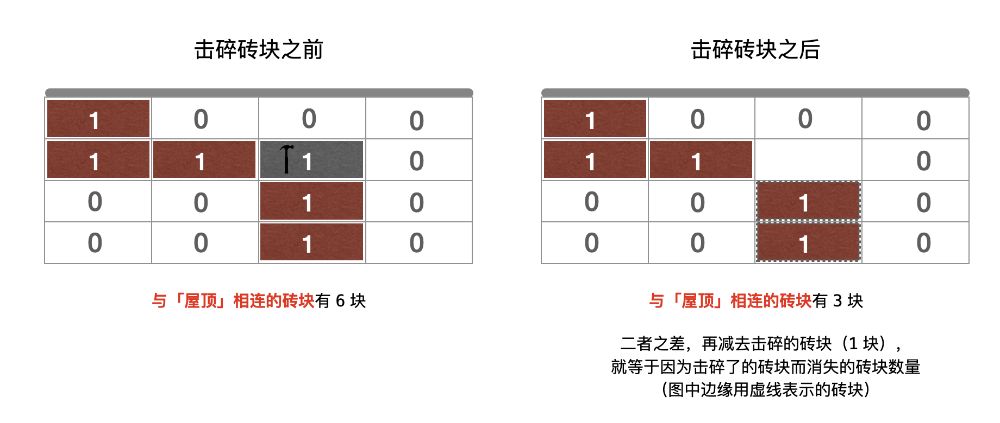
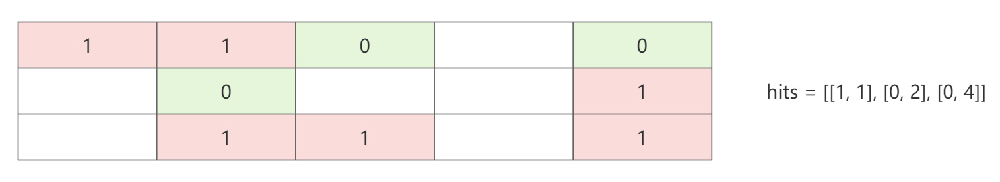
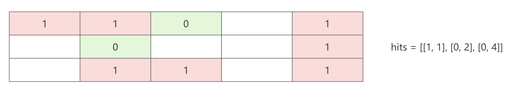
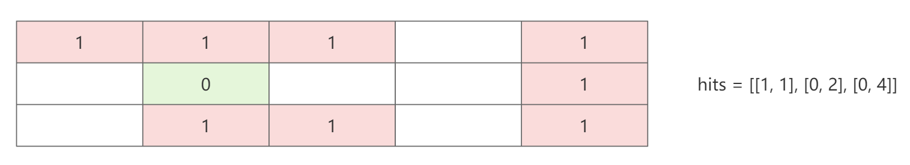
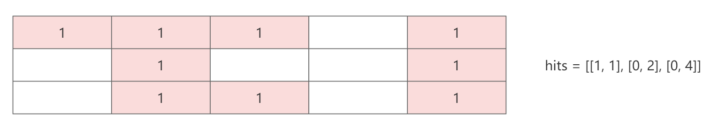

## 前言

并查集类题目

## 情侣牵手

> [765. 情侣牵手](https://leetcode.cn/problems/couples-holding-hands/)

针对这道题，有这么几点：

1. 首先，对于 rows 数组中的每个人 rows[i]，如果对每一对情侣进行编号，那么 rows[i] 就属于第 rows[i] / 2 号情侣。
2. 另外，一个显而易见的是，如果 k 对情侣互不相邻，那么将他们交换到相邻的位置至少需要 k - 1 次。

对于第一点，比如第 2 个人和第 3 个人，它们互为情侣，那么他们的情侣编号为 1。

对于第二点，比如目前 rows 数组为 `[0, 3, 2, 5, 4, 1]`，那么这 3 对情侣归位至少需要 2 次，比如 1、3 交换后 5、3 交换。

所以，我们将 rows 数组相邻两个位置的人对应的情侣编号在并查集中进行合并，假设最后并查集有 3 个连通分量，每个连通分量中情侣的对数为 a、b、c，那么将这三个连通分量归为到正确的位置至少的交换次数为 a - 1、b - 1、c - 1，即总的交换次数为 a + b + c - 3。

所以：

+ 至少交换的次数 = 情侣的总对数 - 并查集中的连通分量的个数。

```java
class Solution {
    
    public static int MAXN = 31;
    public static int[] fa = new int[MAXN];
    public static int sets = 0;
    
    public int minSwapsCouples(int[] row) {
        int n = row.length;
        build(n / 2);
        for (int i = 0; i < n; i += 2) {
            union(row[i] / 2, row[i + 1] / 2);
        }
        return n / 2 - sets;
    }

    public void build(int n) {
        for (int i = 0; i < n; i++) {
            fa[i] = i;
        }
        sets = n;
    }

    public int find(int x) {
        return x == fa[x] ? x : (fa[x] = find(fa[x]));
    }

    public void union(int x, int y) {
        int rx = find(x);
        int ry = find(y);
        if (rx != ry) {
            fa[rx] = ry;
            sets--;
        }
    }

    public boolean isSameSet(int x, int y) {
        return find(x) == find(y);
    }
}
```

## 相似字符串组

> [839. 相似字符串组](https://leetcode.cn/problems/similar-string-groups/)

其实这道题目的并查集特征很明显，如果两个字符串是相似的，就 union 起来，最后返回并查集中的连通量个数即可。

```java
class Solution {
    
    public static int MAXN = 301;
    public static int[] fa = new int[MAXN];
    public static int sets = 0;

    public int numSimilarGroups(String[] strs) {
        int n = strs.length;
        int m = strs[0].length();
        build(n);
        for (int i = 0; i < n; i++) {
            for (int j = i + 1; j < n; j++) {
                if (!isSameSet(i, j)) {
                    // 如果两个字符串差异字符的个数为 0 or 2 个就视为相似
                    int diff = 0;
                    for (int k = 0; k < m && diff < 3; k++) {
                        if (strs[i].charAt(k) != strs[j].charAt(k)) {
                            diff++;
                        }
                    }
                    if (diff == 0 || diff == 2) {
                        union(i, j);
                    }
                }
            }
        }
        return sets;
    }

    public void build(int n) {
        for (int i = 0; i <= n; i++) {
            fa[i] = i;
        }
        sets = n;
    }

    public int find(int x) {
        return x == fa[x] ? x : (fa[x] = find(fa[x]));
    }

    public void union(int x, int y) {
        int rx = find(x);
        int ry = find(y);
        if (rx != ry) {
            fa[rx] = ry;
            sets--;
        }
    }

    public boolean isSameSet(int x, int y) {
        return find(x) == find(y);
    }
}
```

## 移除最多的同行或同列石头

> [947. 移除最多的同行或同列石头](https://leetcode.cn/problems/most-stones-removed-with-same-row-or-column/)

本题目的一个关键结论：

+ 一个二维矩阵，同一行的石头可以算作一个集合，同一列的石头也可以算作一个集合，那么就可以使用并查集做合并。
+ 最关键的结论是，在并查集中，每一个连通分量（集合）最后都可以移除到只剩最后一块石头。
+ 所以，最终的石头数量就是并查集的连通分量数（集合数），那么可以移除的数量就是总的石头数 - 连通分量数。

```java
import java.util.*;

class Solution {
    public static int MAX = 1001;
    public static int[] fa = new int[MAX];
    public static int sets;
    // 第 k 行的第一块石头 v
    public static HashMap<Integer, Integer> row = new HashMap<>();
    // 第 k 列的第一块石头 v
    public static HashMap<Integer, Integer> col = new HashMap<>();

    public int removeStones(int[][] stones) {
        int n = stones.length;
        build(n);
        for (int i = 0; i < n; i++) {
            int r = stones[i][0];
            int c = stones[i][1];
            if (!row.containsKey(r)) {
                row.put(r, i);
            } else {
                union(row.get(r), i);
            }
            if (!col.containsKey(c)) {
                col.put(c, i);
            } else {
                union(i, col.get(c));
            }
        }
        return n - sets;
    }

    public void build(int n) {
        row.clear();
        col.clear();
        Arrays.fill(fa, 0);
        for (int i = 1; i <= n; i++) {
            fa[i] = i;
        }
        sets = n;
    }

    public void union(int x, int y) {
        int rx = find(x);
        int ry = find(y);
        if (rx != ry) {
            fa[rx] = fa[ry];
            sets--;
        }
    }

    public int find(int x) {
        return x == fa[x] ? x : (fa[x] = find(fa[x]));
    }
}
```

## 打砖块

> [803. 打砖块](https://leetcode.cn/problems/bricks-falling-when-hit/)

首先，不会掉落的「砖块」需要满足两个条件：

+ 「砖块」位于第 0 行
+ 与第 0 行的「砖块」连通

那么我们如何计算每次因击碎砖块而导致其他消失的砖块的数量？

结合下图：



在击碎 (1, 2) 位置的砖块之前，与「屋顶」相连的砖块有 6 块，击碎该砖块之后，(2, 2) 和  (3, 2) 位置的砖块因为没能和「屋顶」连通导致消失，此时与「屋顶」相连的砖块有 3 块。

所以，击碎 (1, 2) 位置的砖块而导致其他砖块消失的数量 = 6 - 3 - 1 = 2。

这其实是一个连通性问题，可以考虑「并查集」。

但是「并查集」主要是将两个连通分量合并为一个连通分量，而击碎一个砖块会导致一个连通分量分为两个连通分量，这提示我们需要反向思考。

即，当逆序补上「被击碎的砖块」之后，有多少个砖块因为这个「被补上的砖块」而重新与「屋顶」相连。

具体步骤，以例子说明。

原始 grid 和 hits 数组如下：


首先，将 hits 数组对应的砖块位置击碎，如下：



接下来，构建并查集，将第 0 行的砖块和「屋顶」合并，将其他行的砖块一一合并。

接下来，逆序补回砖块：

1）此时与「屋顶」相连的砖块有 2 块，补回 [0, 4] 之后



与「屋顶」相连的砖块有 5 块，所以结果是 5 - 2 - 1 = 2

2）此时与「屋顶」相连的砖块有 5 块，补回 [0, 2] 之后



与「屋顶」相连的砖块有 6 块，所以结果是 6 - 5 - 1 = 0

3）此时与「屋顶」相连的砖块有 6 块，补回 [1, 1] 之后



与「屋顶」相连的砖块有 9 块，所以结果是 9 - 6 - 1 = 2

可以看出，当补回完所有砖块，grid 也变为原来的样子。

```java
import java.util.*;

public class Solution {
    
    // 为什么需要 copy 一份原始数组 grid?
    // 有可能在逆序补回时，补回的位置原本就是 0，那么就不能再补回一块砖块
    int[][] copy;
    int row, col;

    int[][] dirs = {{-1, 0}, {1, 0}, {0, -1}, {0, 1}};

    public int[] hitBricks(int[][] grid, int[][] hits) {
        row = grid.length;
        col = grid[0].length;

        // 拷贝 copy
        copy = new int[row][col];
        for (int i = 0; i < grid.length; i++) {
            System.arraycopy(grid[i], 0, copy[i], 0, col);
        }

        // 根据 hits 数组将 copy 数组中的砖块置为 0，后续补回
        for (int[] hit : hits) {
            copy[hit[0]][hit[1]] = 0;
        }

        // 创建并查集
        int top = row * col; // 天花板
        UnionFind uf = new UnionFind(top + 1);

        // 将第 0 行的砖块与天花板合并
        for (int j = 0; j < col; j++) {
            if (copy[0][j] == 1) {
                uf.union(j, top);
            }
        }

        // 将后续的砖块一一合并
        for (int i = 1; i < row; i++) {
            for (int j = 0; j < col; j++) {
                if (copy[i][j] == 1) {
                    // 上
                    if (copy[i - 1][j] == 1) {
                        uf.union(i * col + j, (i - 1) * col + j);
                    }
                    // 左
                    if (j > 0 && copy[i][j - 1] == 1) {
                        uf.union(i * col + j, i * col + (j - 1));
                    }
                }
            }
        }

        // 根据 hits 数组逆序补回
        int[] res = new int[hits.length];
        for (int i = hits.length - 1; i >= 0; i--) {
            int x = hits[i][0];
            int y = hits[i][1];

            // 如果在补回的位置原来就是 0，那么就不能再补回
            if (grid[x][y] == 0) {
                continue;
            }

            // 计算补回之前与天花板相连的个数
            int before = uf.getSize(top);

            // 如果补回位置是在第 0 层，则与天花板合并
            if (x == 0) {
                uf.union(y, top);
            }

            // 四个方向依次看是否可以进行合并
            for (int[] dir : dirs) {
                int nx = x + dir[0];
                int ny = y + dir[1];
                if (nx >= 0 && nx < row && ny >= 0 && ny < col && copy[nx][ny] == 1) {
                    uf.union(x * col + y, nx * col + ny);
                }
            }

            // 真正补回
            copy[x][y] = 1;

            // 计算补回之后与天花板相连的个数
            int curr = uf.getSize(top);

            // 补回的位置没有和天花板合并，也就是 curr = before，那么 res[i] = 0
            res[i] = Math.min(curr - before - 1, 0);
        }
        return res;
    }

    public static class UnionFind {
        
        int[] fath;
        int[] size;

        public UnionFind(int x) {
            fath = new int[x];
            size = new int[x];
            for (int i = 0; i < x; i++) {
                fath[i] = i;
                size[i] = 1;
            }
        }

        public void union(int x, int y) {
            int rx = find(x);
            int ry = find(y);
            if (rx == ry) {
                return;
            }
            fath[rx] = ry;
            size[ry] += size[rx];
        }

        public int find(int x) {
            if (x == fath[x]) {
                return x;
            }
            return fath[x] = find(fath[x]);
        }

        public int getSize(int x) {
            return size[find(x)];
        }
    }
}
```