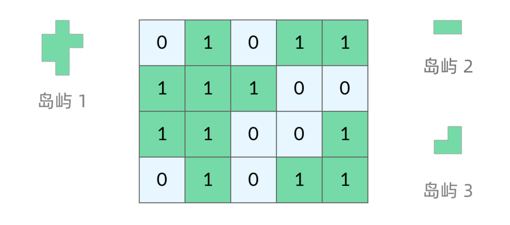
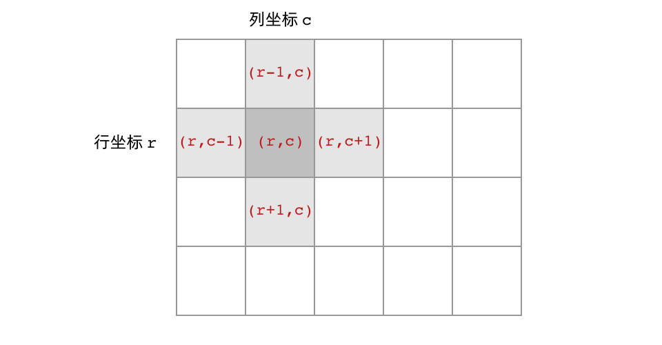
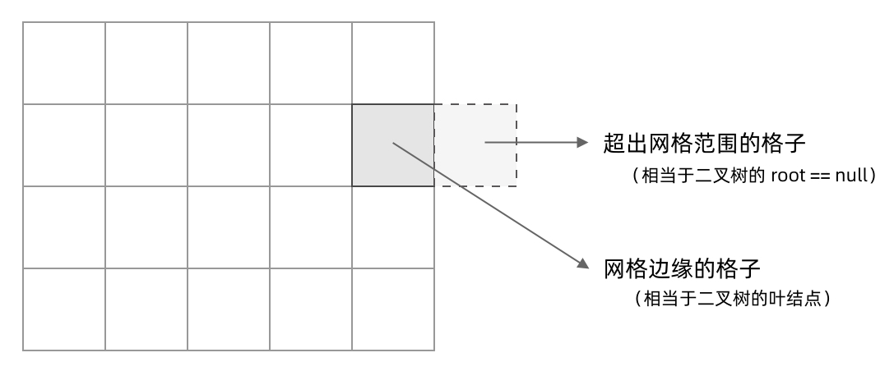
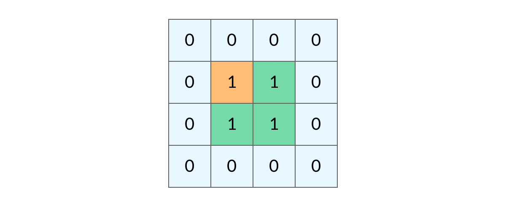
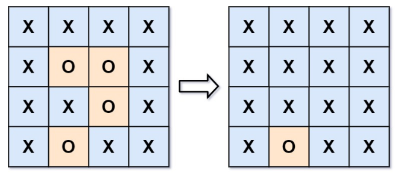

## 前言

洪水填充是我从左神那里了解的概念，这篇文章大部分来自 LeetCode 一个题解。

「岛屿问题」是一个系列的问题，比如：

+ [200. 岛屿数量](https://leetcode.cn/problems/number-of-islands/)
+ [130. 被围绕的区域](https://leetcode.cn/problems/surrounded-regions/)
+ [827. 最大人工岛](https://leetcode.cn/problems/making-a-large-island/)
+ [463. 岛屿的周长](https://leetcode.cn/problems/island-perimeter/)
+ [695. 岛屿的最大面积](https://leetcode.cn/problems/max-area-of-island/)

我们所熟悉的 DFS（深度优先搜索）问题通常是在树或者图结构上进行的，而我们今天要讨论的 DFS 问题，是在一种「网格」结构中进行的。岛屿问题是这类网格 DFS 问题的典型代表。网格结构遍历起来要比二叉树复杂一些，如果没有掌握一定的方法，DFS 代码容易写得冗长繁杂。

## 网格类问题

### 网格问题的基本概念

我们首先明确一下岛屿问题中的网格结构是如何定义的，以方便我们后面的讨论。

网格问题是由 m×n 个小方格组成一个网格，每个小方格与其上下左右四个方格认为是相邻的，要在这样的网格上进行某种搜索。

岛屿问题是一类典型的网格问题。每个格子中的数字可能是 0 或者 1，我们把数字为 0 的格子看成海洋格子，数字为 1 的格子看成陆地格子，这样相邻的陆地格子就连接成一个岛屿。



在这样一个设定下，就出现了各种岛屿问题的变种，包括岛屿的数量、面积、周长等。不过这些问题，基本都可以用 DFS 遍历来解决。

### DFS 的基本结构

网格结构要比二叉树结构稍微复杂一些，它其实是一种简化版的图结构，要写好网格上的 DFS 遍历，首先要理解二叉树上的 DFS 遍历方法，再类比写出网格结构上的 DFS 遍历。

我们写的二叉树 DFS 遍历一般是这样的：

```java
void dfs(TreeNode node) {
    // base case
    if (root == null) {
        return;
    }
    // 访问子节点
    dfs(root.left);
    dfs(root.right);
}
```

可以看到，二叉树的 DFS 有两个要素：「访问相邻结点」和「判断 base case」。

第一个要素是访问相邻结点。二叉树的相邻结点非常简单，只有左子结点和右子结点两个。二叉树本身就是一个递归定义的结构：一棵二叉树，它的左子树和右子树也是一棵二叉树。那么 DFS 遍历只需要递归调用左子树和右子树即可。

第二个要素是判断 base case。一般来说，二叉树遍历的 base case 是 root = null。

这样一个条件判断其实有两个含义：一方面，这表示 root 指向的子树为空，不需要再往下遍历了。另一方面，在 root = null 的时候及时返回，可以让后面的 root.left 和 root.right 操作不会出现空指针异常。

对于网格上的 DFS，我们完全可以参考二叉树的 DFS，写出网格 DFS 的两个要素：

首先，网格结构中的格子有多少相邻结点？答案是上下左右四个，对于格子 (r, c) 来说（r 和 c 分别代表行坐标和列坐标），四个相邻的格子分别是 (r-1, c)、(r+1, c)、(r, c-1)、(r, c+1)。换句话说，网格结构是「四叉」的。



其次，网格 DFS 中的 base case 是什么？从二叉树的 base case 对应过来，应该是网格中不需要继续遍历、grid\[r][c] 会出现数组下标越界异常的格子，也就是那些超出网格范围的格子。



这一点稍微有些反直觉，坐标竟然可以临时超出网格的范围？这种方法我称为「先污染后治理」— 不管当前是在哪个格子，先往四个方向走一步再说，如果发现走出了网格范围再赶紧返回。这跟二叉树的遍历方法是一样的，先递归调用，发现 root = null 再返回。

这样，我们得到了网格 DFS 遍历的框架代码：

```java
int[][] directions = {{-1, 0}, {1, 0}, {0, -1}, {0, 1}}; // 分别表示上、下、左、右

void dfs(int[][] grid, int r, int c) {
    // base case
    if (!inArea(grid, r, c)) {
        return;
    }
    // 访问上、下、左、右四个相邻节点
    for (int[] direction : directions) {
        dfs(grid, r + direction[0], c + direction[1]);
    }
}

// 判断 (r, c) 是否在网格中
boolean inArea(int[][] grid, int r, int c) {
    return r >= 0 && r < grid.length && c >= 0 && c < grid[0].length;
}
```

### 如何避免重复遍历

网格结构的 DFS 与二叉树的 DFS 最大的不同之处在于，遍历中可能遇到遍历过的结点。这是因为，网格结构本质上是一个「图」，我们可以把每个格子看成图中的结点，每个结点有向上下左右的四条边。在图中遍历时，自然可能遇到重复遍历结点。

这时候，DFS 可能会不停地「兜圈子」，永远停不下来，如下图所示：



如何避免这样的重复遍历呢？答案是标记已经遍历过的格子。以岛屿问题为例，我们需要在所有值为 1 的陆地格子上做 DFS 遍历。每走过一个陆地格子，就把格子的值改为 2，这样当我们遇到 2 的时候，就知道这是遍历过的格子了。也就是说，每个格子可能取三个值：

+ 0 —— 海洋格子
+ 1 —— 陆地格子（未遍历过）
+ 2 —— 陆地格子（已遍历过）

我们在框架代码中加入避免重复遍历的语句：

```java
int[][] directions = {{-1, 0}, {1, 0}, {0, -1}, {0, 1}};

void dfs(int[][] grid, int r, int c) {
    // base case               如果该格子不是岛屿，直接返回
    if (!inArea(grid, r, c) || grid[r][c] != 1) {
        return;
    }
    grid[r][c] = 2; // 将格子标记为「已遍历过」
    // 访问上、下、左、右四个相邻节点
    for (int[] direction : directions) {
        dfs(grid, r + direction[0], c + direction[1]);
    }
}

// 判断 (r, c) 是否在网格中
boolean inArea(int[][] grid, int r, int c) {
    return r >= 0 && r < grid.length && c >= 0 && c < grid[0].length;
}
```


这样，我们就得到了一个岛屿问题、乃至各种网格问题的通用 DFS 遍历方法。以下所讲的几个例题，其实都只需要在 DFS 遍历框架上稍加修改而已。

小贴士：

在一些题解中，可能会把「已遍历过的陆地格子」标记为和海洋格子一样的 0，美其名曰「陆地沉没方法」，即遍历完一个陆地格子就让陆地「沉没」为海洋。这种方法看似很巧妙，但实际上有很大隐患，因为这样我们就无法区分「海洋格子」和「已遍历过的陆地格子」了。如果题目更复杂一点，这很容易出 bug。

## 坐标转换

将二维坐标转换为一维索引通常是在处理如矩阵或网格数据时的一种常见需求，比如在对矩阵进行广度优先搜索或者使用并查集时。

最常见的转换方式是行主序（row-major order）或列主序（column-major order）。

假设有一个 N x M 的矩阵，其中 N 是行数，M 是列数。

**行主序转换**

如果使用行主序，那么对于任何位于 (r, c) 位置的元素，其中 0 ≤ r < N 且 0 ≤ c < M，其在一维数组中的索引 `i` 可以由下面的公式计算得出：

$$
i = r \times M + c
$$
相反，若已知一维索引 `i`，那么其二维坐标是：

```java
r = i / M
c = i % M
```

**列主序转换**

如果使用的是列主序，那么对于同一位置 (r, c) 的元素，其在一维数组中的索引 `j` 可以由下面的公式计算得出：

$$
j = c \times N + r
$$
相反，若已知一维索引 `j`，那么其二维坐标是：

```java
r = j % N;
c = j / N;
```

注意：一维数组的索引从 0 开始。

## 岛屿数量

### 深度优先搜索

```java
class Solution {
    int[][] directions = {{-1, 0}, {1, 0}, {0, -1}, {0, 1}};

    public int numIslands(char[][] grid) {
        int cnt = 0;
        for (int i = 0; i < grid.length; i++) {
            for (int j = 0; j < grid[i].length; j++) {
                if (grid[i][j] == '1') {
                    ++cnt;
                    dfs(grid, i, j);
                }
            }
        }
        return cnt;
    }

    private void dfs(char[][] grid, int r, int c) {
        if (!inArea(grid, r, c) || grid[r][c] != '1') {
            return;
        }
        grid[r][c] = '2'; // 已经访问过
        for (int[] direction : directions) {
            dfs(grid, r + direction[0], c + direction[1]);
        }
    }

    private boolean inArea(char[][] grid, int r, int c) {
        return r >= 0 && r < grid.length && c >= 0 && c < grid[0].length;
    }
}
```

这道题目也可以使用广度优先搜索和并查集求解。

### 广度优先搜索

```java
public int numIslands(char[][] grid) {
    int cnt = 0;
    int n = grid.length;
    int m = grid[0].length;
    for (int i = 0; i < grid.length; i++) {
        for (int j = 0; j < grid[i].length; j++) {
            if (grid[i][j] == '1') {
                ++cnt;
                Queue<Integer> q = new LinkedList<>();
                q.offer(i * m + j);
                while (!q.isEmpty()) {
                    int rc = q.poll();
                    int r = rc / m;
                    int c = rc % m;
                    for (int[] direction : directions) {
                        int nr = r + direction[0];
                        int nc = c + direction[1];
                        if (nr >= 0 && nr < n && nc >= 0 && nc < m && grid[nr][nc] == '1') {
                            q.offer(nr * m + nc);
                            grid[nr][nc] = '2'; // 注意标记访问过的位置
                        }
                    }
                }
            }
        }
    }
    return cnt;
}
```

### 并查集

```java
class Solution {
    public static int MAXN = 300 * 300;
    public static int[] fa = new int[MAXN];
    public static int sets = 0;

    public int numIslands(char[][] grid) {
        int n = grid.length;
        int m = grid[0].length;
        build(grid, n, m);
        for (int i = 0; i < n; i++) {
            for (int j = 0; j < m; j++) {
                if (grid[i][j] == '1') {
                    if (i > 0 && grid[i - 1][j] == '1') {
                        union(i * m + j, (i - 1) * m + j);
                    }
                    if (j > 0 && grid[i][j - 1] == '1') {
                        union(i * m + j, i * m + j - 1);
                    }
                }
            }
        }
        return sets;
    }

    public void build(char[][] grid, int n, int m) {
        sets = 0;
        for (int i = 0; i < n; i++) {
            for (int j = 0; j < m; j++) {
                if (grid[i][j] == '1') {
                    fa[i * m + j] = i * m + j;
                    sets++;
                }
            }
        }
    }

    public int find(int x) {
        return x == fa[x] ? x : (fa[x] = find(fa[x]));
    }

    public void union(int x, int y) {
        int rx = find(x);
        int ry = find(y);
        if (rx != ry) {
            fa[rx] = ry;
            sets--;
        }
    }
}
```

## 被围绕的区域



任何边界上的 O 都不会被填充为 X。 我们可以想到，所有的不被包围的 O 都直接或间接与边界上的 O 相连。我们可以利用这个性质判断 O 是否在边界上，具体地说：

+ 对于每一个边界上的 O，我们以它为起点，标记所有与它直接或间接相连的字母 O；
+ 最后我们遍历这个矩阵，对于每一个字母：
  - 如果该字母被标记过，则该字母为没有被字母 X 包围的字母 O，我们将其还原为字母 O；
  - 如果该字母没有被标记过，则该字母为被字母 X 包围的字母 O，我们将其修改为字母 X。

```java
int[][] dir = {{-1, 0}, {1, 0}, {0, -1}, {0, 1}};

public void solve(char[][] board) {
    int n = board.length;
    int m = board[0].length;
    for (int c = 0; c < m; c++) {
        if (board[0][c] == 'O') {
            dfs(board, 0, c);
        }
        if (board[n - 1][c] == 'O') {
            dfs(board, n - 1, c);
        }
    }
    for (int r = 1; r < n - 1; r++) {
        if (board[r][0] == 'O') {
            dfs(board, r, 0);
        }
        if (board[r][m - 1] == 'O') {
            dfs(board, r, m - 1);
        }
    }
    for (int i = 0; i < n; i++) {
        for (int j = 0; j < m; j++) {
            if (board[i][j] == 'O') {
                board[i][j] = 'X';
            }
            if (board[i][j] == 'Y') {
                board[i][j] = 'O';
            }
        }
    }
}

// 以 (i, j) 为起点，将所有的 O 变为 Y
private void dfs(char[][] board, int i, int j) {
    if (i < 0 || i >= board.length || j < 0 || j >= board[0].length || board[i][j] != 'O') {
        return;
    }
    board[i][j] = 'Y';
    for (int[] d : dir) {
        dfs(board, i + d[0], j + d[1]);
    }
}
```

## 最大人工岛

首先对每片岛屿编号（从 2 开始），然后统计每片岛屿的面积，用 cnt[i] 表示第 i 片岛屿的面积，并且记录最大的岛屿面积。

最后遍历所有的海洋格子，计算将每个格子变为 1 之后能够算出来的最大面积。

```java
int[][] dir = {{-1, 0}, {1, 0}, {0, -1}, {0, 1}};

public int largestIsland(int[][] grid) {
    int n = grid.length;
    int m = grid[0].length;
    int num = 1;
    for (int i = 0; i < n; i++) {
        for (int j = 0; j < m; j++) {
            if (grid[i][j] == 1) {
                dfs(grid, i, j, ++num);
            }
        }
    }
    int[] cnt = new int[num + 1];
    int max = 0;
    for (int i = 0; i < n; i++) {
        for (int j = 0; j < m; j++) {
            if (grid[i][j] > 1) {
                max = Math.max(max, ++cnt[grid[i][j]]);
            }
        }
    }
    boolean[] visited = new boolean[num + 1];
    int u, d, l, r;
    for (int i = 0; i < n; i++) {
        for (int j = 0; j < m; j++) {
            if (grid[i][j] == 0) {
                u = i - 1 >= 0 ? grid[i - 1][j] : 0; // 上
                d = i + 1 < n ? grid[i + 1][j] : 0; // 下
                l = j - 1 >= 0 ? grid[i][j - 1] : 0; // 左
                r = j + 1 < m ? grid[i][j + 1] : 0; // 右
                int sum = 1;
                if (!visited[u]) {
                    sum += cnt[u];
                    visited[u] = true;
                }
                if (!visited[d]) {
                    sum += cnt[d];
                    visited[d] = true;
                }
                if (!visited[l]) {
                    sum += cnt[l];
                    visited[l] = true;
                }
                if (!visited[r]) {
                    sum += cnt[r];
                    visited[r] = true;
                }
                max = Math.max(max, sum);
                visited[u] = false;
                visited[d] = false;
                visited[l] = false;
                visited[r] = false;
            }
        }
    }
    return max;
}

// 以 (i, j) 为起点，将 grid[i][j] = 1 的点染为 num
private void dfs(int[][] grid, int i, int j, int num) {
    if (i < 0 || i >= grid.length || j < 0 || j >= grid[0].length || grid[i][j] != 1) {
        return;
    }
    grid[i][j] = num;
    for (int[] d : dir) {
        dfs(grid, i + d[0], j + d[1], num);
    }
}
```

## 岛屿的周长

数学解法：

对于每一个格子，它对总的岛屿周长的贡献是：4 - 该格子周围的陆地格子数，所以只需要统计每个陆地格子周围的陆地格子数，计算对周长的贡献即可。

```java
public int islandPerimeter(int[][] grid) {
    int n = grid.length;
    int m = grid[0].length;
    for (int i = 0; i < n; i++) {
        for (int j = 0; j < m; j++) {
            if (grid[i][j] == 1) {
                grid[i][j] = neighbor(grid, i, j);
            }
        }
    }
    int perimeter = 0;
    for (int i = 0; i < n; i++) {
        for (int j = 0; j < m; j++) {
            if (grid[i][j] > 0) {
                perimeter += (grid[i][j] == 5) ? 4 : (4 - grid[i][j]);
            }
        }
    }
    return perimeter;
}

public int neighbor(int[][] grid, int i, int j) {
    int n = grid.length;
    int m = grid[0].length;
    int cnt = 0;
    cnt += i - 1 >= 0 && grid[i - 1][j] != 0 ? 1 : 0;
    cnt += i + 1 < n && grid[i + 1][j] != 0 ? 1 : 0;
    cnt += j - 1 >= 0 && grid[i][j - 1] != 0 ? 1 : 0;
    cnt += j + 1 < m && grid[i][j + 1] != 0 ? 1 : 0;
    // 本身是岛但是周围没有岛则返回 -1
    return cnt == 0 ? 5 : cnt;
}
```

## 岛屿的最大面积

和 **最大人工岛** 解法类似，先为岛屿编号，然后计算每个岛屿中的陆地格子数量。

```java
int[][] dir = {{-1, 0}, {1, 0}, {0, -1}, {0, 1}};

public int maxAreaOfIsland(int[][] grid) {
    int n = grid.length;
    int m = grid[0].length;
    int id = 1;
    for (int i = 0; i < n; i++) {
        for (int j = 0; j < m; j++) {
            if (grid[i][j] == 1) {
                dfs(grid, i, j, ++id);
            }
        }
    }
    int max = 0;
    int[] cnt = new int[id + 1];
    for (int i = 0; i < n; i++) {
        for (int j = 0; j < m; j++) {
            if (grid[i][j] > 0) {
                max = Math.max(max, ++cnt[grid[i][j]]);
            }
        }
    }
    return max;
}

private void dfs(int[][] grid, int i, int j, int id) {
    if (i < 0 || i >= grid.length || j < 0 || j >= grid[0].length || grid[i][j] != 1) {
        return;
    }
    grid[i][j] = id;
    for (int[] d : dir) {
        dfs(grid, i + d[0], j + d[1], id);
    }
}
```

当然也可以直接 DFS 做，如下：

```java
int[][] dir = {{-1, 0}, {1, 0}, {0, -1}, {0, 1}};

public int maxAreaOfIsland(int[][] grid) {
    int n = grid.length;
    int m = grid[0].length;
    int max = 0;
    for (int i = 0; i < n; i++) {
        for (int j = 0; j < m; j++) {
            max = Math.max(max, dfs(grid, i, j));
        }
    }
    return max;
}

private int dfs(int[][] grid, int i, int j) {
    if (i < 0 || i >= grid.length || j < 0 || j >= grid[0].length || grid[i][j] != 1) {
        return 0;
    }
    grid[i][j] = 2;
    int cnt = 1;
    for (int[] d : dir) {
        cnt += dfs(grid, i + d[0], j + d[1]);
    }
    return cnt;
}
```