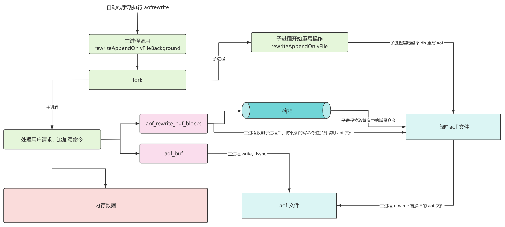

## 前言

redis 的数据都是存储在内存中的，所以数据读写的性能很高，但是当 redis 重启之后，内存中的数据就会丢失，基于此，redis 实现了一些持久化机制，包括 aof、rdb 以及混合持久化。

这里我们就来分析一下 aof 的机制以及 aofrewrite 相关的源码实现，源码版本是 6.2.16。

## aof 机制

aof（append only file）持久化以独立日志文件的方式记录每一条写命令，并在 redis 启动时回放 aof 文件中的命令以达到恢复数据的目的。

aof 持久化的相关参数：

```properties
# 是否开启 aof 功能
appendonly yes
# aof 文件的名称
appendfilename "appendonly.aof"
```

redis 在执行完写命令后，会将写命令追加到 aof_buf，然后通过 write 写到内核缓冲区，至于什么时候 fsync 到磁盘是可以通过刷盘策略控制的。

redis 提供了 3 种刷盘的策略，可以配置在 redis.conf 配置文件中的 appendfsync 配置项：

| 参数         | 描述                                                         | 优缺点                                                       |
| ------------ | ------------------------------------------------------------ | ------------------------------------------------------------ |
| **always**   | 每次写命令执行完后，同步将 aof 日志数据写回磁盘；            | 可靠性高，最大程度保证数据不丢失，但是每个写命令都要写回磁盘，性能开销大。 |
| **everysec** | 每秒，每次写命令执行完后，先将命令写入到 aof 文件的内核缓冲区，然后每隔一秒将缓冲区里的内容刷到磁盘； | 性能适中，极端情况宕机会丢失 1 秒的数据。                    |
| **no**       | 每次写操作命令执行完后，先将命令写入到 aof 文件的内核缓冲区，再由 OS 决定何时将缓冲区内容刷到磁盘。 | 性能较好，宕机时丢失的数据可能更多。                         |


## aofrewrite

aof 日志会将所有执行过的命令追加到 aof 文件中，那么随着 redis 的不断运行，aof 文件会不断膨胀，当文件大小到达一定的阈值时就需要做 aofrewrite。

aofrewrite 会移除 aof 中冗余的写命令，大致就是遍历整个 db，然后以等效的方式重写、生成一个新的 aof 文件，来达到减少 aof 文件大小的目的。

与 aofrewrite 相关的参数有：

```bash
# aof 文件较上一次的增长率
aof-rewrite-perc 100
# aof 文件大小阈值
aof-rewrite-min-size 64mb
```

在源码分析中，我们还能看到这两个参数，在 serverCron 中，只有当 aof 文件的阈值达到 aof-rewrite-min-size，并且增长率大于 aof-rewrite-perc 才会进行后台 aofrewrite。

但是为了保证 aof 文件的完整性，比如在子进程 rewrite 期间，主进程还在处理用户请求，这部分命令也是不能丢的。

所以主进程需要把 aofrewrite 期间的写命令缓存起来，等子进程结束之后再追加到新的 aof 文件中。

在此期间，如果写入量比较大的话，主进程在收割子进程之后就会有大量的 aof 刷盘操作，从而导致 redis 性能下降，为了提高 aofrewrite 的效率，redis 通过在主进程和子进程之间建立管道，将 aofrewrite 期间的写命令通过管道同步给子进程，追加写盘的操作也就交给子进程了。

实际上，每当新的 aof 文件增长 10K 大小，子进程就会从管道中拉取一些写命令追加到 aof 文件中，同时，在子进程完成 rewrite 之后，还会尽可能多的从管道中拉取写命令追加到 aof 文件中，你可以在下面的源码中清楚的看到。

所以，一旦主进程收割子进程，在将 aof-rewrite-buffer 中的数据追加到新的 aof 文件时，也没有多少了，这就极大地增大了主进程的效率，不至于影响正常的业务请求。

整个 aofrewrite 的流程图如下：



## 源码分析

### 触发 aofrewrite

触发 aofrewrite 主要有两种方式：

1. 手动执行 bgrewriteaof 命令
2. serverCron 时间事件检测到 aof 文件大小达到阈值

```c
int serverCron(struct aeEventLoop *eventLoop, long long id, void *clientData) {
    // ...
    /* Trigger an AOF rewrite if needed. */
    if (server.aof_state == AOF_ON &&
        !hasActiveChildProcess() &&
        server.aof_rewrite_perc &&
        server.aof_current_size > server.aof_rewrite_min_size)
    {
        long long base = server.aof_rewrite_base_size ?
            server.aof_rewrite_base_size : 1;
        long long growth = (server.aof_current_size*100/base) - 100;
        if (growth >= server.aof_rewrite_perc) {
            serverLog(LL_NOTICE,"Starting automatic rewriting of AOF on %lld%% growth",growth);
            rewriteAppendOnlyFileBackground();
        }
    }
    // ...
}

/* AOF states */
#define AOF_ON 1              /* AOF is on */

/* Return true if there are active children processes doing RDB saving,
 * AOF rewriting, or some side process spawned by a loaded module. */
int hasActiveChildProcess() {
    return server.child_pid != -1;
}
```

也就是说，当 aof 文件大小超过了 server.aof_rewrite_min_size，并且增长率大于 server.aof_rewrite_perc 时就会触发（增长率计算的基数 server.aof_rewrite_base_size 是上次 aofrewrite 完之后 aof 文件的大小）。

### 开启 aofrewrite

在 aofrewrite 触发之后，就会调用 rewriteAppendOnlyFileBackground() 函数进行处理。

```c
int rewriteAppendOnlyFileBackground(void) {
    pid_t childpid;

    if (hasActiveChildProcess()) return C_ERR;
    if (aofCreatePipes() != C_OK) return C_ERR; // 建立进程通信管道
    // 创建子进程
    if ((childpid = redisFork(CHILD_TYPE_AOF)) == 0) {
        char tmpfile[256];
        /* Child */
        redisSetProcTitle("redis-aof-rewrite");
        redisSetCpuAffinity(server.aof_rewrite_cpulist);
        snprintf(tmpfile,256,"temp-rewriteaof-bg-%d.aof", (int) getpid());
        if (rewriteAppendOnlyFile(tmpfile) == C_OK) {
            sendChildCowInfo(CHILD_INFO_TYPE_AOF_COW_SIZE, "AOF rewrite");
            exitFromChild(0);
        } else {
            exitFromChild(1);
        }
    } else {
        /* Parent */
        if (childpid == -1) {
            serverLog(LL_WARNING,
                "Can't rewrite append only file in background: fork: %s",
                strerror(errno));
            aofClosePipes();
            return C_ERR;
        }
        serverLog(LL_NOTICE,
            "Background append only file rewriting started by pid %ld",(long) childpid);
        server.aof_rewrite_scheduled = 0;
        server.aof_rewrite_time_start = time(NULL);

        /* We set appendseldb to -1 in order to force the next call to the
         * feedAppendOnlyFile() to issue a SELECT command, so the differences
         * accumulated by the parent into server.aof_rewrite_buf will start
         * with a SELECT statement and it will be safe to merge. */
        server.aof_selected_db = -1;
        replicationScriptCacheFlush();
        return C_OK;
    }
    return C_OK; /* unreached */
}
```

### 建立 IPC 管道

在真正进行 fork 子进程之前，会调用 aofCreatePipes() 函数创建管道，如下：

```c
/* Create the pipes used for parent - child process IPC during rewrite.
 * We have a data pipe used to send AOF incremental diffs to the child,
 * and two other pipes used by the children to signal it finished with
 * the rewrite so no more data should be written, and another for the
 * parent to acknowledge it understood this new condition. */
int aofCreatePipes(void) {
    int fds[6] = {-1, -1, -1, -1, -1, -1};
    int j;

    if (pipe(fds) == -1) goto error; /* parent -> children data. */
    if (pipe(fds+2) == -1) goto error; /* children -> parent ack. */
    if (pipe(fds+4) == -1) goto error; /* parent -> children ack. */
    /* Parent -> children data is non blocking. */
    if (anetNonBlock(NULL,fds[0]) != ANET_OK) goto error;
    if (anetNonBlock(NULL,fds[1]) != ANET_OK) goto error;
    // 注册读时间处理函数，负责处理子进程要求停止管道传输的消息
    if (aeCreateFileEvent(server.el, fds[2], AE_READABLE, aofChildPipeReadable, NULL) == AE_ERR) goto error;

    server.aof_pipe_write_data_to_child = fds[1];   // 父进程向子进程写数据的 fd
    server.aof_pipe_read_data_from_parent = fds[0]; // 子进程从父进程读数据的 fd
    server.aof_pipe_write_ack_to_parent = fds[3];   // 子进程向父进程发起停止消息的 fd
    server.aof_pipe_read_ack_from_child = fds[2];   // 父进程从子进程读取停止消息的 fd
    server.aof_pipe_write_ack_to_child = fds[5];    // 父进程向子进程回复消息的 fd
    server.aof_pipe_read_ack_from_parent = fds[4];  // 子进程从父进程读取回复消息的 fd
    server.aof_stop_sending_diff = 0;               // 是否停止管道传输标记位
    return C_OK;
    // ...
}
```

### 创建子进程

当建立管道之后，父进程就会调用 fork 函数创建子进程进行 aofrewrite。

这里先补充一下 fork 函数的基础知识。

在 Linux 中，fork 函数用于创建一个新的进程，这个进程几乎是原有进程的一个完全拷贝，通常被称为子进程。

当调用 fork() 时，会发生以下几件事情：

+ 如果函数成功执行，它会返回两次：一次是在父进程中，返回值是子进程的进程 id；另一次是在子进程中，返回值为 0。这样就可以通过检查返回值来区分代码是在父进程中运行还是在子进程中运行。
+ 如果 fork() 调用失败，则不会创建新的进程，并且在父进程中返回 -1。

创建的一个子进程，几乎能够复制父进程的所有资源，包括打开的文件描述符、堆中的数据等，但是，子进程有自己独立的内存空间，对变量的修改不会影响到对方。

在很多情况下，我们还需要结合其他系统调用如 exec() 来替换子进程的镜像，或者使用 wait() 或 waitpid() 来等待子进程结束。

这样就不难分辨出上面的源码哪个部分是父进程，哪个部分是子进程了。

### 父进程如何处理

当通过 fork 创建好子进程之后，我们先来看父进程是如何进行后续处理的。

```c
if (childpid == -1)
    // fork 失败的错误处理
    serverLog(LL_WARNING,
        "Can't rewrite append only file in background: fork: %s",
        strerror(errno));
    aofClosePipes();
    return C_ERR;
}
// 记录日志
serverLog(LL_NOTICE,
    "Background append only file rewriting started by pid %ld",(long) childpid);
// 设置 aof_rewrite_scheduled 为 0 防止 serverCron 再次触发 aofrewrite
server.aof_rewrite_scheduled = 0;
// 记录 aof_rewrite_time_start
server.aof_rewrite_time_start = time(NULL);

/* We set appendseldb to -1 in order to force the next call to the
 * feedAppendOnlyFile() to issue a SELECT command, so the differences
 * accumulated by the parent into server.aof_rewrite_buf will start
 * with a SELECT statement and it will be safe to merge. */
// 根据注释，我们可以知道，将 aof_selected_db 设置为 -1 的目的是确保在下一次调用
// feedAppendOnlyFile() 函数时，强制发出一个 SELECT 命令
// 当 aof 重写完成后，新的 aof 文件和累积的命令差异会被合并。
// 由于累积的命令差异现在是从一个明确的 SELECT 语句开始，这使得合并过程更加安全和一致，避免了因数据库上下文不匹配导致的数据不一致问题。
server.aof_selected_db = -1;
// 清空 redis 缓存的 lua 脚本
replicationScriptCacheFlush();
return C_OK;
```

这里 replicationScriptCacheFlush 函数用于清空 redis 缓存的 lua 脚本，结合注释，这样做有这么几个原因：

1. 当一个新 slave 节点连接到 master 节点并执行全量同步（FULL SYNC）时，slave 会丢弃所有的数据，并从 master 接收整个数据集，所以需要清空脚本缓存以避免不一致。
2. 当 redis 执行 aof 重写时，旧的 aof 文件仍然会被更新，如果脚本被添加到了新的 aof 文件中，但还没有被记录到旧的 aof 文件中，就会出现数据不一致，因此，在 aof 重写开始前需要清空脚本缓存。
3. 如果 redis 实例没有配置任何从节点，并且 aof 持久化也被禁用，那么脚本缓存就变得没有必要，因为它不会影响到其他任何地方的数据一致性，这种情况下，清空脚本缓存可以帮助回收内存。

接下来就是缓存写命令和管道通信的部分了，入口是在 feedAppendOnlyFile 方法中：

```c
void feedAppendOnlyFile(struct redisCommand *cmd, int dictid, robj **argv, int argc) {
    // ...

    /* Append to the AOF buffer. This will be flushed on disk just before
     * of re-entering the event loop, so before the client will get a
     * positive reply about the operation performed. */
    // 将写命令追加到 server.aof_buf 中，在重新进入事件循环之前会将其刷新到磁盘
    if (server.aof_state == AOF_ON)
        server.aof_buf = sdscatlen(server.aof_buf,buf,sdslen(buf));
    // 如果在进行 aofrewrite，那么还会将命令写到 aof_rewrite_buf_blocks 中
    if (server.child_type == CHILD_TYPE_AOF)
        aofRewriteBufferAppend((unsigned char*)buf,sdslen(buf));
    // ...
}
```

```c
/* Append data to the AOF rewrite buffer, allocating new blocks if needed. */
void aofRewriteBufferAppend(unsigned char *s, unsigned long len) {
    listNode *ln = listLast(server.aof_rewrite_buf_blocks);
    aofrwblock *block = ln ? ln->value : NULL;

    while(len) {
        /* If we already got at least an allocated block, try appending
         * at least some piece into it. */
        if (block) {
            unsigned long thislen = (block->free < len) ? block->free : len;
            if (thislen) {  /* The current block is not already full. */
                memcpy(block->buf+block->used, s, thislen);
                block->used += thislen;
                block->free -= thislen;
                s += thislen;
                len -= thislen;
            }
        }

        if (len) { /* First block to allocate, or need another block. */
            int numblocks;

            block = zmalloc(sizeof(*block));
            block->free = AOF_RW_BUF_BLOCK_SIZE;
            block->used = 0;
            listAddNodeTail(server.aof_rewrite_buf_blocks,block);

            /* Log every time we cross more 10 or 100 blocks, respectively
             * as a notice or warning. */
            numblocks = listLength(server.aof_rewrite_buf_blocks);
            if (((numblocks+1) % 10) == 0) {
                int level = ((numblocks+1) % 100) == 0 ? LL_WARNING :
                                                         LL_NOTICE;
                serverLog(level,"Background AOF buffer size: %lu MB",
                    aofRewriteBufferSize()/(1024*1024));
            }
        }
    }

    /* Install a file event to send data to the rewrite child if there is
     * not one already. */
    if (!server.aof_stop_sending_diff &&
        aeGetFileEvents(server.el,server.aof_pipe_write_data_to_child) == 0)
    {
        aeCreateFileEvent(server.el, server.aof_pipe_write_data_to_child,
            AE_WRITABLE, aofChildWriteDiffData, NULL);
    }
}
```

redis 用链表 server.aof_rewrite_buf_blocks 来缓存 aofrewrite 期间的写命令，链表的每个节点最大 10 MB。

重点是在最后的写事件注册，当 server.aof_pipe_write_data_to_child 这个 fd 没有注册事件时，就注册写事件函数 aofChildWriteDiffData：

```c
/* Event handler used to send data to the child process doing the AOF
 * rewrite. We send pieces of our AOF differences buffer so that the final
 * write when the child finishes the rewrite will be small. */
void aofChildWriteDiffData(aeEventLoop *el, int fd, void *privdata, int mask) {
    listNode *ln;
    aofrwblock *block;
    ssize_t nwritten;
    UNUSED(el);
    UNUSED(fd);
    UNUSED(privdata);
    UNUSED(mask);

    while(1) {
        ln = listFirst(server.aof_rewrite_buf_blocks);
        block = ln ? ln->value : NULL;
        if (server.aof_stop_sending_diff || !block) {
            aeDeleteFileEvent(server.el,server.aof_pipe_write_data_to_child,
                              AE_WRITABLE);
            return;
        }
        if (block->used > 0) {
            nwritten = write(server.aof_pipe_write_data_to_child,
                             block->buf,block->used);
            if (nwritten <= 0) return;
            memmove(block->buf,block->buf+nwritten,block->used-nwritten);
            block->used -= nwritten;
            block->free += nwritten;
        }
        if (block->used == 0) listDelNode(server.aof_rewrite_buf_blocks,ln);
    }
}
```

每次事件循环都会把 server.aof_rewrite_buf_blocks 积攒的写命令全部同步给子进程，除非server.aof_stop_sending_diff 被设置了停止标记。

### 子进程如何处理

接下来我们看 fork 出来的子进程是如何处理的。

```c
char tmpfile[256];
/* Child */
redisSetProcTitle("redis-aof-rewrite");
redisSetCpuAffinity(server.aof_rewrite_cpulist);
snprintf(tmpfile,256,"temp-rewriteaof-bg-%d.aof", (int) getpid());
if (rewriteAppendOnlyFile(tmpfile) == C_OK) {
    sendChildCowInfo(CHILD_INFO_TYPE_AOF_COW_SIZE, "AOF rewrite");
    exitFromChild(0);
} else {
    exitFromChild(1);
}
```

当然重点是在 rewriteAppendOnlyFile 函数中

```c
/* Write a sequence of commands able to fully rebuild the dataset into
 * "filename". Used both by REWRITEAOF and BGREWRITEAOF.
 *
 * In order to minimize the number of commands needed in the rewritten
 * log Redis uses variadic commands when possible, such as RPUSH, SADD
 * and ZADD. However at max AOF_REWRITE_ITEMS_PER_CMD items per time
 * are inserted using a single command. */
int rewriteAppendOnlyFile(char *filename) {
    // ...
    snprintf(tmpfile,256,"temp-rewriteaof-%d.aof", (int) getpid());
    fp = fopen(tmpfile,"w");
    // ...
    server.aof_child_diff = sdsempty();
    // ...
    if (rewriteAppendOnlyFileRio(&aof) == C_ERR) goto werr;
    // ...
}
```

首先打开一个临时 aof 文件，初始化 server.aof_child_diff 缓存准备从父进程读数据，然后就调用rewriteAppendOnlyFileRio() 来写 aof 文件和读取管道中的数据：

```c
int rewriteAppendOnlyFileRio(rio *aof) {
    // ...
            /* Read some diff from the parent process from time to time. */
            if (aof->processed_bytes > processed+AOF_READ_DIFF_INTERVAL_BYTES) {
                processed = aof->processed_bytes;
                aofReadDiffFromParent();
            }
    // ...
}
```

在遍历 redis 把 key-value 写入新 aof 文件过程中，新 aof 文件每增长 10K 就会调用 aofReadDiffFromParent()从管道中读取数据追加到 server.aof_child_diff：

```c
ssize_t aofReadDiffFromParent(void) {
    char buf[65536]; /* Default pipe buffer size on most Linux systems. */
    ssize_t nread, total = 0;

    while ((nread =
            read(server.aof_pipe_read_data_from_parent,buf,sizeof(buf))) > 0) {
        server.aof_child_diff = sdscatlen(server.aof_child_diff,buf,nread);
        total += nread;
    }
    return total;
}
```

### 停止管道传输

子进程在遍历完 redis，生成好新的 aof 文件之后就要准备退出了，在退出前要先告诉父进程停止管道传输，依然回到 rewriteAppendOnlyFile() 函数来看：

```c
int rewriteAppendOnlyFile(char *filename) {
    // 这里 fp 是子进程进行数据重写的临时文件
    /* Do an initial slow fsync here while the parent is still sending
     * data, in order to make the next final fsync faster. */
    if (fflush(fp) == EOF) goto werr;
    if (fsync(fileno(fp)) == -1) goto werr;

    /* Read again a few times to get more data from the parent.
     * We can't read forever (the server may receive data from clients
     * faster than it is able to send data to the child), so we try to read
     * some more data in a loop as soon as there is a good chance more data
     * will come. If it looks like we are wasting time, we abort (this
     * happens after 20 ms without new data). */
    int nodata = 0;
    mstime_t start = mstime();
    while(mstime()-start < 1000 && nodata < 20) {
        if (aeWait(server.aof_pipe_read_data_from_parent, AE_READABLE, 1) <= 0)
        {
            nodata++;
            continue;
        }
        nodata = 0; /* Start counting from zero, we stop on N *contiguous*
                       timeouts. */
        aofReadDiffFromParent();
    }

    // 通知父进程停止管道传输
    /* Ask the master to stop sending diffs. */
    if (write(server.aof_pipe_write_ack_to_parent,"!",1) != 1) goto werr;
    if (anetNonBlock(NULL,server.aof_pipe_read_ack_from_parent) != ANET_OK)
        goto werr;
    /* We read the ACK from the server using a 5 seconds timeout. Normally
     * it should reply ASAP, but just in case we lose its reply, we are sure
     * the child will eventually get terminated. */
    if (syncRead(server.aof_pipe_read_ack_from_parent,&byte,1,5000) != 1 ||
        byte != '!') goto werr;
    serverLog(LL_NOTICE,"Parent agreed to stop sending diffs. Finalizing AOF...");

    /* Read the final diff if any. */
    aofReadDiffFromParent();

    /* Write the received diff to the file. */
    serverLog(LL_NOTICE,
        "Concatenating %.2f MB of AOF diff received from parent.",
        (double) sdslen(server.aof_child_diff) / (1024*1024));

    /* Now we write the entire AOF buffer we received from the parent
     * via the pipe during the life of this fork child.
     * once a second, we'll take a break and send updated COW info to the parent */
    size_t bytes_to_write = sdslen(server.aof_child_diff);
    const char *buf = server.aof_child_diff;
    long long cow_updated_time = mstime();
    long long key_count = dbTotalServerKeyCount();
    while (bytes_to_write) {
        /* We write the AOF buffer in chunk of 8MB so that we can check the time in between them */
        size_t chunk_size = bytes_to_write < (8<<20) ? bytes_to_write : (8<<20);

        if (rioWrite(&aof,buf,chunk_size) == 0)
            goto werr;

        bytes_to_write -= chunk_size;
        buf += chunk_size;

        /* Update COW info */
        long long now = mstime();
        if (now - cow_updated_time >= 1000) {
            sendChildInfo(CHILD_INFO_TYPE_CURRENT_INFO, key_count, "AOF rewrite");
            cow_updated_time = now;
        }
    }

    /* Make sure data will not remain on the OS's output buffers */
    if (fflush(fp)) goto werr;
    if (fsync(fileno(fp))) goto werr;
    if (fclose(fp)) { fp = NULL; goto werr; }
    fp = NULL;

    if (rename(tmpfile,filename) == -1) {
        serverLog(LL_WARNING,"Error moving temp append only file on the final destination: %s", strerror(errno));
        unlink(tmpfile);
        stopSaving(0);
        return C_ERR;
    }
    serverLog(LL_NOTICE,"SYNC append only file rewrite performed");
    stopSaving(1);
    return C_OK;
    // ...
}
```

这里写的就很直接了：

+ 使用 write 向控制管道写入“!”发起停止请求，然后读取返回结果，超时时间为 5s
+ 超时就 goto werr 异常退出，5s 内读取到“!”就继续
+ 再次调用 aofReadDiffFromParent() 从数据管道读取数据确保管道中没有遗留
+ 最后 rioWrite() 把 server.aof_child_diff 积攒的数据追加到新的 aof 文件

那么父进程是如何处理“!”的呢，还记得之前注册的读事件 aofChildPipeReadable() 吧，子进程向控制管道发送“!”就会激活：

```c
/* This event handler is called when the AOF rewriting child sends us a
 * single '!' char to signal we should stop sending buffer diffs. The
 * parent sends a '!' as well to acknowledge. */
void aofChildPipeReadable(aeEventLoop *el, int fd, void *privdata, int mask) {
    char byte;
    UNUSED(el);
    UNUSED(privdata);
    UNUSED(mask);

    if (read(fd,&byte,1) == 1 && byte == '!') {
        serverLog(LL_NOTICE,"AOF rewrite child asks to stop sending diffs.");
        server.aof_stop_sending_diff = 1;
        if (write(server.aof_pipe_write_ack_to_child,"!",1) != 1) {
            /* If we can't send the ack, inform the user, but don't try again
             * since in the other side the children will use a timeout if the
             * kernel can't buffer our write, or, the children was
             * terminated. */
            serverLog(LL_WARNING,"Can't send ACK to AOF child: %s",
                strerror(errno));
        }
    }
    /* Remove the handler since this can be called only one time during a
     * rewrite. */
    aeDeleteFileEvent(server.el,server.aof_pipe_read_ack_from_child,AE_READABLE);
}
```

很简单，标记 server.aof_stop_sending_diff = 1，给子进程回复“!”，并且把自己从事件循环删掉，自此父子进程间通信完成，剩下的就是父进程等待子进程退出进行收尾工作。

### 父进程收尾工作

在 serverCron 中会检查是否有活跃的子进程，如果有，就进一步调用 checkChildrenDone 函数

```c
/* Check if a background saving or AOF rewrite in progress terminated. */
if (hasActiveChildProcess() || ldbPendingChildren()) {
    run_with_period(1000) receiveChildInfo();
    checkChildrenDone();
} else {
    // ...
```

在 checkChildrenDone 函数中，会调用 waitpid() 来收割子进程，如果 server.child_type 是 CHILD_TYPE_AOF，就会调用 backgroundRewriteDoneHandler 来进行收尾工作。

```c
void checkChildrenDone(void) {
    // ...
        } else if (pid == server.child_pid) {
            if (server.child_type == CHILD_TYPE_RDB) {
                backgroundSaveDoneHandler(exitcode, bysignal);
            } else if (server.child_type == CHILD_TYPE_AOF) {
                backgroundRewriteDoneHandler(exitcode, bysignal);
    // ...
}
```

```c
/* A background append only file rewriting (BGREWRITEAOF) terminated its work.
 * Handle this. */
void backgroundRewriteDoneHandler(int exitcode, int bysignal) {
    // ...
        /* Flush the differences accumulated by the parent to the
         * rewritten AOF. */
        latencyStartMonitor(latency);
        snprintf(tmpfile,256,"temp-rewriteaof-bg-%d.aof",
            (int)server.child_pid);
        newfd = open(tmpfile,O_WRONLY|O_APPEND);
        if (newfd == -1) {
            serverLog(LL_WARNING,
                "Unable to open the temporary AOF produced by the child: %s", strerror(errno));
            goto cleanup;
        }

        if (aofRewriteBufferWrite(newfd) == -1) {
            serverLog(LL_WARNING,
                "Error trying to flush the parent diff to the rewritten AOF: %s", strerror(errno));
            close(newfd);
            goto cleanup;
        }
        latencyEndMonitor(latency);
        latencyAddSampleIfNeeded("aof-rewrite-diff-write",latency);

        // everysecond 策略，则启动后台线程进行每秒 fsync
        if (server.aof_fsync == AOF_FSYNC_EVERYSEC) {
            aof_background_fsync(newfd);
        } else if (server.aof_fsync == AOF_FSYNC_ALWAYS) {
            // always 策略，则主线程同步 fsync
            latencyStartMonitor(latency);
            if (redis_fsync(newfd) == -1) {
                serverLog(LL_WARNING,
                    "Error trying to fsync the parent diff to the rewritten AOF: %s", strerror(errno));
                close(newfd);
                goto cleanup;
            }
            latencyEndMonitor(latency);
            latencyAddSampleIfNeeded("aof-rewrite-done-fsync",latency);
        }
        // no 策略，不启动后台线程，主线程也不 fsync，交给 os 处理
    // ...
}
```

首先会打开子进程生成的新 aof 文件，并调用 aofRewriteBufferWrite() 把 server.aof_rewrite_buf_blocks 中剩余的数据追加到新 aof 文件，然后根据不同的 fsync 策略进行刷盘处理。

```c
/* A background append only file rewriting (BGREWRITEAOF) terminated its work.
 * Handle this. */
void backgroundRewriteDoneHandler(int exitcode, int bysignal) {
    // ...

        /* Rename the temporary file. This will not unlink the target file if
         * it exists, because we reference it with "oldfd". */
        latencyStartMonitor(latency);
        if (rename(tmpfile,server.aof_filename) == -1) {
            serverLog(LL_WARNING,
                "Error trying to rename the temporary AOF file %s into %s: %s",
                tmpfile,
                server.aof_filename,
                strerror(errno));
            close(newfd);
            if (oldfd != -1) close(oldfd);
            goto cleanup;
        }
        latencyEndMonitor(latency);
        latencyAddSampleIfNeeded("aof-rename",latency);

        if (server.aof_fd == -1) {
            /* AOF disabled, we don't need to set the AOF file descriptor
             * to this new file, so we can close it. */
            close(newfd);
        } else {
            /* AOF enabled, replace the old fd with the new one. */
            oldfd = server.aof_fd;
            server.aof_fd = newfd;
            server.aof_selected_db = -1; /* Make sure SELECT is re-issued */
            aofUpdateCurrentSize();
            server.aof_rewrite_base_size = server.aof_current_size;
            server.aof_fsync_offset = server.aof_current_size;
            server.aof_last_fsync = server.unixtime;

            /* Clear regular AOF buffer since its contents was just written to
             * the new AOF from the background rewrite buffer. */
            sdsfree(server.aof_buf);
            server.aof_buf = sdsempty();
        }
}
```

之后把新 aof 文件 rename 为 server.aof_filename 记录的文件名，然后记录一次日志信息。

```c
/* Asynchronously close the overwritten AOF. */
if (oldfd != -1) bioCreateCloseJob(oldfd);
```

接着使用 bio 后台线程来 close 原来的 aof 文件。

```c
cleanup:
    aofClosePipes();
    aofRewriteBufferReset();
    aofRemoveTempFile(server.child_pid);
    server.aof_rewrite_time_last = time(NULL)-server.aof_rewrite_time_start;
    server.aof_rewrite_time_start = -1;
    /* Schedule a new rewrite if we are waiting for it to switch the AOF ON. */
    if (server.aof_state == AOF_WAIT_REWRITE)
        server.aof_rewrite_scheduled = 1;
```

最后是清理工作，包括关闭管道、重置 aof-rewrite-buffer、复位 server.aof_child_pid = -1 等，至此 aofrewrite 完成。