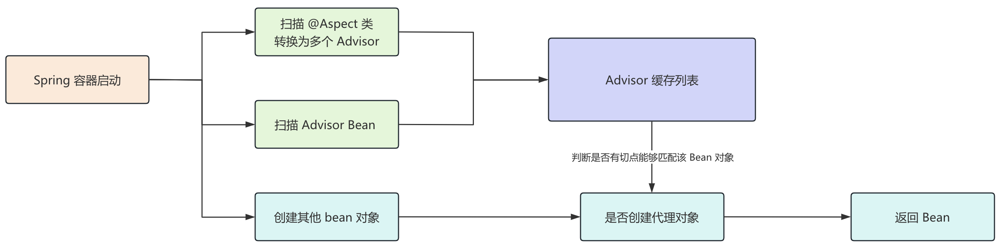
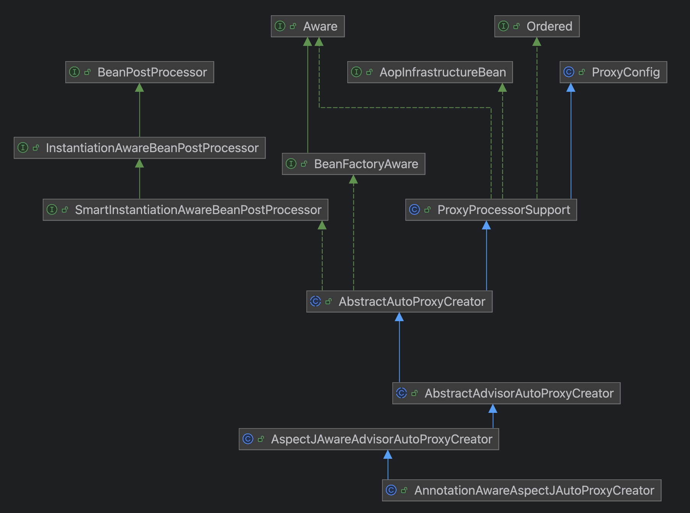
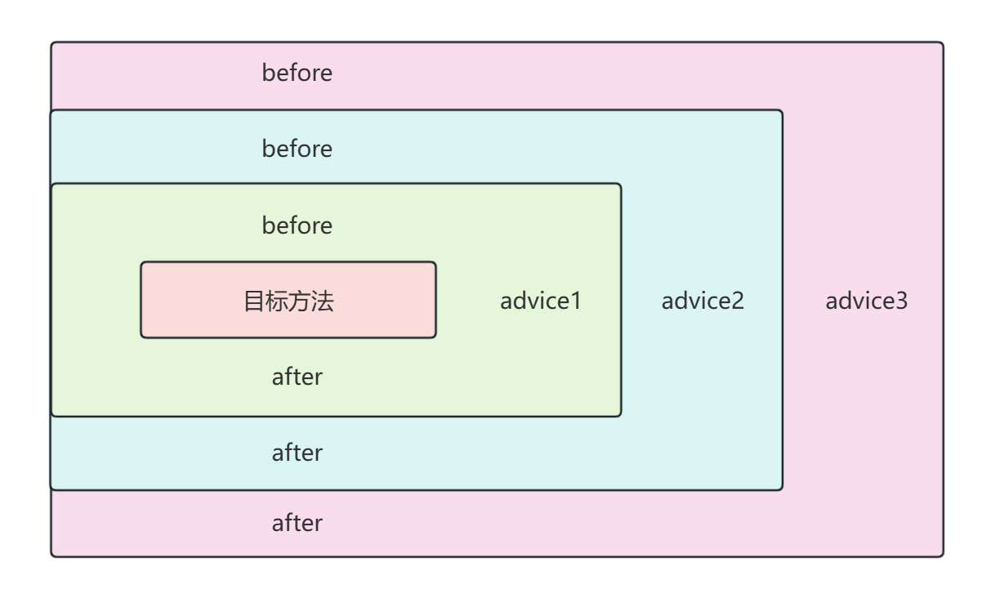

## 前言

AOP 即 Aspect Oriented Programming，面向切面编程。

AOP 是一种范式，它主要用于处理那些跨越多个对象的横切关注点，比如事务管理、日志记录、权限控制等。

这里我们的主要内容是研究一下 Spring AOP 的底层的源码技术。

## 核心概念

切面（Aspect）：切面是一个模块化的横切关注点实现，可以包含通知和切入点的定义。

连接点（Join Point）：连接点是程序执行过程中可以插入切面逻辑的具体位置，常见的连接点是一个方法。

切点（Pointcut）：切点是用来定义一组连接点的模式，它描述了对哪些方法进行增强，在 Spring AOP 中，通常使用切点表达式来定义切点，可以匹配类名、方法名、参数类型等。

通知（Advice）：通知是在切入点上执行的代码。它是切面中的行为，通知定义了切面是什么时候以及怎样影响到程序的执行流程。在 Spring AOP 提供了几种类型的通知：

+ 前置通知：在连接点执行之前运行。
+ 后置通知：无论连接点执行的结果如何，都在其之后运行。
+ 返回通知：在连接点正常返回之后运行。
+ 异常通知：在连接点抛出异常时运行。
+ 环绕通知：在连接点前和后执行，最强大的通知类型，可以完全控制连接点的执行。

目标对象（Target）：目标对象是被一个或多个切面通知的对象，或者说，它是被增强的对象，这个很好理解。

代理（Proxy）：代理对象是由 AOP 框架创建的，在代理对象中添加了切面的逻辑。

织入（Weaving）：织入是将切面代码插入到目标对象中，从而创建代理对象的过程，织入可以发生在编译时、类加载时或运行时，这对应了三种 AOP 的实现。

## AOP 的三种实现

AOP 的三种实现，本质就是有关如何创建代理对象的命题。

编译时织入：编译时通过特殊的编译器（比如 AspectJ）将切面织入到目标代码中，由于是通过编译器直接修改 class 字节码，所以本质上并没有创建代理对象，这种静态织入的方式性能较好，因为织入是一次性的，并不会带来运行时的开销，同时也可以突破动态代理的一些限制，比如 static、final 等，也不需要目标类实现接口。

类加载时织入：在类加载阶段将切面织入到目标类中，可以通过 Java 代理（Java Agent）来实现，这种情况下，切面是在 java 文件已经编译为 class 之后，加载到 JVM 时织入的，所以不需要改变原有的编译过程，和编译时织入一样，也可以突破动态代理进行 AOP 增强的限制。

运行时织入：这也是用的最多的 AOP 实现，也可以称为动态代理，主要是通过 JDK 动态代理或者 CGLIB 来实现，这种方式不需要改变编译或者类加载的过程，会在内存中实实在在的生成目标对象和代理对象，但会存在一些代理的限制，比如 JDK 动态代理要求目标类和代理类必须实现同一个接口，而 CGLIB 是通过生成目标类的子类，重写目标类的方法进行增强，所以对于目标类的 static、final 方法就无可奈何了。

## 底层的切面、切点、通知

下面我们开始研究 Spring 底层的 AOP 实现，首先看一个简单的例子：

```java
import org.aspectj.lang.*
import org.springframework.stereotype.Component;

@Aspect
@Component
public class MyAspect {

    @Before("execution(* foo())")
    public void before() {
        System.out.println("前置增强");
    }

    @After("execution(* foo())")
    public void after() {
        System.out.println("后置增强");
    }

    @Around("execution(* foo())")
    public Object around(ProceedingJoinPoint joinPoint) throws Throwable {
        System.out.println("环绕前增强");
        Object res = joinPoint.proceed();
        System.out.println("环绕后增强");
        return res;
    }
}
```

在这个类中，完美的诠释了切点（切点表达式）、通知（通知类型 + 通知逻辑）以及切面（整个类）。

当然这是作为 AOP 的使用者的视角看到的，实际上我们也应该了解 Spring 底层是如果描述这些概念的。

### 切点

首先是切点，在 Spring 中，切点是由 org.springframework.aop.Pointcut 描述的。

其中一个重要的实现是 AspectJExpressionPointcut，从名称也可以看出来，它是用来匹配 AspectJ 表达式的。

参考下面的例子：

```java
import org.springframework.aop.aspectj.AspectJExpressionPointcut;

public class AopApplication {

    public static void main(String[] args) throws NoSuchMethodException {
        AspectJExpressionPointcut pointcut = new AspectJExpressionPointcut();
        pointcut.setExpression("execution(* bar())");
        boolean barMatches = pointcut.matches(AopClass.class.getMethod("bar"), AopClass.class);
        boolean fooMatches = pointcut.matches(AopClass.class.getMethod("foo"), AopClass.class);
        System.out.println("barMatches = " + barMatches); // barMatches = true
        System.out.println("fooMatches = " + fooMatches); // fooMatches = false
    }

    static class AopClass {
        public void foo() {}
        public void bar() {}
    }
}
```

但是我们知道，对于切点表达式其实是存在一定的局限性的，它只能匹配方法上的信息，如果我们要匹配类上的信息呢？

以 @Transactional 为例说明，在 Spring 中，匹配该注解的类是：TransactionAttributeSourcePointcut，重点逻辑如下：

```java
abstract class TransactionAttributeSourcePointcut extends StaticMethodMatcherPointcut implements Serializable {

	protected TransactionAttributeSourcePointcut() {
		setClassFilter(new TransactionAttributeSourceClassFilter());
	}

	@Override
	public boolean matches(Method method, Class<?> targetClass) {
		TransactionAttributeSource tas = getTransactionAttributeSource();
        // getTransactionAttribute 内部会进行判断
		return (tas == null || tas.getTransactionAttribute(method, targetClass) != null);
	}

	@Nullable
	protected abstract TransactionAttributeSource getTransactionAttributeSource();

	/**
	 * {@link ClassFilter} that delegates to {@link TransactionAttributeSource#isCandidateClass}
	 * for filtering classes whose methods are not worth searching to begin with.
	 */
	private class TransactionAttributeSourceClassFilter implements ClassFilter {

		@Override
		public boolean matches(Class<?> clazz) {
            // 过滤无需匹配的类
			if (TransactionalProxy.class.isAssignableFrom(clazz) ||
					TransactionManager.class.isAssignableFrom(clazz) ||
					PersistenceExceptionTranslator.class.isAssignableFrom(clazz)) {
				return false;
			}
			TransactionAttributeSource tas = getTransactionAttributeSource();
			return (tas == null || tas.isCandidateClass(clazz));
		}
	}
}
```

最终在 org.springframework.transaction.interceptor.AbstractFallbackTransactionAttributeSource#computeTransactionAttribute 方法中，就会解析出 @Transactional 注解，当然在这过程中，有很多其他的逻辑，比如非 public 的方法即使有 @Transactional 也不会生效，你可以自行查看。

这里想说的一点是，如果你需要匹配非方法上的切点信息，可以仿照 TransactionAttributeSourcePointcut，实现 StaticMethodMatcherPointcut，比如：

```java
import org.springframework.aop.support.StaticMethodMatcherPointcut;

import java.lang.reflect.Method;

public class AopApplication {

    public static void main(String[] args) throws NoSuchMethodException {
        StaticMethodMatcherPointcut pointcut = new StaticMethodMatcherPointcut() {
            @Override
            public boolean matches(Method method, Class<?> targetClass) {
                // 这里有方法和类信息了，是不是就可以随意判断了。
                return targetClass.isAssignableFrom(AopPointcut.class);
            }
        };

        boolean fooMatches = pointcut.matches(AopClass.class.getMethod("foo"), AopPointcut.class);
        boolean barMatches = pointcut.matches(AopClass.class.getMethod("bar"), AopPointcut.class);
        System.out.println("fooMatches = " + fooMatches); // fooMatches = true
        System.out.println("barMatches = " + barMatches); // barMatches = true
    }

    @AopPointcut
    static class AopClass {
        public void foo() {}
        public void bar() {}
    }

    @interface AopPointcut {}
}
```

你可以看到，实现 StaticMethodMatcherPointcut 类重写的 matches 方法中，会传入方法和类信息，这是不会是就可以很方便的去做非方法上的切点匹配了。

### 通知

其次是通知，在 Spring 中，通知由 Advice 接口描述，不过实际上他就是一个空接口。

一个最重要的实现是 org.aopalliance.intercept.MethodInterceptor，它是环绕通知的底层实现，其他所有的通知（前置、后置、异常后、返回后）最后都会转换到该接口。

由于 MethodInterceptor 只有一个抽象方法，所以它是一个函数式接口，如下：

```java
@FunctionalInterface
public interface MethodInterceptor extends Interceptor {

	@Nullable
	Object invoke(@Nonnull MethodInvocation invocation) throws Throwable;
}
```

这里 MethodInvocation 也是一个接口，它实现了 Joinpoint 接口，所以一般我们可以通过下面的方式调用目标对象的原始方法：

```java
invocation.proceed();
```

### 切面

最后是切面，一般来说，由 @Aspect 注解的类就可以称为一个切面（高级切面），它包含多组通知 + 切点，而在 Spring 底层，还有一个低级切面 Advisor，它仅仅包含一组通知 + 切点。

实际上，高级切面最后也会转换为一个个的低级切面（Advisor）。

一个例子：

```java
import org.aopalliance.intercept.*;
import org.springframework.aop.*;

public class AopApplication {

    public static void main(String[] args) throws NoSuchMethodException {
        AspectJExpressionPointcut pointcut = new AspectJExpressionPointcut();
        pointcut.setExpression("execution(* foo())"); // 切点表达式
        MethodInterceptor advice = new MethodInterceptor() {
            @Override
            public Object invoke(MethodInvocation invocation) throws Throwable {
                System.out.println("前置增强");
                Object result = invocation.proceed();
                System.out.println("后置增强");
                return result;
            }
        };
        // 封装切面
        Advisor advisor = new DefaultPointcutAdvisor(pointcut, advice);
        // 代理工厂（用于创建代理，可能是 JDK、CGLIB）
        AopClass target = new AopClass();
        ProxyFactory proxyFactory = new ProxyFactory();
        proxyFactory.setTarget(target);   // 设置目标对象
        proxyFactory.addAdvisor(advisor); // 设置切面
        AopClass proxy = (AopClass) proxyFactory.getProxy();
        proxy.foo();
    }

    static class AopClass {
        public void foo() {
            System.out.println("foo");
        }
    }
}
```

## Spring 选择哪种代理

我们知道，Spring 内部可以选择 JDK 代理，也可以选择 CGLIB，它内部是如何选择的呢？

从上面的例子我们可以看到，创建代理是由 ProxyFactory 完成的，所以如何选择代理肯定是在它内部实现的。

其中的关键逻辑在 org.springframework.aop.framework.DefaultAopProxyFactory#createAopProxy 中，如下：

```java
public AopProxy createAopProxy(AdvisedSupport config) throws AopConfigException {
    if (!NativeDetector.inNativeImage() &&
            (config.isOptimize() || config.isProxyTargetClass() || hasNoUserSuppliedProxyInterfaces(config))) {
        // 当以下条件之一成立时，使用 CGLIB 代理
        // 1. config.isOptimize() 为 true，表示开启了优化
        // 2. config.isProxyTargetClass() 为 true，明确指定了要代理目标类而不是接口
        // 3. hasNoUserSuppliedProxyInterfaces(config) 为 true，目标类没有实现接口
        Class<?> targetClass = config.getTargetClass();
        if (targetClass == null) {
            throw new AopConfigException("TargetSource cannot determine target class: " +
                    "Either an interface or a target is required for proxy creation.");
        }
        if (targetClass.isInterface() || Proxy.isProxyClass(targetClass) || ClassUtils.isLambdaClass(targetClass)) {
            // 如果目标类是接口、已经是代理类或者是一个 lambda 表达式的类，则使用 JDK 动态代理
            return new JdkDynamicAopProxy(config);
        }
        // 如果目标类不是接口，并且不是代理类也不是 lambda 类，则使用 CGLIB 代理
        return new ObjenesisCglibAopProxy(config);
    } else {
        // 如果是在原生镜像中，或者上述条件都不满足，则默认使用 JDK 动态代理
        return new JdkDynamicAopProxy(config);
    }
}
```

## AOP 的整体流程

目前为止，我们已经知道了在 Spring 内部是如何描述切面、切点和通知的，现在来梳理一下整个 AOP 的过程。



当 Spring 容器启动时，会找出容器中所有的被 @Aspect 注解的类，即所谓的“高级切面”，然后解析其中定义的通知（Advice，包括 @Before、@After、@Around 等）以及对应的切点表达式。

接着将每个通知以及对应的切点组合转换为 Advisor 实例（高级切面转低级切面），然后将这些 Advisor 缓存。

当然，手动添加的 Advisor 也会加入到 Advisor 缓存。

当 Spring 容器尝试创建其他 Bean 对象时，它会检查之前缓存的 Advisor 列表，看是否有任何 Advisor 的切点能够匹配到正在创建的 Bean，如果存在匹配，则创建代理对象。

所以接下来我们的重点就在：Advisor 何时创建、代理对象如何创建、代理对象何时创建。

这里的关键类是 org.springframework.aop.aspectj.annotation.AnnotationAwareAspectJAutoProxyCreator。

它的继承关系如下：



可以看到 AnnotationAwareAspectJAutoProxyCreator 实现了 InstantiationAwareBeanPostProcessor，这意味着它可以在 Bean 的实例化前后、初始化前后做一些额外的逻辑，这在整个 AOP 的流程中是很重要的。

## Advisor 何时创建

这个问题的关键在 AnnotationAwareAspectJAutoProxyCreator 实例化前的后处理。

一些关键的调用链路如下：

```java
AbstractAutoProxyCreator#postProcessBeforeInstantiation()
    AspectJAwareAdvisorAutoProxyCreator#shouldSkip()
        AnnotationAwareAspectJAutoProxyCreator#findCandidateAdvisors()
```

findCandidateAdvisors 方法如下：

```java
protected List<Advisor> findCandidateAdvisors() {
    // Add all the Spring advisors found according to superclass rules.
    List<Advisor> advisors = super.findCandidateAdvisors();
    // Build Advisors for all AspectJ aspects in the bean factory.
    if (this.aspectJAdvisorsBuilder != null) {
        advisors.addAll(this.aspectJAdvisorsBuilder.buildAspectJAdvisors());
    }
    return advisors;
}
```

这里调用父类的 findCandidateAdvisors 方法创建容器中所有的 Advisor Bean。

而通过 aspectJAdvisorsBuilder.buildAspectJAdvisors() 方法就是解析 @Aspect 注解的类，将每个通知以及对应的切点组合转换为 Advisor 实例。

核心逻辑在 org.springframework.aop.aspectj.annotation.ReflectiveAspectJAdvisorFactory#getAdvisors 中

```java
@Override
public List<Advisor> getAdvisors(MetadataAwareAspectInstanceFactory aspectInstanceFactory) {
    // ... 
    List<Advisor> advisors = new ArrayList<>();
    for (Method method : getAdvisorMethods(aspectClass)) {
        Advisor advisor = getAdvisor(method, lazySingletonAspectInstanceFactory, 0, aspectName);
        if (advisor != null) {
            advisors.add(advisor);
        }
    }
    // ...
}
```

进入 getAdvisor 方法：

```java
public Advisor getAdvisor(Method candidateAdviceMethod, MetadataAwareAspectInstanceFactory aspectInstanceFactory,
        int declarationOrderInAspect, String aspectName) {
    // ...
    AspectJExpressionPointcut expressionPointcut = getPointcut(
            candidateAdviceMethod, aspectInstanceFactory.getAspectMetadata().getAspectClass());
    if (expressionPointcut == null) {
        return null;
    }
    return new InstantiationModelAwarePointcutAdvisorImpl(expressionPointcut, candidateAdviceMethod,
            this, aspectInstanceFactory, declarationOrderInAspect, aspectName);
}
```

可以看到，这里会创建切点 expressionPointcut，创建切面 InstantiationModelAwarePointcutAdvisorImpl，但是问题来了，在哪里创建的通知呢？

这里很狗，创建通知是在 InstantiationModelAwarePointcutAdvisorImpl 的构造方法通过 instantiateAdvice 创建的：

```java
private Advice instantiateAdvice(AspectJExpressionPointcut pointcut) {
    Advice advice = this.aspectJAdvisorFactory.getAdvice(this.aspectJAdviceMethod, pointcut,
            this.aspectInstanceFactory, this.declarationOrder, this.aspectName);
    return (advice != null ? advice : EMPTY_ADVICE);
}

public Advice getAdvice(Method candidateAdviceMethod, AspectJExpressionPointcut expressionPointcut,
        MetadataAwareAspectInstanceFactory aspectInstanceFactory, int declarationOrder, String aspectName) {

    // ...
    AbstractAspectJAdvice springAdvice;

    // 根据不同的注解（@Before、@After ……）创建不同类型的通知
    switch (aspectJAnnotation.getAnnotationType()) {
        case AtPointcut:
            return null;
        case AtAround:
            springAdvice = new AspectJAroundAdvice(
                    candidateAdviceMethod, expressionPointcut, aspectInstanceFactory);
            break;
        case AtBefore:
            springAdvice = new AspectJMethodBeforeAdvice(
                    candidateAdviceMethod, expressionPointcut, aspectInstanceFactory);
            break;
        case AtAfter:
            springAdvice = new AspectJAfterAdvice(
                    candidateAdviceMethod, expressionPointcut, aspectInstanceFactory);
            break;
        case AtAfterReturning:
            springAdvice = new AspectJAfterReturningAdvice(
                    candidateAdviceMethod, expressionPointcut, aspectInstanceFactory);
            AfterReturning afterReturningAnnotation = (AfterReturning) aspectJAnnotation.getAnnotation();
            if (StringUtils.hasText(afterReturningAnnotation.returning())) {
                springAdvice.setReturningName(afterReturningAnnotation.returning());
            }
            break;
        case AtAfterThrowing:
            springAdvice = new AspectJAfterThrowingAdvice(
                    candidateAdviceMethod, expressionPointcut, aspectInstanceFactory);
            AfterThrowing afterThrowingAnnotation = (AfterThrowing) aspectJAnnotation.getAnnotation();
            if (StringUtils.hasText(afterThrowingAnnotation.throwing())) {
                springAdvice.setThrowingName(afterThrowingAnnotation.throwing());
            }
            break;
        default:
            throw new UnsupportedOperationException(
                    "Unsupported advice type on method: " + candidateAdviceMethod);
    }

    // Now to configure the advice...
    springAdvice.setAspectName(aspectName);
    springAdvice.setDeclarationOrder(declarationOrder);
    String[] argNames = this.parameterNameDiscoverer.getParameterNames(candidateAdviceMethod);
    if (argNames != null) {
        springAdvice.setArgumentNamesFromStringArray(argNames);
    }
    springAdvice.calculateArgumentBindings();
    return springAdvice;
}
```

整个过程中，对于 Advisor Bean 和 @Aspect 注解的切面中的 Advisor 都会加入到对应的缓存中。

这里缓存也是有一些说道的，容器内部对 Advisor 的缓存分为 cachedAdvisorBeanNames 和 aspectBeanNames + advisorsCache。

这里 cachedAdvisorBeanNames 是一个 String[]，主要保存了 Advisor Bean 的名称，而 aspectBeanNames 是一个 List<String>，主要保存了 @Aspect 注解的 Bean 名称，而 advisorsCache 是一个 Map，key 为 Bean 名称，value 为 Advisor 集合（因为一个 @Aspect 切面可能有多个 Advisor）。 

后面判断是否创建代理对象（Bean 是否有匹配的切点）就依赖于这三个属性，我们后面再看。

最后，你可以通过下面的代码来进行 debug，熟悉整体的创建流程。

```java
import org.aopalliance.intercept.MethodInterceptor;
import org.aopalliance.intercept.MethodInvocation;
import org.aspectj.lang.annotation.After;
import org.aspectj.lang.annotation.Aspect;
import org.aspectj.lang.annotation.Before;
import org.springframework.aop.Advisor;
import org.springframework.aop.aspectj.AspectJExpressionPointcut;
import org.springframework.aop.aspectj.annotation.AnnotationAwareAspectJAutoProxyCreator;
import org.springframework.aop.support.DefaultPointcutAdvisor;
import org.springframework.context.annotation.Bean;
import org.springframework.context.annotation.Configuration;
import org.springframework.context.annotation.ConfigurationClassPostProcessor;
import org.springframework.context.support.GenericApplicationContext;

public class AopApplication {

    public static void main(String[] args) {
        GenericApplicationContext ctx = new GenericApplicationContext();
        ctx.registerBean(MyAspect.class);
        ctx.registerBean(Config.class);
        ctx.registerBean(ConfigurationClassPostProcessor.class); // 处理 @Configuration 和 @Bean 的后处理器
        ctx.registerBean(AnnotationAwareAspectJAutoProxyCreator.class);
        ctx.refresh();
    }

    /**
     * 切面类
     */
    @Aspect
    static class MyAspect {

        @Before("execution(* foo())")
        public void before() {
            System.out.println("high before");
        }

        @After("execution(* foo())")
        public void after() {
            System.out.println("high after");
        }
    }

    @Configuration
    static class Config {

        /**
         * Advisor Bean
         */
        @Bean
        public Advisor advisor() {
            AspectJExpressionPointcut pointcut = new AspectJExpressionPointcut(); // 切点
            pointcut.setExpression("execution(* foo())");
            MethodInterceptor interceptor = new MethodInterceptor() { // 通知
                @Override
                public Object invoke(MethodInvocation invocation) throws Throwable {
                    System.out.println("low before");
                    Object result = invocation.proceed();
                    System.out.println("low after");
                    return result;
                }
            };
            return new DefaultPointcutAdvisor(pointcut, interceptor); // 切面
        }
    }
}
```

## 代理对象如何创建

创建代理对象也依赖于上面的 AnnotationAwareAspectJAutoProxyCreator 后处理器，只是这里关键的后处理方法是初始化后处理方法，如下：

```java
public Object postProcessAfterInitialization(@Nullable Object bean, String beanName) {
    if (bean != null) {
        Object cacheKey = getCacheKey(bean.getClass(), beanName);
        if (this.earlyProxyReferences.remove(cacheKey) != bean) {
            return wrapIfNecessary(bean, beanName, cacheKey);
        }
    }
    return bean;
}
```

所以，代理对象的创建核心逻辑就在 wrapIfNecessary 中。

```java
protected Object wrapIfNecessary(Object bean, String beanName, Object cacheKey) {
    // 过滤一些条件
    
    // Create proxy if we have advice.
    Object[] specificInterceptors = getAdvicesAndAdvisorsForBean(bean.getClass(), beanName, null);
    if (specificInterceptors != DO_NOT_PROXY) {
        this.advisedBeans.put(cacheKey, Boolean.TRUE);
        Object proxy = createProxy(
                bean.getClass(), beanName, specificInterceptors, new SingletonTargetSource(bean));
        this.proxyTypes.put(cacheKey, proxy.getClass());
        return proxy;
    }
    this.advisedBeans.put(cacheKey, Boolean.FALSE);
    return bean;
}
```

在 wrapIfNecessary 方法内部主要就做了两件事：

1. 获取与该 Bean 对象匹配的 Advisor，对应 getAdvicesAndAdvisorsForBean 方法。
2. 如果存在这样的 Advisor 那么就创建代理对象，对应 createProxy 方法。

首先比较简单的是 createProxy 方法，内部无非就是根据一些条件选择 CGLIB 还是 JDK 代理，然后根据对应的方式创建代理即可。

比较复杂的是找到与该 Bean 对象匹配的 Advisor 的过程。

核心的逻辑如下：

```java
protected List<Advisor> findEligibleAdvisors(Class<?> beanClass, String beanName) {
    // 这里和前面创建 Advisor 的方法是同一个
    // findCandidateAdvisors 返回容器中所有的 Advisor
    List<Advisor> candidateAdvisors = findCandidateAdvisors();
    // findAdvisorsThatCanApply 找出该 Bean 对象进行匹配过滤后的所有 Advisor
    List<Advisor> eligibleAdvisors = findAdvisorsThatCanApply(candidateAdvisors, beanClass, beanName);
    extendAdvisors(eligibleAdvisors);
    if (!eligibleAdvisors.isEmpty()) {
        eligibleAdvisors = sortAdvisors(eligibleAdvisors);
    }
    return eligibleAdvisors;
}
```

该方法首先通过 findCandidateAdvisors 返回容器中缓存的所有 Advisor 实例，包括 Advisor Bean 和 @Aspect 注解的 Bean 中的多组 Advisor。

然后通过 findAdvisorsThatCanApply 对这些 Advisor 进行匹配过滤，返回候选的 Advisor 对象。

如果最后 eligibleAdvisors 不为空，说明该 Bean 对象有与之匹配的 Advisor，所以需要创建代理对象返回，否则无需创建，返回目标对象（原始对象）即可。

你可以通过下面的代码进行 debug 分析：

```java
import org.aopalliance.intercept.MethodInterceptor;
import org.aopalliance.intercept.MethodInvocation;
import org.aspectj.lang.annotation.After;
import org.aspectj.lang.annotation.Aspect;
import org.aspectj.lang.annotation.Before;
import org.springframework.aop.Advisor;
import org.springframework.aop.aspectj.AspectJExpressionPointcut;
import org.springframework.aop.aspectj.annotation.AnnotationAwareAspectJAutoProxyCreator;
import org.springframework.aop.support.DefaultPointcutAdvisor;
import org.springframework.context.annotation.Bean;
import org.springframework.context.annotation.Configuration;
import org.springframework.context.annotation.ConfigurationClassPostProcessor;
import org.springframework.context.support.GenericApplicationContext;

public class AopApplication {

    public static void main(String[] args) {
        GenericApplicationContext ctx = new GenericApplicationContext();
        ctx.registerBean(MyAspect.class);
        ctx.registerBean(Config.class);
        ctx.registerBean(ConfigurationClassPostProcessor.class); // 处理 @Configuration 和 @Bean 的后处理器
        ctx.registerBean(AnnotationAwareAspectJAutoProxyCreator.class);
        ctx.refresh();
        Target target = ctx.getBean(Target.class);
        target.foo();
    }

    static class Target {

        public void foo() {
            System.out.println("foo");
        }
    }

    /**
     * 切面类
     */
    @Aspect
    static class MyAspect {

        @Before("execution(* foo())")
        public void before() {
            System.out.println("high before");
        }

        @After("execution(* foo())")
        public void after() {
            System.out.println("high after");
        }

        @Before("execution(* bar())")
        public void beforeBar() {
            System.out.println("high before");
        }
    }

    @Configuration
    static class Config {

        /**
         * Advisor Bean
         */
        @Bean
        public Advisor advisor() {
            AspectJExpressionPointcut pointcut = new AspectJExpressionPointcut(); // 切点
            pointcut.setExpression("execution(* foo())");
            MethodInterceptor interceptor = new MethodInterceptor() { // 通知
                @Override
                public Object invoke(MethodInvocation invocation) throws Throwable {
                    System.out.println("low before");
                    Object result = invocation.proceed();
                    System.out.println("low after");
                    return result;
                }
            };
            return new DefaultPointcutAdvisor(pointcut, interceptor); // 切面
        }

        @Bean
        public Target target() {
            return new Target();
        }
    }
}
```

## 代理对象何时创建

从上面的分析中，我们已经知道了 wrapIfNecessary 是创建代理对象的核心方法，所以代理对象何时创建的命题就变成了何时调用 wrapIfNecessary 方法的命题。

其中一个调用的时机我们上面已经讲到了，就是在 Bean 对象初始化后，由  AnnotationAwareAspectJAutoProxyCreator 进行后处理。

而另外一个时机就是在 Bean 对象进行属性填充之前，由于循环依赖的情况，我们不得不预先将获取 Bean 早期引用的逻辑封装为 ObjectFactory 加入到三级缓存中。

一旦真正出现了循环依赖，就必须要通过三级缓存提前创建尚未完全进行属性注入的 Bean 对象，这里提前创建的逻辑如下：

```java
protected Object getEarlyBeanReference(String beanName, RootBeanDefinition mbd, Object bean) {
    Object exposedObject = began;
    if (!mbd.isSynthetic() && hasInstantiationAwareBeanPostProcessors()) {
        for (SmartInstantiationAwareBeanPostProcessor bp : getBeanPostProcessorCache().smartInstantiationAware) {
            exposedObject = bp.getEarlyBeanReference(exposedObject, beanName);
        }
    }
    return exposedObject;
}
```

而当容器有 AnnotationAwareAspectJAutoProxyCreator 后处理器时，就可以对提前暴露引用的 Bean 进行必要的 AOP 代理。

```java
@Override
public Object getEarlyBeanReference(Object bean, String beanName) {
    Object cacheKey = getCacheKey(bean.getClass(), beanName);
    this.earlyProxyReferences.put(cacheKey, bean);
    // 调用 wrapIfNecessary
    return wrapIfNecessary(bean, beanName, cacheKey);
}
```

## 增强后的方法调用

当 Spring 容器创建好代理对象之后，后面我们对目标对象的方法调用都会被代理到代理对象增强的方法上。

在整个增强方法的调用过程中，值得关注的几点：

+ 首先会将所有的非环绕通知转换为环绕通知，这用到了适配器模式。
+ 由于每个通知都被转换为环绕通知，所以 Spring 基于递归来做前置、后置增强。
+ 由于一个增强的方法，可能有多个通知，所以底层还基于责任链模式进行调用。

### 非环绕转环绕通知

实现这个功能的关键在代理工厂 ProxyFactory 的一个巨长无比的方法：

org.springframework.aop.framework.AdvisedSupport#getInterceptorsAndDynamicInterceptionAdvice，你可以跟进源码看一看。

一般来说，会将 @Before 和 @AfterReturning 转换为环绕通知，其他的三种通知类型都是 MethodInterceptor 的子类，所以无需转换。

转换前置通知的适配器类是 org.springframework.aop.framework.adapter.MethodBeforeAdviceInterceptor，转换返回后通知的适配器类是 org.springframework.aop.framework.adapter.AfterReturningAdviceInterceptor。

我们以 MethodBeforeAdviceInterceptor 为例，简单看一看：

```java
// 适配器模式，前置通知适配器
public class MethodBeforeAdviceInterceptor implements MethodInterceptor, 
                                                BeforeAdvice, Serializable {
	
    private final MethodBeforeAdvice advice;

	/**
	 * Create a new MethodBeforeAdviceInterceptor for the given advice.
	 * @param advice the MethodBeforeAdvice to wrap
	 */
	public MethodBeforeAdviceInterceptor(MethodBeforeAdvice advice) {
		Assert.notNull(advice, "Advice must not be null");
		this.advice = advice;
	}

	@Override
	@Nullable
	public Object invoke(MethodInvocation mi) throws Throwable {
		this.advice.before(mi.getMethod(), mi.getArguments(), mi.getThis());
		return mi.proceed();
	}
}
```

下面给出一个测试代码，对比转换前后通知的区别：

```java
import org.aspectj.lang.ProceedingJoinPoint;
import org.aspectj.lang.annotation.*;
import org.springframework.aop.Advisor;
import org.springframework.aop.TargetSource;
import org.springframework.aop.aspectj.annotation.AnnotationAwareAspectJAutoProxyCreator;
import org.springframework.aop.framework.ProxyFactory;
import org.springframework.aop.framework.autoproxy.AbstractAutoProxyCreator;
import org.springframework.context.annotation.Bean;
import org.springframework.context.annotation.Configuration;
import org.springframework.context.annotation.ConfigurationClassPostProcessor;
import org.springframework.context.support.GenericApplicationContext;

import java.lang.reflect.InvocationTargetException;
import java.lang.reflect.Method;
import java.util.ArrayList;
import java.util.List;

public class AopApplication {

    public static void main(String[] args) throws InvocationTargetException, IllegalAccessException, NoSuchMethodException {
        GenericApplicationContext ctx = new GenericApplicationContext();
        ctx.registerBean(MyAspect.class);
        ctx.registerBean(Config.class);
        ctx.registerBean(ConfigurationClassPostProcessor.class); // 处理 @Configuration 和 @Bean 的后处理器
        ctx.registerBean(AnnotationAwareAspectJAutoProxyCreator.class);
        ctx.refresh();
        AnnotationAwareAspectJAutoProxyCreator ctxBean = ctx.getBean(AnnotationAwareAspectJAutoProxyCreator.class);
        Method method = AbstractAutoProxyCreator.class.getDeclaredMethod("getAdvicesAndAdvisorsForBean", Class.class, String.class, TargetSource.class);
        method.setAccessible(true);
        // getAdvicesAndAdvisorsForBean 可以获取匹配指定类的所有 Advisor 实例
        Object[] advisors = (Object[]) method.invoke(ctxBean, Target.class, "target", null);
        List<Advisor> advisorList = new ArrayList<>();
        for (Object advisor : advisors) {
            if (advisor instanceof Advisor) {
                advisorList.add((Advisor) advisor);
            }
        }
        System.out.println("转换环绕通知之前: >>>>>>>>>>>>>>>>>>>>>>>>>>>>>>");
        for (Advisor advisor : advisorList) {
            System.out.printf("通知: %s\n", advisor.getAdvice());
        }
        ProxyFactory proxyFactory = new ProxyFactory();
        proxyFactory.setTarget(new Target());
        proxyFactory.addAdvisors(advisorList);
        List<Object> interceptors = proxyFactory.getInterceptorsAndDynamicInterceptionAdvice(Target.class.getDeclaredMethod("foo"), Target.class);
        System.out.println("转换环绕通知之后: >>>>>>>>>>>>>>>>>>>>>>>>>>>>>>");
        for (Object interceptor : interceptors) {
            System.out.printf("通知: %s\n", interceptor);
        }
    }

    static class Target {
        public void foo() {
            System.out.println("foo");
        }
    }

    /**
     * 切面类
     */
    @Aspect
    static class MyAspect {

        @Before("execution(* foo())")
        public void before() {
            System.out.println("high before");
        }

        @After("execution(* foo())")
        public void after() {
            System.out.println("high after");
        }

        @AfterReturning(pointcut = "execution(* foo())", returning = "result")
        public void afterReturning(Object result) {
            System.out.println("high afterReturning, result: " + result);
        }

        @AfterThrowing(pointcut = "execution(* foo())", throwing = "ex")
        public void afterThrowing(Exception ex) {
            System.out.println("high afterThrowing, exception: " + ex.getMessage());
        }

        @Around("execution(* foo())")
        public Object around(ProceedingJoinPoint joinPoint) throws Throwable {
            System.out.println("high around - before advice");
            Object result = joinPoint.proceed();
            System.out.println("high around - after advice, result: " + result);
            return result;
        }
    }

    @Configuration
    static class Config {

        @Bean
        public Target target() {
            return new Target();
        }
    }
}
```

### 责任链 + 递归调用

当将所有的非环绕通知转换为环绕通知 MethodInterceptor 之后，就要开始进行方法增强（逐个调用环绕通知），大致的调用模型如下：



在 Spring 内部，基于责任链模式和递归对实现这种多个环绕通知的调用。

每一次通知的调用都会被封装为一个 ReflectiveMethodInvocation 对象，它内部包含了完整的调用链，也就是环绕通知集合，以及目标对象，同时基于一个 currentInterceptorIndex 索引来实现向深入递归。

参考下面的模拟代码：

```java
import org.aopalliance.intercept.MethodInterceptor;
import org.aopalliance.intercept.MethodInvocation;
import org.aspectj.lang.annotation.After;
import org.aspectj.lang.annotation.Aspect;
import org.aspectj.lang.annotation.Before;
import org.springframework.aop.Advisor;
import org.springframework.aop.ProxyMethodInvocation;
import org.springframework.aop.TargetSource;
import org.springframework.aop.aspectj.annotation.AnnotationAwareAspectJAutoProxyCreator;
import org.springframework.aop.framework.ProxyFactory;
import org.springframework.aop.framework.autoproxy.AbstractAutoProxyCreator;
import org.springframework.context.annotation.Bean;
import org.springframework.context.annotation.Configuration;
import org.springframework.context.annotation.ConfigurationClassPostProcessor;
import org.springframework.context.support.GenericApplicationContext;

import java.lang.reflect.AccessibleObject;
import java.lang.reflect.InvocationTargetException;
import java.lang.reflect.Method;
import java.util.ArrayList;
import java.util.List;

public class AopApplication {

    public static void main(String[] args) throws Throwable {
        GenericApplicationContext ctx = new GenericApplicationContext();
        ctx.registerBean(Config.class);
        ctx.registerBean(ConfigurationClassPostProcessor.class); // 处理 @Configuration 和 @Bean 的后处理器
        ctx.registerBean(AnnotationAwareAspectJAutoProxyCreator.class);
        ctx.refresh();

        getMockInvocation(ctx).proceed(); // 开始调用
    }

    private static MockInvocation getMockInvocation(GenericApplicationContext ctx) throws NoSuchMethodException, IllegalAccessException, InvocationTargetException {
        AnnotationAwareAspectJAutoProxyCreator ctxBean = ctx.getBean(AnnotationAwareAspectJAutoProxyCreator.class);
        Method method = AbstractAutoProxyCreator.class.getDeclaredMethod("getAdvicesAndAdvisorsForBean", Class.class, String.class, TargetSource.class);
        method.setAccessible(true);
        Object[] advisors = (Object[]) method.invoke(ctxBean, Target.class, "target", null);
        List<Advisor> advisorList = new ArrayList<>();
        for (Object advisor : advisors) {
            if (advisor instanceof Advisor) {
                advisorList.add((Advisor) advisor);
            }
        }
        ProxyFactory proxyFactory = new ProxyFactory();
        proxyFactory.setTarget(new Target());
        proxyFactory.addAdvisors(advisorList);
        List<Object> interceptors = proxyFactory.getInterceptorsAndDynamicInterceptionAdvice(Target.class.getDeclaredMethod("foo"), Target.class);
        Target target = new Target();
        return new MockInvocation(target, Target.class.getDeclaredMethod("foo"), null, interceptors);
    }

    /**
     * 模拟实现 MethodInvocation
     */
    static class MockInvocation implements ProxyMethodInvocation {

        // 包含目标对象的一组信息，用于反射执行目标对象的方法
        private final Object target;
        private final Method method;
        private final Object[] args;

        // 包含整个通知链上的环绕通知，用于进行递归调用下一个通知
        private final List<Object> interceptors;
        private int currentInterceptorIndex = -1;

        MockInvocation(Object target, Method method, Object[] args, List<Object> interceptors) {
            this.target = target;
            this.method = method;
            this.args = args;
            this.interceptors = interceptors;
        }

        @Override
        public Method getMethod() {
            return method;
        }

        @Override
        public Object[] getArguments() {
            return args;
        }

        /**
         * 重点方法，递归调用的关键
         */
        @Override
        public Object proceed() throws Throwable {
            if (currentInterceptorIndex == interceptors.size() - 1) {
                // 已经调用完所有的环绕通知的前置逻辑，开始反射调用目标方法
                return method.invoke(target, args);
            }
            return ((MethodInterceptor) interceptors.get(++currentInterceptorIndex)).invoke(this);
        }

        @Override
        public Object getThis() {
            return target;
        }

        @Override
        public AccessibleObject getStaticPart() {
            return method;
        }

        @Override
        public Object getProxy() {return null;}

        @Override
        public MethodInvocation invocableClone() {return null;}

        @Override
        public MethodInvocation invocableClone(Object... arguments) {return null;}

        @Override
        public void setArguments(Object... arguments) {}

        @Override
        public void setUserAttribute(String key, Object value) {}

        @Override
        public Object getUserAttribute(String key) {return null;}
    }

    static class Target {
        public void foo() {
            System.out.println("foo");
        }
    }

    /**
     * 切面类
     */
    @Aspect
    static class MyAspect {

        @Before("execution(* foo())")
        public void before1() {
            System.out.println("high before1");
        }

        @Before("execution(* foo())")
        public void before2() {
            System.out.println("high before2");
        }

        @After("execution(* foo())")
        public void after1() {
            System.out.println("high after1");
        }

        @After("execution(* foo())")
        public void after2() {
            System.out.println("high after2");
        }
    }

    @Configuration
    static class Config {

        @Bean
        public Target target() {
            return new Target();
        }

        @Bean
        public MyAspect myAspect() {
            return new MyAspect();
        }
    }
}
```

这种基于责任链 +递归的方式可以很好的实现像过滤器、环绕通知，值得学习！！！

最后，上面的内容，在 CGLIB 代理下，可以通过 org.springframework.aop.framework.CglibAopProxy.DynamicAdvisedInterceptor#intercept 方法进行 debug 跟踪。

祝你好运！！

## 文末总结

事实上，Spring AOP 远比我们想象的要复杂得多，所以，最好的方式还是跟着源码，阅读源码。

